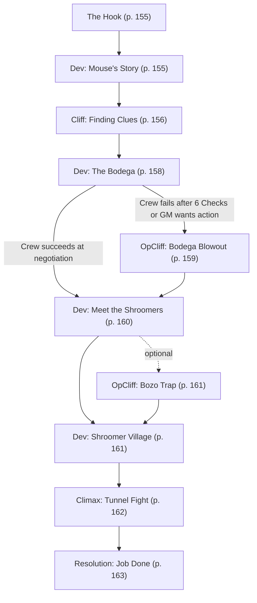

# The Incident

Book pages 154–178

Danger Gal mission: investigate the infiltration of Danger Gal HQ and track down the survivors.

## Contents

- [The Incident](<04 The Incident.md#the-incident>) (p. 154)
  - [Beat Chart](<04 The Incident.md#beat-chart>) (p. 154)
  - [Background (Read Aloud)](<04 The Incident.md#background-read-aloud>) (p. 154)
  - [The Rest of the Story](<04 The Incident.md#the-rest-of-the-story>) (p. 154)
  - [The Setting](<04 The Incident.md#the-setting>) (p. 154)
  - [The Opposition](<04 The Incident.md#the-opposition>) (p. 154)
  - [The Hook](<04 The Incident.md#the-hook>) (p. 155)
  - [Dev (Mouse's Story)](<04 The Incident.md#dev-mouses-story>) (p. 155)
  - [Cliff (Finding Clues)](<04 The Incident.md#cliff-finding-clues>) (p. 156)
  - [Dev (The Bodega)](<04 The Incident.md#dev-the-bodega>) (p. 158)
  - [OpCliff (Bodega Blowout)](<04 The Incident.md#opcliff-bodega-blowout>) (p. 159)
  - [Dev (Meet the Shroomers)](<04 The Incident.md#dev-meet-the-shroomers>) (p. 160)
  - [OpCliff (Bozo Trap)](<04 The Incident.md#opcliff-bozo-trap>) (p. 161)
  - [Dev (Shroomer Village)](<04 The Incident.md#dev-shroomer-village>) (p. 161)
  - [Climax (Tunnel Fight)](<04 The Incident.md#climax-tunnel-fight>) (p. 162)
  - [Resolution (Job Done)](<04 The Incident.md#resolution-job-done>) (p. 163)
  - [Continuing On](<04 The Incident.md#continuing-on>) (p. 164)
  - [NET Architecture & NPC Stat Blocks](<04 The Incident.md#net-architecture--npc-stat-blocks>) (p. 164)

---

*By Storn A. Cook*

---

## The Incident

This Mission uses the Beat Chart system (see CP:R pg. 395) to pace and focus story flow. It breaks down into **Background** (read aloud text designed to set the mood), **The Rest of the Story** (a summary of the Mission for the GM), **The Setting** (a summary of important locations in the Mission), **The Opposition** (a summary of potential enemies), and **The Hook** (a guide to getting the Crew into the Mission) all followed by a series of **Developments** (non-action Beats, labeled as Dev in the header) and **Cliffhangers** (action Beats, labeled as Cliff in the header). It eventually leads to a **Climax** (the big finale) and a **Resolution** (the wrap-up). In addition, this Mission contains two Optional Cliffhangers (labeled OpCliff) to be used at your discretion.

### Beat Chart

**Flow summary:** Mouse hires the Crew to investigate a break-in at Danger Gal HQ. After briefing them in a mobile crime lab behind the Forlorn Hope, the Crew examines corpses and gear to trace the infiltrators to the Shroomers. Mrs. Suzuki's bodega in Old Japantown leads to Pa and May Saddlefoot, who escort the Crew through the tunnels to flush out Arasaka operative Darius and his bodyguard Nymph.

**Branching notes:**

- At **Dev (The Bodega)**, if the Crew succeeds at three DV13 Social Checks, Mrs. Suzuki schedules a Shroomer introduction. If they fail after six Checks — or you want more action — go to **OpCliff (Bodega Blowout)** first.
- At **Dev (Meet the Shroomers)**, optionally include **OpCliff (Bozo Trap)** before **Dev (Shroomer Village)**.
- At **Climax (Tunnel Fight)**, Sweetbriar may break her promise and join combat if the Crew is overwhelmed.

> **Background (Read Aloud)**
>
> It's a typical night at the Forlorn Hope — desultory, intermittent fights outside, a smog of cigarette smoke and flavored vape fumes inside. Your Fixer has a preem job for you, with an exceptional client. "Very hush-hush," they said, "go up to the bar and wait."
>
> Someone is waiting for the crew at the bar. Cat ears, purple hair, and shimmery pale skin with nanoglitter particles worked right into it — it's a face you've seen in advertisements, animation, and cosplay. It's Mouse from Danger Gal's Puma Squad, in the very chrome! She's even wearing her signature colors in the form of a purple minidress, black biker shorts, and a drab, olive jacket over the top. The jacket is somewhat worse for wear — one of the sleeves is badly shredded, and there's a 3D-printed honeycomb splint visible through it. The flesh underneath the splint is bruised badly. Mouse flashes her trademark playful smile at you all, then waves for you to sit down.
>
> "We have business to discuss," she says. "Drinks are on Michiko Sanderson, so order what you want."

### The Rest of the Story

His name is Darius, and he works for Arasaka as an undercover operative in Night City. But he didn't hire a crew of scrub Edgerunners and infiltrate Danger Gal HQ on business. Instead, he hoped to find information about his parents, who went missing during the 4th Corporate War. Unfortunately, things didn't go as planned. While Darius and his bodyguard, Nymph, escaped, two of his hired crew died, and two others sank into comas.

Now, Darius and Nymph are hiding out in the tunnels beneath Night City, waiting for the heat to die down. Meanwhile, Michiko Sanderson, CEO of Danger Gal, wants answers, and she's empowered Mouse to hire the Crew to get them.

### The Setting

The story begins in the Forlorn Hope, an Edgerunner bar with a long and storied history. From there, the Crew travels to Old Japantown, a dying district where the few remaining residents attempt to hold onto their homes as gang conflicts roar about them. Their destination in Old Japantown is Mrs. Suzuki's bodega: a rare oasis of order in the chaos of a Combat Zone. Finally, they'll journey beneath Night City into a warren of abandoned tunnels, stations, and basements claimed by those who don't fit into topside life. In the darkness, the Crew will find their prey.

### The Opposition

- **The Maelstrom** is looking to expand its operations into Old Japantown, and the Crew might be there when a small group of chromed-up Mooks attack Mrs. Suzuki's bodega.
- While they aren't there as combatants, the **Bozos**' presence might be felt in the form of a trap left behind.
- The Crew's primary goal is locating **Darius**, an Arasaka operative working undercover in Night City, and his bodyguard **Nymph**.

See [NET Architecture & NPC Stat Blocks](<04 The Incident.md#net-architecture--npc-stat-blocks>) for stat blocks.

### The Hook

Mouse offers the Edgerunners a "small job" (her words) for 1,000eb per person. She'll hand over 500eb as an advance, with the rest handed over on mission completion. Once they take the money, she'll consider them to have accepted the job and under a non-disclosure agreement. Until they agree, all she'll say is the job should be primarily investigative, but she can't rule out combat.

If the Crew accepts, Mouse slides a set of preloaded chops (aka credchips) across the table to them. Checking them proves they do, in fact, contain 500 Eurobucks each. Mouse then begins the briefing.

There has been an incident of some note at Danger Gal HQ — some rather enterprising choombas decided to test their luck and break into the building. Unfortunately, they did so while a few members of Puma Squad were present, and were promptly stopped dead in their tracks (emphasis on dead).

Now they have a crew of infiltrators to ID, but it is the middle of the busy season for the investigation NeoCorp. Moreover, Puma Squad, Danger Gal's premiere crew, has a big job of their own coming up. All this means they must farm the work to a competent crew capable of investigation. That'd be the Player Characters. Luckily, the right people are vouching for them.

The job: Find out who the infiltration crew was, track down the escaped members, discover anything possible about their motivations, and — if possible — deal with the remaining infiltrators. Mouse would prefer them alive (dead people can't answer questions) but understands that sometimes bullets speak before words have the chance to.

For more information about Mouse and the Danger Gal Puma Squad see pg. 27. For more information about the Forlorn Hope see CP:R pg. 313.

**Go to:** [Dev (Mouse's Story)](<04 The Incident.md#dev-mouses-story>)

### Dev (Mouse's Story)

With the job accepted and some money advanced, Mouse leads the Crew towards the back of the Forlorn Hope.

"I'll bring the glass back!" Mouse shouts to the bartender before using her uninjured shoulder to push through the back door and into a large alley behind the building. There's a large, unmarked box truck parked there, with a refrigeration unit installed. As Mouse approaches, the rear door rolls up. Waves of cold air roll dramatically out of the truck's cargo compartment. Inside, the Crew can see two corpses strapped to tables and a series of lockers attached to the wall.

"Welcome to Danger Gal's covert mobile crime lab." Mouse says, "Let me run through the details of what happened, then you can poke at the bodies and their belongings."

#### The Brownout

The infiltration happened at 02:47 the previous night. Mouse and Pantera were staying up late to binge-watch the latest season of *The Elflines Online Chronicles* in the archive room when the power flickered. Such brownouts are not uncommon, even in the swankier parts of Night City, as demand often outstrips supply in the Time of the Red. The backup power generators immediately kicked in and then turned off when the city power resumed less than a minute later.

#### The Virtual Inspection

Pantera began a sweep of the HQ's NET Architecture, as per protocol. Neither Mouse nor Pantera thought this was worth waking the rest of the Puma Squad for, something which Mouse says she regrets. During her virtual sweep, Pantera noticed an oddity on one of the cameras near the archive room. Usually, the security cameras do a slow pan of a specific area, back and forth, but one appeared to be jammed and pointing at a fixed spot. The two of them, therefore, moved toward the archive room exit to inspect the camera and lodge a repair request if needed.

#### The Firefight

As they attempted to leave the archive room, all hell broke loose. The two Puma Squad operatives ran straight into a team of six people trying to enter the room. A brief exchange of fire took place. Initially outnumbered and outgunned, the infiltrators wounded Pantera and broke Mouse's arm (and, more importantly, ruined her jacket!).

Mouse dragged Pantera into the records room and forced the door closed. Fighting nausea, but still plugged into the NET Architecture, Pantera activated the fire-suppression system for the area outside the archive room, flooding it with carbon dioxide gas. Meant to starve fires of oxygen, it had the same effect on the infiltrators.

#### The Escape

Outside the archive room, Mouse and Pantera heard the sounds of high-velocity gunfire and breaking glass. By this point, the entire building was on alert; another member of Puma Squad, Tigress, watched through her scope as two of the infiltrators rappelled down to the street and vanished into an alleyway.

#### The Aftermath

Further investigation suggests the two escaped infiltrators dropped down a maintenance hole into the city's storm drains and vanished in the warrens. Two were found dead, and two others were in comas due to oxygen starvation. The jammed camera noticed by Pantera appeared to have been sabotaged with quick-setting spray foamcrete, available from any hardware Vendit. This is a common street-level hack to prevent security cameras from focusing on, say, a Netrunner jacking into NET Architecture.

Mouse will answer questions as honestly as possible, with two exceptions.

First, she dodges questions about why she and Pantera chose to binge a vidshow series in the archive room, instead of their preem and cushy quarters (though a Human Perception Check against DV 15 will spot a blush on her cheeks).

Second, she doesn't want to discuss how the infiltrators may have caused the power outage, replying with, "That's not information we're willing to share with someone outside Danger Gal. Someone might try to repeat the tactic before we seal the security hole. You understand."

In either case, she doesn't think it has anything to do with the Crew's main priority: investigating the infiltrators and figuring out their motivations and any potential backers.

Once she's done with the story (and her drink), Mouse wishes the Crew luck.

"Check the bodies for clues," Mouse says, "Keep them intact, please. There's only the corpses here. The other two need medical attention back at Danger Gal HQ and are off-limits. If they wake up and spout any useful data, I'll send word.

"You'll find the stuff they were carrying in the lockers. Each locker has a picture of a perp so you know what belongs to who. Take pics, and leave the items. They're now DGD property. I'm going to go grab a second one of these fab appletinis and get back to work. Let the driver know when you're done, and they'll bring the truck home."

**Go to:** [Cliff (Finding Clues)](<04 The Incident.md#cliff-finding-clues>)

### Cliff (Finding Clues)

With Mouse gone, the Crew can begin investigating. Here's what they can find.

**Body #1** belongs to a twenty-something man with a blue mohawk. No markings indicating he belongs to a gang or other group. Visible cyberware includes a neural link and chipware socket. It looks like someone exploded his chest. Probably autofire.

**Body #2** was a late teens/early twenties man with green hair. He was shot, through and through, in the gut. Like Body #1, no markings. He has two oversized cybereyes replacing his meat orbs.

In the locker marked **Body #1**: a hammer (heavy melee weapon), assault rifle, cell phone, a light armor jack, bloody generic chic clothing, and a flashlight. In the locker marked **Body #2**: a very heavy pistol, a cell phone, a metal token/coin, bloody generic leisurewear clothing (well worn), and a radio scanner/music player loaded with pop hits.

The photo on the locker marked **Patient #1** shows a blue-haired woman with EMP threading. Inside is a knife (light melee weapon), generic chic clothing, a heavy pistol, and a Kevlar® vest. The photo on the locker marked **Patient #2** shows an early 20s-something man with cybereyes identical to those installed in Body #2. Inside is a shotgun, a Kevlar® helmet and jacket, some leisurewear clothing (well worn), a metal token/coin, and a cell phone.

With the visual exam of the bodies and belongings finished, the Crew can start looking for clues.

- A **DV 13** Criminology or Paramedic Check is all an Edgerunner needs to determine the most likely cause of death for both men was massive trauma due to a lead injection.
- Identifying Body #1 requires a **DV 21** Streetwise Check. His handle is Mallard, and he's a low-stakes Fixer of no particular importance. Identifying Patient #1 requires a **DV 17** Streetwise Check. She's Capo, a roller derby player who recently made a singing career debut with the Razor Squad, a small-time local band. Identifying Body #2 or Patient #2 is impossible.
- Searching the Data Pool for image matches requires a **DV 17** Library Search Check (**DV 13** if Capo was identified). Success finds Capo's Garden Patch, showing photos of her in action on the roller derby track and with the Razor Squad. One photo shows her cuddled up to Patient #2. He isn't identified, but she added a nonsense tag to the photo: *shroomerboi*.
- Body #1's cyberware is bog standard. Body #2's cybereyes are unusual. With a **DV 15** Cybertech Check, an Edgerunner can identify it as specifically tuned for long-term dark dwelling.
- Using an appropriate Skill (Science [Biochemistry], for example) with a **DV 15**, an Edgerunner can identify some organic matter trapped under the fingernails of Body #2 as being the remains of a high-end edible mushroom.
- Except for the tokens possessed by Body #2 and Patient #2, all the gear is bog standard and of poor quality. Mostly 3D-Printed or bought at some random bodega, vendit, or Oasis. Breaking past the four-digit passcode on the cellphones requires a **DV 13** Electronics/Security Tech Check. Each has five numbers programmed into them. Three of the numbers belong to the other phones present. The remaining two are identical on all four phones. If dialed, the numbers go to an out-of-service message. Obvious burner phones.
- The tokens are brass discs the size and shape of an old-school, antique Night City Area Rapid Transit token, with a mushroom symbol stamped into it.

It requires a **DV 13** Deduction, Streetwise, or Library Search Check to piece together the clues and see they lead to an underground (literally) group known as the Shroomers known for growing (you guessed it!) high-quality mushrooms. Their turf isn't marked on any map, and there's only one place to grab Shroomer food outside of random Night Markets: Mrs. Suzuki's Gourmet Bodega in Old Japantown. In fact, the bodega advertises it on its Garden Patch — "100% Shroomer-Grown Lichen Desserts! Night City Delicacy!" Since they advertise publicly, no Check is needed to find Mrs. Suzuki's Bodega via the Data Pool.

If the Crew can't piece together the clues, Mouse will return and tell them one of Danger Gal's analysts identified the token as coming from the Shroomers and suggests they check out Mrs. Suzuki's Bodega.

**Go to:** [Dev (The Bodega)](<04 The Incident.md#dev-the-bodega>)

### Dev (The Bodega)

Mrs. Suzuki's bodega is snuggled in the heart of what remains of Old Japantown's original community, near Crisis Medical Center. What little traffic there is in the district is currently rerouting around a clash between the Tyger Claws and the Maelstrom to the east. The sound of gunfire and explosions can be heard several blocks away.

The bodega is clean and well-lit. There are absolutely no frills regarding how the goods are displayed, but everything has its place on shelves or in the large wire racks lining the walls. Near the door, a little plastic statuette of a calico cat waves its paw for good luck, and a young man stands near the checkout kiosks. Meet Benedict Suzuki: Benny, for short. He looks up from his tablet as the Crew comes in, but armed choombas coming in for late-night groceries are very much his day-to-day. "Hi," he says, "can I help you?" He looks to be in his very early 20s, and is wearing a Night City University hoodie with a Heavy Pistol holstered over it in a shoulder rig.

Need to know more about Old Japantown? See CP:R pg. 299. For more information on Bodegas see CP:R pg. 332.

If asked about Mrs. Suzuki, he raises an eyebrow. "Sorry," he says, "My aunt is busy. Is this important?" Benny is not seeking to stop the Edgerunners; he just doesn't want to get scolded if he bothers her when she's working. This will be evident with a **DV 13** Human Perception Check. He can be persuaded to contact her by anyone who succeeds at a **DV 13** Check using an appropriate social Skill.

Once convinced, he calls her on his Agent, has a brief conversation in Japanese, then motions to a door on the far side of the shop. "Past there," he says as the door thunks and unlocks. "Be polite."

Beyond is a narrow corridor with three doors, two on the left and one at the far end. The second door on the left is open, and a voice calls for them to enter.

The office past the entrance is filled with boxes containing canned goods, plastic-wrapped packets, and earthy-scented mushrooms. A middle-aged woman of Japanese descent sits on a sagging couch near the back, a shotgun perched across her lap.

"Hi," Mrs. Suzuki says, as though she's greeting regular customers. "I'm Mrs. Suzuki. You wanted to speak to me?" She pronounces her name as if it is a title — as if she could be the only Mrs. Suzuki worth knowing. She is small, plump, and aggressively pleasant in her floral blouse and loose, floaty slacks.

Mrs. Suzuki is polite but protective of her connection to the Shroomers. She doesn't want trouble to come down on her mushroom source. Nor does she want another Fixer muscling in on her territory. Hence, reluctant to answer questions about the underground group.

Convincing Mrs. Suzuki to talk will require some negotiating and three Checks with an appropriate Social Skill, each against **DV 13**. If the Crew succeeds, she's willing to share.

"I don't know any of these choombas," Mrs. Suzuki will say, "but those are Shroomer tokens for sure. Tell you what, I'm meeting with my Shroomer contacts here two nights from now. Come back then and I'll introduce you."

Optionally, a Netrunner can try to break into the Bodega's NET Architecture (see [Mrs. Suzuki's Gourmet Bodega NET Architecture](<04 The Incident.md#mrs-suzukis-gourmet-bodega-net-architecture>)). Inside, they might find Mrs. Suzuki's schedule, including the meeting with the Shroomers two nights hence.

If the Crew succeeds, **Go to:** [Dev (Meet the Shroomers)](<04 The Incident.md#dev-meet-the-shroomers>)

If the Crew fails to convince Mrs. Suzuki after six Checks or if you just want to add a little action to your session, **Go to:** [OpCliff (Bodega Blowout)](<04 The Incident.md#opcliff-bodega-blowout>)

### OpCliff (Bodega Blowout)

The sound of gunshots whickering into the storefront rings out from the bodega. Immediately after, there's the sound of security shutters slamming down, a howl of agony, and a garbled message from Mrs. Suzuki's Agent. "... shot…" is all that can be heard through the noise.

Mrs. Suzuki instructs her Agent to call her family for backup even as she rises, shotgun in hand.

"Help me defend my store, and I'll reward you!" Mrs. Suzuki shouts as she hurries out.

The scene on the bodega floor is somewhat frantic — Benny, who is bleeding, has brought the steel security shutters down over the front of the shop. They have slammed down with all their weight upon one of the attackers, a low-level Maelstrom ganger, who is quite messily dead.

Mrs. Suzuki points to the shutters and shouts, "You know what to do!" while she attends to Benny's wound.

#### ▶ Gamemaster Notes ◀

**About Mrs. Suzuki:** Mrs. Suzuki is the third Mrs. Suzuki in her large extended family to run their little chain of bodegas which cater to Night City inhabitants looking for Japanese food and cooking ingredients. Once a month, she and her relatives pool their resources to open a Night Market in one of Old Japantown's shuttered, big-box stores.

Her regular monthly income has doubled since making her deal with the Shroomers.

At this point, most of her family works in stores in the Watson Development but she personally maintains the original Bodega in Old Japantown out of sentiment.

The shutters explode open, as if on cue. The firefight begins. Maelstrom gang members, equal in number to the Crew, stream in and engage. Use the stats for various Maelstrom Mooks (see pg. 75 through pg. 78) to represent the enemy. Mrs. Suzuki prioritizes treating Benny. If she needs to join the fight, use the stats for a **Security Operative** (see CP:R pg. 413; replace the Poor Quality Assault Rifle with a Shotgun).

If the Characters are in danger of being overwhelmed by their opponents, remember Mrs. Suzuki summoned her family members using her Agent; they should show up in time to help clean up troublesome mooks. Even if they aren't needed for backup, once the attackers are all incapacitated, members of the Suzuki family arrive for mop up and recovery.

Once the battle ends, Mrs. Suzuki wanders over to the Crew.

"We normally have Tyger Claws protection, but they're run thin with Maelstrom muscling into the area to scav for tech. Guess the ones near my bodega got drawn up to the big fight to the east and missed this little raiding party. You saved our hides. I said I'd reward you. Grab a shopping basket full of Prepak and drink."

That's enough food to reduce each Edgerunner's next Lifestyle payment (see CP:R pg. 377) by 50eb.

If the Crew didn't convince Mrs. Suzuki to share information earlier, she does so now, inviting them back in two nights for an introduction to the Shroomer.

**Go to:** [Dev (Meet the Shroomers)](<04 The Incident.md#dev-meet-the-shroomers>)

### Dev (Meet the Shroomers)

The Crew has time to relax, restock, and recover. If they contact Mouse about their progress, she briefly replies, "Sounds good, let me know when you know more."

Upon returning two nights later, the Edgerunners notice a small cadre of Tyger Claws hanging out in a parking lot across the street from the bodega, all armed and watchful. The area seems as peaceful as any inside a Combat Zone can be.

If the Crew is on friendly terms with Mrs. Suzuki, Benny offers a warm hello and places a call to Mrs. Suzuki. The door unlocks, and he directs them in. Otherwise, they'll need to succeed at a **DV 15** Check with an appropriate Social Skill to convince him to call with his aunt. The good news is the Shroomers are interested in meeting them and will ask Mrs. Suzuki to let the Crew in. They're starting to worry about their missing kin and are willing to entertain strangers for more information.

Sitting on the couch, this time, are three people: Mrs. Suzuki and two pale-skinned folk. They are in the middle of weighing out a collection of mushrooms on a scale. It almost looks like a drug deal in action.

Mrs. Suzuki says. "These are my Shroomer contacts. Pa. May. These are the folks who were asking about you."

The two, older and pale-skinned, introduce themselves.

"Pa Saddlefoot," one of the Shroomers says, taciturn. His voice sounds rusty, as though he doesn't usually talk much, and he looks to be anywhere from 60 to 80. It's hard to tell.

"And I'm May," the other one says. Curled, gray hair frizzes gently out of her utilitarian cap to straggle onto her slight shoulders, and she appears to be in her 50s or 60s. Both of them have obvious cybereye replacements almost identical to those on Body #2 and Patient #2.

"What do you outsiders want, not meaning to be rude? We prefer to keep to ourselves." May continues.

If shown the photos of the tokens, May and Pa Saddlefoot confirm them as Shroomer in design, although they cannot vouch for their authenticity. "We put chips in them," Pa Saddlefoot says, "so they're a pass token, not just a piece of brass. Not that we'd be able to test it without the tokens in hand." He jabs his chin at the Edgerunner who shows them the image on their Agent. "Where'd you find those?"

Upon seeing the dead and unconscious infiltrators' pictures, Pa and May avert their eyes. Pa Saddlefoot reaches into his faded denim jacket for a handkerchief and wipes away a few tears.

"It's them," May says. "We told them not to take the job, but they wanted the topside life and the flash." She explains further. "The boys — they're nicknamed Bloodhound and Bugout. Bloodhound, the one on the table, is Pa's grandson. Bugout's my nephew. Bugout was seeing the woman in those photos, Capo — she's a topsider. And the other dead man, that's one of Capo's friends, Mallard. They brought nothing good with them." May's voice is full of blame.

"Enough of that," Pa Saddlefoot interjects. "It wasn't her who put ideas in Bugout's head. He'd seen enough of the outside to like it in his wander-year." The old man looks hurt but undaunted.

With a **DV 13** Human Perception Check, the Crew can tell the Saddlefoots are holding something back. It isn't hard to convince them to share using a **DV 13** Check using an appropriate social Skill.

"We keep an eye on people using the storm drains and tunnels in the rest of the city, lest they wander into our squats." May says. "Early morning of the day you say those photos were taken, a couple of folks came through an old entrance into an abandoned tunnel. We don't use it no more on account of it flooding part of the year, but it's dry right now and they've set up a little hideout there. One of our trackers peeked in and says he saw those folks talking to Bloodhound and Bugout topside last week, while on a supply run."

"We hate to be beholden to others," Pa Saddlefoot says, "but something tells us tangling with them direct is opening ourselves up to more trouble. You want them. We want them gone. Seems our interests align."

"Come on back with us." May agrees, "We'll help you finish your job."

Pa and May escort the Crew to an abandoned tunnel entrance not far from the bodega. They push open a creaky door and leads the way down a long, dark, sloping tunnel into the underside of Night City.

**Go to:** [OpCliff (Bozo Trap)](<04 The Incident.md#opcliff-bozo-trap>) or [Dev (Shroomer Village)](<04 The Incident.md#dev-shroomer-village>)

### OpCliff (Bozo Trap)

Include this Optional Cliffhanger if you feel your Crew needs a small action break, if you want to foreshadow future Bozo-related events, or if you just want to showcase the random chaos that is Night City.

NCART is the Night City Area Rapid Transit Corporation. For more info see CP:R pg. 303. To learn more about the Bozos see pg. 15.

As the Shroomers lead the Crew down the stairs, ask for a **DV 17** Perception Check from the Edgerunners. May and Pa can also make the Check (with a Perception Base of 12). If a Crew member doesn't have a way to counter the darkness (May and Pa have cybereyes with Low Light/Infrared/UV) impose a -1 penalty to their Check due to the poor lighting conditions.

With a success, someone spots the trap. An unknown party has rigged goo sprayers into the tunnel's broken fire suppression system, creating a makeshift Slip-floor environmental defense (see CP:R pg. 375). Deactivating the trap requires a **DV 13** Electronics/Security Tech Check.

Failure to spot the trap means it triggers. Everyone must succeed at a **DV 15** Athletics Check or slip and fall prone. This includes Pa and May, using an Athletics Base of 10. Falling causes no damage but covers the Character in a glowing, white substance they can only remove by spending a minute scrubbing themselves clean using a 10eb solvent — one the Shroomers don't have on hand.

"Bozos," May grunts. "Those damn chaos clowns love trapping our tunnel entrances. We're lucky it was just paint this time."

**Go to:** [Dev (Shroomer Village)](<04 The Incident.md#dev-shroomer-village>)

### Dev (Shroomer Village)

At the end of the passageway is a blast door built from parts of a subway train. Pa Saddlefoot uses his token to open it. Beyond lies a checkpoint with armed Shroomers guarding it. They nod respectfully to Pa Saddlefoot and May, but do not admit them until a password is given, at which point the entire group enters into a cavernous space excavated out of Night City's subterranean layers and shored up with concrete. In the old days, this was a maintenance depot for the NCART subway system, but the city cut off this entire loop of the subway from the rest of the line due to instability caused by the Arasaka Tower nuke of 2023 (see CP:R pg. 292).

In the intervening decades, the Shroomers moved in, transforming the space into a small farming settlement. Large racks, welded together from scrap, hold trays of substrate and mycelium, where mushrooms in various stages of maturity grow. Scattered between the racks, large chunks of fallen concrete debris serve as makeshift garden beds for some sort of pale lichen under jury-rigged grow lamps.

Several train cars serve as shells for housing. Markings indicate others repurposed for various needs, including a bathhouse, lavatory, and tech workshop. Overall, the lighting is dim — just enough to see by but troublesome for anyone without some way to perceive a world shrouded in underground murk.

"I'll scare up a meal," May says, insistent on proper hospitality.

The Crew is invited to a scavenged plastic picnic table with matching benches. Pa Saddlefoot pulls up a stool to join them and make polite conversation. He won't talk much about Shroomer business directly but mention how the new lichen crop seems to be coming in well.

When May returns, it's with a large, bubbling cook pot atop a cart, hand-hammered bowls and cups, and utensils to serve the food with. There's also a tall jug of home-brewed mushroom beer for those who wish to partake, and kombucha for teetotalers. The stew, when ladled out, appears to be rich with mushrooms and thickened with lichen, with cubes of spiced SCOP thrown in for flavor.

This might be the first taste some of the Edgerunners have had of real, grown food instead of kibble and Prepak, so feel free to emphasize just how good this meal tastes. The savory flavors of the mushroom, the subtle texture of the lichens, and the greasy savor of canned SCOP are all balanced in a rich, thick gravy. It's no wonder Mrs. Suzuki goes to such lengths to keep the Shroomers as suppliers.

#### ▶ Gamemaster Notes ◀

We've only got so many pages to share this Mission, so we can't cover every possible course of action. For example, the Players might decide to muscle their way into the meeting or they might stay outside and follow the Shroomers when they leave.

Remember, part of your job as GM is to keep the story moving forward. This might mean making up some DVs and results on the fly: a **DV 13** to shove open a locked door or a **DV 15** to tail some paranoid Shroomers without being noticed, followed by some fast Checks with social Skills to talk their way past the checkpoint guards.

Don't panic if your Players go "off the rails". Improvisation is part of the game and we believe you can do it! It is also alright if they fail. Not all Missions go smoothly.

Once everyone has been sufficiently fed, Pa Saddlefoot lays the deal out for the characters. "As promised, we'll lead you to the folks you're after. I'll be sending Sweetbriar, specifically, to do it. She's my granddaughter and one of the best tunnel sweepers we got. She'll take you to the outsiders' hideout. I'd let her fight alongside you, but we just lost one, maybe two, of our own. My heart couldn't take losing another."

He summons a short, solid-looking woman with brown hair in curly brown ringlets. This is Sweetbriar and she comes complete with a crossbow and a serious disposition.

Sweetbriar promises to obey her elders and not engage in combat. Once the Crew is ready, she leads them to a battery-driven rail cart. Along the way, she lays out a plan.

"There's a water main running close to the storm drain the outsiders are hiding in. Since I'm not gonna be in the fight, I'll go up and breach the mains, divert most of that water flow into the hidey hole, and flush them out. Least that way, you avoid any traps they've laid, and I do something to help avenge my brother."

**Go to:** [Climax (Tunnel Fight)](<04 The Incident.md#climax-tunnel-fight>)

### Climax (Tunnel Fight)

Sweetbriar starts the cart and pilots it through the tunnels. Edgerunners without night vision spend this entire trip listening to the soft whirr and creak of the rail cart and whatever little conversation takes place. Those who can see in the dark are treated to a monotonous repetition of tunnels and switchbacks for what feels like hours until the cart comes to a halt.

"Off the cart, now, and watch your feet," Sweetbriar murmurs. "Follow me. We're under Little Europe."

The Shroomer leads them through another secret door that leads into a half-collapsed, somewhat stabilized maintenance worker shaft and then roughly 300 m/yds further into an abandoned tunnel full of rusted old rail cars.

"Their hideout is past that choke-point," Sweetbriar says, pointing into the darkness. "They walled off the other junctions for defense, so once I flood their hideout, there's nowhere else for the water to go but there. Arm up and get ready. I gotta take another route to hit the main."

With that, the Crew is left to wait. There's plenty of time to find an advantageous position. A minute passes. Then five. Then there's a heavy crumpling sound that builds into a roar and, immediately after, the distant sounds of swearing and splashing.

Sweetbriar made good on her promise. Flushed out of their hideout is a pair of sodden, angry figures, albeit well-armed. The characters now face Darius (see [Darius — NPC Stat Block](<04 The Incident.md#darius--npc-stat-block>)) and his bodyguard, Nymph (see [Nymph — NPC Stat Block](<04 The Incident.md#nymph--npc-stat-block>)). Note that the water stops flowing almost immediately, making the area slippery but not impacting the fight directly. Darius and Nymph are equipped for the low light conditions, but anyone in the Crew who isn't suffers a -1 penalty to any relevant Checks made during the battle. Anyone marked by glow paint in **OpCliff (Bozo Trap)** makes for an easier target, granting a +1 to opponents making an Attack Check against them.

As a bodyguard, Nymph takes the lead, with Darius behind her and providing backup and support.

If the fight feels too easy for the Crew, feel free to add a Mook or three to Darius' entourage. These are local hires, clueless about what they're doing other than collecting Eurobucks from some Corp and his bodyguard.

If it seems the Crew is having trouble winning the fight, feel free to have Sweetbriar break her promise to her grandfather and join the battle. Use the **Road Ganger** stat block (see CP:R pg. 413; replace Leather Armor with Kevlar, remove the Very Heavy Pistol and Ammo, and give Cybereyes x2 w/ Low Light/Infrared/UV x2). She'll fight smart, staying back to provide cover and support while the Crew takes on the duo. She'll focus more on Complimentary Skill Checks than direct Attacks.

**Go to:** [Resolution (Job Done)](<04 The Incident.md#resolution-job-done>)

### Resolution (Job Done)

Nymph is a professional with no wish to die; she tries to escape or surrenders if things turn south. Darius will try to bluff his way out by telling the truth: shouting he just wanted to find his parents and he believes Danger Gal is responsible for their disappearance. It'll be his Persuasion versus the Crew's Human Perception for them to suss out he isn't telling the whole truth there.

If it seems he'll be captured, remember Darius is an Arasaka loyalist. He'll activate his cortex bomb, dying instantly — there's no chance of saving him.

The undercover operative leaves no sign of his Corporate allegiance on his person. However, a printed photograph is in his pocket: a boy being embraced lovingly by an older man and woman, all obviously related. On the back, it reads "Mom, Dad, and Me. 1 August 2020." in Japanese.

Nymph knows she was working for Arasaka but little else; Darius handled all contact with their handlers. She, unfortunately, has little to offer in exchange for her freedom but tries to bargain, promising she'll owe the Crew a favor if they release her.

Investigating the water-logged hideout of the duo, the Crew finds a motley assortment of now-useless items, such as a pair of soggy sleeping bags, some inedible ration packs, and sewage-soaked clothing. With a **DV 13** Perception Check, they find a little cardboard rectangle — a corporate calling card of the sort handed out ritualistically at the beginning of business meetings. Embossed on the expensive plastic is a Corporate logo that any Night City resident would recognize instantly: the Arasaka trifoliate. The card bears no name or title but does have a coded data thread woven into it. Cracking the data thread requires hardware and time the Crew doesn't possess.

Darius' Cyberdeck holds nothing more than programs — no data files. He got nothing from the Danger Gal HQ archive room servers before being forced to flee.

Assuming Sweetbriar returns home alive, the Crew befriends the Shroomers and is sent away with a fresh crate of mushrooms and lichen (a 100eb value).

"If you need to talk to us, send word to Mrs. Suzuki. We'll be glad to hear you out."

When contacted, Mouse insists the Crew say nothing over their Agents and asks them to meet her at Danger Gal HQ. From the lobby, she draws them into a second-floor meeting room and listens to their report. If the Crew is towing Nymph along, Mouse has guards escort her to a holding cell.

Once Mouse receives the report and examines the business card, she uses an encrypted connection to murmur a coded message in a hard voice. Then she puts her practiced cheerful performance face back on.

"I need you to give me anything you recovered from the infiltrators or their hideout, no matter how trivial it seems," Mouse says. "We need to examine everything."

If you need more data on Arasaka see CP:R pg. 267.

Anyone trying to hold something back must succeed on a Persuasion Check against Mouse's Human Perception (see pg. 31). Should the Crew wish to negotiate, have them make the appropriate Skill Checks against Mouse. If they fail, she'll pay them 100eb each for the items. If they succeed, she'll give them an additional 500eb each.

Finally, Mouse offers the Crew congratulations and a promise of future work, should the need arise. While escorting them out of the building, she hands them one last gift — an envelope. Inside is a Danger Gal Puma Squad foil trading card, showing the entire team in a group shot. It is signed by each squad member, making it worth 1,000eb to the right collector.

"That's from Mrs. Sanderson," Mouse says with a wink. "For a job well done."

### Continuing On

What information was contained in the data thread woven into the Arasaka business card? What was Darius up to in Night City on behalf of his employer? What happened to his parents? Consider these plot hooks to pick up on and design future missions around. Danger Gal will certainly be asking those questions and, as the Crew has proven themselves useful and reliable allies, they might be brought in on any operation to find the answers.

For stat blocks and background on the dead and comatose infiltrators (Mallard, Bloodhound, Capo, Bugout) and Shroomer faction lore, see Danger Gal Dossier+.

---

## NET Architecture & NPC Stat Blocks

### Mrs. Suzuki's Gourmet Bodega NET Architecture

| | |
|---|---|
| **Demons Installed** | None |

| Floor | DV | Node |
|-------|-----|------|
| 1 | 8 | Password |
| 2 | 6 | Black ICE: Hellhound |
| 3 | 6 | Control Node: Observation Camera |
| 4 | 6 | Control Node: Security Shutters |
| 5 | 6 | File: Mrs. Suzuki's Schedule |

---

### Mrs. Suzuki — NPC Stat Block

Use **Security Operative** (see CP:R pg. 413). Replace the Poor Quality Assault Rifle with a Shotgun.

---

### Sweetbriar — NPC Stat Block

Use **Road Ganger** (see CP:R pg. 413). Replace Leather Armor with Kevlar, remove the Very Heavy Pistol and Ammo, and give Cybereyes x2 w/ Low Light/Infrared/UV x2.

---

### Darius — NPC Stat Block

**Hardened Lieutenant · Netrunner: Interface 4** · **REP 1**

| INT | REF | DEX | TECH | COOL | WILL | MOVE | BODY | EMP |
|-----|-----|-----|------|------|------|------|------|-----|
| 7 | 6 (5) | 6 (5) | 7 | 5 | 4 | 6 (5) | 4 | 3 |

| HP 30 · Seriously Wounded 15 · Death Save 4 |

**Weapons & Armor**

| Weapon | ROF | Damage | Armor/SP |
|--------|-----|--------|----------|
| Very Heavy Pistol | 1 | 4d6 | Head: TUp Medium Armorjack SP 12 |
| Brawling | 2 | 1d6 | Body: TUp Medium Armorjack SP 12 |

**Skills:** Athletics 8 (7), Brawling 8 (7), Bribery 11, Concentration 6, Education 12, Electronics/Security Tech 12, Evasion 12 (11), First Aid 9, Handgun 14 (13), Human Perception 10, Language (English) 11, Language (Japanese) 11, Language (Streetslang) 9, Library Search 13, Lip Reading 11, Local Expert (Watson Development) 9, Perception 9, Persuasion 10, Resist Torture/Drugs 10, Stealth 8 (7), Streetwise 9

**Gear:** Basic Very Heavy Pistol Ammo x16, Disposable Cell Phone, Photograph, TUp (+1 Slot) Smart Glasses w/ Low Light/Infrared/UV & Virtuality, Cyberdeck w/ Armor, Eraser, Sword, Vrizzbolt & Worm

**Cyberware:** Contraceptive Implant, Cortex Bomb, EMP Threading, Neural Link w/ Interface Plugs x2 & Reflex Co-Processor

Darius has always been a person leading several lives. The son of a British-Persian father and a Japanese mother, he split his time between London and Chiba depending on which set of relatives he was living with while his parents worked their high-echelon Corp jobs. His parents would come back to visit, look over his grades at Corp programming school, reward him richly for doing well, and then disappear again.

Darius' parents vanished for good the year he turned seventeen, while on assignment in Night City during the Fourth Corporate War, and it was only then that he realized he loved and valued them. In the aftermath of the war, he signed up with Arasaka in Japan and worked his way up the ranks, hoping to discover what happened to them.

Darius found some information indicating his parents survived the war, but little else besides. Knowing Danger Gal was tracking Arasaka operatives in North America, he volunteered for an infiltration assignment to Night City in the hopes of discovering more in the NeoCorp's archives.

It goes without saying that Darius is a true believer at this point. Arasaka isn't just his corporate affiliation — it is his surrogate family. Over the years, he's built up a fantasy of his parents as heroic Arasaka loyalists who performed remarkable feats and he's sure Michiko Sanderson, as a traitor to the Arasaka family, had something to do with their disappearance.

---

### Nymph — NPC Stat Block

**Mini-Boss · Solo: Combat Awareness 4** · **REP 1**

| INT | REF | DEX | TECH | COOL | WILL | MOVE | BODY | EMP |
|-----|-----|-----|------|------|------|------|------|-----|
| 5 | 8 (6) | 8 (6) | 4 | 4 | 4 | 8 (6) | 8 | 3 |

| HP 40 · Seriously Wounded 20 · Death Save 8 |

**Weapons & Armor**

| Weapon | ROF | Damage | Armor/SP |
|--------|-----|--------|----------|
| Excellent Quality Assault Rifle | 1 | 5d6 | Head: Armorjack SP 13 |
| Very Heavy Pistol | 1 | 4d6 | Body: Armorjack SP 13 |

**Skills:** Athletics 16 (14), Autofire 16 (14), Brawling 16 (14), Concentration 10, Conversation 5, Education 7, Endurance 8, Evasion 16 (14), First Aid 12, Handgun 14 (12), Human Perception 5, Language (Cantonese) 9, Language (English) 7, Language (Streetslang) 7, Local Expert (Watson Development) 10, Perception 12, Persuasion 6, Resist Torture/Drugs 12, Shoulder Arms 16 (14), Stealth 12 (10), Tactics 13

**Gear:** Armor-Piercing Rifle Ammo x50, Basic Very Heavy Pistol Ammo x8, Anti-Smog Breathing Mask (in helmet), Disposable Cell Phone, Smart Glasses w/ Low Light/Infrared/UV (in helmet)

**Cyberware:** Neural Link w/ Chipware Socket, Kerenzikov, Pain Editor & Reflex Co-Processor

Nymph was once a member of the Hong Kong Flying Tigers SDU — unfortunately, she was away on a cross-training assignment when her home city was reduced to an uninhabitable wasteland by a bioterror attack. The casualties included Nymph's husband, children, and extended family. In the wake of such sorrow, she lost all sense of meaning and duty. She vanished, only to resurface several years later working as muscle for the highest Corporate bidder.

At some point in her freelance career, Arasaka took an interest in her abilities, and now she works for them full-time as Darius' undercover partner. Nymph came by her street handle not because of how she resembles the mythical being in grace and beauty, but due to how thoroughly a dragonfly nymph murders its way through life to survive. That's what she does also, if she's ordered to.

Nymph is not a true believer in Arasaka's corporate superiority, like Darius is. Still, she is fully willing to carry out the dirty work required to build them a new foothold in Night City, if only because she stopped caring about things like integrity and morality a long time ago.

This indifference may be a weakness — if she doesn't care about Arasaka that much, then maybe she's not willing to die for them, either.
