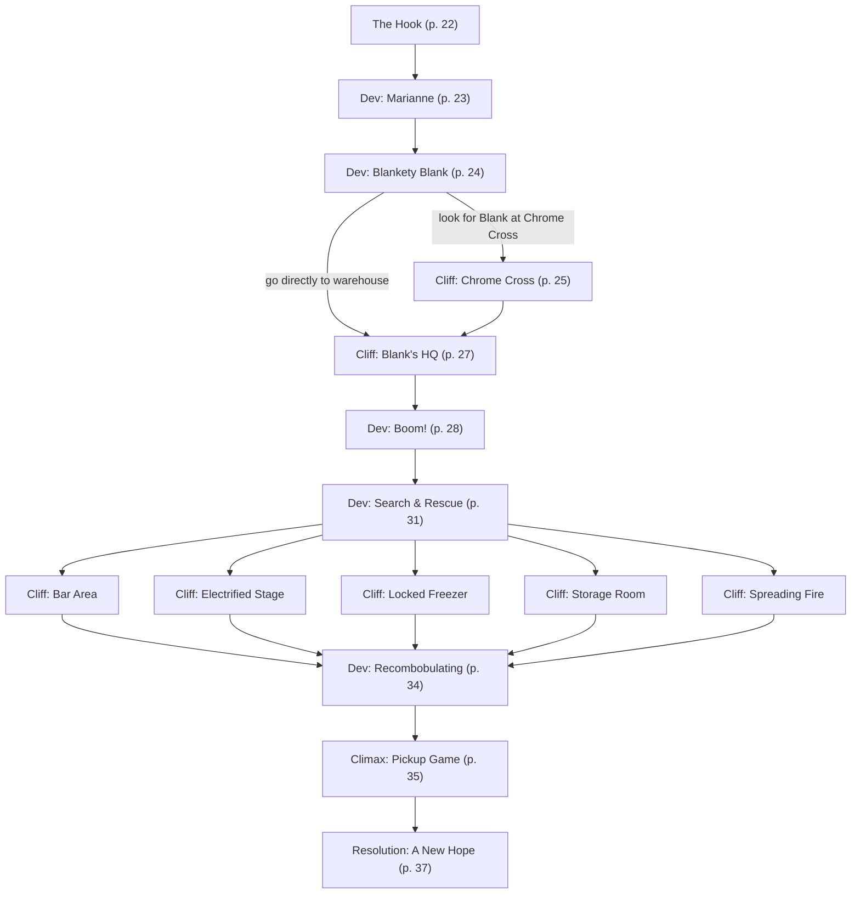

# M1: The Angel's Share

Book pages 20–41

First mission for the Forlorn Hope campaign.

## Contents

- [Beat Chart](<02 M1 The Angel's Share.md#beat-chart>) (p. 20)
- [Rumors](<02 M1 The Angel's Share.md#rumors>) (p. 21)
- [Background](<02 M1 The Angel's Share.md#background-read-aloud>) (p. 21)
- [The Rest of the Story](<02 M1 The Angel's Share.md#the-rest-of-the-story>) (p. 21)
- [The Setting](<02 M1 The Angel's Share.md#the-setting>) (p. 22)
- [The Opposition](<02 M1 The Angel's Share.md#the-opposition>) (p. 22)
- [The Hook](<02 M1 The Angel's Share.md#the-hook>) (p. 22)
- [Dev (Marianne)](<02 M1 The Angel's Share.md#dev-marianne>) (p. 23)
- [Dev (Blankety Blank)](<02 M1 The Angel's Share.md#dev-blankety-blank>) (p. 24)
- [Cliff (Chrome Cross)](<02 M1 The Angel's Share.md#cliff-chrome-cross>) (p. 25)
- [Cliff (Blank's HQ)](<02 M1 The Angel's Share.md#cliff-blanks-hq>) (p. 27)
- [Dev (Boom!)](<02 M1 The Angel's Share.md#dev-boom>) (p. 28)
- [Dev (Search & Rescue)](<02 M1 The Angel's Share.md#dev-search--rescue>) (p. 31)
- [Cliff (Bar Area)](<02 M1 The Angel's Share.md#cliff-bar-area>) (p. 31)
- [Cliff (Electrified Stage)](<02 M1 The Angel's Share.md#cliff-electrified-stage>) (p. 32)
- [Cliff (Locked Freezer)](<02 M1 The Angel's Share.md#cliff-locked-freezer>) (p. 32)
- [Cliff (Storage Room)](<02 M1 The Angel's Share.md#cliff-storage-room>) (p. 33)
- [Cliff (Spreading Fire)](<02 M1 The Angel's Share.md#cliff-spreading-fire>) (p. 34)
- [Dev (Recombobulating)](<02 M1 The Angel's Share.md#dev-recombobulating>) (p. 34)
- [Climax (Pickup Game)](<02 M1 The Angel's Share.md#climax-pickup-game>) (p. 35)
- [Resolution (A New Hope)](<02 M1 The Angel's Share.md#resolution-a-new-hope>) (p. 37)
- [Downtime](<02 M1 The Angel's Share.md#downtime>) (p. 37)
- [NPCs, Obstacles & NET Architectures](<02 M1 The Angel's Share.md#npcs-obstacles--net-architectures>) (p. 38)

---

*By Eddy Webb*

**Estimated play time:** 4 to 6 hours

---

## Beat Chart

**Flow summary:** Marianne hires the Crew to shut down XBD dealer Blank. Investigation leads to Chrome Cross (tail, track, or confront) and/or the Ling Po warehouse. After Blank's operation is destroyed, The Forlorn Hope explodes — the Crew races a 10-Round Clock to rescue trapped staff. Surviving rescuers face Red Chrome Legionnaires in a pickup-truck assault. Resolution at Phoenix Redwyne's clinic sets up rebuilding The Hope.

**Branching notes:**

- At **Dev (Blankety Blank)**, the Crew can go to Chrome Cross or straight to the warehouse.
- At **Chrome Cross**, options include tailing Blank, remote tracking, or parking-lot confrontation (may draw Red Chrome Legionnaires).
- During **Search & Rescue**, the Crew chooses which hazards to tackle; problems can be split or handled as a team. All five cliff beats loop back to Search & Rescue until the Clock ends or everyone is rescued.

---

### Rumors

| 1d6 | Rumor |
|-----|-------|
| 1 | The Red Chrome Legion recently hijacked a Militech cargo train. During the hijacking, a crew of edgerunners boarded and removed cargo crates right under the RCL's noses. |
| 2 | The Red Chrome Legion and Iron Sights have been at war for over a year due to the RCL's habit of poaching young Iron Sights recruits. In recent clashes, the Iron Sights have pushed the RCL out of Old Japantown and into the south side of Little China. |
| 3 | John "The Professor" Freeman, co-owner of The Forlorn Hope, is dying. His neuromuscular system is slowly shutting down. The condition is resistant to all known forms of treatment. |
| 4 | Earlier this year, an entire clown car's worth of Bozos attacked The Forlorn Hope. Most of the clowns proved to be ordinary Night City citizens who were kidnapped, brainwashed, and bodysculpted into becoming red-nosed shock troops. The event may have been the opening salvo in the now-ongoing Bozo civil war. |
| 5 | Marianne and The Professor, co-owners of The Forlorn Hope, have helped several streetrats escape exploitative membership in Maelstrom and Red Chrome Legion. Neither gang is happy with the couple. |
| 6 | There's been a flood of poor-quality bootleg and black market braindance chips in the south side of Little China. At least a dozen people have been left comatose after slotting one. |

---

> **Background (Read Aloud)**
>
> "The angel's share." It's what distillers call the amount of spirits lost to evaporation from the barrel as the whiskey ages. Every way of life has a cost for doing business, which Marianne Freeman understands. Maybe better than most. She's the bartender and manager of The Forlorn Hope and den mother to many a young edgerunner. She's tough as nails and doesn't put up with anyone's bullshit, but she's a rare flicker of light in the dark streets of Night City.
>
> Now Marianne needs a favor from you. Nothing major — an easy task for a group of experienced troubleshooters like yourselves — but it needs to be done. Just the angel's share of dirty business to keep The Forlorn Hope open. And what's a small favor for a friend?

### The Rest of the Story

For once, the job is as it appears. It's almost refreshing to have a straightforward client with a straightforward job. It's a shame that this will be a tragic night for The Forlorn Hope and its found family of Edgerunners.

Marianne Freeman is the wife of John "The Professor" Freeman. Together, the couple owns and operates The Forlorn Hope, an edgerunner bar in Little China. Marianne manages the day-to-day operations of the joint and often serves as barkeep to boot. She also acts as a surrogate mother figure to many young edgerunners, particularly trans kids growing up on The Street like she did. As such, The Forlorn Hope has a strict "no XBD" policy. Braindance is fine, but XBD has a dangerous layer of ersatz "reality" to it. And both Freemans have seen where addiction to cheap and nasty braindance chips leads.

A small-time dealer named Blank has been leaning on Marianne to allow him to sell precisely that kind of XBD in The Forlorn Hope, and she's kicked him out of the bar every time he comes around. In response, Blank has made vague threats against her and some of the patrons. Marianne isn't worried about Blank and his goons getting past Petra's security, but there might be repercussions for her staff and adopted kids when they're out and about beyond the protection of The Forlorn Hope's walls.

She wants a few experienced edgerunners to put Blank out of business. What she doesn't know is that Blank has also been dealing XBD to the Red Chrome Legion, a neo-fascist hate gang, and they'll be drawn into the night's events by the end of the Mission.

Worse, unknown to everyone, this is The Forlorn Hope's last night as it succumbs to a fire set by a Maelstrom charmer named Ripper.

### The Setting

The mission starts in The Forlorn Hope, as Marianne asks the edgerunners for a favor. From there, they might travel to the parking lot of Chrome Cross, a hangout for the Red Chrome Legion, or to an old warehouse.

Abandoned by Ling Po Imports during the 4th Corporate War, the warehouse is now home to anyone with enough muscle to hold it. From there, it's back to (the remains of) The Forlorn Hope.

### The Opposition

- The Crew will be confronted by a gaggle of **Baby Punks** in The Forlorn Hope.
- **Blank** likes to think of himself as a Fixer, but he's just a sleazy dealer who specializes in cheap, bootleg XBDs.
- Blank makes enough money selling to some gangs in Little China to hire a **Bodyguard**, an **XBD Technician**, and some **Hustle** (hired muscle) for security.
- Once The Forlorn Hope crashes and burns, the Edgerunners must navigate a variety of dangerous situations if they hope to save the people remaining inside.
- And the cherry on top: **Red Chrome Legionnaires** show up in the end to rub salt in the wounds of the survivors.

### The Hook

Close to closing time, The Forlorn Hope isn't that impressive — a run-down hotel in Little China that looks like it was the target of the entire 4th Corporate War. You've seen countless such buildings scattered around Night City's combat zones end up as a haven for squatters and addicts, but the bullet marks on the walls and faded bloodstains on the concrete just add to the character of this place.

Even at this late hour, you hear music and laughter coming from inside. Right above the door, you can make out a flickering neon sign that reads "The Forlorn Hope."

Inside the bar, the raucous noise picks up. Loud music bursts out of large speakers that might be older than you. You can see a band playing on stage while the patrons drink, dance, and flirt with each other. As the band finishes their song, a person wearing criss-crossed leather belts and military body language strolls over to you from the corner they were lurking in.

"Name's Petra," they say. "I'm the security. We're about to close up, so I don't have time for bullshit. Keep your weapons holstered and your attitude in check, and we'll get along fine." They point to a group getting up from a nearby table as the band starts their final number. "I know Marianne's expecting you, but she's busy, so grab that table, and she'll be with you when she can."

> **Infobox: The Forlorn Hope (DV9)**
>
> Founded in 2011, The Forlorn Hope began life as a bar catering to veterans of the Central American conflicts. Over time, it evolved into an edgerunner hangout bar. It isn't as famous as The Afterlife, but those in the know see it as a home away from home, where they can find peace or plan a job without worry. The Forlorn Hope also provides services besides food, drink, and music via an in-house Tech, a ripperdoc clinic in the basement, and even lodging for favorite regulars who need it. Owned by John "The Professor" Freeman and his wife, Marianne Freeman, she runs the day-to-day operations while he focuses on helping veterans of the 4th Corporate War find needed services and help.

Let the Edgerunners settle into their table and listen to the music. A Black woman wearing electric blue fronts the band as they play a thumping mixture of punk and soul, with a dash of hip-hop thrown in for good measure. If you're randomly sharing tidbits from the Rumor table (see pg. 21) this is a good time to do so. After a song or two, a group of drunk patrons approach the Crew.

Three punks with bad attitudes walk up to the table. The fake leather jackets and cheap armor they wear scream "baby edgerunner with more balls than sense."

"Beat it, doombas," the tallest one says. She slams a glass down on the table, and yellow, foamy smash spills over the lip. "This is our table now, neh? So bail." A quick glance towards the door, and you see Petra escorting a fourth punk in a similar jacket outside. A few nearby patrons look on in amusement, curious to know if they'll get a floor show along with their music.

These are bottom-of-the-barrel **Baby Punks** (see pg. 38) trying to throw their weight around. How the Crew wants to deal with the problem is up to them. They have a Round or two to act before Petra finishes ejecting their friend, notices the situation, and takes action.

Start with a Facedown (see pg. 194) to see who blinks first. After that, example tactics the Crew might use include talking them down or scaring them off (a Persuasion Check), making them think they're too cool to be approached like this (Wardrobe & Style), or doing the old "grab and shove someone's head down against the table" routine (Brawling or Martial Arts) to make the jerks reconsider. All against a DV set by the GM. If the Crew succeed at their Checks, the doombas back off and leave.

If the Baby Punks leave, Petra comes over and thanks the Crew for keeping a level head and not turning this into a firefight. If, however, they are still an issue, Petra will tell the doombas to leave. A couple of regulars will join in to help escort any troublemakers out.

After ensuring the drunk troublemakers leave, Petra jerks a thumb over their shoulder. "Marianne is ready to talk to you. At the bar."

**Go to:** [Dev (Marianne)](<02 M1 The Angel's Share.md#dev-marianne>)

#### Not a Gun Fight

Considering this is Cyberpunk RED, the Players' first instinct might be to pull their guns and start blasting away. After all, The Forlorn Hope isn't the sort of bar where you must check your weapons at the door. This is a good chance to educate the Players — not all conflicts need to be resolved with bullets. If a Player says they're drawing their iron, ask for a DV9 Concentration Check and remind them about Petra's warning: "Keep your weapons holstered and your attitude in check, and we'll get along fine."

If they insist on turning this into a gunfight, the music stops. The various regulars pull their weapons, ready to shoot whomever they see as a threat to The Forlorn Hope — and right now, it isn't clear if that's the baby edgerunners or the Crew. A gruff voice will set the tone: "A thrown punch or two isn't a problem, choomba, but don't be bringing violence into The Hope."

This isn't just a matter of proper etiquette, either. If the Crew forces the issue, they'll lose respect in the eyes of their fellow edgerunners. That probably isn't the sort of reputation they want.

### Dev (Marianne)

As the band winds down and the regulars start to file out, you approach the bar. Marianne is a white woman beginning to feel the touch of age, with long pink hair, piercing green eyes, and a fashionable new cyberhand. She uses an Agent to collect payment from the last of her customers before tucking it away and approaching.

"Marianne Freeman," she says, holding her cyberhand out for shaking. You notice the gold ring on her finger. She calls out to a young woman in glasses, "Edelweiss, start clean-up. I need to talk to these fine young people in my office, then I'll come back out to help."

Marianne guides the Crew to a back office with filing cabinets and an old, military-issued metal desk.

Behind the desk sits an older white man in a Rocklin Augmentics Spider Cyberchair, its four hydraulic limbs hissing as they move. His hair has long since turned gray, but you can see the steel in his eyes. An interface cable runs from an old-model interface port in his temple down to the chair. He nods at you as he carefully reviews a tablet that trembles slightly in his hands. Marianne leans over and gives him a peck on the cheek, and he smiles slightly despite himself.

"My husband, John," she says. "Everyone calls him The Professor. He's here to listen, but I'm giving you this job."

The Professor sets down the tablet and watches as his wife moves around the desk to stand in front of you. "Sit wherever you want," she says. "It's our office, but I'm behind the bar so much I sometimes forget this place is even here." She winks as she perches on the edge of the desk, her legs dangling. "But seriously, Auntie Marianne needs a favor if you have the time."

While Marianne is a joker and a flirt, she's all business as soon as the Edgerunners settle in.

"I have a problem, and his name is Blank. No, seriously, he goes by Blank because this is the kind of guy who thinks a handle like 'Blank' is impressive. He's a nasty hood dealing even nastier braindance chips. They're XBD — braindance with all the safeties removed. At best, you can get addicted. At worst? You can end up drooling. Blank's been sniffing around The Hope for the past month, but John and I have a strict 'no XBD' policy here."

Marianne looks back at her husband, who nods. She smiles and looks back at you. "I've asked Petra — you met them, by the door — to bounce him more times than a rubber ball, but he isn't picking up on the hint."

She leans forward, and you can see a glint in her eye. You get the impression this woman has run the Edge more than a few times in her life. "As of tonight, Blank's career as a dealer is over. Find his operation. Find his equipment. Smash it all. I'm not hiring you to do wetwork — this doomba isn't worth how much it would cost — but beyond that, use your imagination. Loud or quiet doesn't matter to me as long as it's done and done tonight."

Marianne and The Professor offer the Crew 500eb per person for the job, but she can throw in drink and meal vouchers with successful negotiation. She transmits a photo of Blank, a rather bland-looking white guy sporting dreadlocks, to one of the Crew's Agents and promises payment as soon as the job's done.

"Come back to The Hope when you're done," Marianne says, "The job shouldn't take you long, and we'll still be here, cleaning up."

**Go to:** [Dev (Blankety Blank)](<02 M1 The Angel's Share.md#dev-blankety-blank>)

### Dev (Blankety Blank)

First things first, the Crew needs to find Blank. There are a few ways they can go about it.

- Using **Library Search** or **Criminology** to dig through news reports and criminal records to learn more about Blank. It's a difficult Skill Check (DV17), primarily because Blank is small-time and doesn't warrant much attention from the screamsheets or the cops. A successful roll reveals that he always operates within Little China, which narrows the field considerably.
- **Local Expert** can also be used, but it's easier (DV15) to find the same information as above. In addition, he tends to deal in the parking lot of Chrome Cross, a local neo-Nazi bar, and hang out for the Red Chrome Legion. Medias can make this Check at a DV13 using Credibility to scout out a few rumors on the subject.
- Talking to locals in Little China can help, using an appropriate Social Skill such as Bribery, Conversation, or Persuasion. Succeeding against DV13 will reveal that Blank is becoming one of the local names to go to for XBDs. He usually deals out of Chrome Cross's parking lot. Lately, he's been seen with a bodyguard. Fixers with an Operator Rank of 3 or higher learn this information automatically by canvassing their contacts.
- An **Electronics/Security Tech** or **Streetwise** Check (DV13) will reveal that any XBD dealer slinging bootleg chips needs a place to burn and store them. It would have to be either massively secure (unlikely for someone at Blank's scale) or hidden in some shithole building (which is much more plausible). A similar Skill Check is needed to know that Chrome Cross is the local bar for the Red Chrome Legion.
- If the Players are still struggling to figure things out, let them make a **Deduction** Check (DV17, grant them a +1 bonus to the Check for each of the above bullet points they worked out before this one) to figure out that if Blank is hiring bodyguards, he probably isn't investing in facilities, so he's likely squatting in an abandoned warehouse, and it has to be somewhere in Little China. With a DV15 Library Search, Local Expert, or Streetwise Check, they might realize a group of old Ling Po Import/Export warehouses lie abandoned roughly midway between Chrome Cross and The Forlorn Hope.

The Crew has two options: Follow or shake down Blank at Chrome Cross or go directly to the Ling Po warehouse to confront Blank and his bodyguards.

- If the Crew tries to find Blank at Chrome Cross, **Go to:** [Cliff (Chrome Cross)](<02 M1 The Angel's Share.md#cliff-chrome-cross>)
- If the Crew goes to Blank's warehouse, **Go to:** [Cliff (Blank's HQ)](<02 M1 The Angel's Share.md#cliff-blanks-hq>)

### Cliff (Chrome Cross)

Chrome Cross is exactly what you expect from a shitty bar with shitty customers. As befits a dive bar in a combat zone, it's damaged and teetering on the edge of collapse.

The cars and trucks in the parking lot all look salvaged, with mismatched paint and primer underneath badly spelled hate-speech graffiti.

In one shadowy corner of the lot, away from the vehicles, you notice two figures. One is smoking a cigarette and wearing a long, ratty coat. He has purple and red dreadlocks and piercings in his nose and ears. Next to him looms a larger figure with a blue mohawk and an obvious holster under his armpit, scanning the parking lot.

As you decide what to do, two Red Chrome Legionnaires walk out the door of the bar, laughing loudly and punching each other playfully. They walk over to dreadlocks and his hustle.

> **Infobox: Red Chrome Legion (DV13)**
>
> The Red Chrome Legion began life as a poser gang; Edgy teens who enjoyed cosplaying as Nazis. As often happens, people who pretend to be assholes soon became assholes, and Neo-fascist ideology grew into the core bedrock of the gang's identity. In the Time of the Red, members of the gang talk a lot about "The Great Caesar," an almost messianic figure who will rise up from their ranks to conquer Night City and establish it as a hub of "a new American Empire, free of the pollution of foreign filth and corrupt cultures." It all sounds impressive until a choomba realizes they're just another combat zone gang engaged in constant warfare with nearby rivals. They aren't conquering shit.

#### Following Blank

If the Edgerunners are here just to tail **Blank** (see pg. 39) back to his warehouse, they watch as what is obviously some kind of illicit exchange takes place between the Red Chrome Legionnaires and Blank. After he's counted his money and the Red Chrome Legionnaires return to the bar, Blank and his **Bodyguard** (see pg. 39) walk out of the parking lot.

Have the Crew make Stealth Checks against Blank and the Bodyguard's Perception. If the NPCs succeed, they notice the Crew. Blank's Bodyguard will turn to engage the Crew while his boss flees. The Bodyguard will surrender and spill his guts as to the location of the XBD production facility if he's in mortal danger (less than 5 HP). If the Crew manages to capture Blank, he'll tell them where his warehouse is with little provocation. He's a coward at heart.

If the Crew succeeds at their Stealth Check, they can tail the pair back to the warehouse.

**Go to:** [Cliff (Blank's HQ)](<02 M1 The Angel's Share.md#cliff-blanks-hq>)

#### Tracking Blank

The Crew could attempt to track Blank remotely instead. This can be done by a tech-savvy Edgerunner via hacking the dealer's Agent with a Breacher (see pg. 179) or planting a tracker via a contested Conceal/Reveal Object versus Blank's Perception in a classic "bump and plant" maneuver. With success, the Crew can track the two to the Ling Po warehouse.

**Go to:** [Cliff (Blank's HQ)](<02 M1 The Angel's Share.md#cliff-blanks-hq>)

#### Parking Lot Confrontation

The Crew might confront Blank in the parking lot or pose as buyers. If so, Blank is suspicious but greedy and easily intimidated. A Streetwise or Persuasion Check to threaten him is at DV15, while one to convince him to sell is only at DV13. If the Check succeeds, Blank will either promise not to sell again or sell a few XBD chips (50eb each), then leave, allowing the Crew to trail the two back to the Ling Po warehouse.

If the Check fails, or the Edgerunners attack in Chrome Cross parking lot, 2 **Red Chrome Legionnaires** (see pg. 38) — either the ones Blank just sold an XBD to or two just now exiting the bar — will join the fight with Blank's Bodyguard while Blank flees. The Legionnaires won't fight to defend either Blank or the Bodyguard, but they respond to any attack on their turf with violence.

At the top of the 3rd Round, an additional number of Red Chrome Legionnaires equal to the number of Edgerunners in the Crew minus two (minimum one) will exit Chrome Cross and join the fight. The Legionnaires will aim to murder the Edgerunners and aren't interested in prisoners. They will run if half or more of their number are Seriously Wounded.

If the Crew defeats the Legionnaires and/or the bodyguard, and Blank isn't around, one of them will spill the beans about the location of his production facility.

If the Crew manages to capture Blank, he'll tell them where his warehouse is. If released, he immediately flees. If Blank is killed, the location of the warehouse can be found on his Agent.

Otherwise, the Crew might need another way to find Blank's warehouse. Check the options in **Dev (Blankety Blank)**, but if they are stuck, Marianne can call the Crew and tell them one of her patrons heard about the scuffle at Chrome Cross and noticed Blank heading to the old Ling Po Imports warehouse.

**Go to:** [Cliff (Blank's HQ)](<02 M1 The Angel's Share.md#cliff-blanks-hq>)

### Cliff (Blank's HQ)

Whether the Crew followed or tracked Blank back to the warehouse or used their deductive skills to figure out the location, it's quickly apparent why this is the ideal location for a shady XBD dealer.

This warehouse is an old remnant of Little China from back before David Ling Po decided it was better to rule over a rebuilding Little China than a single import/export company. The building looks nondescript, with only faint traces of the "Ling Po" painted sign remaining on the crumbling brick. Most of the buildings nearby have been demolished or collapsed under their own weight, making it easy to control the area. Surprisingly, there aren't any guards patrolling the warehouse.

There are several ways into the warehouse. The front has a nondescript metal door, along with a cargo bay door (both unlocked with a DV15 Pick Lock Check). There's also a metal door in the back with a similar lock. Along both side walls are several broken windows covered in rusting metal bars. The bars can be yanked free with a BODY STAT Check against DV15 or sliced through with the right tool and a DV9 Basic Tech Check. Both processes are noisy and will alert anyone inside.

Once inside, read the following.

All around are ancient, broken crates with the "Ling Po Imports" name on fragmented, moldering bits of plastic. A thick layer of dust and cobwebs covers the molding stock. In the center of the warehouse, a tattooed technician fiddles with an editing deck, a chip burner, and a stack of chips.

The rest of the scene changes depending on the Crew's actions during **Cliff (Chrome Cross)**. If Blank returns and is unaware of the Edgerunners, he is in the process of checking an inventory list on his Agent. If he believes himself in danger, he is stuffing chips into a bag while his Hustle stands and peers in all directions, armed and ready for trouble. Blank's Bodyguard, if present, is always alert and ready for danger. He's not an experienced pro yet, but he's at least serious about his job.

In addition to the **XBD Technician** (see pg. 38) and possibly **Blank** and his **Bodyguard**, there are a number of **Hustle Mooks** (see pg. 38) present equal to the number of Edgerunners. Once combat begins, Blank spends one Round grabbing the chip burner and editing deck, then attempts to run out the most convenient exit.

The Bodyguard and Hustle Mooks will fight until Seriously Wounded, at which point each will surrender or attempt to flee. They aren't being paid enough to die over this. The XBD Technician will fight back until he takes at least 5 points of damage to his HP, after which he tries to flee.

If Blank manages to leave the warehouse with the equipment, he doesn't have a car, so the Crew can try to chase him down on foot. Have everyone chasing Blank make an Athletics Check while you roll for Blank. Every Edgerunner that rolls better than Blank catches up with him. If Blank manages to escape, he leaves Little China, never to return.

The braindance equipment can be destroyed with an Electronics/Security Tech Check, DV9, or by stomping on it with a solid boot on concrete.

If Blank isn't present, perhaps due to still being at Chrome Cross (or being dead), his Hustle and the XBD Technician will put up a token resistance. The XBD Technician flees after taking any damage. The Hustle Mooks surrender or run if they take more than 10 HP in damage.

**Go to:** [Dev (Boom!)](<02 M1 The Angel's Share.md#dev-boom>)

### Dev (Boom!)

Once Blank and his operation are dealt with, the Crew heads back to The Forlorn Hope.

With the job done, you head back to The Forlorn Hope to collect your money and maybe a drink or two before you crash. You're thinking about how you'll spend what's left of the night when your bones rattle from a thunderous explosion. In the distance, you see a huge plume of smoke. Right around where The Forlorn Hope would be.

The Crew doesn't need a Skill Check to figure out that the explosion came from the direction of The Forlorn Hope. However, an appropriate Skill Check (such as Criminology, Demolitions, or Weaponstech against DV13) reveals that the explosion isn't from weapons fire or a conventional explosive; it's the sound of a part of a building collapsing in on itself.

As the Crew rush to the scene, their worst fears are confirmed.

Before, The Forlorn Hope looked like the last survivor of a war. Now, it looks like it's succumbed to its wounds. The upper floors of the building are on fire and have started to collapse into the first floor. Smoke pours out of the open front door. Inside, the usual sounds of laughing and chatter have been replaced with screams for help and moans of pain.

Five people sit or lay on the sidewalk across the street from the burning building, being tended to by Grace Steel, the lead singer of the band that was playing inside during your earlier visit.

"I was outside having a smoke, taking a break while we shut down for the night when … this lot stumbled out but Marianne, The Professor, Petra … my band mates! They're still in there!"

A DV13 First Aid or Paramedic Check allows for a quick triage of the five people Grace is helping. All have cuts and bruises. Two are currently coughing up their lungs thanks to smoke inhalation. One is suffering from second-degree burns and is unconscious. And one suffered head trauma — likely something fell on them. Thanks to Grace, they're all stabilized.

"I've got to help this lot!" Grace yells, "Go! Get the others if you can!"

If a Medtech or other Crew member offers to stay with the wounded, Grace demures. "I've got some experience and they're stable for now, but the folks inside might need more medical help than I can provide! Go!"

Once the Crew step through the door and into The Forlorn Hope, they find chaos waiting.

Smoke fills the air, burning the lungs and eyes. Rubble is piled up around the bar. You can smell the ozone from electricity crackling in the air. There are voices somewhere you can't make out, and everywhere you look, something is on fire.

The Forlorn Hope is dying. The only question is, will the people trapped inside die with it?

**Map key:** E — Entrance · 1 — Marianne, trapped under rubble behind the bar · 2 — Edelweiss, trapped on the electrified stage · 3 — Valence, trapped in the walk-in freezer · 4 — Petra, trapped in the storage room · O — The Office, where The Professor is trying to free Rory

Let the Players know that they have five options to try to rescue people from the rubble of The Forlorn Hope.

- Someone is trapped under rubble behind the bar.
- Someone is trapped on the stage, as the electronics on it spark and pop.
- It sounds like someone is banging on the door of the walk-in freezer.
- Shouting can be heard from the storeroom.
- The fire is spreading and might block access to specific areas or the exit.

The Crew can tackle each problem as a team or divide their forces to address them all at once. There are benefits and drawbacks to each option. Working individually helps solve the problems faster, but makes it harder to accomplish each goal. On the other hand, working together makes it easier to succeed at each task, but risks slowing down the rescue operation.

Once the Players decide what they want to do, roll Initiative and set the Clock.

#### The Clock

The building will fully collapse in 10 Rounds but before then, the situation inside will grow progressively worse. To track the deterioration of the situation, write the number 1 in a central place where all the Players can see. We call this the **Clock**.

Roll Initiative as you normally would for combat. At the top of the 2nd Round (and each consecutive Round thereafter), increase the Clock by 1. Some problems have events that happen at certain Clock benchmarks — if a particular problem is resolved ignore the relevant event. For simplicity's sake, all NPCs go at the end of the Round. No need to roll Initiative for them.

Don't initially apply penalties based on visibility, despite the building being on fire. Those will occur as the Clock advances.

Players shouldn't know what will happen at each Clock number until the effects occur. All events take place at the top of the Round (with the exception of the building collapsing when the Clock reaches 10).

| Clock # | Event |
|---------|-------|
| 2 | Add 1d6 HP to all Spreading Fires. |
| 3 | The smoke filling the room grows worse. -1 to all Checks made inside The Forlorn Hope (an Anti-Smog Mask or independent oxygen supply eliminates this penalty). Add 1d6 HP to all Spreading Fires. |
| 4 | Add 1d6 HP to all Spreading Fires. |
| 5 | The smoke filling the room grows worse. -2 to all Checks made inside The Forlorn Hope (an Anti-Smog Mask or independent oxygen supply reduces this penalty to -1). Petra screams, "I can smell gas! I think a line in the wall broke!" Add 1d6 HP to all Spreading Fires. |
| 6 | If not already freed, Marianne rescues herself from the Heavy Rubble at the bar area. She immediately dives into the office, screaming, "John!!!" Add 1d6 HP to all Spreading Fires. |
| 7 | If Petra has not been rescued and any Spreading Fire has more than 0 HP, the storage room explodes, and they die. Add 1d6 HP to all Spreading Fires. |
| 8 | The smoke filling the room grows worse. -3 to all Checks made inside The Forlorn Hope (an Anti-Smog Mask or independent oxygen supply reduces this penalty to -2). Add 1d6 HP to all Spreading Fires. |
| 9 | If she has not been rescued, Edelweiss dies. If not already freed, Valence escapes from the locked freezer. If not already rescued, The Professor and Rory escape with the help of Marianne. The building rumbles ominously, warning of imminent collapse. Add 1d6 HP to all Spreading Fires. |
| 10 | At the end of this Round, the building collapses, killing anyone still inside. Including any remaining Crew. |

If the Players ask, allow for a Tactics Check (DV13) to realize the best strategy would be to have most of the Crew put out the fire first while one or two tackle the Electrified Stage, then split their efforts between the Heavy Rubble and Collapsed Girders, and finally free the person trapped in the Locked Freezer.

Don't worry about movement during this Beat. Though we are treating it like combat, assume the Edgerunners and NPCs capable of movement can reach any spot on the map, including the exit, with a single Move Action, no matter their actual MOVE.

**Go to:** [Dev (Search & Rescue)](<02 M1 The Angel's Share.md#dev-search--rescue>)

### Dev (Search & Rescue)

This is a hub for the various possible tasks the Crew can perform while inside the collapsing Forlorn Hope.

They are not required to stay inside the building and can escape to the outside at any time.

Once they've finished their tasks, either because they've rescued everyone, the Clock ran out, or they've given up, **Go to:** [Dev (Recombobulating)](<02 M1 The Angel's Share.md#dev-recombobulating>)

- If the Crew wants to move some rubble to free the trapped victim at the bar, **Go to:** [Cliff (Bar Area)](<02 M1 The Angel's Share.md#cliff-bar-area>)
- If they want to get someone off the electrified stage, **Go to:** [Cliff (Electrified Stage)](<02 M1 The Angel's Share.md#cliff-electrified-stage>)
- If the idea is to free someone from a locked freezer, **Go to:** [Cliff (Locked Freezer)](<02 M1 The Angel's Share.md#cliff-locked-freezer>)
- If the Crew wants to rescue someone from the storage room, **Go to:** [Cliff (Storage Room)](<02 M1 The Angel's Share.md#cliff-storage-room>)
- If they want to deal with the spreading fire, **Go to:** [Cliff (Spreading Fire)](<02 M1 The Angel's Share.md#cliff-spreading-fire>)

### Cliff (Bar Area)

**If the Clock is 5 or lower**

Large chunks of steel and reinforced concrete trap Marianne behind the bar and block the office door. She's trying to shift one piece to squeeze her way through the mess and through the door, but her left arm dangles uselessly by her side. It looks like it's dislocated or broken.

Marianne is trapped by **Heavy Rubble** (see pg. 40). Treat it like an NPC for the purposes of this beat. Evasion, in this case, represents the rubble shifting or breaking apart to resist attempts to dislodge it. Reducing the Heavy Rubble's HP to 0 frees Marianne, but just blasting or hacking away at it risks harming her. Every 5 points of damage done to the Heavy Rubble via a standard weapon Attack also means Marianne is damaged by its Rubble Attack. This Attack hits automatically, bypasses her armor (SP7 otherwise), and deals damage directly to her HP, which is currently 40. She won't be shy about telling the Crew that their plan isn't a good one.

The Heavy Rubble can be shifted or pushed aside. Treat an Athletics Check like a Brawling attack (see pg. 176), with the "damage" from the attached STAT using the Brawling Damage table below, lowering the Heavy Rubble's HP. Marianne is not hurt by this, or similar, Actions.

If Players come up with clever uses for other Skills, such as using Basic Tech to construct a lever and fulcrum to shift rubble, that can be used in place of the Athletics Check.

At the GM's discretion, the Heavy Rubble can "return fire" at an Edgerunner at the bottom of the Round, with an Attack Check representing part of it falling on them or cutting them during the rescue effort. This is considered a Melee Attack for the purposes of Evasion.

#### Makeshift Brawling Damage

During this Beat, the Crew might "attack" the obstacles in unusual ways. When they do so, ask for an appropriate Skill Check to decide if the attack succeeds, then use the following chart to determine damage via the STAT attached to the Skill used.

| STAT | Damage |
|------|--------|
| 4 or under | 1d6 |
| 5 or 6 | 2d6 |
| 7 or higher | 3d6 |

#### Explosives

Impatient Players might want to speed up the rescue operation through the use of explosives. Feel free to remind them they're in a burning building with a damaged infrastructure. Using grenades and other boom toys could bring the whole place down prematurely.

Once the Heavy Rubble's HP has been reduced to zero, or the Clock hits 6, Marianne breaks free. She will refuse to exit the building and instead head into the office to rescue her husband.

**If the Clock is at 6**

Large chunks of steel and reinforced concrete have fallen over the bar. Marianne shoves some of the rubble out of her way. One of her arms dangles uselessly by her side, looking like it's dislocated or broken. "John!" she yells before diving through the door to her office.

Anyone following her will see The Professor is in the process of using his cyberchair and a length of cable to pull rubble off the top of a young, redheaded woman.

Marianne immediately goes to help. If any member of the Crew aids them, The Professor, Marianne, and Rory O'Reilly (the redhead) can all escape from the burning building at the top of the next Round. Otherwise, they escape when the Clock reaches 9.

**If the Clock is at 7 or higher**

Large chunks of steel and reinforced concrete have fallen over the bar but have been shifted to allow access to the office. You don't see anyone in danger here.

**Go to:** [Dev (Search & Rescue)](<02 M1 The Angel's Share.md#dev-search--rescue>)

### Cliff (Electrified Stage)

**If the Clock is at 8 or lower**

Large arcs of electricity skitter across the stage like a living thing. A huge chunk of the ceiling landed on the band members, and you can tell from a glance that no Trauma Team squad in the world can bring them back. However, Edelweiss, the staff member Marianne spoke to earlier, managed to climb onto one of the large amps, away from the electrified stage. "Get me off of here!" she screams as a blue bolt of electricity crackles right next to her head.

Edelweiss is trapped by the **Electrified Stage** (see pg. 40). Treat it like an NPC for the purposes of this battle. Evasion, in this case, represents the confusing tangle of wires and debris, making it hard to discern what's critical to the power system and what's not. The Crew can attempt to chop wires in order to cut off the flow of electricity. When Attacking the stage in this fashion, a roll of 1 causes an explosion of electricity, and the Electrified Stage performs an Attack against whichever Edgerunner is closest to the stage. A Solo's Fumble Recovery can prevent this.

The Crew can also attempt to pull wires, find the cutoff switch, or otherwise try to shut down the Electrified Stage. Treat an Electronics/Security Check like a Brawling attack (see pg. 176). Use TECH instead of BODY to calculate damage to the Electrified Stage's HP.

A Netrunner can also enter the Stage's NET Architecture (see pg. 40). Successfully taking control of the Lighting Control Node and shutting it down cuts the Electrified Stage's current HP in half. The Control Node for the Sound System is corrupted and glitching so badly that it cannot be interacted with. The system's Demon, an Imp in the form of a tall Black man wearing a dark trenchcoat and mirrorshades, is also glitching and will prioritize attacking any "invading" Netrunners. However, because of the damage to the system, the Imp loses 2 REZ each time it performs a NET Action. The Electrified Stage's HP immediately drops to 0 if the Demon is defeated.

At the end of each Round, the Electrified Stage makes an Attack against Edelweiss (who has 35 HP and SP7 armor) with arcs of random electricity. She cannot evade the attack. Once the Electrified Stage's HP has been reduced to zero, Edelweiss can leap free. She will flee the burning building immediately.

**If the Clock is at 9**

Large arcs of electricity skitter across the stage. A huge chunk of the ceiling landed on the band members, and you can tell from a glance that no Trauma Team squad in the world can bring them back. It looked like someone tried to climb off the stage, but the electricity burned them to the bone. There's nothing else you can do here.

**Go to:** [Dev (Search & Rescue)](<02 M1 The Angel's Share.md#dev-search--rescue>)

### Cliff (Locked Freezer)

**If the Clock is at 8 or lower**

From a crumpled metal door near the bar, you hear panicked thumping and cries for help. "Hey!" a voice screams from inside. "The door's stuck, and it's getting hard to breathe. Get me out of here!"

This is Valence, a server Marianne and The Professor rescued from Maelstrom's scavver gang. The door is thick steel, with 50 HP. Any Attack made against it automatically succeeds but firearms won't open a big enough hole for Valence to climb through. If the Crew wants to apply their muscle or brains to the problem, treat any Athletics Check to pry open the door or Basic Tech Check to leverage open the door as a Brawling Attack (see pg. 176) with the damage based on the attached STAT. Valence continues to push from the other side, doing 1d6 damage to the door at the bottom of the Round.

Once the door's HP has been reduced to 0, Valence is free. Valence will help free Marianne from the Heavy Rubble if they're not already free and then help shepherd her, The Professor, and Rory outside. There's no need to make a Check for Valence. Just assume they offer anyone who needs it an automatic +1 Complimentary Skill Check Bonus. Otherwise, Valence will escape outside to offer medical aid to the survivors.

**If the Clock is at 9**

From a shattered doorway next to the bar, you see a large metal door hanging open. Whoever was trapped here seems to have found a way to escape.

**Go to:** [Dev (Search & Rescue)](<02 M1 The Angel's Share.md#dev-search--rescue>)

### Cliff (Storage Room)

**If the Clock is at 6 or lower**

Dodging through the rubble and fire, you make your way towards the storage room. There you see Petra trapped behind several fallen metal girders that block the exit. All around are crates full of chemicals.

"I'm trapped in here," Petra growls, pushing ineffectually on a girder. "Is there anything you can do on your side to help?"

Petra is trapped by **Collapsed Girders** (see pg. 40). Treat it like an NPC for the purposes of battle with one major exception: the Collapsed Girders can't evade melee attacks. Reducing the Collapsed Girders' HP to 0 frees Petra, but just blasting or hacking away at it risks harming them. Every 5 points of damage done to the Collapsed Girders via a standard weapon Attack also means Petra is damaged by its Rubble Attack. This Attack hits automatically as pieces of flaming debris fall from the wall and ceiling. Petra has 50 HP and is wearing SP11 armor.

The Collapsed Girders can be shifted or pushed aside. Treat an Athletics Check like a Brawling attack (see pg. 176), with the "damage" from the attached STAT using the Brawling Damage table lowering the Collapsed Girders' HP. Petra is not hurt by this or similar Actions.

If Players come up with clever uses for other Skills, such as using Basic Tech to construct a lever and fulcrum to shift the girders, that can be used in place of the Athletics Check.

At the GM's discretion, the rubble can "attack back" at an Edgerunner at the bottom of the Round, representing part of it falling on them or cutting them during the rescue effort. This is considered a Melee Check for the purposes of Evasion.

Once the Collapsed Girders' HP has been reduced to zero, Petra squirms free and begins fighting any remaining Spreading Fires, automatically doing 3d6 damage to one at the end of each Round.

If the Crew is still trying to free Petra when the Clock hits 5, they shout, "I can smell gas! I think a line in the wall broke!"

If the Crew is still trying to free Petra when the Clock hits 6 and any of the Spreading Fires still burn, Petra calls out, "It's too late! Get out of here!"

When the Clock hits 7, if any Spreading Fires still burn, the Storage Room explodes. Anyone still trying to rescue Petra suffers 6d6 damage. Petra dies.

**If the Clock is at 7**

You hear an explosion coming from the back of the bar! A brief scream sounds out before it dies, gurgling. Dodging through the rubble and fires, you make your way into the storage room. There, you see dozens of open crates and exploded chemical bottles surrounding Petra's badly burnt body. There's nothing you can do for them.

**If the Clock is at 8 or higher**

Dodging through the rubble and fires, you make your way into the storage room. There, you see dozens of open crates and exploded chemical bottles surrounding Petra's badly burnt body. There's nothing you can do for them.

**Go to:** [Dev (Search & Rescue)](<02 M1 The Angel's Share.md#dev-search--rescue>)

### Cliff (Spreading Fire)

There's fire everywhere, and it seeks to spread across the floor, up the walls, and even along the ceiling. Stemming the tide of the blaze might be a worthy task and increase the chance of rescuing the people trapped inside.

There are a number of individual **Spreading Fires** (see pg. 40) equal to ½ the number of Edgerunners (rounded up). Any Attack made against the Spreading Fires is done at a DV9 and must be done with an appropriate weapon. A firearm won't do much good, but a successful melee weapon or Brawling Attack represents removing/destroying any substance that can act as fuel for the fire.

At the top of each Round beyond the first (when the Clock is 2 or higher), add 1d6 HP to all Spreading Fires as they grow and spread. This can take the Spreading Fire's HP above its initial maximum. If a 6 is rolled on the 1d6, the fire in question also attacks one Edgerunner or NPC, as determined by the GM. This is considered a Melee Check for the purposes of Evasion.

There are three fire extinguishers throughout The Hope: One behind the bar, one in the freezer, and one beside the stage. If the Cliff (Bar Area), Cliff (Electrified Stage), or Cliff (Locked Freezer) Beats are successfully resolved, an Edgerunner automatically notices the extinguisher and can grab it without an Action.

#### Fire Extinguisher

Cost: 50 eb (Costly). A Two-Handed Exotic Very Heavy Pistol with a 5-shot capacity and a maximum range of 6 m/yds (3 squares). The foam produced by the fire extinguisher causes damage to fire with Hit Points, extinguishing the blaze when it hits 0 HP. Otherwise, a single shot from a Fire Extinguisher will automatically end the On Fire condition of a target. Recharging (reloading) a Fire Extinguisher costs 20eb (Everyday) and access to a charging station. It takes 5 minutes to recharge.

If the players come up with clever uses for Skills, such as using Athletics to remove anything that could be used as fuel for the fire, treat the Skill Check like a Brawling attack (see pg. 176), with the "damage" based on the attached STAT.

When a Spreading Fire reaches 0 HP it is extinguished, though the building itself is still ablaze. If all the Spreading Fires are extinguished, existing penalties due to smoke and heat remain but do not worsen as the Clock advances.

If the GM believes the rescue is going too smoothly, new Spreading Fires can spring to life when the Clock reaches 3, 5, 7, and 9.

**Go to:** [Dev (Search & Rescue)](<02 M1 The Angel's Share.md#dev-search--rescue>)

### Dev (Recombobulating)

Once the Clock hits 10, The Forlorn Hope collapses. Anyone inside when this happens dies, with no Death Saves possible. No amount of armor will save a choomba from getting crushed by a collapsing building.

With a scream of tortured metal and a shower of sparks, The Forlorn Hope collapses. Your teeth rattle with the impact, and the street you're standing on is covered in a sudden rush of thick, black smoke.

Everyone not wearing an Anti-Smog Mask or without another source of oxygen should make an Endurance Check (DV13), to avoid damage from smoke inhalation. Anyone who fails the Check takes 1d6 damage from the smoke (armor doesn't apply and isn't ablated).

Once you're clear of the smoke and can start breathing easy, Marianne moves to check on John. He waves her off, trying to pretend he's fine, but as he coughs, blood explodes from his lips.

"Shit. Shit. Shit. We need to get John and anyone else hurt to Phoenix Redwyne's clinic! God, what a night for Doc Stoic and Backhand to both be off. At least they're fucking safe."

That's when you hear the engines in the distance. Through the smoke, you can see a pickup truck with mismatched paint and primer, all under a logo featuring a black Roman Legionnaire's helmet against a red dot. The back of the truck is dangerously overloaded with gangers looking for trouble.

"Fucking great," Marianne groans. "That's all we need. The Red Chrome Legion. Fucking neo-Nazi shitheads."

**Go to:** [Climax (Pickup Game)](<02 M1 The Angel's Share.md#climax-pickup-game>)

### Climax (Pickup Game)

The initial explosions at The Forlorn Hope did more than alert the Crew to trouble. It also sent a signal flare up to every predator within a few blocks. The closest able to respond was the Red Chrome Legion over at Chrome Cross.

A group of the neo-fascist gangers piled into the back of a pickup truck and rushed over, intent on bashing the skulls of the injured and looting whatever they could from the wreckage.

There are two people in the cab of the pickup truck, the **Driver** and a **Passenger**. In addition, there are as many Red Chrome Legionnaires piled into the back of the truck as there are Edgerunners present.

Marianne immediately sets to organizing every capable member of her staff to grab the injured and evacuate. She turns to you, "We need to get the people who can't walk, my husband included, to the parking lot and out of here. I know this is a big ask, but can you hold them off?"

Assuming the Crew says yes, everyone should roll Initiative and the battle begins. For simplicity's sake, during this fight use The Forlorn Hope Survivors stat block (see pg. 40) for anyone who isn't a member of the Crew or a Legionnaire. Forlorn Hope Survivors go at the end of the Round.

This isn't a typical combat since each party involved has a different goal. It might be difficult to keep track of, so we'll break it down for you.

- The **Driver** and **Passenger** want to do a literal hit-and-run with their truck (see pg. 39). They come in on one end of the map in their truck and wait for one Round to let all the other Red Chrome Legionnaires out. In the next Round, they'll accelerate and attempt to run over at least one possible target who isn't a Legionnaire, before continuing on. After this, they'll continue along and escape off the other side of the map.
- The **Red Chrome Legionnaires** want to hurt everyone present who isn't a member of their gang. If someone's shooting at them, they'll shoot back. Aside from that, they'll attack the nearest person to them who isn't a Legionnaire. If that person is down on the ground, they'll switch to someone moving. They're all high on drugs at the moment, so tactics or cohesive team strategy just aren't possible for them. They'll fight to the death. During the fight, they'll scream random gibberish like, "This patch is our's now, scum! We're gonna loot it till it bleeds!" and "Time for The Forlorn Dopes to pay for corrupting our kids!"
- The **Forlorn Hope Survivors** want to reach safety. Marianne, Grace, Valence, and the injured but ambulatory survivors carry or drag those not capable of moving on their own to safety. This includes The Professor, who is now continually coughing up blood. They use the Run Action (see pg. 127) until they reach their goal point. For ease of tracking, move them along the map as a single token. They move at the bottom of the Round.
- **Petra**, if they're alive, covers their people's escape. They move behind the group, using Suppressive Fire (see pg. 174) to force any Legionnaires who come too close back. If Petra is dead, **Grace** fills this role instead.

**Map:** Forlorn Hope Survivors start at the building; RCL Truck starts at the street entrance; Survivors' goal is the parking lot across from the ruins.

#### Medtech Help

A medtech on the Crew might want to attend to The Professor instead of join the fight. If that's their jam, reward their noble intentions! They'll need to practice medicine on the go and move with the rest of The Forlorn Hope staff.

Diagnosing The Professor requires an Action and a DV13 Paramedic Check. His lungs sound as if they're struggling with every breath. A second Action (and a DV15 Surgery Check) will provide some relief, but he'll still require an operating room in order to survive.

#### What About Trauma Team?

No one from The Forlorn Hope — who is present anyway — has a Trauma Team membership. If one of the Crew does and offers to summon help, Marianne will wave it away.

"We need to go now! Besides, they won't take my people where we need them to go. Thanks, anyway."

In Marianne's eyes, waiting even half a minute for the Trauma Team to arrive is waiting half a minute too long.

#### Ending the Fight

Once The Forlorn Hope staff reaches the goal point, they're free and clear. At the top of the next Round, the Crew can hear the sound of vehicles peeling out of the parking lot behind the remains of The Hope. At this point, the Edgerunners can either stay and mop up the Legionnaires or get the hell out of there. It is their choice.

**Go to:** [Resolution (A New Hope)](<02 M1 The Angel's Share.md#resolution-a-new-hope>)

### Resolution (A New Hope)

The rising sun burns into your eyes as you make your way to From the Ashes, a no-questions-asked clinic run by Phoenix Redwyne, a doctor and friend of the Freemans.

You quickly find your way to the waiting room, where the rest of The Forlorn Hope crew are sitting in ancient plastic chairs bolted to the cracked linoleum. Everyone looks ready to drop from exhaustion, but they refuse to rest until they learn how The Professor and their other injured friends are.

The Crew can check into the clinic themselves and get patched up, but otherwise, they can either hang out in the waiting room or leave their contact details with Grace and wait for a status update. Either way, it will be hours before Marianne emerges and can share news.

"Everyone else is fine. Some broken bones. Some lung damage. Nothing that can't be fixed. John, though … he's not doing well. He's stable, but his lungs were already weak, and the smoke did a number on them. With his condition, a transplant or cyberware install isn't possible, so …."

Marianne shakes her head and changes her focus, "I owe you some money, don't I? Here."

She transfers the money, and a bonus besides. One thousand eurobucks each.

Marianne sighs and runs a hand through her hair. The casual, fun-loving bartender is gone, and suddenly, she looks every year of her age. "I talked to John before the docs sedated him. He only said one word. 'Rebuild.' And that's what we're going to do. We're going to rebuild The Hope."

"I've already called an investigator I know. She's looking into what happened. If someone fucked with us, I want revenge. In the meantime? We're going to rebuild our damn home."

**If the Crew rescued everyone**

She looks up at you, eyes welling with tears. "Tonight, you went above and beyond — for me and for my family. As far as we're concerned, you've got a place of honor in the new Forlorn Hope."

"I'll call you soon with more info. Thank you. Thank you so much."

**If Petra and/or Edelweiss died**

She looks up at you, eyes welling with tears, "You tried. I know you did, but the losses tonight hit hard. We need time to mourn, but the world won't stop long enough for us to do it properly, and I'll need a Crew like yours in the future. I know it."

"I'll call you with more info when I have it. Get some rest."

### Downtime

Considering the Crew lept from dealing with Blank to the disaster of The Forlorn Hope's collapse to a pitched battle against the Red Chrome Legion, they're probably hurt and quite possibly low on ammo and other provisions.

Give them at least 1 week of downtime to heal, restock, repair gear, and live their lives.

When you feel they're ready, Marianne gives them a call.

**Go to:** Mission: Real Estate Rumble

---

## NPCs, Obstacles & NET Architectures

Important NPCs in Tales of the RED: Hope Reborn are presented in two formats. Mooks and minor combatants have an abbreviated stat block presenting only essential information. Use their Combat # for any attack checks and when evading melee attacks (they can't dodge ranged attacks). NPCs with whom the Crew might have a deeper interaction have a full stat block. We include a Combat # (C#) for each listed attack to help speed up the fight.

Use the **Red Chrome Legionnaire** stat block for all RCL Legionnaires, including the Driver and Passenger.

### Blank — NPC Stat Block

**Fixer: Operator 2** · **REP 2**

| INT | REF | DEX | TECH | COOL | WILL | MOVE | BODY | EMP |
|-----|-----|-----|------|------|------|------|------|-----|
| 5 | 5 | 4 | 4 | 5 | 4 | 4 | 4 | 5 |

| HP 30 · Seriously Wounded 15 · Death Save 4 |

**Weapons & Armor**

| Weapon | ROF | Damage | Armor/SP |
|--------|-----|--------|----------|
| Utility Knife (C# 4) | 2 | 1d6 | Head: Skinweave SP 7 |
| Heavy Pistol (C# 12) | 2 | 3d6 | Body: Scavenged Armor SP 11 |

**Skills:** Athletics 6, Brawling 6, Bribery 9, Conceal/Reveal Object 10, Concentration 6, Conversation 8, Education 7, Evasion 12, First Aid 6, Handgun 12, Human Perception 8, Language (English) 9, Language (Streetslang) 7, Local Expert (Little China) 7, Perception 7, Persuasion 9, Stealth 6, Streetwise 10, Trading 9

**Gear:**

- Basic Heavy Pistol Ammo x8
- Standard Quality Agent
- Disposable Cell Phone
- XBD Chips
- Cash: 150eb

**Cyberware:**

- Cybereye w/ Chyron & Low Light/Infrared/UV
- Cybereye w/ Low Light/Infrared/UV
- Skinweave

---

### Blank's Bodyguard — NPC Stat Block

**Solo: Combat Awareness 2** · **REP 1**

| INT | REF | DEX | TECH | COOL | WILL | MOVE | BODY | EMP |
|-----|-----|-----|------|------|------|------|------|-----|
| 5 | 5 | 5 | 2 | 2 | 5 | 5 | 6 | 3 |

| HP 40 · Seriously Wounded 20 · Death Save 6 |

**Weapons & Armor**

| Weapon | ROF | Damage | Armor/SP |
|--------|-----|--------|----------|
| Wolvers (C# 10) | 2 | 3d6 | Head: None SP 0 |
| PQ Very Heavy Pistol (C# 11) | 1 | 4d6 | Body: Kevlar SP 7 |

**Skills:** Athletics 9, Brawling 10, Concentration 7, Conversation 5, Education 7, Endurance 8, Evasion 9, First Aid 4, Handgun 11, Human Perception 5, Language (English) 9, Language (Streetslang) 7, Local Expert (Little China) 9, Melee Weapon 10, Perception 11, Persuasion 10, Resist Torture/Drugs 10, Stealth 7

**Gear:**

- Basic Very Heavy Pistol Ammo x16
- Disposable Cell Phone
- Cash: 50eb

**Cyberware:**

- Cyberarm w/ Wolvers

---

### Baby Punk (Mook)

| HP 20 · INIT 8 · MOVE 4 · Combat # 5 · REP 0 |

**Weapons & Armor**

| Weapon | ROF | Damage | Armor/SP |
|--------|-----|--------|----------|
| Rippers | 2 | 2d6 | Head: None SP 0 |
| PQ Heavy Pistol | 2 | 3d6 | Body: Leathers SP 4 |

**Skills:** Athletics 6, Concentration 4, Conversation 5, Cybertech 6, Human Perception 5, Perception 6, Persuasion 6, Resist Torture/Drugs 4, Stealth 7

**Gear:** Basic Heavy Pistol Ammo x8, Disposable Cell Phone, Rippers, Cash: 10eb

---

### Hustle Mook

| HP 35 · INIT 11 · MOVE 5 · Combat # 5 · REP 0 |

**Weapons & Armor**

| Weapon | ROF | Damage | Armor/SP |
|--------|-----|--------|----------|
| Rippers | 2 | 2d6 | Head: None SP 0 |
| PQ Heavy Pistol | 2 | 3d6 | Body: Leathers SP 4 |

**Skills:** Athletics 8, Concentration 7, Conversation 5, Cybertech 8, Human Perception 5, Perception 9, Persuasion 10, Resist Torture/Drugs 10, Stealth 7

**Gear:** Basic Heavy Pistol Ammo x16, Disposable Cell Phone, Cyberarm w/ Rippers, Cash: 20eb

---

### Red Chrome Legionnaire (Mook)

| HP 35 · INIT 11 · MOVE 4 · Combat # 5 · REP 1 |

**Weapons & Armor**

| Weapon | ROF | Damage | Armor/SP |
|--------|-----|--------|----------|
| Big Knife | 2 | 2d6 | Head: None SP 0 |
| PQ Heavy Pistol | 2 | 3d6 | Body: Kevlar SP 7 |

**Skills:** Athletics 8, Concentration 6, Conversation 4, Cybertech 4, Drive Land Vehicle 10, Human Perception 4, Perception 6, Persuasion 6, Resist Torture/Drugs 6, Stealth 7

**Gear:** Basic Heavy Pistol Ammo x16, Disposable Cell Phone, Gang Colors, Cash: 20eb

---

### XBD Technician (Mook)

| HP 30 · INIT 10 · MOVE 4 · Combat # 3 · REP 1 |

**Weapons & Armor**

| Weapon | ROF | Damage | Armor/SP |
|--------|-----|--------|----------|
| Utility Knife | 2 | 1d6 | Head: Leathers SP 4 |
| PQ Heavy Pistol | 2 | 3d6 | Body: Leathers SP 4 |

**Skills:** Athletics 6, Basic Tech 10, Concentration 7, Conversation 8, Cybertech 10, Electronics/Security Tech 10, Human Perception 10, Perception 6, Resist Torture/Drugs 5, Stealth 7

**Gear:** Basic Heavy Pistol Ammo x8, SQ Agent, Cyberarm w/ Tool Hand, Cash: 50eb

---

### Forlorn Hope Survivor (Mook)

| HP 35 · INIT 12 · MOVE 5 · REP 4 |

**Weapons & Armor**

| Weapon | ROF | Damage | Armor/SP |
|--------|-----|--------|----------|
| Brawling | 2 | 2d6 | Head: None SP 0 |
| Heavy Pistol | 2 | 3d6 | Body: Kevlar SP 7 |

**Skills:** Athletics 10, Concentration 10, Conversation 10, Cybertech 10, Human Perception 10, Perception 10, Persuasion 10, Resist Torture/Drugs 10, Stealth 10

**Gear:** Basic Heavy Pistol Ammo x8, Agent, Cash: 20eb

Petra (or possibly Grace) is armed with an Assault Rifle but will only use it for Suppressive Fire.

---

### Red Chrome Legion Pickup Truck

| SDP 30 · Seats 2 · Speed (Combat) 20 MOVE · Speed (Narrative) 100 MPH/161 KPH |

---

### Obstacles

#### Heavy Rubble

| Combat # (Attacks) | 12 |
| Combat # (Evasion) | 7 |
| Hit Points | 25 |

**Attacks:** Rubble (ROF 1 · 3d6 Damage)

#### Collapsed Girders

| Combat # (Attacks) | 12 |
| Combat # (Evasion) | — |
| Hit Points | 30 |

**Attacks:** Rubble (ROF 1 · 3d6 Damage)

#### Electrified Stage

| Combat # (Attacks) | 12 |
| Combat # (Evasion) | 12 |
| Hit Points | 20 |

**Attacks:** Electric Arc (ROF 1 · 4d6 Damage · Does not ablate armor but is reduced by it)

#### Spreading Fire

| Combat # (Attacks) | 12 |
| Combat # (Evasion) | — |
| DV to Hit w/ Melee | 9 |
| Hit Points | 20 |

**Attacks:** Fire (ROF 1 · 3d6 Damage · Sets target On Fire [Strong])

---

### Forlorn Hope Stage NET Architecture

| Demons Installed | Imp |
| REZ | 15 |
| Interface | 3 |
| NET Actions | 2 |
| Combat Number | 14 |

| Floor | DV | Node |
|-------|-----|------|
| 1 | 8 | Password |
| 2 | 6 | Control Node: Light Controls |
| 3 | — | Control Node: Sound Controls (corrupted) |
