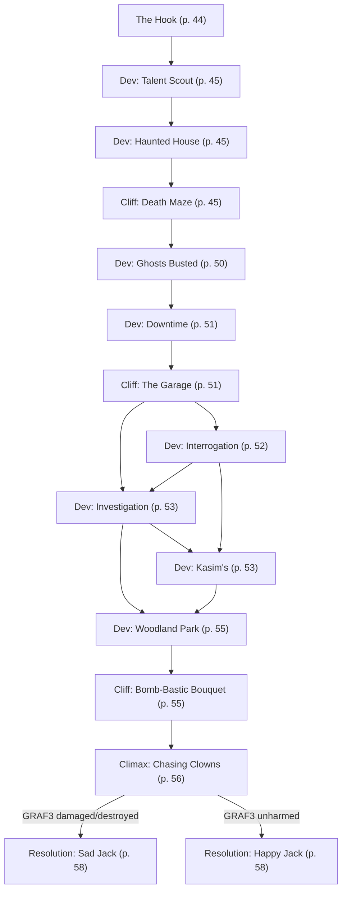

# M2: Real Estate Rumble

Book pages 42–63

Second campaign mission.

## Contents

- [Beat Chart](<03 M2 Real Estate Rumble.md#beat-chart>) (p. 42)
- [Rumors](<03 M2 Real Estate Rumble.md#rumors>) (p. 43)
- [Background](<03 M2 Real Estate Rumble.md#background-read-aloud>) (p. 43)
- [The Rest of the Story](<03 M2 Real Estate Rumble.md#the-rest-of-the-story>) (p. 43)
- [The Setting](<03 M2 Real Estate Rumble.md#the-setting>) (p. 44)
- [The Opposition](<03 M2 Real Estate Rumble.md#the-opposition>) (p. 44)
- [The Hook](<03 M2 Real Estate Rumble.md#the-hook>) (p. 44)
- [Dev (Talent Scout)](<03 M2 Real Estate Rumble.md#dev-talent-scout>) (p. 45)
- [Dev (Haunted House)](<03 M2 Real Estate Rumble.md#dev-haunted-house>) (p. 45)
- [Cliff (Death Maze)](<03 M2 Real Estate Rumble.md#cliff-death-maze>) (p. 45)
- [Dev (Ghosts Busted)](<03 M2 Real Estate Rumble.md#dev-ghosts-busted>) (p. 50)
- [Dev (Downtime)](<03 M2 Real Estate Rumble.md#dev-downtime>) (p. 51)
- [Cliff (The Garage)](<03 M2 Real Estate Rumble.md#cliff-the-garage>) (p. 51)
- [Dev (Interrogation)](<03 M2 Real Estate Rumble.md#dev-interrogation>) (p. 52)
- [Dev (Investigation)](<03 M2 Real Estate Rumble.md#dev-investigation>) (p. 53)
- [Dev (Kasim's)](<03 M2 Real Estate Rumble.md#dev-kasims>) (p. 53)
- [Dev (Woodland Park)](<03 M2 Real Estate Rumble.md#dev-woodland-park>) (p. 55)
- [Cliff (Bomb-Bastic Bouquet)](<03 M2 Real Estate Rumble.md#cliff-bomb-bastic-bouquet>) (p. 55)
- [Climax (Chasing Clowns)](<03 M2 Real Estate Rumble.md#climax-chasing-clowns>) (p. 56)
- [Resolution (Sad Jack)](<03 M2 Real Estate Rumble.md#resolution-sad-jack>) (p. 58)
- [Resolution (Happy Jack)](<03 M2 Real Estate Rumble.md#resolution-happy-jack>) (p. 58)
- [Downtime](<03 M2 Real Estate Rumble.md#downtime>) (p. 58)
- [NPCs, Obstacles & NET Architectures](<03 M2 Real Estate Rumble.md#npcs-obstacles--net-architectures>) (p. 59)

---

*By Paris Arrowsmith & Tracie Hearne*

**Estimated play time:** 6 to 8 hours

---

## Beat Chart

**Flow summary:** Marianne sends the Crew to real estate agent Jack Skorkowsky to find a new home for The Forlorn Hope. Jack offers side work investigating a booby-trapped construction site (the "haunted house"), then a garage explosion looted by scavvers. Clues lead to Kasim's coffee shop and Network 54 reporter Destiny Hondel. Jack calls the Crew to Woodland Park to tour the perfect new Hope location — where the Cirqu3 d3 B0Z0 springs a final trap and steals Jack's flatbed GRAF3. A vehicle chase (or ground fight if the Crew is clever) determines whether Jack pays well.

**Branching notes:**

- After **The Garage**, the Crew can interrogate captured Cobras, investigate the scene, visit Kasim's, or proceed toward Woodland Park in any order.
- At **Bomb-Bastic Bouquet**, disarming failure or evacuation still leads to the chase; starting distance depends on whether the Crew fled or stayed.
- Clever Crews who guard the GRAF3 or spot Sp00ph's disguise can convert the climax to a traditional combat (see pg. 67 map in the book).

---

### Rumors

| 1d6 | Rumor |
|-----|-------|
| 1 | Real estate agent Jack Skorkowsky learned everything he knows about the business from Scott Brown, a legend of the 2020 era. |
| 2 | Competition from Maelstrom in the Hot Zone and nomad packs in the Badlands have pushed smaller scavver groups to take bolder and more violent action in Night City's various combat zones. |
| 3 | The Bozo civil war is heating up, with at least thirteen different circuses competing to out-prank one another. No matter which circus wins, Night City loses. |
| 4 | The Forlorn Hope burned down recently. No one knows the cause, and the FDNC isn't investigating. The building was old, so an accident can't be ruled out, but the smart money is on arson. Rumors abound, naming the Red Chrome Legion, various cyberpsychos, the Iron Sights, and even Arasaka as possible suspects. |
| 5 | The roller derby season is in full swing, and bookies are giving good odds on the Woodland Park Muses and Pacifica Sea Shells making it all the way to the championship. |
| 6 | After a string of failures culminating with an embarrassing defeat outside the burning Forlorn Hope, there's been a bloody coup in the Red Chrome Legion's leadership. Pieces of the gang's old boss, Maniple, were found scattered across Little China, and former recruiters Vox and Populi have stepped up to fill the vacuum. |

---

> **Background (Read Aloud)**
>
> In Night City, location is everything. Making sure that you find the right watering hole to hang your hat after trudging through the hellscape of a city is valuable for anyone, from the regular night prowlers to the daytime thrill seekers. The Forlorn Hope is no different — and its iconic Little China location has always been a staple for edgerunners of all backgrounds to visit. But now, it is in shambles. The building has completely collapsed, and little remains of the historic site of The Forlorn Hope. However, maybe there is something you can do about this.
>
> You've developed a rapport with Marianne Freeman due to your actions during The Forlorn Hope's destruction, and now she has reached out to you for more help: it's time to find a new location for her and her husband to call home.
>
> "John's lungs are still healing, so I can't leave him now. I'd like to ask you for help finding a new place to rebuild The Forlorn Hope. Go see Jack Skorkowsky; he works in real estate and is a long-time friend of ours. He should be able to help you find a new option for the new Forlorn Hope. We'll pay you 500eb each for your time, of course."
>
> "I know the real estate market in Night City is tough these days, but let me know what Jack offers. If you need a ride, I can lend you The Hope's van. Thank you so much for helping. Rebuilding our home means everything to us."

### The Rest of the Story

Marianne sets up the Crew to meet with edgerunner turned real estate agent Jack Skorkowsky. The Crew has built a lot of trust with her after saving lives during The Hope's destruction, so she is counting on them to do whatever it takes to secure a solid location to establish the new Forlorn Hope. If the Crew is borrowing The Hope's van, see pg. 61 for its stats.

Given the nature of her request, it'll take time for Jack to find a property suitable for Marianne's needs. In the meantime, Jack offers the Crew some work involving a few of his properties. Of course, he also promises to compensate the Crew for their time.

Jack will explain that he has been having problems with strange "accidents" being reported at some of his sites. He doesn't know — and won't find out until a final trap is sprung — that his real estate agency is the latest victim of the Cirqu3 d3 B0Z0, a Bozo circus.

The circus leader saw one of Jack's commercials, took a liking to his face, and started playing pranks on the real estate agent by targeting several of his properties.

The first of Jack's spots has had reports of several workplace accidents. The recurring incidents have caused Jack's hired construction crew to be wary of working there. When the Crew arrives, they'll find the location stacked with traps.

The second spot is the target of a small group of scavvers, the Crawling Cobras, who are taking advantage of an explosion and looting the place. Clues here will lead the Edgerunners to a young Network 54 Media who might be willing to make a deal to give them extra information.

After the Crew finishes investigating the two locations, Jack asks them to meet him at a perfect spot for The Forlorn Hope. Of course, the Cirqu3 d3 B0Z0 plans on striking there, too.

### The Setting

The Crew will first visit Jack Skorkowsky in his office, then travel to a booby-trapped one-floor office building under construction in Heywood.

Next, they'll investigate a garage in South Night City and possibly pop into Kasim's, a Turkish coffee shop in The Glen.

Finally, Jack asks the Crew to meet him in Woodland Park, a neighborhood on the border of New Westbrook and Heywood near where the city meets the Badlands.

### The Opposition

- The **Cirqu3 d3 B0Z0**, a Bozo circus specializing in digital and trap-based pranks. The leader of this small circus, a Netrunner named **Sp00ph** (pronounced "spoof"), is targeting Jack's properties because he spotted one of the real estate agent's commercials and "liked his face." The Crew will face off with Sp00ph in their final confrontation.
- The **Crawling Cobras**, a small group of scavvers led by **Joshua Travél**. The Cobras live off the scraps and detritus of Night City and operate primarily in its combat zones.

### The Hook

On business for Marianne, you all arrive at the small office of real estate agent Jack Skorkowsky. The air is thick with the scent of stale KaffPop and day-old SCOP. Jack Entropy's Boring Through My Heart plays from cheap speakers. Jack's large desk is made of industrial steel and littered with dents caused by gunfire. He offers a greeting and points to a set of folding metal chairs, inviting you to take a seat.

Jack is an older punk, still rocking the monovision mirrorshades and a mohawk. Despite his exterior, he is a businessman at heart and always looking for a good deal on locations in Night City. He hasn't gone completely Corporate, though. Jack is loyal to the people he trusts, and Marianne is one of the few on that list.

> **Infobox: Jack Skorkowsky (DV15)**
>
> Jack was a merc back in the day. He won't say how, but he scored big during the 4th Corporate War. Afterwards, he sank his newfound wealth into property and opened up his own real estate business. He specializes in renting and selling properties to people who live on the outskirts of society, like edgerunners.

Jack speaks highly of Marianne and understands the significance of The Forlorn Hope and its history, but also explains that the real estate market in Night City can be challenging.

"It'll take time for me to find a property that works and is actually and honestly for sale. A lot of records were lost during the DataKrash. The city's been rebuilding its databases, but occasionally, someone swoops in to stake a claim based on pre-4CW data. In the meantime, I've got some work for an enterprising group such as yourselves. I own a building under construction that's seen some weird shit lately. The supervisors in charge sent me reports of various unexplained workplace accidents and incidents. It's been a whole mess, and I need someone to look into it.

"Look, I get it. You all want to help Marianne and The Professor as soon as possible, but this stuff takes time. Help me out, and I'll make sure you're well compensated. I'll pay you 500 eurobucks each for investigating and solving any problems. And I promise I'll give Marianne and The Professor's job my full attention in the meanwhile. I won't let 'em down."

Jack gives the Crew the details of what his workers call "the haunted house." It is a single-story office building in the middle of restoration. There's been a rash of workplace accidents and reports of weird noises. When the construction crew arrived on the job this morning, the front door was covered with blood. That was the last straw. Now, Jack's people refuse to work on the site.

"I can always find a new crew, but this one is good, and I don't wanna take away their income, you know? Anyway, the crew supervisor will meet you there."

**Go to:** [Dev (Talent Scout)](<03 M2 Real Estate Rumble.md#dev-talent-scout>)

### Dev (Talent Scout)

After leaving Jack's office, a member of the Crew receives a call from Grace Steel, The Forlorn Hope's house band leader.

"Yo! I got your contact info from Marianne. Hope this is a good time. Listen, you know this, but I lost choombas in the fire. Good bandmates. Good friends. Fuck life, you know? Show needs to go on, though. I know you're doing work for Marianne, so while you're out there, if you spot some musical talent, film 'em and send me the footage and some contact deets. I've got to fill my band's ranks before The Hope opens again. Thanks."

If a member of the Crew is a Rockerboy and volunteers, Grace promises to give them an audition but warns she's looking for a long-term band member, not a one-night stand.

**Go to:** [Dev (Haunted House)](<03 M2 Real Estate Rumble.md#dev-haunted-house>)

### Dev (Haunted House)

The single-story office building sits on the edge of the Heywood Industrial Zone against a backdrop of rising factories. It is one of a dozen in the area being renovated and restored to take advantage of an increasing Corporate presence. The building doesn't look like much from the outside — a nondescript gray building with windows covered in industrial shutters. A sign on the wall reads, "Another Jack Skorkowsky Masterpiece, Coming Soon!"

The front entrance is slightly elevated, with cement stairs leading to double doors. Tyme, the crew supervisor, sits on a pile of planks stacked up next to the building. When the Crew approaches, she stands and calls out.

"You the folks Jack sent? Thanks for coming. We completed the outside and were planning on going inside to finish the renovation there, but this morning, we found the door covered in blood. After all the accidents, that was the last straw. My crew's convinced the place is haunted and refuses to work on it 'till someone cleans out the ghosts."

The door is covered in a drying, rust-colored substance. A DV13 Criminology, Paramedic, or Science (Biology) Check identifies it as actual blood and not paint. If the Check is made with the help of a Chemical Analyzer or similar tool, the type of blood can be identified: it is human. Type O negative.

The door is locked, and Tyme's electronic key won't open it — someone's scrambled the lock. The back door is welded shut.

The Crew can attempt to unlock the door with a DV15 Electronics/Security Check. Alternatively, it can be opened with brute force and a DV15 BODY Check or by attacking it (no Check needed to hit) and reducing its 50 HP to 0, which destroys the door. The building has windows, but they're all covered with security bars (50 HP). They can be sawed through (no Check needed to hit), or someone can attempt a DV17 BODY Check to pry them off. Opening and climbing through the window is easy without the bars in the way.

**Go to:** [Cliff (Death Maze)](<03 M2 Real Estate Rumble.md#cliff-death-maze>)

### Cliff (Death Maze)

Once they're inside, the Edgerunners can explore the building. Tyme refuses to enter but offers to stay in touch via Agent and provide information to the Crew. The lights inside are off, so unless the Crew has a way of seeing in the dark, they should take a -1 penalty to any Checks where visibility is important.

There is a NET Architecture installed (see pg. 61), placed there by Sp00ph to run the traps. Neither Jack nor Tyme are aware of it. The server is in the Main Office (7). Each camera and speaker in the building is an Access Point.

The NET Architecture is self-contained. The installed Imp has instructions to watch the cameras. When someone enters a location, it plays a specific recorded phrase through the appropriate speaker. These phrases trigger the various traps via a microphone implanted in each.

Shutting down the Cameras or the Speakers will disable all the traps.

Noticing the Observation Cameras requires a DV17 Perception Check. Noticing the Speakers requires a DV21 Perception Check.

The NET Architecture (including the cameras and speakers) and traps all have their own batteries and won't shut off if the Crew cuts the building's power.

**Map key:** 1 — Foyer · 2 — Lobby · 3 — Cubicle Farm · 4 — Break Room · 5 — Bathroom · 6 — Hallway · 7 — Main Office · c — Camera · s — Speaker

#### Foyer (1)

A simple foyer. This room nears completion, with drywall up, taped, and painted. Hooks are even installed near the door for hanging up coats. A second security door leads into the building proper. It is unlocked.

*Tyme on this room:* Both doors are heavy-duty. Solid locks. Strong material. Designed to buy the people inside enough time to arm up if someone invades, you know?

#### Lobby (2)

A reception and waiting room, still unfinished. The room is mostly bare, but a wall-mounted desk has been installed, and a powerless Vendit sits in the center, waiting to be positioned and plugged in. A construction floodlight, also unplugged, sits unused against the wall.

Once the entire Crew enters this room, they'll hear a click from the security door leading into the foyer as it locks. Unlocking the door requires a DV24 Electronics/Security Check. Bashing it down requires a DV21 BODY Check or dropping its 50 HP down to 0. The same is true of the door leading to the Cubicle Farm (3).

A recording plays. It begins with a maniacal laugh and then devolves into lousy poetry. The recording triggers the bomb countdown in this room and the microbomb on the barrel (blowing it open to release the water) in the Cubicle Farm (3).

> "I've primed the bomb and pulled the pin you better disarm stuff before the roof falls in!"

The bomb will detonate in 5 Rounds. To track this easily, create a Clock by placing the number 5 in a central location where all the Players can see it. Roll Initiative as you usually would for combat. Each time a Round passes, reduce the Clock by 1. When the Clock reaches 0, the bomb explodes at the end of the Round.

For added paranoia, ask the Players for a DV13 Perception Check when the Clock reaches 4. With a success, their Character hears a small pop from the room beyond the interior door (the Cubicle Farm [3]). That's the micro-explosive ripping open the water barrel.

The bomb is hidden in the **Vendit**. When it detonates, it has the blast range of a normal explosive (10 m/yd [5 squares]) but only does 1d6 damage (Armor-Piercing). More importantly, when it explodes, it triggers a second set of charges in the ceiling, causing it to collapse. Anyone in the room takes 4d6 damage as debris falls on them. This damage can't be dodged. Spotting the bomb requires an Edgerunner to specifically examine the Vendit and succeed at a DV15 Perception Check. Disarming it requires a DV13 Demolitions Check. The bomb cannot be removed from the Vendit without detonating it (if not disarmed) or destroying it beyond repair (if disarmed).

A second bomb is hidden in the **floodlight**. If someone plugs the light in, the bomb detonates, dealing 6d6 damage (Armor-Piercing) in a 10 m/yds (5 square) area. This also sets off the ceiling charges if they haven't been detonated and causes the collapse. Spotting this bomb requires an Edgerunner to specifically examine the floodlight and succeed at a DV15 Perception Check. Rendering it inert requires a DV9 Demolitions Check, but if the Edgerunner beats a DV13, they realize the bomb isn't on a timer — it will only explode if the floodlight is plugged in. This bomb can be removed if properly disarmed and acts like an Armor-Piercing Grenade if thrown.

Once the Vendit bomb explodes or is disarmed, the doors in this room unlock.

*Tyme on this room:* The Vendit belongs to Jack. He likes to put one in all of his sites to scam a little extra income even after he's sold the property.

#### No Demolitions?

Demolitions can be a rare Skill; If no one in the Crew has it, don't despair. Allow them to substitute other Skills, such as Electronics/Security Tech or Weaponstech, to defuse the bombs through unorthodox methods. Or, ask them to rely on the highest TECH STAT but remind the Players about Complimentary Skill Checks and their Luck pools. As a final resort, if you feel the need, lower the DV of the various Demolitions Checks to levels more easily achieved by the Crew.

Demolitions is a Skill that makes this Mission easier, but a lack of it shouldn't make doing the job impossible.

#### Cubicle Farm (3)

This large, half-finished room was obviously meant to be crammed full of desks for office drones. It probably wasn't designed to be covered in a thin layer of water like it currently is. A blue plastic barrel dangles from the ceiling on a rope. Trace amounts of water still drip to the floor via the exploded hole in the bottom.

A DV17 Perception Check is needed to spot the faint arcs of blue lightning skipping across the water and find their source — someone has installed a crude **Electrical Flooring Trap** (see pg. 59) in the center of the room. Thanks to the water, the trap's reach extends to all corners of the room.

Encourage the Players to be creative here. Let them devise a solution, then assign an appropriate Skill Check and DV. Some possible solutions include:

- Building a bridge across the room using planks from the pile outside. A DV13 Basic Tech Check.
- Using a grapple arm or gun to swing across the room or climbing along the walls using Grip Feet. A DV13 Athletics Check.
- Disconnecting the battery from the Electrical Flooring trap via an Aimed Shot.
- Rigging a pulley system to swing someone over the trap and lower them so they can disarm it. A DV15 Basic Tech Check followed by a DV13 Electronics/Security Tech Check.
- Adding more electrical current to the water to overload the trap and force it to shut off. DV13 Electronics/Security Tech Check.

If the Crew hasn't visited the Lobby (2), the hanging barrel is intact. The original Electrical Flooring trap is still a problem, but the entire floor isn't a hazard.

*Tyme on this room:* The plans called for an open room with plenty of space so the buyer could slot in desks or cubicles. I'd hate that sort of life, myself.

#### Break Room (4)

The break room is almost finished, and someone's already installed two Vendits — one packed with ten different flavors of kibble and the other with a rainbow assortment of Tritti-Fizz. The lights in this room are on, but red bulbs illuminate the scene instead of standard white ones, casting an eerie glow over everything.

By this point, the Players are probably expecting a trap, but no matter how hard they search, they won't find one. This room is trap-free. At the right moment, ramp up their paranoia by suddenly bursting into another bad rhyming poem. The recording triggers the countdown on the big bomb in the Main Office (7).

> "Tick tock, the clock has sang, One minute now before the big bang!"

To track this easily, create a Clock by placing the number 20 in a central location where all the Players can see it. Roll Initiative as you would normally for combat. Each time a Round passes, reduce the Clock by 1. When the Clock reaches 0, the final bomb in the Main Office (7) explodes.

*Tyme on this room:* The Vendits belong to Jack. My crew came in here to buy snacks when we were on the job.

#### Bathroom (5)

An ordinary multi-person bathroom with six stalls and four sinks. The sinks have been installed, but not the toilets.

Like the Break Room (4), the Bathroom isn't trapped. In fact, it represents an opportunity. With a DV13 Perception Check, an Edgerunner can spot a large vent in the far wall next to the sinks. It leads to the Main Office (7). Climbing through it requires a DV13 Athletics Check, but success allows the Crew to avoid the trap in the Hallway (6).

*Tyme on this room:* We ordered the toilets months ago, but they still haven't come in. I hear the local supplier got bought out by Petrochem or something, so the whole supply chain's a freaking mess. If we ever get back to it, we'll finish piping the vent up to the roof and add fans. Keep the place smelling fresh… ish.

#### Hallway (6)

A long hallway runs from the break room to an emergency exit in the rear of the building. The walls are unfinished, and the floor is bare concrete. A My First GRAF3 toy drone stands before the thick, steel exit. Rising from its neck, held on by a wire, is a big red balloon. Someone's painted words on the balloon: "Have you seen my daddy?"

The rhyming voice calls out again. This triggers the My First GRAF3 to start moving.

> "A toy-full of fun, That's come a-rockin' Now it's time for a little Biotoxin!"

The **My First GRAF3** (see pg. 61) goes at the top of the Round and has a MOVE of 3. The balloon pops if it is damaged, the My First GRAF3 is damaged, or the toy drone enters a square adjoining one an Edgerunner occupies. When the balloon pops, it floods the entire hallway with a Biotoxin gas. Anyone in the hallway is exposed and must succeed at a DV15 Resist Torture/Drugs Check or take 3d6 damage directly to their HP. This bypasses armor and does ablate it. Gear such as Nasal Filters and Anti-Smog Masks negate the Biotoxin.

The best way to stop the My First GRAF3 from crossing the hallway is to knock it over. This can't be done with a gunshot, but throwing any object weighing at least a pound does the trick, providing the thrower succeeds at an Attack Check (using Athletics) based on the drone's distance. Once knocked over, the My First GRAF3's tiny legs continue to move to no effect. The balloon breaks free and floats to the ceiling, unpopped.

It is also possible to sever the wire connecting the My First GRAF3 to the balloon with an Aimed Shot. Once the balloon is free, it floats to the ceiling, unpopped.

Finally, someone with a Breacher (see pg. 179) can shut the My First GRAF3 down with a DV13 Electronics/Security Tech Check. This Action takes 2 Rounds to complete.

Siphoning the Biotoxin out of the balloon requires a DV21 Weaponstech Check and an appropriate container. Failure floods the hallway (or a 10 m/yd [5 square] area) with the gas. If anyone tries to carry the balloon around, it randomly pops after 1d6 Rounds.

The emergency exit has been welded shut and can't be opened from the outside or inside.

*Tyme on this room:* I dunno what to tell you. This is a hallway. Emergency door shouldn't be welded shut, though. That's a violation of city rules. Not that the city ever does an inspection.

#### Main Office (7)

Work on this large office space has barely begun. Tape on the floor outlines the future locations of an executive bathroom, a closet, and a kitchenette. Painted on every available surface with teal paint are words repeated over and over, "All work and no play makes Jack a dull boy!"

And if that's not disturbing enough, someone's dragged an empty, giant wire spool into the room and placed a box on it. A box with a crank attached. And the crank started turning the moment you entered the room.

If it isn't obvious, the threat here is a bomb large enough to destroy most of the building. If the Clock is currently higher than 10, lower it to 10 immediately. Entering the room accelerated the countdown. The giggling voice reads more terrible poetry.

> "Tick tock, the clock has sang, not too long before the big bang!"

If the Crew entered the room via the window, set the Clock to 10. The giggling voice chastises them.

> "You crawled through the window. That means you cheated, so I'm boosting the clock. Soon you'll all be boom-leted!"

The box in the center of the room is not actually a bomb. It is simply a big music box playing *Pop Goes the Weasel* as the crank turns. There's also a motion sensor attached to it. As Edgerunners come closer, the music box grows louder. The music box will play even if the Cameras and/or Speakers are shut down.

The bomb is hidden in the wall between this room and the junction of the Cubicle Farm (3) and Bathroom (5). Locating it will be difficult, but there are clues.

- A DV15 Basic Tech Check shows the drywall placement is sloppy. In some spots, nails stick out further than they should, and the joints between panels aren't clean. This was obviously done by amateurs.
- If an Edgerunner succeeds at a DV17 Perception Check, they notice a flash of metal (the housing for the bomb) through a gap in two sections of drywall.
- A DV15 Demolitions Check made on the music box identifies it as a simple, if sinister, device and not a bomb.
- A DV15 Deduction, Demolitions, or Tactics Check suggests the music box's placement makes no sense. To do real damage to the building, the bomb needs to be near a support beam. A DV15 Basic Tech Check points out the nearest support beam at the junction of this room, the Cubicle Farm (3), and the Bathroom (5).

Pulling the drywall off the studs to reveal the bomb doesn't require a Check. Once they've located the bomb — a chunk of C9 attached to a timer — the Crew has three options. They can run away, but it will mean Jack loses the building. They can attempt to diffuse it with a DV17 Demolitions Check. Or they can move the bomb, transporting it to a vacant lot nearby so it can blow up harmlessly. Doing so requires a DV13 Concentration Check (to keep the bomb steady) and a number of Rounds based on the MOVE of the Edgerunner transporting it. Passing the bomb through the windows is inadvisable because the motion might jostle it.

| Transporter's MOVE | # of Rounds Needed |
|--------------------|--------------------|
| 5 | 8 |
| 6 | 7 |
| 7 | 6 |
| 8 | 5 |

When the bomb explodes, anyone within 10 m/yds (5 squares) takes 8d6 damage. If the bomb is still inside the building, the structure suffers major damage, and the Crew will spend a few minutes digging themselves out of the rubble.

*Tyme on this room:* This will eventually be the big boss's office. It'll be the last part completed according to the schedule. Weird you say there's writing all over the wall, though. We haven't installed the drywall yet, so there shouldn't be walls to write on.

#### Keeping the Bomb

The Crew might want to keep the bomb. That's fine! C9 is stable so long as the detonator is removed or set correctly. The C9 bomb is an Explosive that does 8d6 damage in a 10 m/yd (5 square) area. It takes 30 seconds (10 Rounds) to arm the detonator. This can be reduced to 1 Action with a DV15 Demolitions Check, which can only be attempted once. The timer can be set as low as 30 seconds (10 Rounds) and as high as 1 hour (1,200 Rounds). The bomb is worth 100eb (Premium).

**Go to:** [Dev (Ghosts Busted)](<03 M2 Real Estate Rumble.md#dev-ghosts-busted>)

### Dev (Ghosts Busted)

Once the traps have been cleared and the bomb either defused or detonated, the Crew can report to Tyme.

"Damn! I can't believe someone rigged the building with traps. Who the hell did the boss piss off? You probably should call Jack and let him know what's going on."

A DV13 Deduction Check suggests this elaborate series of "pranks" has a Bozo-like signature. It started small, with on-site accidents, and ended with an overly elaborate series of tauntings and deathtraps.

> **Infobox: The Bozos (DV13)**
>
> Everything about the Bozos is shrouded in mystery, including their origins. One common narrative suggests that they began life as a fairly benign prankster gang back in the 2010s, but their "jokes" grew more and more sadistic as time went on. Stories of a "Great Bozo" transforming Night City citizens into clowns via brainwashing, torture, and cybernetic surgery have been the stuff of legend for decades. Recently, the Bozos fractured, splitting up into different "circuses." Now, each circus tries to out-prank the others in a horrific clown civil war.

Any call to Jack immediately goes through.

**If the Crew failed to save the building**, Jack's pissed, but not at them.

"It'll take months and way too much money to fix this mess. Not your fault, though. Sometimes, things just don't go right. I'm sending you the payment I promised, and I'll get back to you as soon as I have a good spot for The Forlorn Hope."

Jack transmits 500eb per Edgerunner to the Agent of the Crew member he's talking to.

**If the Crew saved the building**, his mood is certainly better.

"Shit on a stick! I don't know what I did to piss anyone off, but I'm upping the security on all my sites. Thanks for dealing with this. I'm sending payment now. With a little bonus for the trouble. I'll get back to you as soon as I have a good spot for The Forlorn Hope."

Jack transmits 1,000eb per Edgerunner to the Agent of the Crew member he's talking to.

**If the Crew mentions the possibility of the Bozos being involved**, Jack groans.

"Over twenty years working in this damn city, and I've never so much as heard one of those asshats honk their noses. Now they're trying to blow up my buildings? I need to look into this. I've got some people I can call who might know something. If I find a lead, I might have some more work for you, so keep your ears open."

**Go to:** [Dev (Downtime)](<03 M2 Real Estate Rumble.md#dev-downtime>)

### Dev (Downtime)

With nothing to do but wait for Jack to find The Forlorn Hope a new home, you've got time to kill.

Give the Crew at least one day of downtime to heal up, try their hand at some repairs, buy new equipment, or check other tasks off their list. When you're ready, Jack calls the Edgerunners with another request.

**Go to:** [Cliff (The Garage)](<03 M2 Real Estate Rumble.md#cliff-the-garage>)

### Cliff (The Garage)

Jack calls up the Edgerunner he last spoke to with another job.

"No word on a new home for The Hope yet, but I got more work for you. After your little adventure in the office building, I installed security cameras on some of my properties. One of them just went dark. It's a garage I'm renting out in South Night City. My tenant is out at sea right now. I want you to go over and check it out. I'll pay your Crew 500eb each if there's trouble and you deal with it. 100eb each, even if nothing's wrong, just for the effort."

When the Crew agrees to the job, Jack texts the address and asks them to "get over there right away."

Assuming they do so, they'll find the camera isn't the only thing broken at the scene.

This garage is one of many single-vehicle storage spaces in South Night City, offering a measure of security for residents who fear parking in the street in a combat zone. Or at least, it would offer a measure of security if it wasn't for the large hole blown into the side of it.

The lingering scent of burning metal assaults your nostrils as you approach the location. Jack gave you a door code but you won't be needing it. Neither will the scavvers pouring out of the hole, carrying pieces of a chopped-up car!

The scavvers are the Crawling Cobras, a minor gang local to the area specializing in breaking into buildings and stripping out wiring and other easily portable junk to sell. They didn't cause the explosion but were nearby when it happened, so they're taking advantage of it. The group consists of their leader, **Joshua Travél** (see pg. 60), and a number of **Crawling Cobras** (see pg. 59) equal to the number of Edgerunners in the Crew.

> **Infobox: The Crawling Cobras (DV21)**
>
> The Crawling Cobras are one of a seemingly endless number of small scavver groups operating in Night City. There's nothing remarkable about them at all. Like most scavver gangs, they aren't likely to last past the end of the year.

The Crawling Cobras aren't interested in chatting and consider anyone who looks dangerous (which the Crew obviously does) a threat. They'll drop their boxes, dive for cover, and open fire.

The Crawling Cobras are tenacious. They'll continue the fight until one of two things happens.

- If their leader, Joshua Travél, dies, the remaining Crawling Cobras will attempt to flee. If it becomes obvious they can't flee, they will surrender.
- If the majority of the Crawling Cobras die before Joshua Travél, he'll throw down his weapon and surrender, at which point the rest of the gang flees.

- If the Crew captures and interrogates a Crawling Cobra, **Go to:** [Dev (Interrogation)](<03 M2 Real Estate Rumble.md#dev-interrogation>)
- If the Crew investigates the garage, **Go to:** [Dev (Investigation)](<03 M2 Real Estate Rumble.md#dev-investigation>)

### Dev (Interrogation)

Convincing Joshua Travél or a captured Crawling Cobra to talk requires an appropriate Social Skill Check against their Concentration or Human Perception. They'll insist they had nothing to do with the explosion (which is the truth). They were just in the area, heard the boom, and took advantage of the situation by chopping up the car inside so they could sell the parts.

"Dunno who did it. Maybe the Net54 folk do. Saw a van zooming off as we arrived. I've seen that van around before — think they hang out at the Turkish coffee joint, just inside The Glen."

A DV9 Local Expert (The Glen) or DV13 Library Search identifies the "Turkish coffee joint" as Kasim's.

If the Crew calls into Jack, he promises to send a security guard down to protect the garage. He asks the Edgerunners to continue investigating if they can and suggests they check on the security camera. He can also identify the "Turkish coffee joint" as Kasim's.

Jack isn't interested in keeping any remaining Crawling Cobras captive and he doesn't want to involve the cops.

"Just tell the doombas not to mess with me again and let 'em go. If we call in the authorities, thing'll just get messier."

- If the Crew investigates the garage, **Go to:** [Dev (Investigation)](<03 M2 Real Estate Rumble.md#dev-investigation>)
- If the Crew decides to visit Kasim's, **Go to:** [Dev (Kasim's)](<03 M2 Real Estate Rumble.md#dev-kasims>)
- Otherwise, **Go to:** [Dev (Woodland Park)](<03 M2 Real Estate Rumble.md#dev-woodland-park>)

### Dev (Investigation)

The garage is a two-room building. One room is the garage itself and contains a workbench, some tools, and roughly half of a compact ground car, recently chopped. The second room, separated by a door, is a small apartment with a couch, a few empty crates, a tiny fridge, and a card table with a microwave set up on it.

More importantly, with a DV9 Perception Check, the Crew can spot the remains of Jack's security camera hanging just above the entrance, facing the street. This type of camera is self-contained and doesn't require a NET Architecture. Instead, it records grainy, black-and-white video on a memory chip. It has limited transmission capabilities — if disabled, it tries to send a distress signal to a specific Agent. In this case, Jack's.

The camera's memory chip is damaged. Immediately retrieving any information from it requires a DV13 Electronics/Security Tech Check. A Tech with at least one Rank in Field Expertise can jury-rig the chip to temporarily work with a DV9 Electronics/Security Tech Check instead.

Only a minute of footage remains on the memory chip. A woman in a Rocklin Augmentics Spider Cyberchair (similar to the model used by The Professor) wearing a head-mounted camera and Net54 press vest seems to be filming the building. She's next to a Net54 news van. There's a blast of light, and the footage freezes on the woman cringing away, surprised by the occurrence.

A DV15 Perception Check spots the "Kasim's" bumper sticker on the back of the news van.

A DV9 Local Expert (The Glen) or DV13 Library Search identifies Kasim's as a Turkish coffee bar in The Glen.

If the Crew calls into Jack, he promises to send a security guard down to protect the garage. He asks the Edgerunners to continue investigating if they can. He can also identify Kasim's as a "Turkish coffee joint" in The Glen.

- If the Crew has captured and wishes to interrogate a Crawling Cobra, **Go to:** [Dev (Interrogation)](<03 M2 Real Estate Rumble.md#dev-interrogation>)
- If the Crew decides to visit Kasim's, **Go to:** [Dev (Kasim's)](<03 M2 Real Estate Rumble.md#dev-kasims>)
- Otherwise, **Go to:** [Dev (Woodland Park)](<03 M2 Real Estate Rumble.md#dev-woodland-park>)

### Dev (Kasim's)

You can smell Kasim's before you step inside: a combination of rose-scented tobacco and bitter coffee tinged with cardamom. Inside, patrons enjoy puffing away on water pipes and drinking thimbles full of the rich Turkish brew Kasim's provides.

A broad-chested man sits on a stool in the corner, playing guitar and crooning a low-key chromatic blues song, *Serendipitous Tears*. This must be the right place. You passed by a Net54 van on the way in.

The owner, Kasymbek, greets the Crew and invites them to sit wherever they like. He promises to be right with them. Convincing him to share information without a purchase requires an appropriate DV13 Social Skill Check. If the Crew makes a purchase, he's happy to share information for free.

The coffee is 20eb (Everyday) per cup. A packet of tobacco is 50eb (Costly). Both are the real deal and delightful.

Once convinced to share information, Kasymbek will gladly point out Destiny Hondel, who is currently head-down in a dark corner, typing something into her Agent. If asked, he'll also name the musician currently playing as Chevalier.

Spotting Destiny Hondel without Kasymbek's help isn't hard and only requires a DV9 Perception Check. She's currently the only patron in a Rocklin Augmentics Spider Cyberchair.

> **Infobox: Destiny Hondel (DV17)**
>
> Destiny Hondel is an "on the spot" reporter for Network 54 in Night City. She's only been on the job for a year — long enough to earn a small reputation but not long enough to guarantee her stories will actually make it on air.

Once approached, Destiny is wary but pleasant enough and willing to share some information without a Skill Check.

"Yeah, I saw the explosion. I got an email telling me something interesting would happen at that address at that time, and heck, I figured, why not? It was a slow news day.

"The explosion went off about three minutes after I arrived. I got some footage, then left.

"I know Jack Skorkowsky owns the garage, but he's dodging my calls. Do you know more? My gut tells me this is part of something bigger, and I want to be the one to crack the story!"

Destiny will offer access to her footage in exchange for information so long as an Edgerunner succeeds at a DV13 Trading Check. She can also be convinced to give a copy of the footage via a DV15 Bribery or Persuasion Check. If there's an obvious Media in the Crew, tack a -2 penalty to any Social Skill Check made against Destiny. She's wary of someone trying to steal her story.

Of course, the Crew could always just take the footage from her by using a Breacher (see pg. 179) on her Agent or stealing the camera helmet from her van, which is parked outside. Breaking into the vehicle requires a DV9 Pick Lock Check.

The footage isn't particularly remarkable. Destiny kept the camera pointed at the garage. It goes wonky momentarily as the explosion occurs, thanks to the compression wave knocking her back. Then, she spends a few minutes sweeping the area and collecting additional footage before shutting down the camera.

A DV13 Perception Check or DV9 Photography/Film Check does notice one important detail. Painted on the garage door is a rhyming couplet.

> "We've haunted your house! We've blown open a hole! Driving you mad is our ultimate goal!"

Destiny has no idea what the couplet means. As for the email, it came from a generic Data Term address, and there's no way to trace it. If the Crew mentions the Bozos, Destiny grows excited. The Bozo civil war is a trending topic right now, and any new story on it is guaranteed a prime spot in the feeds. She'll excuse herself and hurry out to her van. She needs to file this story now now now!

If the Crew hasn't already figured out the Bozos are involved, a DV9 Deduction Check is all that's needed. After two incidents, it isn't hard to piece together.

#### Chevalier

If the Crew approaches Chevalier (the musician), he'll smile and nod towards the box at his feet, which already contains a few eurobucks. He's immediately interested if they mention a potential gig at The Forlorn Hope and will let them record him for free. Otherwise, he refuses to play while recorded unless the Crew drops at least 20eb (Everyday) into his case.

**Go to:** [Dev (Woodland Park)](<03 M2 Real Estate Rumble.md#dev-woodland-park>)

### Dev (Woodland Park)

Once the Crew is done investigating, they should probably check in with Jack. Even if they don't call him, Jack calls them.

"Bombs and bad rhymes. This whole thing stinks. Listen, I've dug through my properties and found a place. I almost overlooked it because it was on the edge of the city, but I think it's perfect for The Hope! Meet me there. I'll pay you, give you a tour, and maybe we can talk strategy about this whole clown crapfest."

You drive to the city's eastern edge, right on the border of New Westbrook and North Heywood. The biggest local landmark is a Dynalar campus, buzzing with security and Corp workers. Just past it is a series of buildings and a grove of palm trees. The pin Jack dropped is a two-story building on the far side of the neighborhood, just across from a fenced-in construction yard.

Jack really has found the perfect spot for the rebirth of The Forlorn Hope. Construction is complete on the multi-story building and it is spacious and inviting, with two floors above ground and two floors below.

> **Infobox: Woodland Park (DV17)**
>
> Woodland Park is a neighborhood on the edge of Night City, sitting on the border between New Westbrook and North Heywood. Dynalar, a cyberware manufacturer, built a campus there a few years ago. Other local attractions include a Biotechnica-monitored palm tree grove, a roller rink/night club known as Xanadu, and a few different residential options (including a cube hotel, cargo container village, and apartment building).

Jack waits in front of the building and waves at the Crew as they drive up.

"Hey, welcome! Welcome! This is the place, I tell you! My team just finished renovation, though there's plenty of room to do custom interior work if The Professor and Marianne need it. Hell, I haven't even struck the construction yard yet so my guys can get to work in a snap!"

Jack motions to the fenced-in space across the street, where a single security guard watches over an assortment of construction materials and vehicles, including a long-necked GRAF3, currently sitting on the back of a flatbed truck.

Ask for a Perception Check from each Edgerunner. Anyone who beats a DV24 notices how abnormally large the guard's feet are.

**Go to:** [Cliff (Bomb-Bastic Bouquet)](<03 M2 Real Estate Rumble.md#cliff-bomb-bastic-bouquet>)

### Cliff (Bomb-Bastic Bouquet)

Jack leads the way into an alley on the left side of the building and down a flight of stairs to a basement entrance. He pulls out a keycard and slots it, opening the door.

"I want to thank you for looking into my problems for me. If the Bozos are after me, I've got a real problem, so I've reached out to Danger Gal to provide me with security and investigate — figure out which circus is targeting me. I don't think we have to worry here, though. No one's reported any prob… … Well, shit."

The cause of Jack's expletive is a table in the center of the cavernously large room they've just entered. Sitting on the table is a vase holding a mockery of a flower bouquet. Each stem is composed of twisted rebar, and each "flower" is a grenade. To top it all off, a trigger wire leads from the now-open door to the vase.

Put one more Clock on the table, this time marked with a 3. Already primed by previous events, the Crew will likely try to deal with this "bomb-bastic bouquet," especially when Jack cries out, "If that thing goes off, it could bring down the whole building!"

And wouldn't that disappoint Marianne?

Still, the Crew can also choose to evacuate. If they do, **Go to:** [Climax (Chasing Clowns)](<03 M2 Real Estate Rumble.md#climax-chasing-clowns>).

Disarming the bouquet bomb requires a DV24 Demolitions Check. It is complicated, with a number of red herring wires and redundant systems. A failure advances the Clock to 0. So does picking it up or trying to move it.

When the Clock hits 0, the bouquet explodes … into a shower of confetti and glitter, doing 0d6 damage to everyone in the room.

**Go to:** [Climax (Chasing Clowns)](<03 M2 Real Estate Rumble.md#climax-chasing-clowns>)

### Climax (Chasing Clowns)

The bomb-bastic bouquet was designed to jangle Jack's nerves. Sp00ph is disguised as the security guard, and his clowns are hiding nearby. He wanted Jack on-site and rattled when he activated the next part of the prank: stealing the flatbed truck carrying the GRAF3.

Outside, you hear riotous digital laughter broadcast over speakers, like a million AI clowns giggling at once, and the turnover of an engine. Rushing to the street, you see Jack's flatbed truck, the GRAF3 on the back, driving away. The entire thing is crawling with Bozos. One of them screams into a megaphone.

"I love your commercials, Jack! Big, tough Jack with his big, tough gun promising to be the big, tough realtor! After seeing them, I made it the mission of the Cirq3 d3 B0Z0 to turn your frown upside down for all eternity!"

Yes, the Crew can hear the numbers being used as letters in the way Sp00ph talks.

Jack roars angrily and turns to you, "You know how much one of those giant drones costs?!? Get it back in one piece, and I'll triple what I owe you!"

Assuming the Crew agrees, they'll plunge into an absurd scene, chasing after a circus of Bozos riding Jack's stolen flatbed truck (see pg. 61) and a GRAF3 through the streets of Night City.

Use the Chase rules (see pg. 180) for this scene. The number of spaces between the Crew's vehicles and the Bozos depends on their actions in **Cliff (Bomb-Bastic Bouquet)**. If they evacuated the building before the Clock reached 0, the Crew begins the chase 2 squares behind the Bozos. If the Clock reached 0 and the flower bomb exploded, they start the chase 3 squares behind the clowns instead.

In addition to **Sp00ph** (see pg. 60), and the **Bozo Driver** and **Backup Driver** (see pg. 59), there are a number of **Cirq3 d3 B0Z0 Clowns** (see pg. 59) equal to the number of Edgerunners in the Crew. Sp00ph is huddled in the front of the truck's flatbed, just behind the cab, where he's linked into the GRAF3's NET Architecture. The two drivers are in the cab. The remaining Clowns are clinging to the flatbed at various points.

The Cirq3 d3 B0Z0 Clowns will open fire on their pursuers without mercy and aren't interested in taking cover. Whenever a Clown suffers a Critical Injury or reaches the Seriously Wounded Wound State, have them make a DV17 Athletics Check. If they fail, they fall off the flatbed and are run over by passing traffic (quite possibly by the Crew!).

The Bozo Driver focuses entirely on driving and does not attack. If the Bozo Driver reaches the Seriously Wounded Wound State, the Bozo Backup Driver kicks them out of the cab (Splat! Zoom! Crunch!), then takes the wheel. If both Drivers die, you can choose for the truck to slow to a halt or to crash, damaging both it and the GRAF3. It all depends on how difficult you want to make the chase. The Drivers may seek to close the distance between themselves and the Crew or pull away, as makes sense for the situation.

Sp00ph begins the chase Jacked Into the GRAF3's NET Architecture (see pg. 61) and in full control of it. He holds off on attacking until the pursuers are a single square away. He then directs the GRAF3 (see pg. 61) to attack the Crew's vehicle. The other Bozos won't notice (or even care, really) if Sp00ph dies and will keep fighting for as long as they're alive or the chase continues.

A firefight in a chase like this risks damaging the GRAF3. Whenever an Edgerunner rolls a natural 1 while firing at a target on the flatbed, they miss and hit the GRAF3 instead, doing full damage. A Solo's Fumble Recovery counts here. Don't be afraid to remind the Crew about the payday at the end of this. Jack won't mind if the construction drone is "scratched" but isn't tripling anyone's pay if the GRAF3 requires massive repairs.

A Netrunner needs to be either on the flatbed truck or within 1 square of it to connect to the GRAF3's NET Architecture. If the gap between vehicles is increased to 2 or more squares, the Netrunner is forcibly Jacked Out.

During the chase, Sp00ph shouts out more of his "witty" rhyming couplets. You'll find a few examples below but feel free to make up some of your own.

> "A friend of Jack's is a friend of mine. Come a bit closer so I can shatter your spine!"
>
> "My name is Sp00ph, and I'm a hacker of glee, Driving Jack mad is my destiny!"
>
> "Spilled blood is red and dead lips are blue, I'll see both when I eviscerate you!"
>
> "You missed! How sad! You couldn't hit a star! But I won't miss when we blow up your car!"
>
> "I'll kill you all, until one's left alone. Then I'll kill them, too, with a flick of Jack's drone!"

Once the Bozos are dealt with, the Crew can return to Woodland Park and to Jack. Or, if need be, call him for a pick up.

- If the Crew fails to recover the GRAF3 or it is heavily damaged (it has less than 30 HP remaining), **Go to:** [Resolution (Sad Jack)](<03 M2 Real Estate Rumble.md#resolution-sad-jack>)
- If the Crew recovers the GRAF3 and it isn't heavily damaged, **Go to:** [Resolution (Happy Jack)](<03 M2 Real Estate Rumble.md#resolution-happy-jack>)

#### Players Always Surprise You

It is possible a wary Crew won't follow this path. They might connect the clue from the My First GRAF3 in the Haunted House ("Have you seen my daddy") to the GRAF3 in the construction yard and decide to guard it. They might leave someone outside the building to keep watch. Someone might notice the security guard's big feet. Don't force the Crew down the chase path if they're clever enough to guard against it.

Instead, use the map on pg. 67 to transform this encounter into a more traditional combat, with the Crew duking it out against Sp00ph and his circus. The Cirqu3 d3 B0z0 Clowns hop up from their hiding spots in the construction yard and blast away while Sp00ph marches the GRAF3 into battle. The Bozos will fight to the death — they have no sense of self-preservation.

### Resolution (Sad Jack)

Jack curses up a storm as he paces back and forth.

"This week has been a nightmare! A living nightmare! Do you know how much Zhirafa charges for one of those monsters? Not to mention the poor security guard that fucking clown disguised himself as is probably dead. Not your fault, I know. This is all down to the Bozos, but … gah! Right. Back to business."

Jack pays each Edgerunner the 500eb he owes them for the garage investigation but no more. He'll finish the tour, though be grumpy the entire time.

When the Crew calls Marianne about finding a new location for The Forlorn Hope, she's upbeat.

"John's breathing easier today, thank the Goddess. It sounds like you found the right place, too! I'll call Jack and arrange for Backhand to give the place a once-over before we make an offer.

"Thank you for doing this. It really helped. I'm sending payment your way."

As promised, Marianne sends the Crew 500eb each.

### Resolution (Happy Jack)

Jack cheers as the Edgerunners return triumphant.

"You're one helluva crew! Come on, let's finish the tour! And hey, if you're ever looking for a place? Give me a call. I've always got a place to rent to fellow edgerunners."

Jack pays each Edgerunner 1,500eb at the end of the tour.

When the Crew calls Marianne about finding a new location for The Forlorn Hope, she's upbeat.

"John's breathing easier today, thank heavens. It sounds like you found the right place, too! I'll call Jack and arrange for Backhand to give the place a once-over before we make an offer.

"Thank you for doing this. It really helped. I'm sending payment your way."

As promised, Marianne sends the Crew 500eb each.

### Downtime

How much downtime you give the Crew depends on how close they are to the end of the month. Marianne calls them again a few days before the current month ends with a new job.

**Go to:** Mission: Welcome to the Neighborhood

---

## NPCs, Obstacles & NET Architectures

### Crawling Cobra (Mook)

| HP 30 · INIT 10 · MOVE 4 · Combat # 4 · REP 0 |

**Weapons & Armor**

| Weapon | ROF | Damage | Armor/SP |
|--------|-----|--------|----------|
| PQ Thick Pipe | 2 | 3d6 | Head: Leathers SP 4 |
| PQ Heavy Pistol | 2 | 3d6 | Body: Leathers SP 4 |

**Skills:** Athletics 8, Basic Tech 8, Concentration 5, Conversation 6, Cybertech 8, Human Perception 6, Perception 5, Persuasion 5, Resist Torture/Drugs 3, Stealth 6

**Gear:** Basic Heavy Pistol Ammo x16, Disposable Cell Phone, Techtool, Cash: 0eb

---

### Bozo Driver / Backup Driver (Mook)

| HP 30 · INIT 10 · MOVE 5 · Combat # 6 · REP 1 |

**Weapons & Armor**

| Weapon | ROF | Damage | Armor/SP |
|--------|-----|--------|----------|
| Gymnast's Baton | 2 | 3d6 | Head: None SP 0 |
| PQ Heavy Pistol | 2 | 3d6 | Body: Kevlar SP 7 |

**Skills:** Athletics 8, Concentration 6, Conversation 6, Cybertech 8, Drive Land Vehicle 12, Human Perception 5, Perception 5, Persuasion 6, Resist Torture/Drugs 4, Stealth 5

**Gear:** Basic Heavy Pistol Ammo x8, Disposable Cell Phone, Cash: 100eb (all fake money from a board game)

---

### Cirq3 d3 B0Z0 Clown (Mook)

| HP 35 · INIT 12 · MOVE 5 · Combat # 6 · REP 1 |

**Weapons & Armor**

| Weapon | ROF | Damage | Armor/SP |
|--------|-----|--------|----------|
| Gymnast's Baton | 2 | 3d6 | Head: None SP 0 |
| PQ Assault Rifle | 1 | 5d6 | Body: Kevlar SP 7 |

**Skills:** Athletics 10, Concentration 5, Contortionist 10, Conversation 5, Cybertech 10, Human Perception 6, Perception 5, Persuasion 5, Resist Torture/Drugs 3, Stealth 6

**Gear:** Basic Rifle Ammo x25, Disposable Cell Phone, Exotic Bodysculpt, Cash: 100eb (all fake money from a board game)

---

### Joshua Travél — NPC Stat Block

**Solo: Combat Awareness 3** · **REP 2**

| INT | REF | DEX | TECH | COOL | WILL | MOVE | BODY | EMP |
|-----|-----|-----|------|------|------|------|------|-----|
| 4 | 4 | 8 | 4 | 7 | 4 | 4 | 7 | 4 |

| HP 40 · Seriously Wounded 20 · Death Save 7 |

**Weapons & Armor**

| Weapon | ROF | Damage | Armor/SP |
|--------|-----|--------|----------|
| Crowbar (C# 12) | 2 | 3d6 | Head: Scavenged Armor SP 11 |
| Shotgun (C# 10) | 1 | 5d6 | Body: Scavenged Armor SP 11 |

**Skills:** Athletics 14, Basic Tech 10, Brawling 10, Concentration 6, Conversation 9, Education 10, Endurance 7, Evasion 12, First Aid 6, Human Perception 8, Language (Spanish) 10, Language (Streetslang) 6, Local Expert (South Night City) 6, Melee Weapon 12, Persuasion 12, Perception 10, Resist Torture/Drugs 10, Shoulder Arms 10, Stealth 10, Streetwise 10

**Gear:**

- Basic Shotgun Slugs x8
- Carryall
- Flashlight
- Poor Quality Agent
- Techtool
- Cash: 50eb

**Cyberware:**

- Cyberarm w/ Techscanner
- Neural Link w/ Kerenzikov

---

### Sp00ph — NPC Stat Block

**Netrunner: Interface 4** · **REP 2**

| INT | REF | DEX | TECH | COOL | WILL | MOVE | BODY | EMP |
|-----|-----|-----|------|------|------|------|------|-----|
| 5 | 5 | 7 | 7 | 6 | 5 | 5 | 6 | 0 |

| HP 40 · Seriously Wounded 20 · Death Save 6 |

**Weapons & Armor**

| Weapon | ROF | Damage | Armor/SP |
|--------|-----|--------|----------|
| Big Mallet (C# 13) | 2 | 3d6 | Head: Kevlar SP 7 |
| Microwaver (C# 11) | 1 | — | Body: Light Armorjack SP 11 |

**Skills:** Athletics 11, Brawling 10, Concentration 10, Composition 3, Contortionist 10, Conversation 5, Demolitions 12, Education 7, Electronics/Security Tech 14, Evasion 11, First Aid 9, Handgun 11, Human Perception 5, Language (Honk) 9, Language (Streetslang) 7, Library Search 8, Local Expert (Clowntown) 9, Melee Weapon 13, Perception 11, Persuasion 8, Pick Lock 12, Stealth 13, Streetwise 10

**Gear:**

- Microwaver Battery x1
- Standard Quality Agent
- Lock Picking Set
- Techtool
- Cyberdeck w/ DeckKRASH, Flak, Poison Flatline, and Sword x2
- Cash: 100eb
- Cash: 1,000eb (all fake money from a board game)

**Cyberware:**

- Exotic Bodysculpt
- Cybereye w/ Chyron & MicroVideo
- Neural Link w/ Interface Plugs

---

### Obstacles

#### Electrical Flooring Trap

| Hit Points | 20 |
| Perception Check to Spot | DV17 |
| Cannot be Countered | — |

**Attacks:** Electrical Shock (6d6 Damage)

Targets are shocked the first time they make contact with the water in the room. They are shocked again at the end of any of their Turns in which they continue (or reestablish) contact with the water. This damage is reduced by armor but does not ablate it.

---

#### My First GRAF3

| MOVE (TUp) | 3 |
| Hit Points | 5 |
| Counter | DV9 Electronics/Security Tech, 3 minutes |

**Attacks:** None

A popular toy from Concept Mechanics (a subsidiary of Militech). This one has been Tech Upgraded to perform a simple action independently (walk forward faster when it detects a specific phrase).

---

#### Jack Skorkowsky's GRAF3

| MOVE | 2 |
| Hit Points | 60 |
| Armor | SP 11 |
| Counter | DV17 Electronics/Security Tech, 5 minutes |

**Attacks:** Giraffe Neck (ROF 1 · 4d6)

A massive multi-use construction drone from Zhirafa. This particular one is currently being controlled by Sp00ph.

---

### Haunted House NET Architecture

| Demons Installed | Imp |
| REZ | 15 |
| Interface | 3 |
| NET Actions | 2 |
| Combat Number | 14 |

| Floor | DV | Node |
|-------|-----|------|
| 1 | 10 | Password |
| 2 | — | — |
| 3 | — | — |
| 4 | 6 | Black ICE: Liche |
| 5 | 10 | Control Node: Observation Cameras |
| 6 | 6 | File: Bad Rhyme Recordings |
| — | — | Control Node: Speakers |

---

### Jack's GRAF3 NET Architecture

| Floor | DV | Node |
|-------|-----|------|
| 1 | 6 | Password |
| 2 | — | Black ICE: Wisp |
| 3 | 8 | Control Node: GRAF3 |

---

### Vehicles

#### Forlorn Hope Van

| SDP 50 · Seats 6 · Speed (Combat) 20 MOVE · Speed (Narrative) 100 MPH/161 KPH |

#### Jack Skorkowsky's Flatbed Truck

| SDP 50 · Seats 2 · Speed (Combat) 20 MOVE · Speed (Narrative) 100 MPH/161 KPH |
