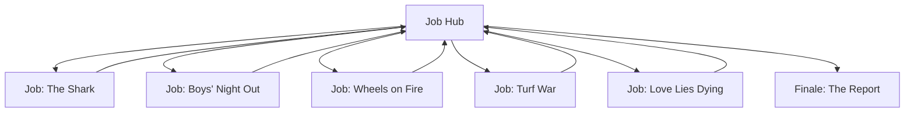

# M3: Welcome to the Neighborhood

Book pages 64–93

Third campaign mission with multiple job hooks.

## Contents

- [Beat Chart](<04 M3 Welcome to the Neighborhood.md#beat-chart>) (p. 64)
- [Rumors](<04 M3 Welcome to the Neighborhood.md#rumors>) (p. 66)
- [Background](<04 M3 Welcome to the Neighborhood.md#background-read-aloud>) (p. 66)
- [About Woodland Park](<04 M3 Welcome to the Neighborhood.md#about-woodland-park>) (p. 66)
- [Job Hub (Start Here)](<04 M3 Welcome to the Neighborhood.md#job-hub-start-here>) (p. 68)
- [Job (The Shark)](<04 M3 Welcome to the Neighborhood.md#job-the-shark>) (p. 69)
- [Job (Boys' Night Out)](<04 M3 Welcome to the Neighborhood.md#job-boys-night-out>) (p. 75)
- [Job (Wheels on Fire)](<04 M3 Welcome to the Neighborhood.md#job-wheels-on-fire>) (p. 77)
- [Job (Turf War)](<04 M3 Welcome to the Neighborhood.md#job-turf-war>) (p. 81)
- [Job (Love Lies Dying)](<04 M3 Welcome to the Neighborhood.md#job-love-lies-dying>) (p. 85)
- [Finale (The Report)](<04 M3 Welcome to the Neighborhood.md#finale-the-report>) (p. 89)
- [Downtime](<04 M3 Welcome to the Neighborhood.md#downtime>) (p. 89)
- [NPCs, Obstacles & NET Architectures](<04 M3 Welcome to the Neighborhood.md#npcs-obstacles--net-architectures>) (p. 90)

---

*Joel Chiam Holtzman*

**Estimated play time:** 8 to 10 hours

## Beat Chart

**Job (The Shark):** Hook → Dev (Plan of Attack) → Cliff (Stairs / Elevator / Window / Light Wells / Shark Arc) → Climax (The Rescue) → Resolution (Happy Ending / Bitter Ending) → Job Hub

**Job (Boys' Night Out):** Hook → Cliff (Saving Brendan) → Climax (Out of the Tree) → Resolution (Swaying Palms) → Job Hub

**Job (Wheels on Fire):** Hook → Dev (The B Team) → Dev (Random Encounter) → Dev (Learning the Ropes) → Climax (Match Night) → Resolution (Good Game) → Job Hub

**Job (Turf War):** Hook → Cliff (The Lookout) → Dev (Nana and Pop Pop) → Dev (Contacting Tarquin) → Climax (Gator Fight) → Resolution (Alligators Win! / Alligators Lose!) → Job Hub or campaign end

**Job (Love Lies Dying):** Hook → Dev (Asking Questions) → Dev (The Zolletta) → Climax (Search & Rescue) → Resolution (Memorial / Celebration) → Job Hub

Treat all five jobs as a single gig for Group Improvement Points at mission end.

---

### Rumors

| 1d6 | Rumor |
| --- | --- |
| 1 | The Bozo Civil War is down one circus. The leader of a small, hacking-focused circus known as The Cirqu3 d3 B0Z0 was shot dead in a high-speed chase through the streets of New Westbrook. No word on whether another circus was responsible. |
| 2 | Destiny Hondel, a junior reporter for Net54, seems to have hit it big with an exposé series entitled *Bleeding Night City Dry*. It focuses on scavver gangs and the damage they do to neighborhoods throughout the city. |
| 3 | Following a tragic fire, The Forlorn Hope is scheduled for rebuilding — but at a new location! The site of the new Forlorn Hope hasn't been revealed yet, but rumors abound. Some say the new Hope will angle to compete directly with The Afterlife for street merc business. |
| 4 | The Dockside Billhooks, a roller derby team from the Upper Marina, are down to half-strength after an NCPD bust. The members currently sitting in a cell are charged with smuggling, but everyone knows their actual crime was failing to pay their bribes on time. |
| 5 | A leaked internal memo suggests Continental Brands is stepping up their war against "illicit and unsafe food production" in Night City. They've begun subtly reaching out to Corp-friendly Fixers, looking for crews willing to get their hands dirty in exchange for cash. |
| 6 | Dynalar's local warehouses have run out of their Modular Finger Enthusiast Cyberhand. The Corporation's buyers are negotiating with the Aldecaldos to transport more raw materials to their Night City factory. |

> **Background (Read Aloud)**
>
> The future location of the new Forlorn Hope lies in Woodland Park, a small neighborhood on the border of Heywood and New Westbrook. It might be described as "up and coming," but it's not there yet, despite the rising apartment towers to the south and the nearby cluster of smart-looking buildings with the Dynalar logo plastered all over them. The new Hope's neighborhood is scrubby but busy enough to support some businesses. Jack Skorkowsky came through with this location, but Marianne Freeman wants you to check out the neighborhood beyond the bricks and mortar before the renovations can get going. She's asked for a full report on who's who, who runs what, and what might interfere with The Forlorn Hope's existence. Any speed bumps that could bog down the bar's reconstruction and operation must be found and negotiated with or hammered flat. This is best ascertained from ground level, so find somewhere to stay and welcome to your new home for the next month or so. In other words, it's time to move. As you get your eye in, you see kids on brightly stickered skateboards stunt off every available railing and curb with the confidence of youth. Well-dressed groups of young professionals stroll from the direction of the Dynalar complex to the bodega or food truck for a snack, and periodically, gorgeous skaters sweep through, all big hair and legwarmers. And the same faces pop up time and again, gathering to talk in small clusters or greeting each other while out and about. > This is a small neighborhood, and it seems everyone knows everyone.

### About Woodland Park

The majority of Welcome to the Neighborhood takes place in Woodland Park, a neighborhood located on the outskirts of Night City, on the border of New Westbrook and North Heywood. Here, the ancient remains of pre-4th Corporate War buildings mix with sparkling new construction to form a neighborhood lodged between a small, local past and a Megacorp-controlled future. The Palms (1) : A cargo container community located on the northwest edge of the neighborhood. A food truck named the Terminus, owned and operated by part-time fashion model Carri Zote, is parked here permanently.

Construction Yard (2) : A fenced-off construction yard operated by Jack Skorkowsky. The Forlorn Hope (3) : The future home of The Forlorn Hope. A two-story building with two sub-levels. Previously, it housed a mahjong parlor, which went out of business four years ago. Parking Lot (4) : An empty lot. It will serve as a parking area for The Forlorn Hope. Collapsed Building (5) : The remains of an EBM repair outlet. It collapsed during the 4th Corporate War. Neighborhood kids play here on the regular. Burning Bright Bodega (6) : The neighborhood corner store. It is owned and operated by Ella Corella, who inherited it from her grandmother … or aunt. No one is quite sure which. Breeze (7) : A drug store (and not of the pharmaceutical kind) owned and operated by Nana and Pop Pop. They cook their own product in the basement. Biotechnica Palm Grove (8) : A grove of genetically engineered palm trees operated by Biotechnica. Each tree is fitted with a metal collar containing an external biomonitor. Messing with the trees summons an armed Biotechnica strike force. The Zolletta (9) : A white stucco building exactly the same length on all sides. The first floor is commercial space and houses a Wash n' Run laundromat, a private investigator's office, and the Place of Rest, a way station and sanctuary for the Navad nomad family. The rest of the building is a cube hotel. Choom Goes Vroom (10) : A parking lot and office for Billy Flight, a local fix-it man (and Fixer). The lot is home to a cargo container (Billy's Office) and three five-level high parking elevators. The Shark (11) : A five-story apartment building dating back to the 2010s. There are studio and two-bedroom apartments located on each floor. The fifth floor is entirely rented by the Pearce family, a guerilla gardening collective that grows crops on the roof. There's also a large neon sign of a shark wearing a trilby on the roof. No one remembers the sign's original purpose. Dynalar Campus (12) : A multi-building campus serving as both an administrative and manufacturing space for Dynalar, a cyberware and electronics Corporation. A station attached to the campus serves as a stop for the private maglev running from the Executive Zone to Corporate-owned locations in Night City. Xanadu (13) : A skating rink/arena/night club operated by the Woodland Park Muses, a roller derby squad in the Night City Wonderland League. Acorn Towers (14) : A two-tower apartment complex serving employees from the nearby Dynalar campus. Some upscale conapts are available for non-employees.

### Job Hub (Start Here)

Marianne calls the Crew towards the end of the month. She's made a deal with Jack Skorkowsky for the building in Woodland Park but wants to learn the neighborhood, identify problems, and potentially solve them before The Forlorn Hope reopens. To that end, she asks the Crew to move into the neighborhood and spend at least a month there. Their job is to meet the residents, map out the local power hierarchy, and identify potential problems. She's willing to pay 500eb per person per week, for a total of 2,000eb at the end of the month.

Moving into Woodland Park isn't difficult. There are multiple vacancies at the four potential housing options. • The Zolletta is a white stucco building exactly the same length on all sides. The first floor is commercial space and houses a Wash n' Run laundromat, a private investigator's office, and the Place of Rest, a waystation and sanctuary for the Navad nomad family. The rest of the building is a cube hotel . • The Palms is a cargo container community stacked in a lot on the northwest side of the new Forlorn Hope. In addition to housing, the Crew can also find a food truck permanently parked here. • Edgerunners looking for something nicer can rent both studio and two-bedroom apartments at The Shark , the large apartment building facing the Dynalar campus. • Finally, if an Edgerunner has the eb to spare, they can snag an upscale conapt in Acorn Towers southeast of the palm tree grove. The towers primarily house Execs working in the nearby Dynalar campus, but others can rent here, too.

• Nomads with their own housing can park their vehicle on Jack Skorkowsky's construction lot . Welcome to the Neighborhood operates differently from the other Missions in Tales of the RED: Hope Reborn . It isn't a single large gig but multiple small jobs the GM can tackle in any order they please. The five missions should be spread out across the space of the following month at whatever pace the GM desires. Once the Crew finishes moving into their new homes, choose one of the following missions and let the action begin. • Job (The Shark) pits the Crew against another edgerunner team in a hostage situation and introduces the local Fixer. • Job (Boys' Night Out) calls upon fast decision-making to rescue a young man from his own bad choices. • Job (Wheels on Fire) sees the Crew doing a favor for the local combat roller derby team, The Muses. • Job (Turf War) introduces more residents and their problems with the Albino Job . • In Job (Love Lies Dying) , the Crew needs to locate an object of a crush while the clock ticks. Welcome to the Neighborhood ends when all the Jobs are finished, and the Crew reports their findings to Marianne in Finale (Neighborhood Report) .

## Job (The Shark)

Corporate greed invades Woodland Park!

> **Background (Read Aloud)**
>

There's someone in every neighborhood who knows everyone. Could be the bar owner who fills the locals' glasses or the bodega clerk who never sleeps but, in this case, it is the handyman who helps keep everything running… and it sounds like he could use a hand.

#### The Rest of the Story

Nobody knows what the neon shark sign atop the apartment building on Grant Avenue used to advertise, but somehow, it just keeps on going through its flickering routine, tipping its trilby all hours, day and night. The last attempt to unplug it blew the circuits in half the building's apartments, so people just live with it; it's so synonymous with its home that everyone calls the building The Shark. Billy Flight owns the Shark and Choom Goes Vroom, a mobile all-service maintenance and vehicle storage business next to the apartment building. He takes the rent, keeps the services running, and quietly ensures trouble stays low. Not a combatant himself, Billy is a Tech and Fixer, knows people who know people, and is always happy to add new and useful people to his list of friends. The Pearce Family occupies the 5th floor of the building. They're guerilla gardeners who support themselves by selling their crops, both directly to locals and to small businesses throughout Night City via Billy Flight. This has drawn the ire of Continental Brands, who hope to open an Oasis convenience store in the area to service the Dynalar campus. The Neocorp has hired the Lucky Charms, a crew of edgerunners, to "economically realign" the Pearce family's garden … with incendiary devices. The Lucky Charms didn't expect strong resistance from a group of gardeners, so they headed straight for the top floor of The Shark to do their job. The Pearces had other ideas and beat them back. The Lucky Charms grabbed the nearest couple of gardeners as human shields and retreated down the stairs, only to run into a group of heavily armed Pearces returning from a delivery run on the 3rd floor. The invaders retreated to the 4th floor and are now holed up in one of the apartments with their hostages. It's a standoff; the Lucky Charms can't get out, the Pearces on the 3rd and 5th floors won't attack and endanger their family, and nobody is interested in calling the authorities over an illegal assault on an illegal garden. Billy Flight would like the Crew to sort the whole mess out, and he is willing to pay 500eb to each Crew member to resolve the situation, doubled if both hostages make it out alive.

#### The Setting

This Job takes place entirely in and on The Shark. The opposition is small in number but is entrenched, and there are multiple routes to reach them and the hostages, including the internal stairs, outside of the building, or even the elevator shaft.

the oPPosition • The Lucky Charms is a crew of edgerunners who do regular contract work for Continental Brands. The crew consists of Green Clover, a Solo and team lead; Orange Star, a Netrunner; and Pink Heart and Yellow Moon, who provide muscle. A fifth member, Blue Diamond, is badly injured.

> **Infobox: The Lucky Charms (DV21)**
>
> A small-time edgerunning crew. Like many younger crews, they've named and organized themselves along a theme in hopes of attracting Corporate sponsors. Rumors suggest they worked primarily with a Fixer named Lowball but went independent after he skipped town.

#### The Hook

Obviously, the locals have noticed your Crew move into the area. For example, the kid with spiky brown hair who whizzes up to you on a skateboard. "Billy Flight has a job for you and wants to see you at Choom Goes Vroom. You'll find it next to The Shark. Said there's money in it. Said be there sooner than later!" They gesture to the apartment building with the massive neon fish sign, drop the board for a running start, and roll off. Choom Goes Vroom turns out to be a parking lot sandwiched between an apartment building and a cube hotel. Three parking elevators lift and store cars five levels high. They dominate the lot, making it easy to miss the cargo container parked in the northwest corner. A deeply tanned, weathered-looking man wearing overalls and a worried expression leans against one of the parking elevators. He gives you the once-over, then says, "Yeah, you look like you'll do." "Got an issue with some heavily armed jackarses. They've decided to try and trash some of my tenants' property, and when those tenants objected and shot up one of the invaders, hostages were taken. I don't want paying tenants splashed over the walls or my property torched, so I'd appreciate professional assistance to resolve the situation. The longer this goes on, the more likely somebody will do something stupid. Like call the cops. I'll pay you 500eb each to get my building back to normal. Hell, I'll be generous. If all the hostages come out alive, I'll double it." **Go to:** DEV (PLAN OF ATTACK)

### Dev (Plan of Attack)

Billy Flight can provide plans for The Shark, including the apartment where the hostages are being held,

members on the 3rd floor and more in their apartment on the 5th floor. It is a standoff — the Pearce family can't storm the 4th floor without risking the lives of the hostages, and the Lucky Charms won't make it off the

A NET Architecture controls the building's cameras, electricals, and elevator, but Flight lost access after the Lucky Charms' Netrunner dropped a Virus into the system. He contacted the other residents and told them to stay in their apartments if they're home or stay away from the building if they're out. Billy Flight sees four possible methods of reaching the 4th floor. • The Stairs : The Pearces control the stairwells on the 3rd and 5th floors. The Lucky Charms are likely guarding the stairwells on the 4th floor. If the Crew takes this path, **Go to:** CLIFF (THE STAIRS) • The Elevator : Out of commission, but the shaft has an emergency ladder. The Lucky Charms might not think of watching a non-functional elevator. If the Crew takes this path, **Go to:** CLIFF (THE ELEVATOR) • The Window : The apartment the Lucky Charms are holed up in is front-facing. The Crew could try to access it via the living area window, though it would mean breaking through the security bars. If the Crew takes this path, **Go to:** CLIFF (THE WINDOW) • The Light Wells : The Shark has three central shafts that run the height of the building, covered by frosted glass, designed to fill the hallways with natural light. If the Crew can get to the roof, they can break or cut through the glass cover, then rappel down to the 4th floor. If the Crew takes this path, **Go to:** CLIFF (THE LIGHT WELLS)

• If at any time the Crew attempts to shut down, infiltrate, or take control of the Shark's NET Architecture, **Go to:** CLIFF (SHARK ARC) It is also possible the Crew may split up and try multiple means of entry. If so, be prepared to run more than one scenario.

### Cliff (The Stairs)

The Shark has two stairwells, one on either side of the building. Two groups of Pearces, all armed, hold the 3rd floor and 5th floor landings. The doors to the 4th floor are propped partially open, and each is watched by a member of the Lucky Charms. Pink Heart (see page

on the right. The Lucky Charms have dragged furniture out of the apartment and are using it as cover (Thick, 20 HP). Stealthing up from the 3rd floor landing to the

Moon requires an opposed Check — Stealth versus Perception. If Orange Star has control of the building's cameras, give Pink Heart or Yellow Moon a +2 bonus.Making it out of the stairwell without Pink Heart or Yellow Moon noticing won't be possible without some kind of distraction. Just what the distraction is depends on the Players. A Netrunner in the NET Architecture could flick the lights. Someone could use a Breacher ( see

alert. Something tossed behind the enemy might cause them to turn around. If the idea's clever, let the Crew try it. As long as they haven't been attacked, Pink Heart and Yellow Moon can be persuaded to turn on their Crew with an appropriate Social Skill Check; for example, a Persuasion Check, and promise to escort them down past the Pearces and out to freedom or Bribery Check (they'll each want at least 100eb) to buy them off and let them pass without alerting the others. Any noise above a quiet conversation (such as gunfire) immediately alerts the remainder of the Lucky Charms. Pink Heart or Yellow Moon will rush to give aid to their comrade, while Green Clover and Orange Star will hunker down and prepare to shoot the hostages. **Go to:** CLIMAX (THE RESCUE)

The Shark • 4th FloorLight Light

Light Light

### Cliff (The Elevator)

Orange Star locked the elevator down on the 1st floor. Pushing up through the emergency access hatch and into the shaft doesn't require a Check, but climbing the old, worn ladder does. Reaching the 4th Floor requires a DV13 Athletics Check. Ask the Players what order the Crew is climbing in and make them roll their Athletics Check in that order. If an Edgerunner fails the Check, they continue climbing but also partially yank the ladder out of the wall, increasing the difficulty for anyone climbing after them (from DV13 to DV15 to DV17 to DV21 to DV24 to DV29). On the off chance six Edgerunners fail their Athletics Check, the ladder breaks entirely, and everyone on it falls 20 m/yds ( see pg. 181 ). Each floor's elevator doors have a manual release. Activating it doesn't require a Check, but opening the doors while hanging on to the ladder requires a DV13 Athletics or Contortionist Check. The doors open onto the hallway. If Orange Star has control of the building's cameras, they immediately notice the elevator doors opening and sound the alert. Pink Heart and Yellow Moon will rush over to engage in combat, while Green Clover and Orange Star will hunker down and prepare to shoot the hostages. Otherwise, a Stealth Check versus Pink Heart and Yellow Moon's Perception allows the Edgerunners to reach the apartment door or sneak up on the guards and deal with them quietly. A grapple and choke out (see pg. 177 ) prevents Pink Heart or Yellow Moon from reporting in. **Go to:** CLIMAX (THE RESCUE)

### Cliff (The Window)

The apartment's living room window faces Grant Avenue and is 20 m/yds above the sidewalk below. Reaching it by free climbing requires a DV15 Athletics Check. If using a grapple gun or hand, the DV drops to 13. The window is covered with security bars, but they're worn. Ripping them free is automatic for anyone with a BODY of 10 or higher — no Check required and a DV13 for anyone else. Cutting them with an appropriate tool, such as a blow torch or hacksaw, is a DV9 Basic Tech Check. Either method causes enough noise to automatically alert Green Clover and Orange Star, who will call for backup from Pink Heart and Yellow Moon and prepare to shoot the hostages. Removing the security bars quietly requires a DV17 Basic Tech Check and five minutes, as each bolt is loosened and removed. The bars must then be passed down and either secured or lowered to the ground. Only one Edgerunner can operate on the bars at a time. Once the bars are out of the way, the Crew can easily smash through the window (no Check) or open it (a DV13 Pick Lock Check) and climb in. Should the Edgerunners look through the window, they'll find the shades drawn — but anyone with Low Light/Infrared/UV can see the heat signatures of the room's occupants on the other side. **Go to:** CLIMAX (THE RESCUE)

### Cliff (The Light Wells)

Accessing the roof of The Shark by scaling the wall requires a DV17 Athletics Check for free climbing or DV15 with the right gear. It is somewhat easier to do so from the roof of the future Forlorn Hope by leaping across the narrow alley between the buildings. This reduces the number of stories climbed from five to only three. Climbing up from the roof of the future Hope can only be done with a grapple or similar gear and a DV13 Athletics Check. Of course, if the Crew has access to an aerial vehicle, they can just fly up to the roof, but unless the ride is a lighter-than-air craft, this involves a lot of noise and alerts the Lucky Charms.playEr surpr IsE! Decades of gaming have taught us one thing: Players always find a way to surprise you. If they choose a plan we haven't accounted for here, don't panic! Just do your best, improvise, and don't allow indecision to paralyze you. Maybe they've decided to sneak in through the window of an adjacent apartment and burst through the adjoining wall. The DVs from Cliff (The Window) still hold firm, but you can throw in a DV13 Perception Check

any clatter is noticed. As for the wall, drywall has

with a Very Heavy Melee Weapon could cut a hole with an Attack Check, allowing the rest of the Crew to leap through and attack.

> **Lawman**
>

If one of the Crew is a Lawman and employed by a law enforcement or security agency, Billy will ask them to "keep your employers out of this mess." If the Lawman decides to use their Backup Role Ability anyway, they can ask for cavalry to come dressed in "plain clothes" to avoid a fuss. If the backup comes in uniform, Billy will groan but still pay up so long as the job is done.

Once on the roof and among the Pearce family garden boxes and greenhouses, the Crew has the choice of three light wells — one on either side of the building and one in the center. The light wells are covered in panes of frosted bulletproof glass (15 HP), making it difficult to see through them. With a DV21 Perception Check, they can detect shadows of movement somewhere below the left and right light well but no movement beneath the central one. If an Edgerunner possesses Low Light/Infrared/UV, reduce the Perception Check DV to 17 . Smashing through the glass means doing more damage than it has HP, but is noisy and immediately alerts the Lucky Charms below. Pink Heart or Yellow Moon runs to their comrade as needed and they open fire on anyone they see. Cutting through the glass quietly requires an appropriate tool and a DV15 Basic Tech Check. If they succeed, the Crew can use ropes to scale down to the 4th floor with a DV13 Athletics Check. If the Edgerunners climb down from the outside light wells, neither Pink Heart or Yellow Moon thinks to look up, so the Crew gets one free Action to subdue them. If the Edgerunners climb down from the central light well, they come in behind the elevator column, which obscures them from the camera. **Go to:** CLIMAX (THE RESCUE)

### Cliff (The Shark Arc)

Orange Star has control of the Shark's NET Architecture. It controls an observation camera on the front door, one facing the sidewalk, and one trained on the elevator doors on each floor. The NET Architecture also gives access to the elevator and the hallway lights on each floor. Orange Star has dropped a Virus (DV10 to delete using a competing Virus) in the NET Architecture, forcing it to acknowledge them as the system operator and anyone else Jacking In as an enemy. Orange Star is Jacked In and currently on the second floor of the NET Architecture, watching the cameras, and will oppose any Netrunner they encounter. An easy way to neutralize the threat of the NET Architecture and cameras is to shut down the Shark's electricity. Billy Flight will be reluctant to do so, as a sudden shutdown could pop the circuits and cause damage he needs to repair, so the Crew will need to convince him with an appropriate Social Check versus his Concentration. Shutting down the NET Architecture could cause problems for the Crew if the GM decides this scenario takes place at night. Without natural light flowing in from the light wells and windows, the GM should feel free to apply penalties for low -lighting conditions ( see pg. 130 ). **Go to:** CLIMAX (THE RESCUE)

### Climax (The Rescue)

Green Clover (see pg. 92 ), Orange Star (see pg. 91 ), and Blue Diamond are holed up in Apartments 4G and 4I (they've bashed open their shared wall, creating a hole between the two). They have two hostages, who are tied up and gagged with duct tape. The apartments are between tenants, so the rooms are stark, with only some cheap furniture occupying the space. The doors aren't locked. Where the Lucky Charms are in the apartments depends on how loud the Crew was in reaching the

If the Crew made it to the apartment without being detected, Blue Diamond and Orange Star are in 4I. Blue Diamond is unconscious and resting on a pile of plastic tarps while Orange Star paces, either keeping watch on the NET Architecture or swearing because they've lost access. Green Clover is in 4G, hunkered down behind a cheap desk (HP 15). Each hostage is duct taped to one side of the desk — one on Green Clover's side and one on the other side. Both Orange Star and Green Clover are watching the doors, not the windows, and they'll focus on the Crew and not the hostages if combat begins. If the Crew was detected, Blue Diamond is still unconscious and on the pile of tarps in 4I, but both Green Clover and Orange Star are in 4G. They're facing whichever direction they believe the threat is coming from (door or window), and each is using a hostage as a human shield (30HP while alive, BODY

detect an Edgerunner coming in through the door or window, Green Clover threatens to shoot a hostage.

A successful Human Perception Check against Green Clover's Acting shows they're not bluffing. They will use their first Action in combat to shoot the hostage. A Human Perception Check against Orange Star's Acting proves the Netrunner is reluctant to kill their hostage. They'll continue to use the poor choomba as a shield while firing on the Crew. How the Crew resolves the situation is up to them. Combat is certainly an option, but might endanger the hostages. Green Clover will agree to release the hostages if the Lucky Charms are promised safe passage. This requires an opposed Social Skill Check against an appropriate Skill on Green Clover's side. Give the Edgerunner running the negotiations a +2 bonus to their Skill Check if someone on the team offers medical aid to Blue Diamond. Unless they're talked down, the Lucky Charms continue to fight until they're dead or subdued. They've been pushed into survival mode by the situation. Billy Flight didn't ask for information on why the Lucky Charms raided the building, but if interrogated, the invading crew breaks with the right opposed Social Skill Checks and admits Continental Brands hired them to smash up the rooftop garden.If the hostages survive, **Go to:** RESOLUTION (HAPPY ENDING) If either (or both) of the hostages die, **Go to:** RESOLUTION (BITTER ENDING)

### Resolution (Happy Ending)

If the hostages survive and the Lucky Charms are subdued or killed, the Crew has befriended the Pearces, who give them a box of fresh veggies worth

The Pearces will take care of the Lucky Charms. "We'll see how lucky they are for our garden, yeah?" If the hostages survive and the Crew promised the Lucky Charms safe passage, the Pearces will honor the agreement but not offer a reward of fresh produce. If the Crew figured out who hired the Lucky Charms, the Pearces, and Billy Flight aren't surprised. "They've tried shit before. They'll try shit again. Not much we can do about it but keep an eye out. Thanks." As agreed, Billy Flight pays the Crew 1,000eb and promises to think of them if more work is needed in the future. Likewise, he suggests they come to him if they have a need. He'll also ask for Marianne Freeman's number. "I doubt it is a coincidence, a group of Edgerunners arriving at the same time the owners of The Forlorn Hope buy a building in Woodland Park. I would like to be a good neighbor." **Go to:** JOB HUB

### Resolution (Bitter Ending)

If one or both hostages died and the Lucky Charms are subdued or killed, the Pearces will insist on taking care of the remaining invaders. "We'll see how lucky they are for our garden, yeah?" If the Crew figured out who hired the Lucky Charms, the Pearces and Billy Flight aren't surprised. "They've tried shit before. They'll try shit again. Not much we can do about it but keep an eye out. Thanks." As agreed, Billy Flight pays the Crew 500eb and promises to think of them for work in the future. Likewise, he suggests they come to him if they have a need. He'll also ask for Marianne Freeman's phone number.

Green Clover and a Hostage

"I doubt it is a coincidence, a group of Edgerunners arriving at the same time the owners of The Forlorn Hope buy a building in Woodland Park. I would like to be a good neighbor." **Go to:** JOB HUB

## Job (Boys' Night Out)

It's a tree eat intern world!

> **Background (Read Aloud)**
>

In the triangle formed by Acorn Street, Moss Street, and Grant Avenue stands a grove of tall palm trees. Judging by their height, they sprouted years back. Untended, they would have died long ago, but posted signs declare this grove property of Biotechnica, and an electronic monitoring collar wreaths each tree.

#### The Rest of the Story

This is an experimental grove of palm trees tended by Biotechnica. Technicians visit once a week to check and maintain the grove.

> **Infobox: Biotechnica (DV9)**
>
> The world's biggest biocorp, specializing in genetic engineering and biochemical research. They own the patent for CHOOH2 and most of the medicines being slung by Medtechs during the Time of the Red. They're also one of the largest employers in Night City. For more information, see pg. 268 . Each tree is fitted with an external biomonitor, and everyone in the neighborhood knows not to mess with them since doing so will set off an alarm and summon a Biotechnica strike team. Most of the trees are relatively normal, with various genetic modifications designed to increase their resistance to pollution, drought, background radiation, and other environmental factors. However, one tree on the southwest side of the triangle is a truly amazing experiment: a hybrid with DNA spliced from Dionaea muscipula , aka the Venus flytrap. This tree keeps down the local rat population by luring them into its skirts and crushing them with its fronds. Perhaps more disturbing, the flytrap genes have been supercharged to accelerate the digestion process. It happens in minutes instead of hours. This tree is dangerous to climb, so naturally, someone does. That someone is Brendan Haight, an intern working on the nearby Dynalar campus. After having one too many drinks at Xanadu, the roller rink/night club just to the south of the grove, Brendan took an interest in the tree and bet his buddies that he could climb up and retrieve a frond.

> **Infobox: Dynalar Technologies (DV13)**
>
> A prominent cyberware manufacturer responsible for a wide range of products. Roughly half the cybernetic implants currently installed in Night City residents were manufactured by Dynalar (or is a Dynalar knock-off built by local Techs). Their most recent triumph involves the return of their patented Cyberfinger system to the open market. Brendan actually succeeded at scaling the tree, hugging the trunk, but as soon as he reached the top of the skirt, the lowest ring of fronds slammed down, pinning him in place. His screams and those of his friends have attracted an interested, if not helpful, crowd.

#### The Setting

The palm grove sits east of the main neighborhood and north of Xanadu, a local club and roller rink. The grove is clearly marked as the property of Biotechnica and each palm tree is fitted with a metal collar containing an external biomonitor near the base. the oPPosition • A 5 m/yd tall palm tree that is both suffocating and slowly digesting the unfortunate Brendan. The timing is tight; Brendan can survive for a few minutes but not long enough for the Crew to engage in an extended planning session. • Brendan's friends are a group of young, fit, and extremely drunk Dynalar interns . They are

enthusiastic about helping but incapable of providing either good ideas or capable assistance. They aren't so much opposition as much as potential hindrances.

#### The Hook

As Edgerunners, you're used to the sound of screams and gunshots as the heralds of something interesting — and possibly profitable. It is, therefore, a little puzzling to round a corner and be faced with half a dozen professionally dressed young men shouting at and taking potshots at a tree while the locals look on at the free entertainment. After a moment, one of the men grabs the nearest member of the Crew and yells, "It's eating Brendan!!" while gesticulating at one of the palm trees. Now you can see a pair of stylish loafers sticking out from under a collapsed ring of fronds, kicking feebly. You've noticed the grove before, complete with "Property of Biotechnica" signs bearing a contact number. You just had no idea some of the trees were capable of killing a person. **Go to:** CLIFF (SAVING BRENDAN)CLiff (saVing BrenDan) Time is of the essence If the Crew doesn't understand the urgency, one of the locals will comment. "Ain't the first time this has happened. I figure the doomba's got maybe five minutes before the tree crushes him to death. Then, maybe an hour before the body's digested. Best not to mess with it, though. If a tree's hurt, Biotechnica sends an armed squad out, and they can get pretty damn cranky." If you want to amp up the pressure on the Players, set a real-world timer for 5 minutes and place it where the rest of your group can see it. If the Crew wants to get involved, they can try some tactics to free Brendan. If they demand a reward from Brendan's choombas, they can salvage 100eb of grubby physical bills between them. A DV9 Persuasion Check is required to convince the drunk saps to pay in advance.

#### Climbing

Climbing the tree requires a DV15 Athletics Check. Any damage done to the fronds crushing Brendan will cause them to relax, freeing him. A Crew member must succeed at a DV15 Athletics Check to catch Brendan or he'll take fall damage when he hits the ground below, unconscious. Climbing the tree does not trigger the sensors of the external biomonitor.

#### Timber!

Cutting the tree down isn't the easiest job. The tree's bark is the equivalent of Light Armorjack (SP11), and it has 30 HP. Of course, it can't exactly evade attacks. Harming the tree triggers the sensors of the external biomonitor.

#### Bend It

This particular palm tree is flexible. If the Crew can grapple or lasso the top of the tree (a DV13 Athletics Check), they can try to bend it low to the ground. Doing so requires no Check, but the combined BODY of everyone pulling on the rope must be 20 or higher. Someone can yank Brendan free once the tree is bent down by damaging one of the fronds. This will not trigger the sensors of the external biomonitor so long as the tree springs back upright within 30 seconds.

#### Trick Shooting

Shooting the palm tree's fronds to force it to release Brendan won't be easy. It is the equivalent of an Aimed Shot ( see pg. 170 ) and requires two successful Attack Checks to do the trick. The fronds will relax, releasing Brendan. He'll hit the ground below and be knocked unconscious. This will not trigger the sensors of the external biomonitor.

#### Calling for Help

Calling the number on the sign might be the most frustrating route. First, the Edgerunners must navigate a long menu of options, and then they need to wait on hold. If you're running a timer, play bland muzak and ignore your Players until it hits 1 minute left. Then, have a rather sleepy scientist respond. Being told the situation, the scientist is thrilled to know the tree is not only capable of killing rats but "able to handle prey up to human size." Convincing the scientist to help requires a DV13 Persuasion Check, at which point they'll activate an electrical surge built into the tree's external biomonitor. The pulse will force the fronds to relax, and Brendan will fall to the ground below, unconscious. He takes fall damage ( see pg. 181 ) unless caught.

#### Mess With the Biomonitor

If the Edgerunners so desire, they can tinker with the tree's external biomonitor. Tuning it so it won't alert Biotechnica if the tree is damaged requires a DV17 Electronics/Security Check and 1 minute of time. If the Edgerunner making the Check beats a DV21 or higher, they notice the device can deliver an electrical shock to the tree and activate the function. Once the shock is activated, Brendan falls from the tree and hits the ground, unconscious. He takes fall damage ( see CP:R

**Go to:** CLIMAX (OUT OF THE TREE)

### Climax (Out of the Tree)

If the Crew doesn't intervene, Brendan is crushed to death at the end of five minutes. The tree finishes digesting him an hour later. Otherwise, the Crew likely saves the poor doomba. He's suffering from broken ribs and acid burns over most of his body, but he's alive. **Go to:** RESOLUTION (SWAYING PALMS)resoLution (swaying PaLMs) Assuming Brendan survives, his choombas rifle through his pockets and pull out his Trauma Team card, snapping it to summon help A Trauma Team AV arrives minutes later and evacuates him. The choombas pay the Crew any money owed, then wander off towards Acorn Towers. If Brendan died, the choombas just wander off after ten minutes or so because "they can't afford to be late for work tomorrow." One of them is already wondering if Brendan's stuff at the office is up for grabs. It is up to the Crew to decide if they want to contact the cops or Biotechnica about this incident. It doesn't matter to the locals; if he was stupid enough to climb up there, he's stupid enough to be plant food. Either way, they'll laugh about this story for a long time. If the tree's external biomononitor was triggered, an armed Biotechnica team arrives thirty minutes later — much too late to help poor Brendan. Their concern is the tree. If it was harmed, they'll conduct an investigation to determine the culprit. The GM is free to make this a close-call scare for the Edgerunners or expand the incident into a whole new plotline, as the Biotechnica team zeroes in on the Crew, intending to charge them a 10,000eb replacement fee. **Go to:** JOB HUB

## Job (Wheels on Fire)

Sex, drugs, and roller derby, babies!

> **Background (Read Aloud)**
>

In Woodland Park, a large chunk of the local entertainment is supplied by The Muses, a semi-pro roller derby squad with a fondness for electronica, skating, and a look inspired by old movies — legwarmers and big hair. They're a common sight around the neighborhood, buzzing groups of Dynalar wage slaves and handing out flyers for whatever events they have scheduled at their headquarters, a former shipping depot turned roller rink and club known as Xanadu.

#### The Rest of the Story

The Muses make their money by running club nights at Xanadu; a shipping depot turned roller rink sandwiched between Jackson Street and Francis Street. They use the

money to equip the squad and pay their salaries and bills. During the roller derby season, they host regular bouts at Xanadu, taking on one of a dozen or so other semi-pro squads in the Night City Wonderland League.

> **Infobox: The Woodland Park Muses (DV17)**
>
> Based out of Woodland Park, The Muses are not just a roller derby squad but a poser gang, mixing 1980s bighair style and ancient Grecian fashion sensibilities. They're as well known for hosting parties in Xanadu, their arena/ nightclub, as they are for their rhinestonestudded razzle-dazzle on the track. This month, they were supposed to battle the Dockside Billhooks, a squad from the Upper Marina, but an unfortunate event relating to smuggled goods and unpaid bribes has left much of the opposition in NCPD custody. The other teams in Night City aren't available to fill in on short notice, which is a problem. A semi-pro sports team lives game to game, so a canceled bout could spell trouble for The Muses. Which is why they reach out to the Crew to replace the Billhooks. The Edgerunners don't need to win the bout; just excite the crowds and convince them to bet on the game. The Muses will give the Crew an appropriate cut of the action for the night — an estimated 2,000eb, total. the setting The Muses make their home in Xanadu, a two-story building covered in neon-bright graffiti located between the Dynalar Campus and Acorn Towers. Inside the building, the ground floor has been converted into a roller rink, complete with seating. The upper floor wraps around the building with open space in the center. Attached to the upper floor walkway are offices, communal living spaces, and chairs for fans who cough up money for the good seats. the oPPosition • The current captain of The Muses is Calliope ; she doesn't compete anymore but manages the team and club. She is perfectly capable of fighting if need be. • The remaining Muses are biosculpted for the wide-eyed, high cheekbone look and favor high perms or mullets. They're all solid athletes.

#### The Hook

A young man in distressingly tight pants skates up to you, expertly t-stopping. You may have seen him or his mates skating around the neighborhood before, blasting cheerful pop music from oversized, shoulder-mounted radios. "Hey there, you beautiful people! Our captain, Calliope, has a lu-cra-tive proposition for you! Can you drop by Xanadu this evening? Free entry and the first round of drinks on the house! See you there, 7pm, be looking sharp!" He hands you a token marked with a shiny gold lyre and promises the bouncer will let you right in if you flash it. Then he winks, offers a huge smile, and skates off. Anyone in the neighborhood can identify the Muses and Xanadu. Everyone knows their leader's name is Calliope. The promise of a job and free drinks should be enough to pique the Crew's interest, especially since the skaters have been a fixture in the neighborhood since they arrived. Assuming they decide to go, it's a chance to get booted and suited, with some Wardrobe & Style and Personal Grooming Checks. The token will get them in, but a Check against a DV15 or better gains them positive attention for having put the effort in. **Go to:** DEV (THE B TEAM)

### Dev (The B Team)

Xanadu is shining in neon spotlights, and you can feel the music in your bones from across the street. There's a queue to the door, but you're ushered past them as soon as the bouncers spot your token. Inside, there's a counter with lockers, where everyone is asked to stow their weapons, and a place to snag some skates if you don't have any. Then it's into the club. The focal point is the roller rink, where clubbers dance and skate past the DJ's booth in the center. There's a bar at the back under the second-floor walkway doing solid business, and the atmosphere is as upbeat as the music. One of the bouncers follows

you in and directs you up a ramp on the right-hand side to where a woman in a shimmering white chiton oversees the proceedings. She leads you into a soundproofed room and plants herself on the corner of the desk that dominates it. This is Calliope. She thanks the Crew for coming and lays out the problem. "Thanks for coming, babies! We had a roller derby bout scheduled for Friday, and ticket sales have been dy-na-mite! We're sold out in advance! There's just one tiny snag — the Billhooks, the other squad, got busted by the fuzz. If we have to issue refunds, it'll wreck our budget for the rest of the season. I refuse to lay down and die, though, so I came up with a plan. "We'll make a new team and play them. All we need is players. That'll be you. If you've run the Edge, you're tough enough to survive a jam and give the crowd a good show. We'll pay you the Billhooks' share of the pot … about two grand. Inspired to play, babies?" A DV15 Human Perception Check reveals Calliope is really under pressure. She isn't lying. If they don't play this match, the team is sunk. Maybe for good. Calliope promises to provide the Crew with all the kit they need, including fleshing out the squad with The Muses B ranks if they are short players. She'll also ensure the Crew learns "the lay of the track" — it shouldn't be hard. Many of their skills as Edgerunners are "transferable." If the Crew agrees, Calliope asks them to return the next day so the lessons can begin. For now, though, she gives each Edgerunner present a voucher for five free drinks. "Have fun, babies!"

#### Bar Brawl?

Despite the pop atmosphere, Xanadu can be a roughand-tumble place. If, as GM, you're feeling a lack of action, feel free to start a bar brawl! As long as it stays relatively non-lethal, the bouncers won't interfere and kick people out until at least 3 Rounds have passed. When the Crew decides to leave, **Go to:** DEV (RANDOM ENCOUNTER)DeV (ranDoM enCounter ) You've just left the club, the pounding music still shaking in your teeth, when you notice a devastatingly pretty young man, a keytar strapped to his back, bouncing the hard way along the sidewalk "Don't care if you're a stone fox, Random!" the bouncer shouts as they dust off their hands, "You're banned from Xanadu until the Newton triplets forgive ya!" The young man in question is Random, a keytar player and serial heartbreaker. His latest conquests — Sandy, Olivia, and Kira — are triplets and Muses. Random got sloppy and scheduled a date with all three of them tonight. He's fairly blase about the incident and happy to talk (and flirt) with the Crew if they start a conversation. Convincing him to play his keytar as part of an audition tape for Grace Steel doesn't require a Check — just a quiet spot away from the pounding beat of Xanadu where the musician can show off his skills. **Go to:** DEV (LEARNING THE ROPES) BY STORN A COOK Calliope

### Dev (Learning the Ropes)

The Crew has a day to learn the basics of roller derby, Night City style. If they think of performing a Library Search (DV9), they'll find a plethora of videos on the Data Pool, including several of The Muses in action. When they show up the next day, Calliope and a few key Muses run the Crew through the basics, drilling the rules into their heads. This is a good time to share the in-game rules and out-of-game mechanics ( see page

already done so. Roller Derby is rough but rarely lethal, and the hosts are expected to have at least one Medtech on standby in case of severe injury. Players with Trauma Team contracts are required to suspend them for the duration of the match. This is because of an unfortunate incident five years ago when a Trauma Team AV smashed through the roof of the Watson Whammers' arena and opened fire on their opponents.Calliope has a few questions for the Crew when the lesson's done. "What are you naming your squad? What'll your colors be? What about your logo?" Encourage your Players to engage here and spend time worldbuilding. They'll get more into the upcoming bout if they feel like they're part of an actual squad. **Go to:** CLIMAX (MATCH NIGHT)

### Climax (Match Night)

When the Crew arrives the following day, the Muses are in full swing, setting up the track for the coming bout. They are introduced to the Newton triplets (Sandy, Olivia, and Kira), who fit the Edgerunners with skates and ensure their armor pads are securely strapped in place. Best of all? The skates and armor are blinged out to match the colors and logo the Crew thought up last night! The triplets also introduce the Crew to any backup Muses (see pg. 90 ) joining their squad to fill their ranks out to five players.BY ZOVYA RPG Xanadu Roller Derby Track

The Crew must play wearing roller derby padding and helmets (SP7 each). As evening falls, there's nothing left to do but maybe place a bet and wait for the match to begin. The Muses are the clear favorites for the night. If an Edgerunner bets on themselves and their Crew wins, they get 3eb for every

their opponents and the Muses win, they get 1.5eb for every 1eb wagered. The maximum bet is 500eb. Calliope acts as MC, introducing the teams and the players from the high walkway. She revs up the crowd, and then it's game on. The Crew versus the Muses (see pg. 90 ). Technically, a bout consists of several jams, but only play one out and use it to determine which squad wins. Once the match ends, go t o RESOLUTION (GOOD GAME) .

### Resolution (Good Game)

Win or lose, as long as the Crew finished the bout and played fair, they get paid their cut of the take: 2,000eb. They can also collect their winnings if some earlier gambling paid off. Calliope's happy, and the Crew's cuts, bruises, and new scars will be a memento of an evening of good, clean fun. **Go to:** JOB HUB

## Job (Turf War)

How doth the little Alligator...

> **Background (Read Aloud)**
>

The Burning Bright Bodega is cramped, hot, and rammed with almost anything you might want or need to buy, as long as it isn't too expensive. At the back of the store, the counter is open to one side, giving the shotgun-toting owner a clear field of fire. The middle-aged woman eyes you cautiously; Ella Corella seems in a foul mood. Maybe you can brighten her day?

#### The Rest of the Story

Ella inherited the Burning Bright from her grandmother. Or possibly aunt — the relationship with her parents could have been more precisely communicated. Since then, she's run the place with an iron fist, keeping the neighborhood supplied with whatever random selection of goods she can stock her shelves. Her next-door neighbors are Nana and Pop Pop, the owners of a recreational substances shop named Breeze. In addition to traditional sales, both stores offer local deliveries via a network of skateboarding kids. All was well for the shopkeepers until the Albino Alligators rolled in and started causing trouble. Tarquin, a mid-level boss, has ambitions beyond having a good time and causing mayhem. She's decided the future of Night City is in real estate and figures Woodland Park will make for a great start in her new empire. All she needs to do is convince the locals to sell via a slow and steady intimidation campaign. It began with smashed windows and trash fires two nights ago, but the locals just patched things up and ignored the damage. So, last night, the Alligators targeted the skateboard couriers — stealing their packages, and smashing their boards. That drew Ella's attention. No goods delivered means no payments for said goods. Plus, Ella's protective of her kids. This is why she needs the Crew to perform some animal control and turn the Alligators into handbags.

#### The Setting

The bulk of the action takes place on the streets of Woodland Park. The Crew won't need to **Go to:** the Albino Alligators The boostergangers will come to them.kEEpIng It sImplE If you don't want to run a unique combat event using the Roller Derby rules on

Athletics Check from each player on the squad and make one for each opposing Muse. Compare the opposing Checks, highest to highest, next highest to next highest, and so forth. The squad with the most wins here takes the night.

the oPPosition • The Albino Alligators are a gang operating out of Rancho Coronado. They get their name from their shirts, which were originally promotional items for the now-abandoned car wash they call home. The black shirts have a white cartoon alligator logo on the back and permanently popped collars. In the grand scheme of Night City's hierarchy of gang power, the Albino Alligators are low on the ladder, but when hopped up on drugs and decently armed, they're still a threat to an isolated neighborhood on the edge of Night City. • This particular cadre of Alligators is led by Tarquin , a woman who dreams of transforming the gang into a real estate empire.

#### The Hook

Ella Corella is a middle-aged woman with devil-red skin and flames painted on her right cyberarm. She speaks with a slight French accent to her Streetslang and always keeps her shotgun within reach. When you arrive at the Burning Bright Bodega, she ushers out a few customers and activates the neon CLOSED sign. "I want you to know I am not naïve; I know how things are usually done. You pay protection, and the local gang makes sure nothing bad happens to you. But the doombas running rampant over Woodland Park these two nights are tourists, not locals, and they aren't even asking for money! These Alligator people are making a mess of our neighborhood, and last night they assaulted my children!" Based on the description of the perpetrators, a DV13 Streetwise Check is all that's needed to identify the gang as the Albino Alligators.

> **Infobox: The Albino Alligators (DV17)**
>
> A minor gang operating out of an abandoned car wash in Rancho Coronado. They get their name from promotional polo shirts the car wash printed before it died: black with a white alligator mascot printed on the back and a permanently popped collar. They're a minor nuisance as gangs go but since there's always more shirts, there's always more Alligators.Ella wants to end this mess before it advances further. She's spoken to the owners of the various local businesses. They can't offer much money — only 100eb per Edgerunner — but they can offer a trade in goods worth enough to supply one half of the Crew (rounded up) with a free month of Generic Prepak Lifestyle. Once they've accepted the offer, Ella suggests the Crew take a walk one door down to Breeze and talk to Nana and Pop Pop. They have more information on the Alligators. **Go to:** CLIFF (THE LOOKOUT)

### Cliff (The Lookout)

Lurking next to the Data Term opposite the bodega is a young man in a tightly zipped black jacket who keeps watch on the bodega. There's a beat-up old motor scooter parked on the sidewalk next to him. This is Sin Gin (see pg. 90 ), a lookout for the Albino Alligators. Since his jacket is closed and not showing off his gang colors, spotting Sin Gin as suspicious requires a DV15 Human Perception or a DV17 Local Expert Check. When Sin Gin spots the Crew leaving the bodega, he speaks rapidly into his disposable cell phone. Understanding what he's saying requires a DV13 Lip Reading Check or Amplified Hearing and a DV15 Perception Check. "No. No, Tarquin, they look like hard cases. Yeah, they're armed. You want me to warn them off? Eff that! I ain't talking to them on my own. Fine. Fine, I will." Sin Gin lobs a paint grenade across the street at the bodega. It lands on the sidewalk, splattering the front of the shop, and any Crew members standing there, with white paint. He shouts, "Next time it'll be a real grenade!" and leaps onto his scooter (see pg. 90 ), zooming away up Moss Street, turning right onto Acorn, and then left onto Crockett. Depending on the Crew, this could mark the start of combat. Sin Gin isn't interested in dying. He rides away for all he's worth until he's caught or escaped. If the Crew happens to have a vehicle nearby and gives chase, use the Chase rules (see pg. 180 ) to determine the outcome.

If he's captured, the Edgerunners can pit their Social Skills against Sin Gin's in order to interrogate him. Sussing out he's an Albino Alligator isn't hard — he's wearing the shirt under the closed jacket. He'll admit he works for a gang underboss named Tarquin and thinks this whole operation is a territory push. If asked, he has a phone number for Tarquin. Sin Gin was planning on driving back to the gang's headquarters in Rancho Coronado before being snagged. He doesn't know what the gang plans to do tonight. Sin Gin is only a daytime lookout. At night he works a concession stand at Playland by the Sea to earn some money for him and his mom. If the Crew continues on to the Breeze, **Go to:** DEV (NANA AND POP POP) If they try to call Tarquin, **Go to:** DEV (CONTACTING TARQUIN)

### Dev (Nana and Pop Pop)

Breeze isn't a large establishment, tucked as it is between the bodega and the cube hotel. A few oil drums have been polished and serve as tables for those partaking in Nana's offerings on the premises. Aside from the ubiquitous cans of Smash in a small fridge behind the counter, Breeze offers a selection of homemade street drugs cooked in the basement kitchen. The store is set up like a tiny bar, and Nana will happily chat cheerily about the merits of their product while also providing a friendly ear and dispensing advice on anything from pie recipes to relationships to the best comedown cushions. Periodically, her husband, known to all as Pop Pop, emerges from his basement to greet the regulars and refresh the supplies. Nana is a grandmotherly-looking woman with an English accent. When asked about the Albino Alligators, she sounds more annoyed than angry. "Oh, those children are so rude! Do say you're going to do something about them, won't you? They need to be taught a jolly good lesson!" Always a little high on her own supply, it takes a DV9 Conversation Check to remind her she knows something more about the Albino Alligators. "Why yes! Of course! How silly of me to forget. Pop Pop saw them the other night, parked … where was it, Pop Pop?" "Corner of Acorn and Moss, Nana!""Yes, yes. You can't see the corner from here because of the hill in the way." "This was two nights ago. I was walking home from a harvesting trip in the Badlands when I saw a group of them tumble out of a small caravan. At the time, I thought maybe they were walking to Xanadu, but that night they started breaking windows and setting fires." With a DV13 Conversation or Persuasion Check, an Edgerunner can draw one further detail out of Pop Pop. "A lady seemed to be in charge of the group. I heard one of them call her something. Tarter? Turtle? Tardigrade? Tarquin! Yes! That's the ticket. Tarquin!" Neither Nana nor Pop Pop know if the Albino Alligators parked there again last night. If the Crew has contact information for Tarquin and wants to call her, **Go to:** DEV (CONTACTING TARQUIN) If they want to wait until nightfall and confront the Albino Alligators directly , **Go to:** CLIMAX (Gator FIGHT) BY STORN A. COOK Nana and Pop Pop

### Dev (Contacting Tarquin)

The Crew might have gotten Tarquin's number from Sin Gin, but there are other ways to obtain it. A Fixer or Media Edgerunner can use their contacts to acquire it with a DV15 Streetwise Check. Billy Flight or another NPC Fixer can obtain it with no Check and will charge 50eb for the information. And, of course, the Crew might have their own contacts made through the course of their career to call upon. Feel free to reward creativity. If the Crew calls Tarquin, she'll be all too happy to chat. Her voice oozes superciliousness as if she barely considers the Crew worth her time. She's aware a group of Edgerunners can be a concern, but she honestly believes her superior numbers guarantee victory. Even if she loses most of her own gang, there's always more where they came from. An opposed Conversation Check will draw the truth out of Tarquin — she wants the locals to sell their property to the gang for a song or just flee altogether so her gang can move in and claim the neighborhood. No amount of talk over the phone will convince her to change the big plan. If the Crew pisses Tarquin off, she'll hang up. Otherwise, she'll suggest meeting after sunset in the Badlands opposite Woodland Avenue to "make a deal." If the Crew decides to visit Breeze, **Go to:** Dev (Nana and Pop Pop) Otherwise, **Go to:** CLIMAX (GATOR FIGHT)

### Climax (Gator Fight)

There's very little chance of resolving this situation without violence. Tarquin (see

to back down. The Albino Alligators arrive around sunset in two beat-up old camper vans. In addition to Tarquin, there are two Alligator Mooks (see pg. 90 ) for each Edgerunner in the Crew . ▶ Meeting ◀ If a meeting was arranged, the Alligators drive right to the meeting spot and exit their vehicles. Tarquin steps forward and attempts to negotiate, offering the Edgerunners ten percent of the profits if they join her campaign against Woodland Park. She's willing to give them 500eb there and then as a signing bonus and offer of good faith. If the Crew agrees, she'll expect immediate results. "We played nice and gave them a chance to run. Now, we play rough. Tonight we riot!" Assuming the Crew doesn't agree to run rampant through the neighborhood in a campaign of slaughter and terror, combat begins.

#### No Meeting

If no meeting was arranged, the Albino Alligators park behind the hill at the corner of Acorn and Moss, just like last time. Forewarned by Pop Pop's recollections, the Crew can arrange for traps or an ambush if they so desire. If unchallenged, the Albino Alligators will march down Moss Street and into the neighborhood with the intent of causing as much mayhem as possible. Tonight they don't plan on stopping with a few broken windows, stolen packages, and damaged skateboards. Unless they're stopped, most of Woodland Park will be broken and ablaze by morning. The Alligators step out of their camper vans, hopped up on drugs, and won't flee or surrender unless Tarquin and at least half their number are taken out of the fight. If the Crew joined Tarquin and the Albino Alligators, **Go to:** RESOLUTION (ALLIGATORS WIN! ) If the Crew stopped the snapping menace, **Go to:** RESOLUTION (ALLIGATORS LOSE!)hElp from thE loCals If the Crew decides to rally the locals to the defense of Woodland Park, the number of Albino Alligators involved increases dramatically but most of the action occurs off-screen, as the Pearces, Billy Flight, Ella, and others battle it out with the extra members of the gang while Tarquin and her direct troops fight the Crew. If you want to add to the tension, at the bottom of each Round, roll 1d6. On an even, describe a local triumphing over a ganger. On an odd, describe a ganger injuring a local. Conveniently, when the Crew wins, the locals do as well.

> **Alligator Assault**
>

By this point, your Crew shouldn't find a group of mooks this size difficult, but you never know. If your dice are hot and the Players' dice aren't, it could go poorly. If things are looking bleak and you want to give the Crew a fighting chance, add a few neighborhood folk to the mix. Ella or the Pearces might be enough to tip the scales.

### Resolution (Alligators Win!)

By morning, the battle for Woodland Park is over. The locals put up some resistance, but they were no match for both you and the gang. Dynalar security protected their campus and Acorn Towers but otherwise didn't interfere. It took hours before the local security contractor, 6th Street, showed up in force and drove you and the gang away. By that point, most of the buildings were broken and burning — including the new home of The Forlorn Hope. By the end of the week, word comes of a buyout of the Woodland Park properties. It isn't Tarquin and the Albino Alligators doing the buying, though. Dynalar swooped in with grand new plans to expand their campus. You won't be getting ten percent of anything. But, hey, at least you got paid 500eb, right? This marks the end of the campaign. The Forlorn Hope is closed forever, and there won't be any additional jobs coming the Crew's way from Marianne and The Professor.

### Resolution (Alligators Lose!)

When the sun rises this morning, it does so over an intact Woodland Park. You stopped Tarquin's plans for the destruction of the neighborhood. The new home of The Forlorn Hope is safe. All that's left is to collect your payment from Ella and the local business owners. As promised, the local business owners will pay the Crew 100eb each and hand over enough supplies to provide half the Crew (rounded up) with one free month of Generic Prepak Lifestyle ( see pg. 377 ). **Go to:** JOB HUB

## Job (Love Lies Dying)

The case of the missing detective...

> **Background (Read Aloud)**
>

The Terminus food truck does good business feeding locals something different than the same old Kibble. Permanently parked in the Palms cargo village, it's surrounded by old wire spools and a variety of mismatched stools to provide seating. You've had word that the owner, Carri, has a problem you might be able to help with.

#### The Rest of the Story

Carri's latest crush, Legacy, is a Rockerboy who recently graduated from NCU with a music degree. They've yet to find a steady gig, so moved into a room in the Zolletta cube hotel a month a**Go to:** save on costs Since moving into Woodland Park, Legacy has become fascinated by the Badlands. Seeking musical inspiration, they've taken to overnight campouts in the Badlands, away from the noise and lights of the city in order, with no Agent to distract them so they can "let the isolation seep into my soul." They went out camping again three nights ago, selecting a spot one mile (1.61km) north, where a stubborn tree offered a small amount of shelter. When they heard gunfire from a Raffen Shiv raid nearby, Legacy decided to bicycle home in the middle of the night rather than risk being caught in the crossfire. Unfortunately, they hit an outcropping in the dark. Legacy's bicycle was wrecked and their leg was broken, leaving them stranded. Worried when Legacy didn't stop by the food truck for their usual Koff Pop, not one morning but two in a row, Carri asked Fashanu Baines, a local PI with an office in the Zolletta, to look for them. Baines broke into Legacy's room, hacked into their Agent, and found a map leading to the campsite. From there, it seemed a simple first aid and rescue job. Only it didn't work that way. A sudden dust storm blew over the area, and Baines rammed the car into a ridge, causing a rock slide to tumble down and trap them both. Now, both the Rockerboy and the PI are unconscious and stuck in a wrecked car and broiling beneath the Badlands sun.

#### The Setting

Baines and Legacy are both residents of the Zolletta Cube Hotel. Baines rents a small office on the 1st floor and a room on the 3rd floor. Legacy lives on the 2nd floor. The car wreck is at the base of a ridge in the Badlands, roughly a mile north of Woodland Park, only a few hundred yards from where Legacy set up their campsite near a scraggly tree.

oPPosition The only opposition is time, though the Crew doesn't know it. If they don't find Baines and Legacy by morning, both will succumb to their injuries and die.

#### The Hook

You've received word. The owner of Terminus, the local food truck parked in the Palms cargo village wants a word. The truck's doing brisk business this morning, with a line ten people deep. When you reach the window, the choomba taking orders shouts something towards the inside of the truck. A moment later, a small woman with dark skin and permanent, silver light tattoo eyeliner hops out from the rear door and motions for you to join her. "Hi. My name's Carri. I heard you were helping people out, and … I think someone needs some help. Maybe a couple of someones. A couple of weeks ago, this Rockerboy named Legacy swung by, said they'd just moved in and were between gigs. Pretty soon, they were here for Koff Pop every morning, and, y'know, we exchanged numbers." She offers you an awkward grin. "Two days ago, Legacy didn't show. Yesterday, Legacy didn't show. I know this is paranoid, but I got worried, so I asked Fashanu … that's Fashanu Baines, the private eye who works out of the Zolletta … to check in on them. That was yesterday, and now Fashanu's missing, too. Could you please go look for them?" Here's what Carri knows • Legacy was living in the Zolletta. Carri will admit, with a blush, that she's been to their room on the

• Baines keeps an office on the Zolletta's first floor. • Legacy is trying to get a regular campaign of Carrion and Crawlers going, but so far, only Carri has agreed to play. • Legacy is currently between gigs and feeling depressed about it. They've grown more withdrawn in the last week and have been talking about trying to find new inspiration. Carri can't afford to pay the Crew in cash, but she'll offer them a week's worth of meal vouchers each if they can locate the missing Rockerboy and detective. "I just want to know they're both alright!" If the Crew decides to ask around the neighborhood, **Go to:** DEV (Asking Questions) If they check out the Zolletta, **Go to:** DEV (THE ZOLLETTA)

### Dev (Asking Questions)

The difficulty of getting information from the locals depends on how well the Crew has bonded with them. If an Edgerunner barely knows someone, they need to succeed at an appropriate DV13 Social Skill Check. If they've completed a mission in which the local being questioned figures and made a good impression in the process, no Check is required.

#### Regarding Legacy

Billy Flight : "The musician who stood Carri up? They dropped in a week back, looking for someone to fix up an old electronic drum kit and amp but didn't strike me as the type who'd just up and delta. I heard our local PI was looking into it?" Ella: "They come into the bodega for supplies now and then. Mostly any fresh vegetables we had left after the Pearces delivered. The last time I saw them, they were

Carri Zote

after a hunting knife, a roll of plastic sheeting, and an old-school compass. I had the knife but not the other stuff, and I didn't ask why they wanted them. They don't seem like a bad sort... but you never know." Nana : "Yes, they are always looking for incense and oils. Nice youngster; I do hope they're all right. I think Pop Pop mentioned seeing them out in the Badlands one time during one of his walkabouts." Anyone else asked doesn't know Legacy except in passing. A few people remember Legacy asking them if they played some sort of game — an analog one, if you can believe it!

#### Regarding Fashanu Baines

Billy Flight : "Decent detective, I think. I pass on any old mystery novels I find to him. Likes the image of the knight in scuffed armor, you know? I know he does some work for Woodchipper, a nomad Fixer. He keeps his car parked with me, but that's been gone for at least a day." Flight can supply an image of Baines' vehicle, a beige, two-seater Zonda Metrocar. Ella: "Always poking his nose into things, isn't he? We once chatted in the Wash n' Run over the best ways to get blood out of a vintage trench coat. Has something happened to him?" Nana : "Well, now, he isn't really one of my customers, if you know what I mean, but always happy to come in and chat about the neighborhood!" Everyone else in the neighborhood offers generic information. They know Baines is a private detective, but no one will admit to having hired him for anything.

> **Infobox: Woodchipper (DV5)**
>
> At just over 7 feet (2.1 4 meters) tall, Woodchipper cuts an impressive figure. She also acts as a marriage counselor, conflict mediator, and Fixer for the local Aldecaldo and Jodes nomad packs. Her Night Markets aren't just shopping experiences but block parties, with some of the best street corn around.If the Crew decides to check out the Zolletta, **Go to:** DEV (THE ZOLLETTA) If they have enough information to travel to the Badlands, **Go to:** CLIMAX (SEARCH & RESCUE)

### Dev (The Zolletta)

The Crew can check out three possible locations in the Zolletta: Baines' office on the 1st floor, Legacy's room on the 2nd floor, and Baines' room on the 3rd floor.

#### Baines' Office

A metal shutter blocks access to the office. Cracking its lock requires a DV15 Electronics/Security Tech Check. Inside, there's a wood-effect desk and faux leather swivel chair taking up most of the space, with a plastic seat opposite, presumably for clients. File cabinets with old-fashioned key locks (DV13 Pick Lock to open) line the walls. Inside the drawers, Baines keeps records on all his cases in plastic suspension folders. On the desk is a personal data term and a dirty drinking glass. There are two drawers in the desk, one of which contains a bottle of semi-decent bourbon-style whiskey. The other is crammed with notepads in various states of use and a small plastic box containing an Agent decorated with bright colors that don't match the sepia tones of this office. The files in the cabinets are all listed under the client's name. The search for Legacy comes under Zote, Carri. It is slim but contains a list of actions taken ("gaining access" to Legacy's room, along with the six-digit lock code for it) and itemizes what he took (their Agent and some half-written songs in notepads). The folder also contains a map of the Badlands, with coordinates scribbled onto an apparently empty area, circled in red. This is the location of Legacy's tree, based on information pulled from their Agent. If the Crew doesn't search the files, the same information is available directly from Legacy's Agent in the desk. It is locked and can be hacked with a Breacher (see pg. 179 ) or a DV21 Electronics/Security Tech Check.

#### Legacy's Room

Accessing Legacy's room requires beating a DV13 Electronics/Security Tech Check or the use of the code acquired from Baines' office. Inside, it is a messy but

typical cube hotel room. Colorful clothes are strewn everywhere. An electronic drum kit and an amp take up most of the space. Since Baines already broke in and "borrowed" Legacy's Agent, nothing in the room is helpful — though a DV13 Perception Check does turn up a memory chip containing a recording of Legacy in concert. They're pretty damn good! Assuming the Crew finds Legacy alive, the file might be worth passing on to Grace Steel.

#### Baines' Room

Accessing Baines' room requires beating a DV13 Electronics/Security Tech Check. Inside is a bog standard cube hotel room. It is obvious Baines spends little time there. There's nothing of interest besides a collection of tattered old noir paperback novels and some clothes. If the Crew decides to ask around the neighborhood, **Go to:** DEV (Asking Questions) If they travel to the Badlands, **Go to:** CLIMAX (SEARCH & RESCUE)

### Climax (Search & Rescue)

It should be pretty clear that Legacy was traveling into the Badlands for some reason, and Baines went after them. With the map from Baines' office, reaching the exact spot of Legacy's campsite in the Badlands requires a DV13 Library Search, Local Expert (Badlands), or Wilderness Survival to navigate using skills or technology. Getting to the site takes less than

Anyone who walks there must make a DV13 Endurance Check due to the burning sun pounding down on them. If an Edgerunner fails the Check, they're weary and at a -2 to all Checks made until they get a good night's sleep. Legacy broke down their site when they left, so there's not much left but the doused remains of a campfire. The dust storm covered the tracks left by Legacy's bicycle and Baines' car, making them difficult to locate. Finding and following them requires a DV15 Tracking Check or DV17 Perception Check. A successful DV15 Tactics Check suggests a spiraling search pattern is the best choice for surveying the area. Doing so will result in finding the car in roughly 30 minutes. Otherwise, a random search of the area will find the car after another hour.▶ Finding the Car ◀ Baines' metrocar is pinned by a landslide's worth of rubble at the base of a ridge. The rubble makes it impossible to reach Baines and Legacy, but a successful DV15 Perception Check detects signs of life inside. Freeing the pair won't be easy. Let the Crew work on a plan and be ready to come up with DVs for their ideas. Some possibilities: • The rubble can't be shifted by hand unless two or more Edgerunners have a BODY of 10 or higher. If so, they can work in concert to push the rubble aside without a Check. • Using rope/chain and a vehicle to shift the rubble requires a DV17 Drive Land Vehicle Check if it has a Heavy Chassis upgrade and a DV24 Drive Land Vehicle Check if it doesn't. If the Check fails, the rubble is still shifted, but the Crew's vehicle suffers

• Blowing the rubble off the car with explosives is possible but extremely risky. It requires at least two grenades (or their equivalent) and a DV24 Demolitions Check. If the Check fails, the explosion kills Baines and Legacy. • Using the right equipment to create levers and fulcrums requires a DV21 Basic Tech Check. With a success, the rubble is shifted. • The Crew can call for help. They might remember Baines does work for the nomad Fixer Woodchipper or that Jack Skorkowsky, the real estate agent, owns a GRAF3 construction drone. Convincing someone to come over to help is a Social Skill Check with a DV of between 13 and

Crew. Once freed, the Crew might want to provide Legacy and Baines with medical treatment. Each is at 0 HP and is not currently stabilized. Baines has three Critical Injuries (Broken Ribs, Cracked Skull, and Whiplash). Legacy has four Critical Injuries (Broken Leg, Foreign Object, Spinal Injury, and Whiplash). While the Critical Injuries don't need immediate attention for transport, the pair shouldn't be moved until they are stabilized ( see pg. 128 ).

If either Baines or Legacy (or both) dies, **Go to:** RESOLUTION (MEMORIAL) If Baines and Legacy are rescued , **Go to:** RESOLUTION (CELEBRATION)

### Resolution (Memorial)

Following the news, Carri organizes a small neighborhood vigil. People from the community light candles, speak quietly and mourn the loss of a resident of Woodland Park. No one openly blames you — you tried your best, they are sure — but some residents look at you with wary eyes in the following days. Carri honors her agreement and hands over the vouchers but avoids the Edgerunners whenever she runs into them in the neighborhood. They remind her too much of what she lost.

### Resolution (Celebration)

A few days after the rescue, Carri organizes a small party to welcome Baines and Legacy back from their stay at From the Ashes, a clinic known for helping those without a lot of money to spend. Both are still in rough shape but clearly on the mend. During the party, Carri publicly thanks you for rescuing the pair and hands you not seven vouchers each but ten, plus the promise of a free cup of Koff Pop every morning from now until the truck goes out of business. **Go to:** Job Hub

## Finale (The Report)

After weeks of living in Woodland Park, you've learned quite a bit about the neighborhood and the people who live here. You travel to the new Forlorn Hope on the final day of the month, ready to share your newfound knowledge. Marianne and The Professor are already there, pouring over plans to renovate the joint. They take a break from the actual physical blueprints to sit down and listen to your report about Woodland Park's businesses, residents, and troubles. "It sounds colorful." The Professor says, "A lot of problems in a short period of time. I'm glad you were able to help." Marianne smiles brightly, "It sounds perfect. I think we'll like it here. Come on. I've brought in some prepak to make for lunch. The good stuff, too. Not the cheap Oasis crap. Help me heat it. We'll eat, and then I'll pay you what we owe you. You did good, kids." And that's exactly what happens. The Crew eats lunch with Marianne and The Professor, and then she pays them 2,000eb each for a job well done.

### Downtime

By this point, your Crew's probably accumulated a small amount of wealth and Improvement Points. Give them at least two weeks to relax, perform tasks, and go shopping before Marianne calls them in for the next mission. **Go to Mission:** The Devil's Cut

> **Don't Forget Grace!**
>
> If the Players didn't remember Grace Steel's request as they scoped out the neighborhood, the celebration is a great time to ask for a DV13 Concentration Check. Anyone who succeeds remembers the task set for the Crew by The Forlorn Hope's musical maven: find musicians for the band! Legacy certainly qualifies. So does Random, who happens to be present and hitting on one of the Pearces.

---

## NPCs, Obstacles & NET Architectures

Use the **Muse** stat block for both opponents and Muses filling out the Crew's ranks. Use the **Albino Alligator Mook** stat block for Sin Gin.

### Muse — Mook

| | |
|---|---|
| **HP** | 35 |
| **Combat #** | 14 |
| **INIT** | 6 |
| **MOVE** | 6 |
| **Seriously Wounded** | 6 |
| **Death Save** | 4 |
| **Reputation** | 3 |

**Skills:** Athletics 12, Conceal/Reveal Object 10, Concentration 9, Conversation 8, Cybertech 8, Dance 12, Human Perception 8, Perception 8, Persuasion 10, Resist Torture/Drugs 10, Stealth 6

| Weapon | ROF | Damage |
|--------|-----|--------|
| Brawling | 2 | 2d6 |
| Rhinestone Club | 2 | 3d6 |

| Armor | SP |
|-------|-----|
| Roller Derby Helmet (head) | 7 |
| Roller Derby Padding (body) | 7 |

**Gear:** Bodysculpt, Roller Skates, Cybereye w/ Color Shift x2, Neural Link w/ Chipware Socket & Pain Editor, Techhair, Cash: 20eb

---

### Albino Alligator Mook

| | |
|---|---|
| **HP** | 25 |
| **Combat #** | 10 |
| **INIT** | 6 |
| **MOVE** | 4 |
| **Seriously Wounded** | 6 |
| **Death Save** | 4 |
| **Reputation** | 1 |

**Skills:** Athletics 10, Concentration 4, Conversation 5, Cybertech 6, Drive Land Vehicle 10, Human Perception 5, Perception 6, Persuasion 6, Resist Torture/Drugs 4, Stealth 7

| Weapon | ROF | Damage |
|--------|-----|--------|
| Rippers | 2 | 2d6 |
| PQ Very Heavy Pistol | 1 | 4d6 |

| Armor | SP |
|-------|-----|
| Leather (head) | 4 |
| Leather (body) | 4 |

**Gear:** Basic Very Heavy Pistol Ammo x8, Disposable Cell Phone x2, Cash: 20eb

---

### Orange Star — Netrunner: Interface 5

| INT | REF | DEX | TECH | COOL | WILL | MOVE | BODY | EMP |
|-----|-----|-----|------|------|------|------|------|-----|
| 5 | 5 | 7 | 7 | 6 | 5 | 5 | 5 | 5 |

| HP 35 · Seriously Wounded 5 · Death Save 4 · REP 3 |

| Weapon | ROF | Damage | C# |
|--------|-----|--------|-----|
| Thick Blade | 2 | 3d6 | 11 |
| Heavy Pistol | 2 | 3d6 | 12 |

| Armor | SP |
|-------|-----|
| Bodyweight Suit (head) | 11 |
| Bodyweight Suit (body) | 11 |

**Skills:** Athletics 9, Basic Tech 10, Brawling 10, Concentration 10, Conversation 8, Education 10, Electronics/Security Tech 12, Evasion 11, First Aid 10, Handgun 12, Human Perception 10, Language (Spanish) 9, Language (Streetslang) 7, Local Expert (Santo Domingo) 9, Melee Weapon 11, Perception 11, Persuasion 8, Stealth 10, Streetwise 8

**Gear:** Basic Heavy Pistol Ammo x16, Standard Quality Agent, Medkit, Techtool, Cyberdeck w/ Armor, Range Upgrade (in Bodyweight Suit), See Ya, Sword x2 & Worm, Cash: 50eb

**Cyberware:** Chemskin, Cybereye w/ Virtuality x2, Neural Link w/ Interface Plugs

---

### Pink Heart / Yellow Moon

| INT | REF | DEX | TECH | COOL | WILL | MOVE | BODY | EMP |
|-----|-----|-----|------|------|------|------|------|-----|
| 4 | 7 | 6 | 5 | 4 | 4 | 6 | 7 | 5 |

| HP 40 · Seriously Wounded 7 · Death Save 4 · REP 0 |

| Weapon | ROF | Damage | C# |
|--------|-----|--------|-----|
| Brawling Attack | 2 | 3d6 | 10 |
| Assault Rifle | 1 | 5d6 | 12 |

| Armor | SP |
|-------|-----|
| Skinweave (head) | 7 |
| Skinweave (body) | 7 |

**Skills:** Athletics 12, Autofire 12, Brawling 10, Concentration 6, Conversation 7, Drive Land Vehicle 10, Education 6, Evasion 10, First Aid 11, Human Perception 7, Language (English) 8, Language (Streetslang) 6, Local Expert (Santo Domingo) 6, Perception 10, Persuasion 6, Shoulder Arms 12, Stealth 8, Tactics 8

**Gear:** Basic Rifle Ammo x35, Incendiary Grenade x1, Standard Quality Agent, Cash: 20eb

**Cyberware:** Chemskin, Neural Link w/ Sandevistan, Skinweave

---

### Tarquin — Fixer: Operator 4

| INT | REF | DEX | TECH | COOL | WILL | MOVE | BODY | EMP |
|-----|-----|-----|------|------|------|------|------|-----|
| 5 | 5 | 4 | 5 | 6 | 6 | 4 | 4 | 5 |

| HP 35 · Seriously Wounded 4 · Death Save 4 · REP 3 |

| Weapon | ROF | Damage | C# |
|--------|-----|--------|-----|
| Brawling Attack | 2 | 1d6 | 6 |
| Very Heavy Pistol | 1 | 4d6 | 12 |

| Armor | SP |
|-------|-----|
| Light Armorjack (head) | 11 |
| Light Armorjack (body) | 11 |

**Skills:** Accounting 8, Athletics 6, Basic Tech 7, Brawling 6, Business 10, Concentration 8, Conversation 10, Education 10, Evasion 12, First Aid 7, Handgun 12, Human Perception 10, Language (English) 9, Language (French) 9, Language (Streetslang) 7, Library Search 10, Local Expert (Rancho Coronado) 7, Melee Weapon 10, Perception 11, Personal Grooming 9, Persuasion 10, Stealth 8, Streetwise 8, Trading 10, Wardrobe & Style 10

**Gear:** Basic Very Heavy Pistol Ammo x8, Disposable Cell Phone x2, Smart Glasses w/ Targeting Scope, Cash: 100eb

**Cyberware:** Cyberaudio Suite w/ Audio Recorder & Standard Quality Internal Agent

---

### Green Clover — Solo: Combat Awareness 4

| INT | REF | DEX | TECH | COOL | WILL | MOVE | BODY | EMP |
|-----|-----|-----|------|------|------|------|------|-----|
| 4 | 6 | 4 | 4 | 6 | 5 | 6 | 5 | 4 |

| HP 35 · Seriously Wounded 5 · Death Save 4 · REP 3 |

| Weapon | ROF | Damage | C# |
|--------|-----|--------|-----|
| Brawling Attack | 2 | 2d6 | 13 |
| VH Pistol w/ Smartgun Link | 1 | 5d6 | 13 |

| Armor | SP |
|-------|-----|
| Light Armorjack (head) | 11 |
| Light Armorjack (body) | 11 |

**Skills:** Athletics 12, Brawling 13, Concentration 9, Conversation 12, Education 8, Endurance 8, Evasion 12, First Aid 6, Handgun 12, Human Perception 10, Language (English) 8, Language (Streetslang) 8, Local Expert (Santo Domingo) 7, Perception 10, Persuasion 10, Resist Torture/Drugs 12, Stealth 10, Tactics 8

**Gear:** Basic Very Heavy Pistol Ammo x16, Incendiary Grenade x1, Smoke Grenade x1, Standard Quality Agent, Cash: 100eb

**Cyberware:** Chemskin, EMP Threading, Neural Link w/ Chipware Socket, Interface Plugs & Pain Editor

---

### Sin Gin's Motor Scooter

| SDP | 20 |
| Seats | 1 |
| Speed (Combat) | 15 MOVE |
| Speed (Narrative) | 30 MPH / 48 KPH |

---

### The Shark NET Architecture

| Floor | DV | Notes |
|-------|-----|-------|
| 1 | 6 | Password |
| 2 | — | Black ICE: Wisp; Control Node: Observation Cameras |
| 3 | 8 | Black ICE: Raven & Wisp; Control Node: Hall Lights |
| 4 | — | — |
| 5 | 8 | Control Node: Elevator |
| 6 | 8 | — |
