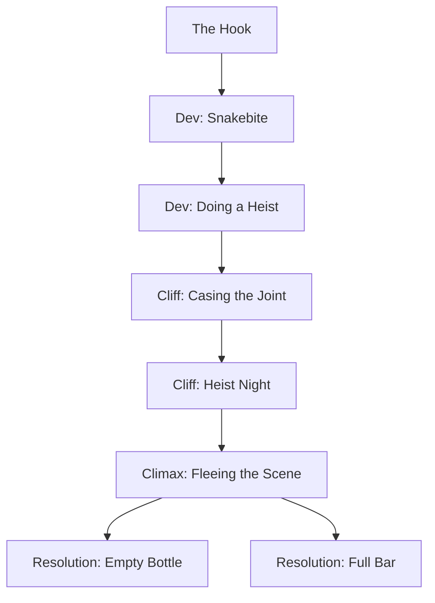

# M4: The Devil's Cut

Book pages 94–113

Fourth campaign mission — stealth, social skills, and heist play.

## Contents

- [Beat Chart](<05 M4 The Devil's Cut.md#beat-chart>) (p. 94)
- [Rumors](<05 M4 The Devil's Cut.md#rumors>) (p. 95)
- [Background](<05 M4 The Devil's Cut.md#background-read-aloud>) (p. 95)
- [The Rest of the Story](<05 M4 The Devil's Cut.md#the-rest-of-the-story>) (p. 95)
- [The Setting](<05 M4 The Devil's Cut.md#the-setting>) (p. 96)
- [The Opposition](<05 M4 The Devil's Cut.md#the-opposition>) (p. 96)
- [The Hook](<05 M4 The Devil's Cut.md#the-hook>) (p. 96)
- [Dev (Snakebite)](<05 M4 The Devil's Cut.md#dev-snakebite>) (p. 97)
- [Dev (Doing a Heist)](<05 M4 The Devil's Cut.md#dev-doing-a-heist>) (p. 99)
- [Cliff (Casing the Joint)](<05 M4 The Devil's Cut.md#cliff-casing-the-joint>) (p. 100)
- [Cliff (Heist Night)](<05 M4 The Devil's Cut.md#cliff-heist-night>) (p. 103)
- [Climax (Fleeing the Scene)](<05 M4 The Devil's Cut.md#climax-fleeing-the-scene>) (p. 106)
- [Resolution (Empty Bottle / Full Bar)](<05 M4 The Devil's Cut.md#resolution-empty-bottle>) (p. 106)
- [Downtime](<05 M4 The Devil's Cut.md#downtime>) (p. 107)
- [Appendix: The Devil's Cut](<05 M4 The Devil's Cut.md#appendix-the-devils-cut>) (p. 107)
- [NPCs, Obstacles & NET Architectures](<05 M4 The Devil's Cut.md#npcs-obstacles--net-architectures>) (p. 109)

---

*Torbin Weit*

**Estimated play time:** 6 to 9 hours

## Beat Chart

**Heist goes wrong** → Resolution (Empty Bottle). **Heist goes right** → Resolution (Full Bar).

---

### Rumors

| 1d6 | Rumor |
| --- | --- |
| 1 | The Albino Alligators, a minor Rancho Coronado gang, suffered a setback when they tried to conquer a neighborhood in North Heywood and met stiff local resistance. |
| 2 | A crew of street mercs raided the Dirty Hippies last month, inflicting severe casualties and destroying many of their garden beds. Street mercs also attacked Stems & Seeds and the reclaimer gardens in the RC Night Market but met stiff resistance from local security, who successfully repelled them. Rumors of attacks on other guerilla gardening operations in Night City during the same time period suggest the assaults originate from the same source: Continental Brands. |
| 3 | Continental Brands is looking to expand its operations beyond kibble and SCOP by entering the luxury food market. Specifically, they're opening a new facility dedicated to selling and storing high-end, vintage booze. The new operation, The Devil's Cut, is the brainchild of rising Corporate star Jules Lung. |
| 4 | It's about time! The Forlorn Hope is re-opening soon in a new location, and the rumored guest list is a who's who of the Night City edgerunning scene. |
| 5 | Megacorps in Night City are pushing the Night City Council to step up building and infrastructure safety inspections. This isn't done out of the goodness of their hearts — they're losing money every time a building near one of their facilities explodes and shrapnel damages their property or a sinkhole opens up and blocks traffic flowing to and from their warehouses. |
| 6 | The Red Chrome Legion's numbers have swelled after new leaders Vox and Populi swept through multiple homeless encampments and promised food and shelter in exchange for an oath signed in blood. |

> **Background (Read Aloud)**
>
> Marianne Freeman welcomes you into the still-under-renovation Forlorn Hope. "Come on in … we haven't installed the stools yet, but you can lean against the bar," she says with an impish smile. She serves up "lemonade". The drinks are mixed from flavored powder, but the water's been run through a filter, and the jug has been sitting in a cooler. It's a little hard to hear her, what with all the power tools screeching and buzzing as contractors continue their building work, but she's used to speaking over a wall of noise. "A real bar needs a liquor collection, not just the synth stuff, and our old one died in the fire." There's a tiny wrinkle between her brows, but she smooths it away with a practiced smile. "I tried to tap old friends with liquor collections to see if anyone was willing to sell to us, but I've come up dry. No pun intended. Some of my old acquaintances have already sold up, but others … other people have lost their collections in an odd series of accidents. One of those old friends will be here in a moment, and if her story goes the way I think it will, I'll have a job for you."

### The Rest of the Story

Unfortunately, when seeking to restock The Hope's liquor collection, Marianne didn't account for speculators attempting to corner the market on vintage booze. Jules Lung is an executive of middling rank but possessed of surprising ingenuity. She's about to open a new and unconventional investment vehicle — The Devil's Cut, a wholly-owned subsidiary of her employer, Continental Brands. This is how The Devil's Cut works: Speculators purchase bottles of authentic spirits, which are then held in a secure climate-controlled vault. Over time, the value of the purchased spirits appreciates. At any time, the speculator can sell their bottles and make a profit. She's selling the venture as liquid gold. As real alcohol becomes rarer, the price of vintage bottles increases. Of course, this booze vault isn't going to work without bottles of alcohol in stock for speculators to bid on. Some collectors happily sold their stockpile, but for others, she arranged for accidents to cover good old-fashioned theft. Unfortunately for Ms. Lung, she made the mistake of stealing the collection of retired grifter Harry the Shrimp.

### The Setting

While the Edgerunners use the new and in-progress Forlorn Hope as a base of operations, the bulk of the gig occurs in the Upper Marina district, in a swanky liquor bank named The Devil's Cut. Designed and created by an art deco-infatuated Continental Brands executive, The Devil's Cut is a pretty façade for the cynical business of hoarding and speculation. See the Mission Appendix for more details on The Devil's Cut and its security systems.

### The Opposition

• The Edgerunners will match wits with Jules Lung , Continental Brands Exec, and her staff: a personal assistant named Mira Maldonado , a bodyguard named Anvil , and a bevy of trained security guards. The Devil's Cut was Jules' idea — ripped off from a genuine wine bank she visited in France. She relies on her team to procure liquors by hook or by crook.

### The Hook

A diminutive, pixie-faced woman walks into the new Hope, leaning lightly on a shiny steel cane. Her salt-and-pepper hair is worn in a short, tousled undercut, and her pale blue Kiroshi cybereyes twinkle out from behind a pair of cosmetic hornrimmed glasses. She is wearing a pair of gray chinos and a threadbare navy-colored blazer. "Marianne," she says in a sweet contralto voice, "as lovely as ever." Those familiar with British English will notice a distinct Estuary accent. "Stop that, Harriet," Marianne says with a grin, "I'm a married woman! Everyone, this is my friend, Harriet Woodward." "Or, as others call me, Harry the Shrimp. The handle's self-explanatory."

> **Infobox: Harry the Shrimp (DV15)**
>
> Harry the Shrimp is a legendary grifter. She's so legendary that no one knows what heists and con jobs she's actually pulled off. Name any famous, non-violent crime in the past two decades, and at least one person "in the know" will insist Harry was involved.

Harry leans against the bar and offers the Edgerunners a questioning glance. Marianne is quick to vouch for them. "They're who I've picked for the job." Harry nods, then takes an Agent from a synthleather document bag and projects a hologram. "This used to be my home." On its screen is an image of a trio of scorched shipping containers burned down to bare steel. "Bloody shame, but as you can see, I haven't got much of anything left. Possessions come and go, but I kept my booze collection there. I promised to sell it to Marianne and The Professor. Now, that plan's all gone up in smoke. Though not due to the fire. I am a hundred percent sure someone set the blaze to cover a theft." If the Crew wants, this is an excellent time to question Harry. Some common questions and answers are below.

**When did the fire happen?**

"Two nights ago — I was out at Greta's shooting pool with a couple of my best girls when I got an alert on my Agent. The carbon monoxide detector and temp sensors were going nuts. Didn't get back in time to put anything out, sadly."

**What happened to the liquor?**

"Someone wants me to think it burned in the fire. I found melted glass in the storeroom. As I said, this was all to cover a theft."

> **Running a Heist**
>
> Nervous about running a heist? Used to more traditional jobs involving chasing down Bozos, squaring off against gangs, and rescuing kidnap victims from Corporate hustle? Unsure of how to make the story flow? We've got your back. First, more than any other Mission in this book, make sure you read and understand The Devil's Cut. That's key. By their nature, heists are more loosely structured than a traditional gig, so you need to be sure you know all the facts. Next, we've provided you with Harry the Shrimp. Harry's a retired grifter and an old hand when it comes to cons and heists. Throughout this mission, you'll find text blocks where Harry lays out potential options for the Crew. Make sure to read them to your Players. If they get stuck and have trouble deciding what to do next? Don't have Harry pop up and give instructions. Instead, mention, "Harry might have an idea," and let them decide to bring her in or continue on their own. (Continued on pg. 97.)

**How does she know it was theft?**

"I'm an observant bird. I took inventory of the melted glass and compared it to the inventory stored on my Agent. There wasn't enough of it … and some of it was blue. None of my bottles were blue." XDo you haVe a PLaCe to Crash ? "Am I gonna be alright? Oh, what a love you are. I'm more than jake, doll. I'm crashing with one of my girlfriends right now, and she makes amazing kibblecakes for breakfast. Don't worry your pretty little head. I have stuff cached around town. It's a blow, but not a fatal one." Marianne offers Harry and the Crew a late lunch. Harry accepts. Lunch is SCOP dogs and more glasses of chilled ersatz lemonade. As a tiny treat, Marianne has topped the SCOP dogs with a sprinkling of real dehydrated onion flakes. "I try to keep to myself now I'm out of the game," Harry says, conveniently leaving out what exactly she retired from doing, "but burning my place down to steal my liquor is the kind of thing a gal comes out of retirement for. So, how would you cuties like to aid me in pulling off a heist … and help The Forlorn Hope in the process?" **Go to:** DEV (SNAKEBITE)

### Dev (Snakebite)

"A good snoop of my place didn't tell me anything more about who burned it down, so I took a different route, looked into who might want to heist my collection, and spotted a likely culprit. In the old days, I would have handled this personally, but I can't in the here and now. When I retired, there was a gentleperson's agreement that I'd only ever do consulting gigs. If I put my toes back into things directly, it could be seen as a declaration of war in some quarters. You understand, I'm sure. Marianne, maybe a little privacy for this one?"Marianne leads the way into an empty room next to the stage. When The Hope opens, it will serve as a green room for performers, but, for now, it functions as a makeshift office. Harry pulls documents out of her bag, all printed on thin plastic sheets. Glossy large-format photos taken from a distance via a zoom lens. Right on top is a picture of a ruthlessly well-dressed woman with shining blue-black techhair and jadegreen cybereyes. Her bronze-tinted skin shimmers with the distinctive light-bending glow associated with the most expensive chemskin nano-glitter implants. In the photograph, she is looking up and speaking to someone just out of frame. "This is Juliana 'Jules' Lung (see

Continental Brands food chain and has been promoted to Chief Operations Officer of a new investment vehicle."

> **Infobox: Continental Brands (DV9)**
>
> If you've eaten food in Night City, chances are Continental Brands either made it, sold it, or both. Thanks to its chain of Oasis convenience stores and brutal market tactics, Continental Brands is North America's largest provider of cheap food and goods. The Neocorp used to be a division of Petrochem but spun itself off, forcibly, following three years of daring Corporate skulduggery. The next photo comes down right next to the first one. It continues the first, revealing the person next to Jules. He's tall and broad-shouldered, with tousled black shoulder-length hair, wearing his expensive sports coat and dress shirt as if he wishes they were tac gear instead. runnIng a hEIst (ContInuE d) Finally, don't forget the Flash of Luck rules (see
> your Players about them. Most important of all, take a deep breath and relax. During a heist, a GM's most important job is not to act but to react. In each beat, establish the scene but let the Players set the pace and decide the plan — then react appropriately. You've got this, choomba. We believe in you!

THE DEVIL 'S CUT "This bruno is Lung's bodyguard. Street name is Anvil (see pg. 110 ). His birth name is Anver Carson. Continental Brands hired him away from a Canadian Marine commando regiment." Harry puts a third photograph down. This one was taken in a separate space from the first two and shows a harried-looking young woman holding a trio of Koff Pop cups in a plastic tray. Her chemskin is designed to look like an old Ming vase, with dark blue EMP lines over porcelain white, and she looks like a walking anachronism in her business attire. "Mira Maldonado (see pg. 111 ), Lung's personal assistant. She was a hard one to investigate, and I still don't have most of her dossier assembled, which means she's probably covert ops in disguise." Harry slaps a printout of a digital business card onto the table. "Continental Brands put Lung in charge of a new investment vehicle — a liquor bank called The Devil's Cut. Since the Collapse of the 1990s, the number of vineyards and distilleries world-wide has shrunk to an all-time low. Real booze is rare. Chemically blended intoxicants have taken over the market. This means vintage bottles of the good stuff are worth a lot of cheddar. Hunting down the right liquors to invest in takes work and specialist knowledge, and storing them makes you a target. So, why not saddle up to a liquor bank and pay for them to acquire the best bottles and store them safe on your behalf? That's what The Devil's Cut is. A booze bank." Again, this is a good time for the Crew to ask questions.

**Ha Ve There Been Other Thefts ?**

"I've caught wind of three other accidents involving liquor collections. One aboard a boat — it sank. One in Pacifica — another arson. And one from an office at Petrochem HQ — they pinned that one on a SovOil strike team. Boat belonged to a nomad clan leader, and he's moved on. The owner in Pacifica died in the fire. Petrochem won't flap their gums with the likes of me. Still, I see a pattern." BY STORN A. COOK Jules Lung, Anvil, and Mira Maldonado

THE DEVIL 'S CUT

**Are You Sure Lung Is the Thief?**

"As close to a hundred percent as anyone can be these days. She didn't make me an offer — everyone knows I collect for pleasure and not money — but I know she's been acquiring, and her career is on the line. If The Devil's Cut fails, she'll wind up managing a factory floor in Oklahoma instead of living the high life here. That's motive right there. Her bodyguard's past training gives her the means. Yeah. I'm sure."

**Is N Cpd in Vestigating Any of This?**

"I didn't bother to report it to the cops. The boat theft wasn't reported, and the Petrochem incident is being handled internally. The Pacifica case is being investigated by an NCPD detective, but she's mysteriously gone from scarfing down kibble to dining on higher-end Continental Brands prepak in the last month. Make of that what you will." The basics of the job are simple. Harry wants the Crew to retrieve as much of her collection as possible so she can sell it to The Forlorn Hope. She wants it done in a specific way so as to cause maximum embarrassment to Jules Lung. Harry will pay 1,000eb per Edgerunner for the job. Marianne offers an additional 100eb per bottle of liquor retrieved from Harry's list. "This has to be a clean job. Professional." Marianne insists. "We can't be caught with our hands dirty. Not when the other side is Continental Brands. The last thing we want is The Hope destroyed a second time." the List Harry hands over a list of seven bottles stolen from her collection. • A 16-year or older aged Islay single-malt. • A clay bottle of Junmai sake made with Mount Fuji spring water.• One of the last cask-aged bourbons decanted before the Kentucky distilleries all closed. • The last bottling of apple brandy distilled before a mutated strain of fire blight wiped out the Normandy orchards. • A rare Swedish cloudberry liqueur — cloudberries are now extinct. • An Irish pot-still whiskey distilled with actual Liffey River water. • A bottle of tequila with Johnny Silverhand's autograph on it — a limited promotional tie-in. "My collection's small but top shelf. You'll want something to tote them in safely," Harry emphasizes, "You'll be carrying precious cargo." **Go to:** DEV (DOING A HEIST)

### Dev (Doing a Heist)

"Here's the important part." Harry says, "She stole from me. Destroyed my home. I want Lung humiliated during the biggest night of her career, and I want it done right. A smash-and-grab isn't enough. Her bosses could forgive a random act of violence. We need to make it clear to the higher-ups that she's incompetent. Which means a heist pulled off during her big opening-night gala. That gives us three days. The specifics of the heist are up to you, but I can offer the benefit of my experience and suggest a few ways I might have done it back in the day." Harry lays down a map of the Upper Marina with one location circled. The Devil's Cut is in a converted bistro in the Upper Marina, between GraffitiX, an art gallery, and Night City Bubbles, a high-priced spa/escort service. Though it isn't open, the liquor bank's Garden Patch is already up. It shows off images of the art nouveau-themed interior, with faux marble floors, graceful bronze-tinted fixtures, and plush armchairs. a b Evy of boozE Enterprising Edgerunners might be thinking about how much they can get for the bottles in the vault beyond those on Harry's list. Remember, bottles of alcohol tend to be heavy (3 pounds or 1.36 kilograms), bulky, and fragile. Usually, carrying capacity isn't a concern in Cyberpunk RED but if the Crew plans on hauling a large quantity of heavy, clinking, fragile glass bottles out of the vault, you're within your right to ask, "How are you carrying it" and adjust the story accordingly. If the Crew thinks ahead, a properly padded carryall costs 50eb (Everyday) and can hold up to six wine bottles (worth roughly

determined by the GM). Remember, getting too greedy has been the end of many would-be thieves.

THE DEVIL 'S CUT Harry helpfully breaks the heist into several parts, each with its own tasks. First, the characters need to Case The Joint. After that, they Perform the Heist, and lastly, Escape the Scene. No heist is complete without a long montage of preparatory clips where an ensemble cast uses their myriad skills to prepare. This is where they do so. Some of the scenes below could be broken down into simple Skill Checks, but work with your Players to describe what happens as part of a proper montage while plotting and preparing. **Go to:** CLIFF (CASING THE JOINT)

### Cliff (Casing the Joint)

As Harry noted, the Crew has three days before the gala opening of The Devil's Cut. They'll need to not only plan the heist during this time but also find a way to case the joint. Harry can offer suggestions, but it is up to the Crew to decide which elements to put into practice. The goal is to gather information about The Devil's Cut and the opening-night gala. Ideally, the Crew wants to know the layout of the building, the level of security in terms of guards and defenses, and possible entrance and exit points. As the Crew gathers info, refer to the Mission Appendix (see pg. 107 ) for more information about The Devil's Cut. Harry is happy to suggest possible methods. "Here's the skinny. You can perform good old-fashioned reconnaissance — watch the place, inside and out. It was renovated recently, so there'll be up-to-date blueprints if you can find 'em. You can also find an in with one of Lung's people: her bodyguard, her assistant ... even the security guards working the building. Now, back in the day, posing as some sort of city official inspecting the joint was always a favorite of mine. And, I hear Lung's looking for an entertainer to juice up the opening gala. Or maybe you've got your own idea! Like I said, you've got options."

#### Changing Their Look

As the Crew cases The Devil's Cut, they will likely notice cameras. They have options if they're worried about their mugs being captured for later identification by Continental Brands. For 100eb (Premium), they can pick up a Stage Makeup Kit. That and a DV15 Acting or Personal Grooming Check will help change the contours of the face to help defeat facial recognition software. If they're really worried, a biosculpt to change their face entirely only requires

DV17 Persuasion Check, the Edgerunners can convince Harry the Shrimp to reimburse them for the two procedures (one to get a new face and one to get their old one back).

Casing the joint requires time spent outside of The Devil's Cut. The neighborhood is upscale and NCPD actually patrols it roughly once an hour. They'll roust anyone who looks out of place, so a DV15 Wardrobe & Style Check and the appropriate clothing (Asia Pop, Businessware, Generic Chic, and Urban Flash all work) wouldn't go amiss. Eight hours and a DV13 Bureaucracy or Tactics Check will reveal the basic flow of personnel in and out of the building in the period leading up to the opening gala. There are two shifts of guards. Day and night. They switch at 6am and 8pm. Mira Maldonado arrives precisely at 6am and leaves at 8pm, always via a taxi. Jules Lung and her bodyguard, Anvil, arrive via a groundcar (driven by Anvil) somewhere between 6am and 6:30am and leave somewhere between 7pm and 8pm.hEIst flow The flow of heists differs from the average Cyberpunk RED mission and can be difficult to plan for. Every Crew is unique, and Players love to dream up entertaining schemes to achieve their goals. This and the space limitations of this book means we can't list every single way to rob The Devil's Cut. If the Players suggest an idea beyond those listed here, don't say no out of turn. Think about it, decide what tools, gear, and Skills are needed, then improvise. Just remember, heists are boring if they go off without a hitch. Complications always make things more fun.

> **Overplanning**
>

One danger of heist missions involves overplanning on the part of the Players. A desire to prepare for every contingency can bog things down, leading to hour upon hour spent plotting and planning. If your Players seem in danger of this, remind them about the Flash of Luck rules (see

unexpected comes up, they'll be able to use their LUCK to give the Crew a fighting chance at success.

THE DEVIL 'S CUT During the day, one of the guards stands outside in the back alley. Otherwise, the guards stay inside the building. At noon, a Continental Brands Oasis truck pulls into the back alley. A delivery person carries a large box of food inside. They're in the building for under five minutes before exiting and driving off.

#### Blueprints

Snagging plans for The Devil's Cut is a good idea. According to the booze bank's Garden Patch, the building was once a bistro and has been remodeled by Morrus Jenkins, an architect employed by Zhirafa Construction. Harry notes Zhirafa Construction is a tough nut to crack, but Jenkins is more accessible, and he likely keeps blueprints for recent projects on his Agent. Jenkins is a creature of habit. He always has lunch at the same food truck parked outside of the Zhirafa Office Park every afternoon. He always leaves work at 8pm in the evening and rides a bus to his apartment in the Glen. How the Crew acquires the files is up to them. They could mug Jenkins, pick his pocket (DV15), hack his Standard Quality Agent using a Breacher ( see pg. 179 ), seduce him (DV13), or bribe him with

Crew for the bribe. The file shows not only the layout of The Devil's Cut but also the defenses installed as part of the main NET Architecture. It does not include defenses installed as part of the vault's NET Architecture.

#### The Audition

As Harry explains it, the DJ hired by Lung to play the opening-night gala turned up dead at a Piranhas party in Pacifica last night, so she's been forced to hold last-minute auditions for a replacement. Obtaining an audition invite requires having a Reputation of 5 or higher as a performer or success at a DV17 Streetwise Check to find the right Fixer to make the arrangements. If the Crew has their own Fixer, reduce the DV to 15. Harry will front the cash for the appropriate bribes here —

The audition is being held in The Devil's Cut, so scoring an invite automatically gets the performer(s) and any "helpers" inside two days before opening night. Once inside, the Edgerunners only have forty minutes to case the joint. They'll be allowed twenty minutes to set up their act, during which time Mira Maldonado and one Devil's Cut Security Guard (see

then and watch the act for ten minutes before leaving. After the audition ends, Maldonado and the Security Guard will observe for ten minutes as the Crew packs up their gear. At this point, they'll be escorted out of the building. During the audition, the main NET Architecture is switched off, as are all defenses connected to it. The vault's NET Architecture is up and running, but the vault itself is open as Lung moves between it and her office while performing a final inventory check. Anvil, Lung's bodyguard, stays with her at all times. In addition to The Devil's Cut Security Guard watching the audition, a second Guard is stationed outside the vault, a third on the front door, and fourth in the back alley. It is up to the Edgerunners to decide how to sneak around during the audition. They can use Social Skills to pull the old "can I use your bathroom" trick, Stealth away, cause distractions … encourage creativity. Actually passing the audition and getting the gig requires succeeding at a DV21 Check using an appropriate Skill, such as Dance or Play Instrument.buIlt for Combat ? If your Crew is optimized for combat, they might find this heist difficult. Here are a few options for putting success within their reach. Warn them ahead of time. At the end of Welcome to the Neighborhood (or even after Real Estate Rumble ), mention an upcoming mission focuses on thieving and social abilities. They can spend Improvement Points, accordingly. When more than one member of the Crew takes the same non-combat Action, ask the Players to pick one Character to make the Check and apply the result to the entire Crew. This is especially useful for Stealth Checks, where a single bad roll can spell doom for an entire group. It also allows another member of the Crew to boost the chances of success with a Complimentary Skill Check. Remind them about the existence of Skill Chips. Slotting one for a +3 to a Skill is better than going in with a +0. Also remind them LUCK and the Flash of Luck (see pg. 186 ) rules exist. Finally, if all else fails, feel free to drop some of the heist's Skill Checks by 2.

THE DEVIL 'S CUT

#### City Inspection

While Night City bureaucracy favors Corporations, it does occasionally do its job and perform safety inspections. With the right outfits (DV13 Wardrobe & Style Check) and the proper paperwork (DV15 Forgery Check) a Crew of Edgerunners could make for convincing inspectors checking on earthquake-resistance or fire code compliance. Add a bonus if one of the Edgerunners is a Lawman working for the NCPD or a reputable security outfit and accompanies the Crew in uniform ("Yeah, I think this is a waste of resources, too, but my boss says I gotta escort these geeks around.") Once inside, the Crew will have full access to the building but be escorted the entire time by Mira Maldonado and one The Devil's Cut Security Guard. The main NET Architecture is switched off, as are all defenses connected to it. The vault's NET Architecture is up and running, but the vault itself is open as Lung moves between it and her office while performing a final inventory check. Anvil, Lung's bodyguard, stays with her at all times. In addition to The Devil's Cut Security Guard escorting the Crew, a second Guard is stationed outside the vault, a third on the front door, and fourth in the back alley.Playing the part of an inspector requires good bullshit. Acting, Bureaucracy, Education, and appropriate Science Skills are all useful in convincing Maldonado that the Edgerunners are doing the job they say they're there to do. No matter how successful they are, though, if they linger for more than thirty minutes, their babysitters will grow suspicious.

#### A Break-in

Breaking into The Devil's Cut at night before the opening gala is risky but potentially rewarding. After hours, Lung, her assistant, and her bodyguard are offsite. The vault is closed, and both NET Architectures are up and running. There is a Devil's Cut Security Guard stationed at each entrance, and one guard per floor is on patrol.

#### Direct from the Source

The Crew can try to gather information directly from someone working at The Devil's Cut. The Devil's Cut Security Guards are Continental Brand loyalists and work in shifts. It wouldn't be hard to follow one to a bar near the docks in the Upper Marina and pump them for information using Bribery (at least 50 eb [Costly]), Conversation, Persuasion, or another appropriate Skill Check. Their information is limited, though. They can provide a general layout of the building and an idea of the defenses connected to the main NET Architecture but don't know much about the vault, its defenses, or its contents. They know nothing about the opening-night gala except that they need to show up for it. Mira Maldonado is thorough, efficient, and ultimately self-serving. She cannot be seduced or bribed. She can be convinced screwing over her boss is good for her career if an appropriate plan is presented. The problem is approaching her. Currently, she splits her time between The Devil's Cut and her conapt in the Continental Brands Vertical Neighborhood near the Neocorp's HQ in Little Europe. Possible points of contact: the taxi she takes to and from work daily and that she orders Greek food for delivery each night once she returns home. The taxi driver or delivery person can be replaced via abduction, violence, or an appropriate Skill Check. Mira has copies of the blueprints (including the defenses inside and outside the vault) and information on the opening-night gala logistics (including

THE DEVIL 'S CUT the schedule and information on the catering staff) on her Agent. She can provide the passwords for both NET Architectures, allowing an infiltrating Netrunner to succeed at Backdoor Checks automatically (though they will still be recognized as an intruder by the system otherwise). She cannot provide information about the security team. She won't actively help during the heist but can be convinced to "leave a door open." Anvil is loyal but flawed. He picks up Jules Lung in the morning from her high-security Camden Court conapt in Little Europe and drops her off there at night, ensuring she makes it inside before leaving. He then drives to Wicked Pissa, a braindance bar near the University District. He downs a few drinks, then plugs into a BD for a few hours before crawling home to his conapt in the Continental Brands Vertical Neighborhood for a few hours of sleep. He can't be bribed or persuaded to betray his boss but he can be seduced or conned out of the information. He has copies of the blueprints (including the defenses inside and outside the vault) and information on gala security (including information on the security guards and their assignments during the gala) on his Agent. He can provide the passwords for both NET Architectures, allowing an infiltrating Netrunner to succeed at Backdoor Checks automatically (though they will still be recognized as an intruder by the system otherwise). He can't provide information about the logistics of the opening-night gala. **Go to:** CLIFF (HEIST Night)

### Cliff (Heist Night)

Harry is happy to sit down with the Crew and discuss their plans for the gala. "You've got to answer three questions, kids: How are you getting inside The Devil's Cut? When you're inside, how are you cracking the vault to steal the booze? Once you've got the booze, what's your exit strategy?" "For a swanky party, getting in always comes down to one of three methods. Be a guest, be the help, sneak in. You'll need to slip past security to trip your way down to the vault, deal with the guards there, open the vault, and grab the bottles. You could go for the stealth and subdue or the distract and lure away there. Finally, you'll need to hit the door. Don't forget something to carry the bottles in. They're heavy, clink if they hit each other, and'll be the first thing to break if things turn rough."Once the Crew has cased the joint and finalized their plans, it is time for The Devil's Cut's grand opening gala! The party begins promptly at 10pm. Entrance is by invitation only, and valet parking is provided. Jules Lung and her assistant Mira Maldonado and bodyguard Anvil are on-site. Neither Maldonado nor Anvil stick with Lung, as both have their own tasks to perform during the evening. Catering is provided by Continental Brands. Present are two cooks (in the kitchen), five servers (three in the main lounge, two in the cigar bar), two bartenders (one in the main lounge, one in the cigar bar), and one intern working the coat check. The number of security guards present depends on how well the Crew performed while gathering information. • No Alert : If everything went smoothly, there is one Devil's Cut Security Guard in the main lounge, one in the cigar bar, one at the station near the front door, two in the alley behind the building, and two at the vault guard station. • Low Alert : If the Crew left behind evidence of their interest but weren't caught in the act of gathering information, there are two Devil's Cut Security Guards in the main lounge, two in the cigar bar, one at the security station near the front door, two in the alley behind the building, and three at the vault security station. • High Alert : If the Crew was found out but escaped while gathering information, it is the same as Low Alert, but there is an NCPD Officer (see

the vault security station. There will be a hundred guests moving between the main lounge and the upstairs cigar bar upstairs during the gala. Many will be armed but unwilling to engage in a fight unless their life is threatened.

#### Opening-Night Schedule

The schedule of opening night is precise. • The party begins at 10pm , and guests will mingle, partake in food and drinks, enjoy the live entertainment, and inspect the bottles being auctioned off at various interactive electronic

THE DEVIL 'S CUT displays. During this time, Jules Lung will speak with the guests in the main lounge and the cigar bar upstairs. Mira Maldonado will split her time between the cigar bar, main lounge, and kitchen, ensuring everything runs smoothly. Anvil moves around in a pattern, checking on the guards. His Agent receives feeds from the security cameras in the building, and he checks them roughly once every five minutes. • At midnight, Jules Lung will hold an auction , offering fifty bottles in the collection to the highest bidders. Mira Maldonado is present, taking notes on who won what. Anvil is there, guarding Lung, but he checks the security feed on his Agent roughly once every five minutes. • The auction ends at 1am , at which time the winners will be escorted to the vault by Lung and Anvil, where they can ogle their purchases for a few minutes before they return to the party upstairs. Mira Maldonado takes the time to visit the office and ensure the payments are transferred correctly. • The party ends at 3am . Guests will be gently ushered out of the building as clean-up begins.

#### Getting Inside

The first step of the heist is gaining access to the building. Harry can suggest a few possibilities. Depending on the circumstances, the Crew may need to try multiple routes to get everyone inside. Scoring an invite isn't easy unless a member of the Crew has a Reputation of 6 or higher for acts that might attract positive attention from "high" society. With such a reputation, they only need to succeed at a DV17 Streetwise Check. Otherwise, the DV is 21. An invitation only provides entry for two people: the invitee and their plus one. Formal dress (Businesswear or High Fashion) and success at a DV15 Wardrobe & Style Check is expected. Arriving as an already invited guest's plus-one is also possible, though we leave it up to you to decide how an Edgerunner arranges this. If the Crew attended the audition and secured the gig, they'll have access to the venue starting at 9pm for setup. They'll be expected to begin playing at 10pm and do so until midnight. They'll be given a break during the auction and then expected to play from 1am to 3am and leave the building by 3:30am. When not setting up, tearing down, or performing, they're told to "not bother the guests" and wait in either the kitchen or the back alley. Sneaking around when not performing won't be easy, but it isn't impossible. Sneaking in as catering staff or a security guard is possible. It requires tracking the staff or guards down before the event and arranging to replace them. They aren't paid well, so they'll hand over their uniforms and ID badges with a DV15 Bribery Check and

Crew for the bribe. The Crew can also take the uniforms and IDs the old-fashioned way — via violence. Once they have the uniforms, showing up and convincing their new coworkers that they belong there is a DV15 Acting Check. However, creative Players can substitute other Skills, such as Bureaucracy, Persuasion, Tactics, or Wardrobe & Style. Breaking and entering is always possible. The Devil's Cut has three possible points of entry: the front door, the back door, and the skylight. The front door is watched and guarded at all times. Opening the back door requires sneaking past the guards in the alley before using a passcard (possessed by any staff member) or succeeding at a DV17 Electronics/ Security Tech Check. Cutting through the skylight is possible but requires a DV15 Basic Tech Check and appropriate tools. The drop to the floor below is short workIng for ContInEntal brands ? What if a member of the Crew is a Continental Brands Exec? This could potentially change the game. First, you'll need to define their relationship with Jules Lung. Are they friendly colleagues, rivals, or unaware of one another? Next, the Exec must decide where their loyalties lie. Loyalty to Continental Brands doesn't rule out participating in the heist — it may well be an opportunity for the Exec to advance their career. After all, if Jules Lung falls, someone has to take her place. Working for Continental Brands provides a new avenue for acquiring information. Data on The Devil's Cut and the opening-night gala is probably stored somewhere inside the company's Night City headquarters, after all. An Exec just needs to navigate the bureaucratic minefield to retrieve it. They can probably also score an invite if they know just who to bribe in the mail room.

THE DEVIL 'S CUT enough that anyone with cyberlegs can simply leap down. Anyone else will need to succeed at a DV13 Athletics Check using a rope. This is best done during the auction when the cigar bar is emptied of everyone but the security guard, who is helping themself to the contents of the bar and distracted. graBBing the gooDs Once they're inside, the Crew needs to gain access to the vault and grab the goods. How the Edgerunners travel to the vault is up to them. Stealth is an option, and distractions are helpful, but the goal is to embarrass Jules Lung. This means she needs to complete the auction and show the buyers empty cases where the booze used to be. Even if the Crew steals the bottles, the job is only halfway done if Lung isn't humiliated. The guests won't look twice at the Crew moving around the building as long as they seem like they belong. The catering staff can be silenced with a good Social Skill Check — they don't want any trouble. Any guards encountered will assess the situation and take appropriate action, calling for backup if needed. At least two Devil's Cut Security Guards are on alert near the vault. If Jules Lung is on Low Alert, there are three guards. If Lung is on High Alert, there's also one NCPD Officer present. Convincing a single guard to leave their post is possible using an appropriate Social Skill Check against a DV15. Convincing two guards to leave ups the Skill Check to DV17 . Three or more boosts it to an incredible DV24 (and requires a truly convincing reason). Sneaking up on the guards with a Stealth Check versus their Perception Skill is possible — neither is focused on the stairs but on the vault or their conversation. If engaged or alerted, the guards will hit a panic button and call for backup at the end of a second Round of combat. If the alarm is sounded, backup (in the form of Anvil and one guard per Edgerunner present) will arrive at the end of the third Round. Additional backup (up to the number of guards present in the building) can arrive as the GM desires.

THE DEVIL 'S CUT The vault is closed. Opening it requires taking over the door's Control Node in the Vault's NET Architecture, succeeding at a DV24 Electronics/Security Check requiring

or Mira Maldonado and a keycard from one of the on-duty vault security guards at the same time. Once the Crew is inside, they need to locate the right bottles. Each bottle is locked in a thick bulletproof glass case (30 HP) secured by an old-fashioned key lock (DV13 Lock Pick and 30 seconds to open. Jules Lung has the key on her person and keeps a copy in her office desk. Finding the bottles on Harry's list quickly requires a DV17 Perception Check and takes

still find the bottles, but it takes 10 minutes instead. It is up to the GM to decide if Anvil visits the vault as part of his regular patrol during this time. Securing the bottles properly is essential. They are fragile and should be carried in a padded bag or box/ container. Hopefully, the Crew took Harry's warning and planned ahead. Once the Crew has the goods, they have to escape with their loot intact. **Go to:** CLIMAX (Fleeing THE SCENE)

### Climax (Fleeing the Scene)

If the Crew did well and no one was alerted, they just need to sneak the goods out and make their escape. Easy peasy. Of course, if they pass Lung, her people, or any guards on the way out, feel free to make opposed Checks based on how the Crew is hiding or carrying the booze. There might be pursuit if the Crew made enough noise to attract attention. Once they've pushed their way outside, the Edgerunners can try to hoof it or grab a vehicle and drive off. They can use a conveniently parked getaway car if they planned ahead, or they can borrow the catering van (see pg. 109 ) parked in the back alley. If Lung and her people are alerted and giving chase, Anvil and a few security guards will pile into his ride (see pg. 109 ) and follow, shooting all the way. If Lung was on High Alert, at least one NCPD Cruiser (see pg. 109 ) follows the Crew, too. As the chase continues, feel free to ramp up the excitement by bringing in more pursuers. Continental Brands might send in more security, or NCPD might join in on the action.Even if the heist ran smoothly, you might want to end the heist on an action movie high note. If you so desire, have a patrolling NCPD car notice the Crew driving away, looking suspicious. If the cops flash their lights and order the Edgerunners to pull over, will they comply? Or flee? Use the Chase rules (see pg. 180) to determine the outcome of any pursuit. One important caveat — anytime an Edgerunner or the Crew's vehicle takes damage, roll 1d10. On a 1, one of the purloined bottles is smashed unless the Edgerunners thought to pack them securely. If the Crew fails the heist, **Go to:** RESOLUTION (EMPTY BOTTLE) If they succeed, **Go to:** RESOLUTION (FULL BAR)

### Resolution (Empty Bottle)

If the Crew fails to bring back any bottles to The Forlorn Hope, Harry and Marianne are disappointed, but they understand that going up against the Corps means you don't always win. "I know you did your best. I guess we'll just open without any pretty bottles to decorate the shelves behind the bars." Marianne says, "At least we'll still open. Lay low for a while. Stay out of sight in case someone at Continental Brands figures out who you are. I'll let you know when the coast is clear." Harry the Shrimp will reimburse the Crew for any money spent on bribes, but there's no payout for failing the job.

### Resolution (Full Bar)

When the Crew arrives at The Forlorn Hope with their prize, Marianne shouts in triumph and begins unpacking the bottles carefully, one at a time. "I'll hide these until opening night, just in case," Marianne promises. Harry the Shrimp and Marianne pay the Crew the agreed-upon fee: 1,000eb each plus 100eb to the group as a whole per bottle retrieved. Harry will also reimburse the Crew for any bribes paid. If it seems likely a member of the Crew was identified in connection with the heist, Marianne suggests they lay low for a while, just in case.

THE DEVIL 'S CUT Otherwise, she hugs those Edgerunners who seem receptive to hugs, genuine tears in her eyes. "I can't wait for opening night!"

### Downtime

By this point in the Campaign, the Crew might want some serious downtime to take care of personal matters — especially if there's a Tech in the group who wants to spend a little time in their workshop. We recommend at least one month of downtime before the next Mission. Go for more if you need it. Heck, feel free to slot in a small side gig just for fun! We do recommend you keep the Crew aware of The Forlorn Hope's opening night during this time ... after all, they'll be guests at the party! **Go to Mission:** Hope's Calling!!!

## Appendix: The Devil's Cut

The Devil's Cut is located in the Upper Marina. The building was home to a bistro from 2042 to 2043. It sat empty after the bistro went under until Continental Brands bought it. Initially, they intended to turn the location into an Oasis, but Jules Lung convinced her bosses to take a chance on her booze bank concept instead. Remodeling was contracted to Zhirafa Construction under the supervision of architect Morrus Jenkins and completed a little over a month ago. The Devil's Cut is a two-story building in an elegant style, with an art nouveau-themed interior, faux marble floors, graceful bronze-tinted fixtures, and plushy upholstered armchairs. The bottom floor is divided into a large main lounge, complete with a bar and stage, and a kitchen. The top floor offers a wrap-around balcony overlooking the main lounge and a comfortable cigar bar. The high-security, climate-controlled alcohol vault is located in the basement. groun D fLoor The north elevator travels between the ground and the top floor. The elevator to the southeast is a cargo elevator traveling between the ground floor and the basement. The stairs to the basement are next to the southeast elevator.Three observation cameras are on this floor (marked on the map). Spotting one requires a DV17 Perception Check. Moving past the camera in the Main Lounge without being clocked by it requires a DV13 Stealth Check. Moving past the two cameras in the back halls without being clocked requires a DV17 Stealth Check. Countering each camera remotely using an Agent requires a DV9 Electronics/ Security Tech Check and 1 minute. Access points for the Main NET Architecture are marked on the map. Main Lounge (1) : A large, open space easily configured for multiple uses. It currently serves as a lounge, with a bar set up against the south wall. Ten waist-high columns are scattered throughout the room, each displaying a tablet listing The Devil's Cut's available inventory. A temporary stage has been erected against the west wall, not far from the main entrance. In the northeast corner, stairs lead up to the top floor. Coat Check Room (2) : A space filled with racks for holding coats. Kitchen (3) : A large kitchen, designed for industrial use. Bathroom (4) : A two-stall, unisex bathroom. toP fLoor The north elevator travels between the ground and the top floor. The stairs go down to the ground floor. Two observation cameras are on this floor (marked on the map). Spotting one requires a DV17 Perception Check. Moving past the camera in the Cigar Bar without being clocked by it requires a DV13 Stealth Check. Moving past the camera in the back hall without being clocked requires a DV17 Stealth Check. Countering each camera remotely using an Agent requires a DV9 Electronics/Security Tech Check and 1 minute. The office contains an Electrical Flooring Trap (see pg. 111 ) across the entire floor. It only deactivates when a proper keycard is slotted to open the door. Leaping from the hall outside to the top of the desk is possible with a DV15 Athletics Check. Access points for the Main NET Architecture are marked on the map.

THE DEVIL 'S CUT Cigar Bar (5) : A cigar bar with comfortable seating. The staffed bar against the south wall provides clients with both cigars and drinks. There is a skylight above. Balcony (6) : A balcony overlooking the main lounge. Comfortable tables and lounge chairs line the south side. Standing tables dot the west and north sides. Bathroom (7) : A two-stall, unisex bathroom. Office (8) : An office for The Devil's Cut's manager, currently being used by Jules Lung. The door is locked (DV15 Electronics/Security Tech Check to bypass unless an Edgerunner has a passcard from Lung or Maldonado). There is a laptop here. Hacking into it requires a DV17 Electronics/ Security Tech Check. It contains information about the catering staff for the gala, the security guards and their assignments during the gala, and blueprints for The Devil's Cut, including all defenses. A copy of the key needed to open the display cases in The Vault (10) is kept in a desk drawer.BY SAGA MACKENZIE The Devil's CutBaseMent There is one observation camera on this floor (marked on the map). Spotting it requires a DV15 Perception Check and moving past it without being clocked is a DV21 Stealth Check. Countering the camera remotely using an Agent requires a DV15 Electronics/Security Tech Check and 1 minute. Inside the vault is a Laser Grid (see pg. 111 ). It covers the entirety of the vault and is active unless the vault is properly opened. Access points for the Vault NET Architecture are marked on the map. Foyer (9) : An open area in front of the vault. Both the stairs and elevator leading from the ground floor open here. It is also the location of the security station. The Vault (10) : Bottles of booze, each in a mechanically locked bulletproof glass display case. The vault door is composed of four layered sections of cover, each Thick Steel (50 HP).

ccAPAP

APAPEFEF

APAP1 : Main Lounge

ap : Access Point e : Elevator ef : Electrical Flooring lg : Laser Grid

THE DEVIL 'S CUT

---

## NPCs, Obstacles & NET Architectures

### NCPD Officer — Mook

| | |
|---|---|
| **HP** | 40 |
| **Combat #** | 13 |
| **INIT** | 6 |
| **MOVE** | 6 |
| **Seriously Wounded** | 6 |
| **Death Save** | 4 |
| **Reputation** | 1 |

**Skills:** Athletics 7, Conceal/Reveal Object 11, Concentration 8, Conversation 9, Cybertech 8, Drive Land Vehicle 12, Human Perception 6, Perception 10, Persuasion 8, Resist Torture/Drugs 6, Stealth 8

| Weapon | ROF | Damage |
|--------|-----|--------|
| Baton | 2 | 3d6 |
| Assault Rifle | 1 | 5d6 |

| Armor | SP |
|-------|-----|
| Light Armorjack (head) | 11 |
| Light Armorjack (body) | 11 |

**Gear:** Basic Rifle Ammo x25, SQ Agent, Handcuffs x2, Radio Communicator, Subdermal Pocket, Cash: 20eb

---

### Devil's Cut Security Guard — Mook

| | |
|---|---|
| **HP** | 35 |
| **Combat #** | 12 |
| **INIT** | 6 |
| **MOVE** | 4 |
| **Seriously Wounded** | 6 |
| **Death Save** | 4 |
| **Reputation** | 0 |

**Skills:** Athletics 6, Conceal/Reveal Object 10, Concentration 6, Conversation 6, Cybertech 8, Human Perception 10, Interrogation 10, Perception 10, Persuasion 8, Resist Torture/Drugs 4, Stealth 6

| Weapon | ROF | Damage |
|--------|-----|--------|
| Baton | 2 | 3d6 |
| Very Heavy Pistol | 1 | 4d6 |

| Armor | SP |
|-------|-----|
| Light Armorjack (head) | 11 |
| Light Armorjack (body) | 11 |

**Gear:** Basic Very Heavy Pistol Ammo x16, PQ Agent, Handcuffs, Radio Communicator, Devil's Breath Keycard, Cash: 50eb

---

### Continental Brands Catering Van

| SDP | 50 |
| Seats | 6 |
| Speed (Combat) | 20 MOVE |
| Speed (Narrative) | 100 MPH / 161 KPH |

### NCPD Cruiser

| SDP | 50 |
| Seats | 4 |
| Speed (Combat) | 20 MOVE |
| Speed (Narrative) | 100 MPH / 161 KPH |

**Upgrades:** Armored Chassis (SP13), Bulletproof Glass (15 HP)

### Anvil's Ride

| SDP | 50 |
| Seats | 4 |
| Speed (Combat) | 20 MOVE |
| Speed (Narrative) | 100 MPH / 161 KPH |

**Upgrades:** NOS

---

### Juliana "Jules" Lung — Exec: Teamwork 6

| INT | REF | DEX | TECH | COOL | WILL | MOVE | BODY | EMP |
|-----|-----|-----|------|------|------|------|------|-----|
| 7 | 6 | 6 | 5 | 7 | 6 | 6 | 4 | 3 |

| HP 35 · Seriously Wounded 4 · Death Save 4 · REP 5 |

| Weapon | ROF | Damage | C# |
|--------|-----|--------|-----|
| Brawling Attack | 2 | 1d6 | 8 |
| EQ Heavy Pistol | 2 | 3d6 | 13 |

| Armor | SP |
|-------|-----|
| Light Armorjack (head) | 7 |
| Skinweave (body) | 11 |

**Skills:** Accounting 12, Acting 10, Athletics 8, Brawling 8, Bribery 12, Business 12, Concentration 10, Conversation 12, Education 12, Evasion 12, First Aid 7, Handgun 12, Human Perception 13, Interrogation 12, Language (Cantonese) 12, Language (English) 10, Language (Streetslang) 9, Local Expert (Little Europe) 9, Local Expert (Upper Marina) 9, Perception 13, Personal Grooming 14, Persuasion 12, Resist Torture/Drugs 10, Stealth 8, Trading 10, Wardrobe & Style 12

**Gear:** Basic Heavy Pistol Ammo x16, Excellent Quality Agent, Audio Recorder, Disposable Cell Phone, Synthcoke x1, Trauma Team Silver Card, Devil's Breath Keycard, Cash: 500eb

**Cyberware:** Biomonitor, Chemskin, Contraceptive Implant, Cybereye w/ Chyron, EMP Threading, Shift Tacts, Skinweave, Techhair

---

### Anvil — Solo: Combat Awareness 5

| INT | REF | DEX | TECH | COOL | WILL | MOVE | BODY | EMP |
|-----|-----|-----|------|------|------|------|------|-----|
| 5 | 8 | 6 | 4 | 5 | 5 | 5 | 7 | 4 |

| HP 40 · Seriously Wounded 7 · Death Save 4 · REP 3 |

| Weapon | ROF | Damage | C# |
|--------|-----|--------|-----|
| Martial Arts Attack | 2 | 3d6 | 12 |
| EQ Heavy Pistol w/ Smartgun Link | 2 | 3d6 | 15 |

| Armor | SP |
|-------|-----|
| Subdermal Armor (head) | 11 |
| Subdermal Armor (body) | 11 |

**Skills:** Athletics 10, Brawling 12, Concentration 7, Conversation 6, Criminology 9, Cybertech 10, Deduction 9, Education 10, Endurance 12, Electronics/Security Tech 10, Evasion 14, First Aid 10, Handgun 13, Human Perception 10, Interrogation 10, Language (English) 10, Language (French) 10, Language (Streetslang) 10, Local Expert (Little Europe) 8, Martial Arts (Aikido) 12, Perception 12, Persuasion 9, Pick Locks 10, Shoulder Arms 10, Stealth 12, Tactics 10

**Gear:** Armor-Piercing Heavy Pistol Ammo x16, Standard Quality Agent, Devil's Breath Keycard, Cash: 50eb

**Cyberware:** Biomonitor, Cybereye w/ Low Light/Infrared/UV x2, Enhanced Antibodies, Neural Link w/ Subdermal Grip

---

### Mira Maldonado — Solo: Combat Awareness 2 / Exec: Teamwork 2

| INT | REF | DEX | TECH | COOL | WILL | MOVE | BODY | EMP |
|-----|-----|-----|------|------|------|------|------|-----|
| 5 | 5 | 7 | 7 | 6 | 5 | 5 | 5 | 3 |

| HP 35 · Seriously Wounded 5 · Death Save 4 · REP 3 |

| Weapon | ROF | Damage | C# |
|--------|-----|--------|-----|
| Popup Spike | 2 | 3d6 | 10 |
| EQ Heavy Pistol | 2 | 3d6 | 13 |

| Armor | SP |
|-------|-----|
| Skinweave (head) | 7 |
| Skinweave (body) | 7 |

**Skills:** Accounting 10, Athletics 10, Brawling 8, Bribery 10, Business 10, Concentration 10, Conversation 10, Education 10, Evasion 12, First Aid 9, Handgun 12, Human Perception 10, Language (English) 10, Language (Streetslang) 7, Local Expert (Little Europe) 9, Local Expert (Upper Marina) 9, Melee Weapon 10, Perception 12, Personal Grooming 10, Persuasion 10, Stealth 12, Wardrobe & Style 10

**Gear:** Basic Heavy Pistol Ammo x8, Excellent Quality Agent, Disposable Cell Phone, Devil's Breath Keycard, Cash: 100eb

**Cyberware:** Biomonitor, Chemskin, Contraceptive Implant, Cyberarm w/ Popup Spike, Skinweave

---

### Electrical Flooring Trap

| HP | 20 |
| Perception Check to Spot | DV17 |
| Counter | DV13 Electronics/Security Tech Check, 1 minute |

**Attacks:** Electrical Shock (6d6 Damage). Targets are shocked the first time they make contact with the floor in The Devil's Cut office. They are shocked again at the end of any Turn in which they continue (or reestablish) contact with the floor. Damage is reduced by armor but does not ablate it. Countering requires access through a panel in the hallway outside the office.

---

### Laser Grid Trap

| Perception Check to Spot | DV17 |
| Counter | DV17 Electronics/Security Tech Check, 1 minute |

**Attacks:** Laser Grid (4d6 Damage). Any target who enters this space or moves more than 2 m/yds through it encounters the grid and takes damage. Armor reduces damage and is ablated. The grid can be navigated with a DV17 Contortionist Check. Countering requires access through a panel in the security station.

---

### The Devil's Cut — Main NET Architecture

| Floor | DV | Notes |
|-------|-----|-------|
| 1 | 8 | Password |
| 2 | — | Black ICE: Asp & Wisp; Control Node: Observation Cameras |
| 3 | 10 | Black ICE: Kraken; Files: Blueprints & Defenses |
| 4 | 8 | Files: Catering & Guard Info |
| 5 | — | — |
| 6 | 8 | — |
| 7 | 10 | Control Node: Electrical Flooring |
| 8 | — | Password |

---

### The Devil's Cut — Vault NET Architecture

| Floor | DV | Notes |
|-------|-----|-------|
| 1 | 8 | Password |
| 2 | — | Black ICE: Skunk x2 |
| 3 | 8 | Black ICE: Hellhound & Killer |
| 4 | — | Control Node: Observation Cameras |
| 5 | 8 | Control Node: Laser Grid |
| 6 | — | — |
| 7 | 10 | Control Node: Vault Door |
| 8 | — | Password |

---

### Heist Inspiration (DV0)

Nervous about running a heist or looking to inspire your Players before the session begins? Check out: *Burn Notice*, *Heat*, *Inception*, *Leverage*, *Lock, Stock, and Two Smoking Barrels*, *Ocean's Eleven*, *Snatch*, *Thief* (the Michael Mann one).
