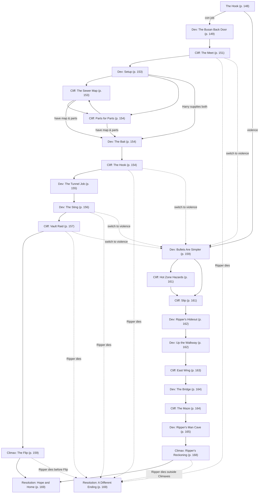

# M6: Ripping the Ripper

Book pages 146–169

Finale mission for the Forlorn Hope campaign.

## Contents

- [Beat Chart](<07 M6 Ripping the Ripper.md#beat-chart>) (p. 146)
- [Rumors](<07 M6 Ripping the Ripper.md#rumors>) (p. 147)
- [Background](<07 M6 Ripping the Ripper.md#background-read-aloud>) (p. 147)
- [The Rest of the Story](<07 M6 Ripping the Ripper.md#the-rest-of-the-story>) (p. 148)
- [The Setting](<07 M6 Ripping the Ripper.md#the-setting>) (p. 148)
- [The Opposition](<07 M6 Ripping the Ripper.md#the-opposition>) (p. 148)
- [The Hook](<07 M6 Ripping the Ripper.md#the-hook>) (p. 148)
- [Dev (The Busan Back Door)](<07 M6 Ripping the Ripper.md#dev-the-busan-back-door>) (p. 149)
- [Cliff (The Meet)](<07 M6 Ripping the Ripper.md#cliff-the-meet>) (p. 151)
- [Dev (Setup)](<07 M6 Ripping the Ripper.md#dev-setup>) (p. 153)
- [Cliff (The Sewer Map)](<07 M6 Ripping the Ripper.md#cliff-the-sewer-map>) (p. 153)
- [Cliff (Parts for Parts)](<07 M6 Ripping the Ripper.md#cliff-parts-for-parts>) (p. 154)
- [Dev (The Bait)](<07 M6 Ripping the Ripper.md#dev-the-bait>) (p. 154)
- [Cliff (The Hook)](<07 M6 Ripping the Ripper.md#cliff-the-hook>) (p. 154)
- [Dev (The Tunnel Job)](<07 M6 Ripping the Ripper.md#dev-the-tunnel-job>) (p. 155)
- [Dev (The Sting)](<07 M6 Ripping the Ripper.md#dev-the-sting>) (p. 156)
- [Cliff (Vault Raid)](<07 M6 Ripping the Ripper.md#cliff-vault-raid>) (p. 157)
- [Climax (The Flip)](<07 M6 Ripping the Ripper.md#climax-the-flip>) (p. 159)
- [Dev (Bullets Are Simpler)](<07 M6 Ripping the Ripper.md#dev-bullets-are-simpler>) (p. 159)
- [Cliff (Hot Zone Hazards)](<07 M6 Ripping the Ripper.md#cliff-hot-zone-hazards>) (p. 161)
- [Cliff (Slip)](<07 M6 Ripping the Ripper.md#cliff-slip>) (p. 161)
- [Dev (Ripper's Hideout)](<07 M6 Ripping the Ripper.md#dev-rippers-hideout>) (p. 162)
- [Dev (Up the Walkway)](<07 M6 Ripping the Ripper.md#dev-up-the-walkway>) (p. 162)
- [Cliff (East Wing)](<07 M6 Ripping the Ripper.md#cliff-east-wing>) (p. 163)
- [Dev (The Bridge)](<07 M6 Ripping the Ripper.md#dev-the-bridge>) (p. 164)
- [Cliff (The Maze)](<07 M6 Ripping the Ripper.md#cliff-the-maze>) (p. 164)
- [Dev (Ripper's Man Cave)](<07 M6 Ripping the Ripper.md#dev-rippers-man-cave>) (p. 165)
- [Climax (Ripper's Reckoning)](<07 M6 Ripping the Ripper.md#climax-rippers-reckoning>) (p. 168)
- [Resolution (A Different Ending)](<07 M6 Ripping the Ripper.md#resolution-a-different-ending>) (p. 169)
- [Resolution (Hope and Home)](<07 M6 Ripping the Ripper.md#resolution-hope-and-home>) (p. 169)
- [Congratulations!](<07 M6 Ripping the Ripper.md#congratulations>) (p. 169)
- [NPCs, Obstacles & NET Architectures](<07 M6 Ripping the Ripper.md#npcs-obstacles--net-architectures>) (p. 170)

---

*By Frances Stewart*

**Estimated play time:** 6 to 8 hours

---

## Beat Chart

**Flow summary:** Marianne and Harry identify Ripper — the Maelstrom scav boss who destroyed the old Forlorn Hope — and offer 4,000eb per Crew member for revenge. The Crew can run Harry's **Busan Back Door** con (Redline meet → setup → sewer map and cybertech bait → hook Ripper → tunnel sting → Rocklin vault raid → flip) or take the **Bullets Are Simpler** assault path through the Hot Zone to Ripper's Ashcroft Hotel fortress. Either path can hand off to the other mid-mission. Ripper's death before **The Flip**, or at any point outside the two Climax beats, triggers **A Different Ending**; success leads to **Hope and Home**.

**Branching notes:**

- **Violence is always an option.** Be ready for the Players to switch from the Busan Back Door to Bullets Are Simpler at any point (and vice versa).
- At **Dev (Setup)**, Harry may supply the sewer map, the cybertech parts, both, or neither — the Crew loops through **The Sewer Map** and **Parts for Parts** until both are secured.
- At **Dev (Bullets Are Simpler)**, optional **Hot Zone Hazards** add random danger before **Slip**.
- **If Ripper dies before The Flip** → [Resolution (A Different Ending)](<07 M6 Ripping the Ripper.md#resolution-a-different-ending>).
- **If Ripper dies at any point outside the Climaxes** → [Resolution (A Different Ending)](<07 M6 Ripping the Ripper.md#resolution-a-different-ending>).

---

### Rumors

| 1d6 | Rumor |
|-----|-------|
| 1 | Some say legendary grifter Harry the Shrimp has come out of retirement, making some people in power nervous. |
| 2 | The grand re-opening of The Forlorn Hope went off with a bang. Literally. Not only did the attendees represent a who's who of Night City edgerunners, but the staff and guests decimated an invading force of Red Chrome Legionnaires. |
| 3 | Insiders with Maelstrom say their leader, Warlock, is watching the scavver underboss, Ripper, for signs of disloyalty. He fears that Ripper might try to break away and form his own gang. |
| 4 | The Muses have been knocked out of the running for the Night City Wonderland Roller Derby League championship. Maybe as a result of too much partying and not enough practice? |
| 5 | Rocklin Augmentics insiders say their new Internal Agent represents a revolution in cyberware technology. Security-minded Techs, meanwhile, say it represents a major risk for early adopters. |
| 6 | The Hot Zone has shrunk by nearly 10 percent in the past three years. Current projections show it should be fully reclaimed by 2056. |

---

> **Background (Read Aloud)**
>
> Marianne calls you back to The Forlorn Hope during the day. Inside, Valence serves drinks to a few sunlight regulars while The Professor and Marianne chat with Harry the Shrimp over at the bar. None of the three wear cheerful smiles.
>
> "Thanks for coming," Marianne says, "I told you I had people looking into the attack on the old Hope. Harry's helping out, and she's gotten us a name."
>
> Harry flicks a file from her Agent onto the bar's video screen. A grimy, shave-headed man in black and red Maelstrom leathers appears, gesturing angrily at some skinny, exhausted people by a bombed-out building.
>
> "This lovely little scalawag," Harry says, "is Ripper. He commands Maelstrom's Hot Zone scav ops by riding herd on terrorized streetrats as they pick through the wreckage. He calls the poor things his Diggers."
>
> Marianne snarls and cracks her knuckles. The Professor pats her arm gently.
>
> "Ripper's an abusive, sadistic boss," Harry says. "And that's on top of the horrid Hot Zone working conditions that mangles and poisons. Makes the Maelstrom money, but there's a constant need for new labor, so he's always 'recruiting.' Last year, he'd set his eye on a band of squatters in the old Brookhaven Co-Op ruins."
>
> "4CW vets," Marianne growls. "With families. Just trying to carve out a space to live their lives."
>
> Harry nods. "Plenty of decent folk wind up on the street. Marianne and The Professor have a reputation for helping. When Ripper started putting pressure on the Brookhaven squatters, our favorite couple here worked with the Jodes to find them a new life down the road to the south. Ripper took it real personal-like. Witnesses overheard him ranting about revenge when he was into his cups at the Totentanz."
>
> Marianne glances across the room, watching Valence serve lunch to a customer.
>
> "When we helped out the Brookhaven folk, we also managed to rescue Valence. They were one of his 'diggers.' Weighed maybe seventy pounds, soaking wet. Skin so pale you could almost see through it. This fucking praying mantis works them until they're just another piece of wreckage littering the Hot Zone sidewalks."
>
> Harry nods in agreement, "He's triple-A trash, that's for sure. And he's the one who blew up the old Hope. I did some horse trading with David Ling Po, and he provided some security cam stills from a Vendit he owns in the area."
>
> Harry flicks the images up onto the screen: Ripper watching as a group of streetrats carry duffel bags into the sewer. Ripper holding what looks like a remote detonation device. Ripper pressing the button.
>
> "Time stamps on the stills match the explosion," Harry explains, "And the Vendit is only a few blocks north of the old Hope's location."
>
> "Now we know who," The Professor says, "And we know why."
>
> "All that's left," Marianne finishes his thought, "is revenge."

### The Rest of the Story

Ripper is a rancid stain your Crew can joyfully destroy. On top of supplying Maelstrom, he has two sidelines: diverting the best parts he finds in the Hot Zone to Rocklin Augmentics, and serial torture and murder. Marianne and The Professor want Ripper destroyed. Painfully, if at all possible. That's why they're willing to pay the Crew 4,000eb each to do the job. That's double the going rate for a gig this dangerous.

How the Edgerunners handle the job is up to them. A combat-heavy Crew can go directly to Ripper's hideout, while a streetwise, technical group can build an elaborate con. Harry and The Hope crew can offer guidance and even resources, but the Edgerunners should do the legwork.

### The Setting

Where the Crew travels depends on the route they take. If they choose to con Ripper, they'll begin with a visit to Redline, a modern gladiatorial arena, before eventually leading the bastard down into the sewers and to a secret Rocklin Augmentics warehouse.

If they decide to lay siege to Ripper's fortress, they'll need to find it in the Hot Zone before climbing to the top of a ruined hotel and into a den right out of a horror movie.

### The Opposition

- The man at the center of it all is **Ripper**, a cunning, sadistic asshole with a taste for power and pseudo-occult trappings. He's built his own little army in the Hot Zone made up of gangpressed Diggers and his "guard dog" **Skippy**, a heavily augmented, cyberpsychotic monster of a Maelstrom member.
- Ripper's headquarters is a rickety old hotel, damaged by the nuke of 2023 but still standing. Somehow. He's laced it with traps, just in case his Diggers get the bright idea to turn on him.
- On the con-job path, a member of the Crew might end up in a free-form brawling contest against one of the **Wild Things**, the gladiatorial gang operating out of Redline.
- On the con job path, depending on how things go, the Crew might find themselves briefly dealing with **Rocklin Augmentics security guards**.

### The Hook

Marianne and The Professor fall silent as Harry takes full control of the meeting.

"Here's the skinny. I 'borrowed' this from Danger Gal."

Harry transfers a dossier on Ripper (see pg. 149) to the Edgerunners' Agents.

"Something Danger Gal's dossier doesn't mention is Ripper's habit of skimming from the top. He takes the best tech his Diggers find in the Hot Zone and sells it direct to Rocklin Augmentics. I don't have solid proof, though, or I'd take it to the Maelstrom's boss, Warlock, and let gang politics take care of the rest."

Marianne leans in, "We want revenge, but not at the cost of losing the new Hope. We called in all our favors to get our home rebuilt. Cashed in all our chips."

The Professor tilts his head in agreement, "Whatever you do, the trail can't lead back here."

"The way I see it," Harry says, "you've got two options. First, you could flatline him. Doing the deed outside the Hot Zone risks you being seen, and someone might connect the dots between you and The Forlorn Hope.

"Inside the Hot Zone, though? There's only Ripper and his Diggers. No one there's gonna rat you out to Maelstrom. The other option? A little poetic justice. I can teach you a sweet con called the Busan Back Door. You exploit his greed and get his pals over at Rocklin to pull the trigger for us. Both are good and this is your gig. Play to your strengths."

Give the Players time to discuss the strengths and weaknesses of each path before prompting them to make a decision.

- If they want to run the con, **Go to:** [Dev (The Busan Back Door)](<07 M6 Ripping the Ripper.md#dev-the-busan-back-door>)
- If they want to siege Ripper's base, **Go to:** [Dev (Bullets Are Simpler)](<07 M6 Ripping the Ripper.md#dev-bullets-are-simpler>)

### Dev (The Busan Back Door)

The Busan Back Door, Harry explains, might seem complicated for a standard Edgerunner plan, but it is simple for a con since it doesn't require a "long-term hook." In the plan, the Crew sells Ripper on a "lost" cache of pre-4CW cybertech and tricks him into robbing a Rocklin Augmentics facility. This puts Ripper on the outs with both of his employers. Rocklin will hunt him down for the betrayal, while Maelstrom will kill him for bringing a Megacorp's wrath down upon them without sanction. Harry goes through the steps, one by one, with the Crew.

"One of you takes on the role of an Exec who manages construction crews for Jack Skorkowsky. He owes me a favor, so he'll agree to help. Besides, he loves The Hope, so I'm sure he'll even put up a fake profile for you on his Garden Patch."

"The story behind the con is simple. While demolishing an old building in the Upper Marina, a construction foreman found a broken old truck in the rubble with a dead driver inside. Probably died courtesy of the nuke. Besides the corpse, the foreman found two things of note. A crate full of old cybertech and a work order, telling the driver to pick up said crate from an underground warehouse at an address now located in the Hot Zone."

"The foreman came to you. You investigated, worked out a route to the underground warehouse address, and decided to cut Jack out of the action … but you don't know the first thing about salvage, so you need a partner with experience to help you."

> **Infobox: Ripper — Danger Gal Dossier**
>
> Ripper rose to leadership when Maelstrom's scavver army needed a full-time organizer. Of all gang leader Warlock's decisions, this is the one most likely to bite him.
>
> Ripper was a typical street enforcer with a good rep and gang underboss Quake sponsored him for this role. As an enforcer under Quake, Ripper's sadism pointed outward: disemboweling Inquisitors, slicing parts off deadbeats, dragging traitors behind his van for a "chat." But his new job, herding disposable streetrats to work in radioactive deathtraps, offers even better opportunities for cruelty.
>
> Ripper entices his scavvers, whom he names Diggers, with the chance to earn membership in the Maelstrom. And they might — maybe one in twenty survive and graduate to the big leagues. As for the rest, some resurface on The Street or elsewhere, but a frightening number (and higher than Ripper reports to Warlock) journey into the Hot Zone and never come out. Even the "winners" bear scars. Ripper's developed pseudo-mystical "Tests," rituals for Diggers on the cusp of graduating.
>
> Ripper makes Maelstrom bank, and Quake likes how Ripper's wannabe gangers idolize him. But his trail of cast-off corpses might sink the gang one day. Or Ripper might decide he's better off making all the decisions, take his Diggers, and split off to form his own gang.
>
> *Prepared by Linda "Overpass" Lucastra (undercover at the Totentanz)*

"Of course, the trick is, since it doesn't exist, you won't be leading Ripper to a lost cache. You'll be leading him to an off-the-books facility where Rocklin Augmentics reverse-engineers cybertech from other Corps. Don't ask how I know about it."

"Anyway, you either trap him there or make sure he's spotted on camera. Either way, it'll look to Rocklin like their Hot Zone seller is betraying them."

#### Step One: The Meet

First, the Edgerunners must catch Ripper's attention so a later call for help feels natural. Harry suggests bumping into Ripper at the Redline, a gladiatorial combat bar in Watson he visits regularly.

"He likes booze, drugs, violence, and talking about himself. Get his number and make enough of an impression that he'll take your calls later. Think carefully about who you introduce and when.

"Having people in reserve can help later, but surprise appearances can spook your mark. Keep your stories consistent, too — one slip can blow the whole thing."

#### Step Two: The Hook

Next, the Crew introduces the bait. They call Ripper with the opportunity and arrange a meeting to show Ripper proof and to make a plan for retrieving the stash.

"Meet at an office so you can control access. Gather some quality cybertech and offer it to Ripper as proof and as a gesture of good faith. After all, it's nothing compared to what's still in that warehouse, eh? Make him dream about his piece of it.

"Be cagey about the location of the stash. He'll expect you to keep it to yourself. Otherwise, he'd be able to go there himself and cut you out of the deal. He'll expect you to think like him."

#### Step Three: The Sting

Next, the Crew leads Ripper on a baffling route through tunnels under the city until he has no hope of knowing where he is. Once Ripper's Diggers break through the wall into the Rocklin Augmentics depot, the Crew needs to make a decision.

"You either need to trap Ripper and alert Rocklin security so they take him out, or you need to make sure he, and only he, gets caught on camera so the suits know they've been betrayed and drop the hammer on him later. You make the call when you're there based on the facts on the ground. Or under the ground, in this case."

#### Con Job Jobs

In a con like this, each Crew member should play a part and get a few moments to shine in the sun. The following is a list of possible parts an Edgerunner might play in the Busan Back Door.

A DV13 Wardrobe & Style Check gives the Crew info they need on how to dress the part, though they still might need to buy the actual clothes.

Remember, the Edgerunners don't need to be these parts in "real life;" they just need to know how to play them convincingly for the con.

- **The Boss:** Someone has to take on the part of the Boss: a construction Exec working for real estate agent Jack Skorkowsky. Anyone playing this part should buy an outfit that straddles the line between "nice" and "too nice." Urban Flash or Leisurewear with a hint of "mob connections" works better in this circumstance than Businesswear.
- **The Assistant:** Every good boss has an Assistant nearby to take notes, fulfill requests, and make them look important. The assistant might also have the air of an undercover bodyguard. Businesswear works best for this.
- **The Hustle:** The Boss might bring along hired muscle to any part of the job. It works best if the hired muscle fits the boss's cover story. Perhaps a 4CW veteran or underground fighter working construction but moonlighting as a legbreaker. Leisurewear and Nomad Leathers both work for this role.
- **The Guide:** The Guide is someone brought in by the boss who can lead the way through the tunnels. They might be a Night City maintenance worker or a Ziggurat repair technician. Either way, they're on this job to earn extra cash. Gang Colors work here, with the "gang" in question being the guide's regular employer.
- **The Expert:** The Boss might bring in an Expert to evaluate the cybertech and provide an informed opinion on what to take and what to leave behind. Leisurewear, Generic Chic, and Bohemian all make good fashion choices here.
- **Backup:** Other Crew members can hang back, ready to rush to the rescue if things go wrong. Backup isn't the most active or exciting part of a con, so the GM should feel free to toss obstacles their way. Maybe someone throws up on their shoes as they watch the boss from across the room during the Meet. Maybe they fall behind and get lost in the tunnels during the Sting. Anything's possible in Night City.

> **Infobox: Maelstrom (DV9)**
>
> A combat gang with some serious history in Night City. Maelstrom believes in the virtues of chrome with a zealous, almost religious fervor. Over the years, they've absorbed the remnants of a dozen other gangs, often defeating them in battle before inducting the survivors.
>
> Maelstrom operates out of the Totentanz, a metal bar on the edge of the Hot Zone. They're led by Warlock, who has guided them into power as one of Night City's biggest dealers in drugs and salvaged tech.

> **Infobox: Rocklin Augmentics (DV13)**
>
> Originally a prosthetic manufacturer, Rocklin Augmentics bet hard on cyberware following the ascension of current CEO Jacinda Hidalgo. They are known for their cutting-edge design, eschewing the organic for the artificial in both form and function. Rocklin Augmentics has also become known for pushing the limits on cyberware and rumors abound about boundary-pushing transhumanist designs secretly in development in heavily guarded labs.

> **Infobox: The Hot Zone (DV9)**
>
> The geographical center of Night City, the Hot Zone also used to be its center of power. Then a nuke blew it up, devastating the area and destroying the Corporate skyscrapers planted there like a lumberjack cutting down a giant metal tree.
>
> Today, it is a haunted landscape of wrecked, twisted buildings, burnt-out vehicles, and entombed bodies. Scavvers abound, digging through the destruction in hopes of earning a few ebs.

Once the Crew have assigned the jobs for the con and worked out the basics of their plan, **Go to:** [Cliff (The Meet)](<07 M6 Ripping the Ripper.md#cliff-the-meet>)

#### Switching Tracks

This mission presents two paths: the Busan Back Door and Bullets Are Simpler. These paths are modular. You can spice things up, rearrange, interchange, or mix freely to fit your Crew's tastes and actions.

There's enough flex in the midway Beats to move from the Busan track onto the Bullets track or vice versa if needed. If the Crew couldn't convince Ripper to take the deal? Load up for bear and go hunt him down in the Hot Zone. Similarly, they may discover Ripper's fortress is too well guarded and nope out before switching to the con.

#### Content Warnings

This Mission is stuffed full of body horror and cruel exploitation. For some Players, the intense descriptions of Ripper's experiments and treatment of the Diggers might twist the stomach too far and ruin the fun. We recommend you talk to your Players, work out what their comfort level is, and adjust accordingly.

Remember, this is a game and it should be fun for everyone playing.

### Cliff (The Meet)

**Who should attend:** The Boss is the only requirement. The Assistant and Hustle coming along makes sense. Anyone else should be out of sight and only present as backup.

Wannabes strut and brawl in the streets outside the Redline, some with skill, others with drunken bravado. Bouncers built like forklifts keep belligerents from entering the bar proper. You go to the Slammer for brawls. You come to the Redline for gladiatorial combat. The bar lighting is dim with most emanating from screens showing off the action in the arena. Ripper and his cronies are too cheap to spring for a private booth so they're cheering from a table upstairs, right next to the barricades. Close enough to the edge to smell blood.

> **Infobox: Redline (DV15)**
>
> A bar with a reputation of hosting the best live fighting events in Night City. The entire bar is built around the fighting pit, where gladiators duke it out for the entertainment of the crowds. Officially, all fights are to the knockout but rumors suggest the Redline hosts private, monthly death matches. The house fighters are all members of the Wild Things, a boostergang that survived the Time of the Red by channeling their megaviolent impulses into bloodsport. Jenny Nails is both the leader of the Wild Things and the owner of Redline.

Ripper's a loudmouthed braggart with enough rep and swagger to impress those who don't know any better. He's snagged a table near the barricades on the top floor, overlooking the arena. Around him are several hangers-on, soaking up his stories about life at the "top of the Maelstrom heap."

He talks over any conversation unless it's about him or something he's excited about. "You know the Maelstrom, choomba? I'm big-time. They all look up to Ripper! I get 'em all their chrome!"

The point of this part of the con isn't to sell Ripper on anything but to make contact and set the stage for later. To stick in Ripper's drug-addled brain, the Crew must succeed at impressing him three times. Two of those times can be simple Social Checks — Conversation or Persuasion against his Human Perception, for example. He responds well to compliments, philosophical ramblings about weird occult shit, talks about the fight below, and the possibility of sex. He responds poorly to people who act superior to him.

The third task to impress Ripper should involve a grand gesture. Just what said gesture is depends on the Players, but some possibilities include:

- A member of the Crew winning a fight in the arena. It is an "open fight" night; anyone can sign up to battle a Wild Things gladiator. Fights in the arena are melee only. No firearms allowed. Implanted armor is fine, but worn armor is not. The battle ends when the first combatant hits the Seriously Wounded Wound State.
- Buying Ripper and his hangers-on a round of drinks. The total number is up to the GM but drinks are 10eb (Cheap) per glass purchased.
- Beating Ripper in a drinking contest with opposed Resist Torture/Drug Checks.
- Or moving the party to a private booth on the first level. This requires a DV13 Bribery Check and a payout of 500eb (Expensive).
- A Netrunner might dig into the Redline's Service NET Architecture (see pg. 174) to help them perform some of these tasks on the cheap.

Knowing if Ripper is impressed enough to do business later requires a DV13 Human Perception Check. If the Crew hasn't performed three tasks yet, just tell them "You're not sure he'll remember you in the morning. Better keep it up." If they've completed two tasks but not the grand gesture, tell them, "You've established a rapport, but you need to do something big to stick in his mind when he sobers up."

Once they've completed all three tasks, Ripper suggests exchanging numbers. He's cunning enough, even when smashed, to avoid carrying an Agent and gives the digits to one of his burner phones.

**Go to:** [Dev (Setup)](<07 M6 Ripping the Ripper.md#dev-setup>)

#### Ripped Ripper

Remember, drugs alter STATs and Skills, and Ripper can be on (or coming off of) any combo you want at any time. Ripper on Blue Glass and Smash is easier to deal with than Ripper on Boost and Synthcoke. Ripper taking Synthcoke to come down off of Black Lace could be a nightmare. Adjust the mix to personalize the challenge to your table.

#### Flash of Luck

The Flash of Luck rules (see pg. 186) were specifically designed to facilitate playing out heists and cons just like the Busan Back Door. Remind your Players the rules exist!

### Dev (Setup)

Cons are slippery and hard to plan. From here on out, the Busan Back Door Beats help you chart a satisfying course rather than giving explicit scenes or directions. Be prepared to improvise, and expect (and prompt) your Players to do so as well.

After the Crew hooks Ripper, Harry gathers them to prepare the actual con. Success in the Busan Back Door hinges on acquiring two physical elements:

- A map of the Night City utility tunnels in the Upper Marina to plan the route and ensure Ripper gets nice and lost. To obtain them, **Go to:** [Cliff (The Sewer Map)](<07 M6 Ripping the Ripper.md#cliff-the-sewer-map>)
- Some pre-war cybertech to fully hook him on the existence of the stash. To obtain them, **Go to:** [Cliff (Parts for Parts)](<07 M6 Ripping the Ripper.md#cliff-parts-for-parts>)

It's now time to pull it all together. If you want to keep things simple and move the action along, have Harry supply the Crew with one or both of the elements needed. If she provides only one, **Go to:** [Cliff (The Sewer Map)](<07 M6 Ripping the Ripper.md#cliff-the-sewer-map>) or [Cliff (Parts for Parts)](<07 M6 Ripping the Ripper.md#cliff-parts-for-parts>) as needed. If she provides both, **Go to:** [Dev (The Bait)](<07 M6 Ripping the Ripper.md#dev-the-bait>)

### Cliff (The Sewer Map)

Ripper knows the Hot Zone well, including the tunnels below, so convincing him he's traveling under the radioactive ruins of the old Corporate Center won't be easy. The Crew must obfuscate the route as they travel. To do so, they'll need the most solid information possible, which means obtaining a current map.

The best source for a map is Ziggurat (see CP:R pg. 280), since their CitiNet spans most of the metropolitan area and most of the cables run underground through the sewer system. Luckily, Ziggurat service teams carry Agents with maps preloaded. It isn't too hard to lure a service team out. In fact, a DV13 Streetwise Check suggests a plan: drop down a manhole, find a cable, damage it, and wait. The wait time, and what security shows up with the team, depends on where the cable is. A DV15 Streetwise or appropriate Local Expert Check will reveal details.

- **Rebuilding Urban Zones:** A Ziggurat team arrives in a service van (see pg. 175) within three hours. The team consists of 2 Ziggurat Technicians (see pg. 170) and 2 Corporate Guards (see pg. 170). Complicating matters, a patrol car (see pg. 175) with 2 NCPD Officers (see pg. 170) shows up to provide assistance, direct traffic, and call for backup if needed.
- **Overpacked Suburbs:** A Ziggurat team arrives in an armored service van (see pg. 175) within twenty-four hours. The team consists of 2 Ziggurat Technicians and 3 Corporate Guards.
- **Combat Zones:** A Ziggurat team shows up in an armored service AV (see pg. 175) within three days. The team consists of 2 Ziggurat Technicians, and 1 Corporate Guard per Edgerunner.
- **Exec Zone and Hot Zone:** Not viable for opposite reasons. The Exec Zone is too well guarded, while the Hot Zone isn't connected at all.

The Ziggurat Technicians are equipped with Excellent Quality Agents. An Edgerunner can use a Breacher (see pg. 179) to hack a Ziggurat Tech's Agent remotely and steal the file. Otherwise, the Crew needs to grab one and crack it physically with a DV17 Electronics/Security Tech Check and four hours of work.

If Crew can't do the job, Backhand, The Hope's in-house Tech, is a deft hand at hacking Agents.

Neither the technicians nor the guards want to give their lives for this job. They'll seek a way to retreat the moment they come under fire. Convincing them to surrender is possible with a strong Social Skill Check. If there are no guards (or cops) to protect them, the technicians will surrender the Agent (and even bypass the security) without a Check.

If the Crew is prepping for the job and doesn't have the parts yet, **Go to:** [Cliff (Parts for Parts)](<07 M6 Ripping the Ripper.md#cliff-parts-for-parts>). Otherwise, **Go to:** [Dev (The Bait)](<07 M6 Ripping the Ripper.md#dev-the-bait>)

#### Flexibility

We only have so many pages for this mission, and your Crew might devise a plan not covered here. For example, they may pursue the Rocklin Augmentics angle, digging for the dirt they need to turn Maelstrom against Ripper. If that's the case, be ready to repurpose the elements presented in this mission. Here are two examples of how to do it.

The Crew might decide to use a classic undercover cop trick and set up a "buy." They'd follow the con track, but instead of dangling a hidden cache in front of him, they'd arrange to buy some choice salvage (without Maelstrom's permission). Transform the steps involving sewer maps and cyberware parts into planting credentials in a server and acquiring proper identification. Ripper's a brute but he's smart enough to do a basic background check. Then, let them record the whole buy and turn the evidence over to Warlock.

Alternatively, the Crew might opt to dig up evidence instead of creating it. The files they need could be in the secret Rocklin Augmentics warehouse. In which case, the sewer crawl turns into a challenge of navigation instead of subterfuge. Alternatively, the files could be in Ripper's tower, leading the Crew to wait until he's at the Redline before sneaking/fighting their way in.

Don't be afraid to change things up and adapt the elements of this mission to follow the path your Players lead you on. The story belongs to the whole table, after all.

### Cliff (Parts for Parts)

The Edgerunners are selling Ripper a story of lost cybertech, so they need to show him convincing examples from the crate mentioned in the con's cover story. Harry happens to know that Mister Kernaghan (see CP:R pg. 305) owns a sealed crate of optical sensors, myomar fibers, and neural subprocessors, complete with 2022 customs tags and she knows exactly what he'll trade it for.

Mister Kernaghan wants someone to steal an all-original power plant for a Cometa, one of the first racing AVs ever built. Only two flyable examples exist in the world, and Kernaghan owns one of the two. If he gets this engine, he will own the only flyable example. The other's engine is trashed and awaiting this replacement.

The Crew can use bribes, favors, or misdirection to get into the Heywood Industrial District port and drive the container out, or they can hijack its transport as it travels from the port to a small airport out in the Badlands, where a cargo copter awaits to transport it to Seattle. The transport team has a Driver (see pg. 171), a Heavy Corporate Guard (see pg. 171), and 1 Corporate Guard (see pg. 170) per 2 Edgerunners in the Crew. They're driving an Armored Semi-Truck (see pg. 175). The Crew can intercept it anywhere between the port and the airport. If needed, use the Chase rules (see pg. 180) to run the scene.

If the Crew is prepping for the job and doesn't have the sewer map yet, **Go to:** [Cliff (The Sewer Map)](<07 M6 Ripping the Ripper.md#cliff-the-sewer-map>). Otherwise, **Go to:** [Dev (The Bait)](<07 M6 Ripping the Ripper.md#dev-the-bait>)

### Dev (The Bait)

Now it's time to draw Ripper in. A few days after the Meet, the Edgerunner playing the Boss should give him a call, feed him the story, and arrange a get together.

The story: The Boss has the intel. Can Ripper supply the muscle and expertise to move and sell the goods? Ask the Edgerunner doing the talking for a DV9 Conversation Check just to be sure they've got Ripper salivating. If they ask, Harry is happy to give them tips.

"Add in some construction yard background noise to prove you're legit and calling from a site. Anything you can do to sell the illusion is important. Once you've laid out the plan, rev up his excitement. Talk about when you get the goods, not if. Get him dreaming about what he plans to do with his share of the take."

**Go to:** [Cliff (The Hook)](<07 M6 Ripping the Ripper.md#cliff-the-hook>)

### Cliff (The Hook)

**Who should attend:** The Boss must be present. The Assistant, Hustle, Guide, and Expert can logically attend. Backup should be out of sight.

Harry arranges for the Crew to take over an empty but furnished office in an Upper Marina building for a few hours. If they want to take some time and spruce the place up, ask for appropriate Checks based on their ideas. The obvious thing missing would be various accoutrements indicating the office is part of the Jack Skorkowsky Real Estate family. A Fixer can acquire signs and stationary using Operator. A crafty Edgerunner can fake them up with a DV13 Forgery Check. Someone might think of calling Jack and asking to borrow some decorations, requiring a DV9 Persuasion Check if they're on good terms or a DV13 Check if they aren't. A DV13 Bureaucracy or Business Check will help order the office to make it seem more "lived in." Your Players might come up with other ideas. Reward them for being creative!

Ripper (see pg. 172 or 173) comes to the meeting sober and impatient. A block from the meeting, he drops off 1 Digger Guard (see pg. 171) per Edgerunner present who he can call quickly if the deal goes sideways. They follow at a distance, then skulk outside.

Once inside, Ripper demands introductions to anyone he doesn't know. When they get down to business, he asks aggressive questions. How big a haul? Why him? How does he know this isn't a scam? He demands ninety percent of the take since he's "taking all the risks," but gets suspicious unless the Crew bargains hard to lower that number to something more reasonable.

The Crew must succeed at two Checks. The first is the Bargain, an opposed Trading Check to haggle with Ripper. Without it, there's no chance of him buying this as a "real job." Second, the Sell, an opposed Acting or Persuasion Check against Ripper's Human Perception to convince him everything is legit.

Give the Crew a +1 (up to a +3) to all Checks made as part of the Bargain and the Sell for each task performed to disguise the office and make the setting more convincing.

If the Crew can't convince Ripper, at best, he walks away angry. At worst, he sends a silent signal, and his Diggers burst in to help him beat answers out of the Edgerunners. Improvise depending on how the scene goes down. Either way, the con goes out the window. The Crew may end up ending Ripper right here. If so, **Go to:** [Resolution (A Different Ending)](<07 M6 Ripping the Ripper.md#resolution-a-different-ending>). Otherwise, the Crew might devise a new plan (see Flexibility) or strike Ripper at his home in the Hot Zone, in which case **Go to:** [Dev (Bullets Are Simpler)](<07 M6 Ripping the Ripper.md#dev-bullets-are-simpler>).

If they succeed, **Go to:** [Dev (The Tunnel Job)](<07 M6 Ripping the Ripper.md#dev-the-tunnel-job>)

### Dev (The Tunnel Job)

Once Ripper's firmly on board, the time comes to finish the con. Harry meets with the Crew in a private room in The Forlorn Hope to go over the plan one last time.

Harry's located a broken-down building with sewer access in the Upper Marina, near the Hot Zone border. From that entry point, the complicated series of switchbacks planned by the Crew using the Ziggurat sewer maps feels like it leads ahead into the Hot Zone but actually twists back on itself to a building in the Upper Marina where Rocklin performs under-the-table "competitive research" on the cyberware of other Corporations. This means there's no Rocklin Augmentics branding on-site to give the job away.

"I've hired some bodies in coveralls to pretend to be Jack's construction crew, move random shit around, and measure things around the entry building we picked out," Harry explains. "Look for the fella with the clipboard and pretend to bribe him before going down the tunnel. That'll sell things.

"Don't worry. They're trustworthy enough for this gig.

"Remember, Ripper knows his turf. If he pays too much attention, he might realize you're going in the wrong direction. Divert his attention from the route. Distract him at the turns and intersections with questions or suggestions or warnings."

Harry also warns the Crew to be careful with Ripper's Diggers.

"The poor bastards are bound to Ripper by fear and not loyalty, so give them as little reason to dislike you as you can manage. When the time comes to run, it's best to have as many people running and as few people shooting at you as you can manage."

The goal of this final step is for Rocklin Augmentics to catch Ripper in the act of breaking into their facility. Rocklin has on-site surveillance and security, but it's important to get Ripper inside where the cameras can see his face.

Rocklin security will hit the scene in minutes once the first person enters the storeroom. An enterprising Netrunner can infiltrate the facility's NET Architecture ahead of time to further tilt things in the Crew's favor.

"Ideally, Rocklin security takes him off the board, but don't hang about. Get him filling his pockets, then make yourselves scarce. If he follows you back into the tunnels, this could turn into a gunfight."

This is the last chance for the Crew to pick up supplies or make preparations before things go down.

**Go to:** [Dev (The Sting)](<07 M6 Ripping the Ripper.md#dev-the-sting>)

#### Working for Rocklin

What happens if one of the Edgerunners is an Exec working for Rocklin Augmentics? Well, that's up to them. Removing Ripper from play means causing disruptions in the Neocorp's supply chain. The Exec needs to decide if this is something that they're good with or if they want to advance their career by betraying the Crew and The Forlorn Hope.

Assuming they go along with the plan, their inside knowledge might be helpful. The facility is top secret, so they likely won't know about it. Still, some sleuthing work (with appropriate Skill Checks) could score useful details or even the password for the NET Architecture, allowing a Netrunner to automatically succeed on an Interface Check against it.

### Dev (The Sting)

Harry's hirelings are already present, pretending to work as part of a Jack Skorkowsky construction crew, when you pull up to the broken-down building in the Upper Marina. They play the part well, calling out greetings to their "boss" as you walk up.

Ripper, meanwhile, rolls up ten minutes late, red-eyed, and with that special flavor of twitchy that suggests multiple drugs are tipping his mood in different directions. He hops out, slaps the side of his box truck, and opens the rear door. A group of scrawny, unwashed, desperate-looking streetrats clutching empty industrial carryalls hop out.

"C'mon, move your asses!" Ripper yells. "I picked you 'cuz you said you could work!"

"Okay," he says to you. "Time to go get rich, yeah?"

There is 1 Digger Worker (see pg. 171) per Edgerunner present. They cluster together and don't talk to outsiders. They don't even make eye contact. After receiving "a bribe," the fake worker with the clipboard leads the Crew and Ripper and his Diggers to the sewer entrance in the rubble. Ripper follows the Edgerunners into the dark with an LED headband lighting his way. He splits his time between watching them like a hawk, pushing his workers along, and bragging about his success with Maelstrom.

"I got hundreds like these losers crawling the Hot Zone and digging all day. They fuckin' worship me. Warlock relies on me to chrome the gang up. Every 'ware you see in someone wearing Maelstrom colors, I probably dug up the parts!"

After about five minutes of traveling, Agents lose signal due to being underground. They can no longer act as communication devices or connect to the CitiNet.

#### Tunnels and Trolling

One of Ripper's few talents is navigating the Hot Zone's tangled wreckage. He pays attention at intersections, scanning for landmarks, and glances back along the route as if fixing it in his mind. He may also notice inconsistencies: a Ziggurat logo on a junction box or working power cables in "abandoned" tunnels, for example. The con needs him lost and ignorant.

Give the Crew five opportunities to conceal signs/move markers or confuse Ripper with Skill Checks against his Concentration. The same trick won't work twice, so Players need to be creative. Fake an injury. Debate Ripper on cyberware brands. Shoot a rat. Distract him and the Diggers while another Edgerunner paints over a sign. Encourage the Players to be creative.

If the Edgerunners fail two distraction Checks, Ripper realizes something's up. Soothing him requires an Acting or Persuasion Check against his Human Perception Skill. "Get in my face down here again, the rats'll be cleaning up what's left of you, butthead!" After this, Edgerunners make any further distraction Checks with a -2 penalty.

If they fail a third Check, Ripper pulls his rifle and starts shooting. His Diggers draw pistols or machetes and attack as well. Things turn into a firefight in the tunnels. Ripper will only fight until he takes damage, at which point he runs, leaving the Diggers behind to keep the Crew busy. Unless convinced otherwise by an appropriate DV17 Social Skill Check, the Diggers fight to the death. They're more frightened of Ripper than they are of pain or dying.

If things go south and the Crew ends Ripper here, **Go to:** [Resolution (A Different Ending)](<07 M6 Ripping the Ripper.md#resolution-a-different-ending>). Otherwise, the Crew might devise a new plan (see Flexibility) or strike Ripper at his home in the Hot Zone, in which case **Go to:** [Dev (Bullets Are Simpler)](<07 M6 Ripping the Ripper.md#dev-bullets-are-simpler>).

If they succeed, **Go to:** [Cliff (Vault Raid)](<07 M6 Ripping the Ripper.md#cliff-vault-raid>)

### Cliff (Vault Raid)

The underground route ends in a utility tunnel. About 10 m/yds down the wall is a spot adjoining Rocklin's basement. Once the Crew points this out, Ripper directs his Diggers to attack the concrete with cutters, drills, hammers, and bare hands, chewing through a couple of feet of cement and rebar.

After five minutes, the hole opened by the workers is big enough for a Netrunner to connect to the Warehouse's NET Architecture (see pg. 174). At that point, they can attempt to hack it to seize control, alert security, or ensure the cameras fixate on Ripper and no one else.

After ten minutes, the diggers open a hole large enough for people to squeeze through.

The storeroom on the other side of the hole is clean, orderly, and lacking in illumination. A musty smell, typical of underground concrete structures hangs in the air. The darkness and silence are so thick you can almost feel them pressing up against your skin.

The hole came through a clear space between parts bins that line most of the walls and sit on free-standing shelves. Each bin is labeled with words like Microswitches, Howell Capacitors, Magnetolubricant Pumps, Firefoam Extruders, and the like.

**Map key:** Hole leading to sewers · Camera

#### Ripper's 11th Hour

Ripper is dangerous and cunning but not smart enough to question the lack of dust. If his Diggers notice, they're too frightened of him to speak up. Ripper sends half of them inside, then demands to know what parts they're finding.

"It's lots, Ripper! All kinds! Whole warehouse of stuff!"

If Ripper noticed any of the Crew's distractions earlier or is otherwise nervous or suspicious, an Edgerunner may have to go in and drag out a fistful of components to kick-start his greed and lure him inside. Otherwise, he goes readily. But he also calls on the Crew to enter and help and grows suspicious if they hang back, so they must mislead, evade, or trap him somehow to facilitate their own escape. Feel free to tempt your Players to linger — they can fit 500eb (Expensive) worth of parts in a single carryall. Stuffing a container full takes one minute's time.

#### That's Your Cue

Unless hacked to do otherwise, the observation camera (which uses Low Light/Infrared/UV to see in the dark) covers the door of the storeroom. Noticing it requires a DV17 Perception Check — with any penalties due to the darkness of the room applicable. At the end of every minute Ripper spends inside the storeroom, roll 1d10. On an even result, he steps in front of the camera, and it records him. On an odd result, he does not. If a Netrunner has control over the camera, they can point it at Ripper at any time.

Either way, at least one of Ripper's diggers steps in front of the camera roughly one minute after entering the storeroom, alerting the Demon in the NET Architecture. It triggers the silent alarm, alerting the security team in the building above. They, in turn, contact a Rocklin Augmentics Rapid Response Squad, who, three minutes later, arrive and assault the storeroom. The Crew needs to decide if they'll set Ripper up to encounter the Rocklin squad or if simply recording his face on camera is enough.

If a Netrunner controls the Silent Alarm Control Node in the NET Architecture, they'll see an ETA about the arrival of the Rocklin Augmentics team in their Virtuality HUD. Otherwise, ask for a DV13 Bureaucracy or Tactics Check from the Players. With a success, they know they have anywhere from three to five minutes before security charges in.

**Go to:** [Climax (The Flip)](<07 M6 Ripping the Ripper.md#climax-the-flip>)

### Climax (The Flip)

Once Ripper's fully engaged in looting, he pays little attention to the Crew. Instead, he moves around the room, ordering his Diggers to empty specific boxes and containers into the industrial carryalls. More than once, he crows about needing to come back because "there's so damn much!"

If an Edgerunner tries to slip out, ask them to make a Stealth Check against Ripper's Perception. If he notices, he'll ask why they're leaving. His greed is overriding his common sense, so give Ripper a -2 to his opposed Human Perception Check if they feed him a lie.

If the Crew decides to seal Ripper inside the storeroom, it isn't hard. They'll need to succeed at a DV15 Demolitions Check in order to attach a single Armor-Piercing Grenade (or similar device) to the hole and rig it for remote detonation. With a success, they'll collapse the hole and trap anyone still in the vault on the other side. Failing the Demolitions Check (or just chucking a grenade) seals the hole but partially collapses the tunnel. Escape is still possible for the Crew, but they each take 4d6 damage (reduced by armor, which ablates) due to being clipped by falling debris.

At the end of three minutes, a squad of 6 Heavy Corporate Guards (see pg. 171) assemble outside the storeroom door. They won't identify themselves or demand surrender. They'll pop open the door, throw in three flash-bangs, and then stream inside with the goal of incapacitating or killing any intruders. Ripper's Diggers shoot back and fight to the death if the Crew hasn't persuaded them to flee. They're more afraid of Ripper than of dying.

Ripper, on the other hand, is a wild card. He cares only about himself. He throws anyone he can between himself and danger and runs the second he thinks he's losing. He's also vengeful. He'll take a shot at anyone he thinks betrayed him on the way out.

The Rocklin Augmentics guards won't pursue people far into the maze of sewer tunnels. Edgerunners who escape the warehouse can follow the map and reach the city above in safety. If Ripper manages to escape, he'll also vanish into the sewers. He values survival over immediate revenge.

Assuming all goes to plan, Ripper's done for. If he's captured, Rocklin Augmentics "disappears" him. If he's caught on camera with his hands in the Corporate cookie jar, the Neocorp hunts him, causing disruptions to Maelstrom operations. At that point, it is a question of who flatlines him first: Rocklin Augmentics or Maelstrom's leader, Warlock.

Even if Ripper escapes somehow, he's burned with both his former employers, leaving him completely alone. Both groups seek his death. In that case, he may decide to attack the Crew (if he can figure out who they actually were), but odds are he grabs what little cash he can and runs for the hills.

**Go to:** [Resolution (Hope and Home)](<07 M6 Ripping the Ripper.md#resolution-hope-and-home>)

### Dev (Bullets Are Simpler)

Marianne sets the Crew up with Valence, the young server who she and The Professor rescued from Ripper's clutches. They promise to lead them to his hideout in the Hot Zone.

"Gonna want masks," Valence says. "You don't wanna breathe the dust-loads of rads. We can take tunnels for sommathe trip, not all. Up ground, there's lotta jaggy crap. Even monowire fiber dust, some places. Wear good boots."

Any armor SP7 or higher meets the "good boots" standard.

She gives Marianne a full gear checklist: anti-smog masks, duct tape, flashlights, and radio communicators (Agent and cell service is spotty), which The Hope supplies as needed. Valence laughs at anyone who suggests rad suits. "We ain't never had those."

Marianne can source rad suits at 500eb (Expensive) apiece. They will protect the Crew from radiation so long as they aren't damaged. If an Edgerunner takes enough damage to ablate their armor, the rad suit becomes worthless.

The next morning, the Edgerunners meet Valence at a service tunnel entrance on the border between Little China and the Hot Zone. The former Digger leads the Crew down a ladder and through a series of poorly maintained, sometimes partially collapsed tunnels. After nearly half an hour, they enter a basement kitchen, its floor distinctly tilted.

If anyone asks why they don't just march into the Hot Zone, Valence says, "Don't wanna die. This is the best way. Dodges Ripper's diggers. Other scavs, too."

"Masks on if you got one," Valence says. "Tuck your pants in your boots. Tape up the gaps."

"Oh," Valence adds. "Listen for slips. Busted-up buildings, sometimes a whole floor of stuff just … falls. Something industrial drops on you? Ain't no coming back."

| 1d6 | Hot Zone Hazards |
|-----|------------------|
| 1 | **Pitfall.** A section of the ground is broken and gives way. An Edgerunner can spot the pitfall with a DV17 Perception Check and warn the Crew to go around. If the pitfall isn't spotted, each Edgerunner stepping onto it must succeed at a DV15 Athletics Check or fall into a hole filled with sharp rubble, taking 6d6 damage. Climbing out does not require a Check. Anyone with a Grapple Hand or easily accessible Grapple Gun automatically succeeds at the Athletics Check to avoid falling. |
| 2 | **Carbon Fiber Splinters.** The wreckage in this area is dusted with microscopic and extremely sharp carbon fiber splinters. Anyone walking across it must succeed at a DV13 Athletics Check. If they fail, all armor worn on their body (but not their head) is ablated by 1. If they aren't wearing armor on their body, they take 3d6 damage instead. |
| 3 | **Ash Storm.** Wind blows ash from a fire burning somewhere in the Hot Zone into this area. Anyone without some form of protection (nasal filters, an anti-smog breathing mask, or similar) takes damage as if exposed to a vial of biotoxin (see CP:R pg. 355). |
| 4 | **Radioactive Wind.** Wind blowing through the area carries with it radioactive particles. Anyone not protected by a Radiation Suit or similar item is exposed, taking 4 damage per Round directly to their HP for 1d6 Rounds. This damage bypasses armor and does not ablate it. |
| 5 | **Sinkhole.** A section of the ground collapses, dumping anyone who steps onto it into a pit of sewage and mud. An Edgerunner can spot the sinkhole with a DV17 Perception Check and warn the Crew to go around. If the sinkhole isn't spotted, each Edgerunner stepping onto it must succeed at a DV15 Athletics Check or fall in. Climbing out does not require a Check. Anyone with a Grapple Hand or easily accessible Grapple Gun automatically succeeds at the Athletics Check to avoid falling. The firearms of anyone who falls into the sinkhole become jammed with sewage and mud and are effectively reduced in quality by one step (Excellent to Standard, Standard to Poor, Poor to non-functional). Restoring a weapon to its original quality requires 10 minutes, proper tools (a techtool will do) and a DV13 Weaponstech Check. |
| 6 | **Roving Blood Swarm.** Left over from the 4th Corporate War, these nanite swarms use pre-war Tech and do not require a NET Architecture to function. They fill an area with a red particle fog and enter a victim's body through their nasal passages, binding their hemoglobin into clots. Anyone inside a swarm must succeed at a DV15 Resist Torture/Drugs Check or take 3d6 damage. This damage bypasses armor and does not ablate it. Targets with some form of protection (nasal filters, an anti-smog breathing mask, or similar) are immune. The blood swarm will attack for 1 Round, then move on to another part of the Hot Zone. |

Only then do they lead the Crew up into the Hot Zone.

Welcome to the Hot Zone! Broken buildings stand at angles all around you, like a mouthful of bad teeth. Here, the constant city noises of traffic and gunfire vanish almost completely. The quiet is oppressive to the point of creepy. Wind rattles plastic and shushes through metal. A faded plastic image of Kerry Eurodyne smiles enigmatically at you from the bubbled, melted plastic side of a bus shelter facing a field of rubble. Don't mind the glow. That's just your imagination playing tricks on you. Probably.

The Hot Zone is a strange, horrible place to travel through. Disposable cell phones do not work at all. Whenever the Crew tries to use an Agent to communicate or access the CitiNet, roll 1d6. On a 6, they succeed. Otherwise, they fail. Radio communicators work fine inside the Zone but have trouble calling out (or receiving a call from outside).

If you want to add random hazards to the trek through the Hot Zone, **Go to:** [Cliff (Hot Zone Hazards)](<07 M6 Ripping the Ripper.md#cliff-hot-zone-hazards>). Otherwise, **Go to:** [Cliff (Slip)](<07 M6 Ripping the Ripper.md#cliff-slip>)

#### Member of Maelstrom

It is possible one of the Edgerunners is a member of Maelstrom or, at least, on good terms with them. If they are, hopefully, they see how Ripper is a short-term benefit but a long-term problem for the gang. Anyone with leadership skills can run a scavver crew, but Ripper's skimming and screwing over his own people. Eventually, that will weaken the gang.

If the Edgerunner in question approaches Warlock or one of his lieutenants, they'll listen to the concerns and charge them with proving their claims. Once they have proof, Maelstrom will be glad to feed Ripper to the Pit.

#### Favor for The Gentleman

If the Crew owes The Gentleman a favor (see pg. 127), he calls one of the Edgerunners as they prep to enter the Hot Zone.

"A friend of a friend suggested you might be on the hunt for a specific monster. Another friend mentioned said monster sports an advanced bit of cybertech. Retrieve it. Bring it to me. Your debt will be paid."

### Cliff (Hot Zone Hazards)

As Valence leads the Crew through the Hot Zone, they may encounter strange, unpleasant, and even deadly obstacles. Roll up to three times or choose entries from the Hot Zone Hazards table (see [Dev (Bullets Are Simpler)](<07 M6 Ripping the Ripper.md#dev-bullets-are-simpler>)) to make your Crew's march through this nuclear-blasted wasteland appropriately hazardous.

Once you're done with the hazards, **Go to:** [Cliff (Slip)](<07 M6 Ripping the Ripper.md#cliff-slip>)

### Cliff (Slip)

It feels as if you've been trudging through the rubble for days … and whenever you think you've seen the nastiest thing the Hot Zone has to offer, there's always something new to prove you wrong. The rat covered in tumors. The webwork of carbon-cable filaments hanging across a pathway, ready to slice skin to ribbons. The disturbingly clean shape of a human body, outlined in carbon scoring on a large, flat chunk of concrete.

All you're hearing now is the same creaks, rattles, and wind noise you've forced yourselves to ignore for the last several hours, but Valence stops and cocks their head. They go pale. "SLIP!" they yell. Then you hear it, echoing weirdly from above: an avalanche-like rumble. That's when chunks of wreckage begin falling down upon you like a flash rainstorm.

Valence's warning doesn't come in time and only the truly perceptive — or someone who's worked the Hot Zone before — will recognize the slip's warning signs (with a DV13 Local Expert [Hot Zone] or DV17 Perception Check). If a Player heeded Valence's earlier warning and is actively on guard against slips, give them a +2 bonus to the Check. Edgerunners who succeed at this Check can scramble to cover and drag Valence or one other Crew member with them.

Anyone left beneath the raining debris must make a DV17 Evasion Check to avoid damage. On a failed Check, roll on the Slip Type table to see what falls on the target. Despite coming from above, all damage is done to the body and not the head.

The ground rumbles. Looking up, you see a wall on a nearby, tilted building give out. The new hole vomits the contents of the floor out towards the ground below like a ganger who drank too much raw CHOOH2 at the Slammer.

| 1d6 | Effect (armor reduces and is ablated if penetrated) |
|-----|-----------------------------------------------------|
| 1–2 | **Small Chunk.** A piece of cement, chair, or can of SCOP. 2d6 damage. |
| 3–4 | **Sharp Thing.** Rebar or a chunk of glass. 3d6 damage. This damage is Armor-Penetrating, reducing armor SP by 2 if it penetrates. |
| 5 | **Big Chunk.** A desk or toilet. 4d6 damage. |
| 6 | **Holy Crap, That's Big!** A fridge. An executive desk. Maybe part of an AV-4. 6d6 damage. |

Once everyone's dug out and patched up, Valence hurries them along. "Slips come in groups. We need to move!"

**Go to:** [Dev (Ripper's Hideout)](<07 M6 Ripping the Ripper.md#dev-rippers-hideout>)

### Dev (Ripper's Hideout)

Valence stops the Edgerunners in the shadow of a fallen building across the street from Ripper's hideout and refuses to move closer; this is where they'll wait to guide the Crew home.

"That's it. Ripper's hideout. He's high up 'cause he needs to prove he's better. Higher up than the Diggers. I ain't going further. I can't. I'm sorry. The memories … I'll wait for you here, bring you home when you're done."

The building is tall but split in twain, one wing tilted rakishly against the other. Its gleaming metal trim is pitted and burned, but the sign on the side is still legible: Ashcroft Hotel.

Twisted, armored shutters and rubble block all access to the ground, but someone has built an improvised walkway. It rises like a snake, coiling around the tilted east wing, up to a hole on the seventh floor. Dirty handprints on the railing show it's been well-used.

"They get in by going up the walkway," Valence says, "Nobody was outside last time I came, but he called gangers down to collect our tribute, so probably there's guards up there."

Careful observers (DV13 Perception Check) spot guards patrolling past cracked and broken windows on the 7th floor and can guide the Crew to the walkway unseen with no problem. Otherwise, crossing the open ground unnoticed requires a DV13 Stealth Check.

**Go to:** [Dev (Up the Walkway)](<07 M6 Ripping the Ripper.md#dev-up-the-walkway>)

### Dev (Up the Walkway)

A huge, painted Maelstrom skull leers up from ground just before the walkway, marking territory. Glow paint and LED stick-on lights shine along the creaky structure's rusted railing. It looks like a long, strange climb, so watch your footing.

Consider the walkway hazardous terrain. Making it up without stumbling requires a DV13 Athletics or Stealth Check. Failure means an Edgerunner breaks a board or slams into the railing, creating a lot of noise. There are 2 Digger Guards (see pg. 171) just inside the entrance on the 7th floor. One will peek out if they hear anything. It is a DV15 Perception Check to notice a Digger Guard's head poking out of the hole. If the Crew climbs to the top without making noise, they'll only have the two guards to deal with. Otherwise, they'll walk into an ambush involving every guard on the floor.

**Go to:** [Cliff (East Wing)](<07 M6 Ripping the Ripper.md#cliff-east-wing>)

### Cliff (East Wing)

Once upon a time, this was a lounge where the hotel's guests gathered and enjoyed themselves. Now, the windows are cracked and shattered, and any plush furniture has long since tumbled out to the street below. Perilous platforms made from old planks provide stable standing room on the otherwise tilted flooring.

On the far end of the room is a gnarled opening where it's possible to cross a welded metal gangway across the gap between the building's sheared sides and into the west wing. There's an alarm button bolted to a pillar next to the hole. If the guards grow desperate, one may run and push it. This action doesn't bring help, but it does alert Skippy and Ripper about the intruders. Otherwise, no one in the West Wing hears the sounds of combat over the rushing of wind between the sections.

There are a number of Digger Guards (see pg. 171) present equal to the number of Edgerunners. If the Crew made it up the walkway without alerting the guards, only 2 are present on the 7th floor. The rest are upstairs on the 8th floor in an old hotel room, watching a loud show. If the Crew deals with the 2 guards silently, the others won't be alerted. Otherwise, they'll charge down the stairs and join the fight at the top of the third Round.

If the Crew alerted the guards during their trip up the walkway, all the guards are there, setting up an ambush.

Fighting on the tilted floor isn't easy. Consider anyone who isn't on one of the platforms to be in difficult terrain (see CP:R pg. 169). It costs 2 m/yds of Movement to move 1 m/yd or 2 squares for every 1 square traveled.

In addition, ask the Crew to make a DV13 Athletics Check when combat begins. Anyone who fails suffers a -1 to all physical Actions taken while not on the platforms due to the tilted terrain. The guards are used to the weird angle and don't need to make a Check, though they still take a penalty for movement when not on the platforms.

**Map key (7th Floor):** C — Camera · E — Electric Flooring · M — Automated Melee Weapon · S — Secret Door · A — Access Point

#### Explosives

The Ashcroft is an old, incredibly damaged building, and explosives — even those designed to avoid damaging infrastructure — will accelerate its inevitable collapse. Whenever a combatant uses a damage-dealing explosive, describe how the entire building shakes and make a tally mark.

If you accumulate 10 tally marks, describe how the building is collapsing … and give the Crew one minute to devise an exit strategy.

The guards will fight to the death if engaged but aren't so loyal to Ripper that they're impossible to talk down. A successful Social Skill Check against a DV17 will do the trick, convincing the guards to lower their weapons and surrender.

If the Crew cuts a deal, one of the guards warns them to be careful. "Make too much noise and Skippy will hear ya coming. You don't want that."

The goons don't know much about Ripper's private sanctum. "We bring people or stuff up here, but Ripper and Skippy come to carry it over the gangplank into the West Wing. We stay in the East Wing. I don't know what they do over there. Don't think I wanna, neither."

They wish the Crew luck and then bail. They've betrayed Ripper, so they need to get the hell away from this place.

**Go to:** [Dev (The Bridge)](<07 M6 Ripping the Ripper.md#dev-the-bridge>)

### Dev (The Bridge)

A rickety gangway bridges the tangled wreckage between the East and West Wings, with an unnerving view of the Hot Zone seven stories below. Attached to a broken column located at the gangway's entrance is a buzzer button. On the far side you can see welded walls of rusty metal stretching from floor to ceiling, creating a stained, scratched hallway. Crossing the bridge should feel hazardous. After all, the Crew is seven stories above the Hot Zone, with nothing but poorly welded guardrails protecting them from falling to the ground below. Describe the wind kicking up, making passage treacherous.

Ask for an Athletics Check if you so desire, but don't actually throw anyone off the bridge. If someone fails an Athletics Check, say they stumble to the edge and stare down at the ruined streets below for a long moment before they catch their balance. No one wants to be insta-killed crossing a bridge before the final boss encounter … but there's no reason why you can't get their blood pumping to create tension.

**Go to:** [Cliff (The Maze)](<07 M6 Ripping the Ripper.md#cliff-the-maze>)

### Cliff (The Maze)

The West Wing isn't tilted at an angle like the East, so the floor evens out on the other side of the bridge. It also transforms into a maze.

Ripper set this sheet metal labyrinth up to slow down invaders, welding steel walls with all sorts of angles and bends, even sealing the elevator doors so the only way down to his lair is via the staircase at the maze's end.

And he's left it protected, too, with cameras and traps run by a NET Architecture (see pg. 175). And, of course, there's also Skippy (see pg. 174), Ripper's guard dog.

#### Maze Features

The maze is lined with traps. There are observation cameras (DV17 Perception Check to spot, equipped with Low Light/Infrared/UV, DV13 Electronics/Security Tech Check and 1 minute to counter) to search for intruders, as well as an Automated Melee Weapon (see pg. 172) and Electrical Flooring (see pg. 172).

When traveling the maze, Ripper and Skippy make use of unlocked secret doors (DV21 Perception Check to notice) to speed the journey. The doors aren't locked.

You'll find all these features, as well as NET Architecture access points, marked on the map (see pg. 163).

#### Skippy

Ripper may or may not buy the mystical excuses he applies to his sadistic "tests," but Skippy believes with absolute fervor. Fanatically loyal to Ripper, she eagerly joins in his "experiments," and even voluntarily accepted physical alterations herself.

Skippy's about six feet tall (1.83 meters), with pale skin, dark hair, and the saddest-looking Exotic mod you've ever seen with dog ears and whiskers that almost look like they were torn off of a cheap Halloween costume. Skippy wears biker leathers painted with black and white dog spots and a spiked choke chain with peeling chrome coating that shows the cheap metal underneath. She'd draw laughter or pity except for her heavy muscle grafts, filed teeth, deadly armament, and berserk rage. Unless Ripper tells her not to, she will tear intruders apart on sight.

Once Skippy becomes aware of the Crew, she'll send an alert to Ripper, then turn the lights off in the maze and lie in wait. This is pitch darkness, giving anyone without an appropriate countermeasure a -4 penalty to all Checks requiring vision. A light source, like a flashlight, provides some illumination (low lighting conditions and a -1 penalty).

Skippy tries to stalk the party, coming in for a strike and then escaping into the darkness. She becomes aware if one of the East Tower Guards hits the alarm button, one of the observation cameras catches sight of an Edgerunner, the Crew makes excessive noise while in the maze, or one of the traps inside is tripped.

If the Crew manages to avoid alerting Skippy, they'll find her guarding the stairs at the end of the maze. In this scenario, she's too focused on combat to send an alert to Ripper. Skippy is fanatically loyal to Ripper. She will not flee. She will not surrender. She cannot be talked down. She fights to the death — hers or the Crew's.

**Go to:** [Dev (Ripper's Man Cave)](<07 M6 Ripping the Ripper.md#dev-rippers-man-cave>)

### Dev (Ripper's Man Cave)

The 6th floor of the West Wing is Ripper's private playground. Here, he stashes tech he skims for Rocklin Augmentics, any "toys" he keeps for himself, and people he plans to "test to destruction." All the windows on the floor are boarded over. Nobody can see in, and no light gets out. It's an ugly, sickening place. Power is provided through a long series of cables jury-rigged into the city's grid.

Fortunately, Ripper is the only enemy the Crew must deal with on the 6th floor. His paranoia means he doesn't trust his people enough to share the space with them. Only Skippy is allowed in Ripper's man cave and the Crew has likely dealt with her, one way or the other.

**Map key:** 1 — Entrance · 2 — Escape Hatch · 3 — Storeroom · 4 — Ripper's Bedroom · 5 — Bathroom · 6 — Meeting Room · 7 — Storeroom · 8 — Ripper's Dungeon · 9 — Workshop · 10 — The Cage · C — Camera · A — Access Point

#### Entrance (1)

There's a smell of cheap disinfectant, cheaper Kibble, stale smoke, and something underneath it all: rot. A BhangraMetal song plays nearby, not quite drowning out muffled sobs. LED work lamps flood some areas, while neglected corners are dim.

The windows are all metal panels coated in a black paint that's dripped messily onto decades-old carpet.

#### Ripper's Escape Hatch (2)

This former office is stuffed full of grungy hard-foam or metal crates, each overflowing with dingy cybertech.

A successful DV13 Cybertech Check shows the crates contain nothing of value. A DV15 Perception Check reveals that nothing's been moved around in this room for a while. If the Perception Check beats a DV17, the reason why becomes clear: there's a swing-away panel in the outside wall, hidden behind a stack of crates.

A battery-powered tracked aerial lift runs from the panel to a cleverly hidden spot in the wreckage six floors down.

This is Ripper's escape hatch. It is also a self-destruct trigger. If the aerial lift is activated, a one-minute countdown begins. Once the timer hits zero, perfectly positioned explosives detonate, and both the East and West Wings of the building collapse.

Clever Edgerunners can find ways to use this knowledge. Once the hatch is found, noticing the self-destruct system requires a DV13 Perception or Demolitions Check. Disarming the system requires a DV15 Demolitions Check. Transferring the trigger from the lift's winch mechanism to a radio communicator requires a DV17 Electronics/Security Tech Check. It is impossible to sync the trigger to an Agent because of the lack of infrastructure in the Hot Zone.

#### Storeroom (3)

This room houses crude brick-and-board shelves full of Kibble, ammo, clothes, tools, and parts needed for makeshift repairs and construction. There's nothing particularly valuable, but hey — you can stock up if you need to.

The Crew can swap out damaged armor for undamaged armor of the same type or grab up to two extra clips of ammunition per weapon here.

#### Ripper's Bedroom (4)

The master bedroom, complete with bed, armoires, and chests. While the windows are boarded up, vivid green velvet curtains hang over them in a mockery of luxury. The king-size bed has an ornate, exotic wood frame (slightly scorched in places) covered in ultra-luxe silk sheets. What can only be described as an oversized dog bed sits on the floor in one corner. Nothing matches, as if each piece was plundered from a different CEO's penthouse.

A DV15 Perception Check reveals a laptop computer in one of the chests. Hacking into it requires five minutes and a DV17 Electronics/Security Tech Check, allowing the Crew to find Ripper's surprisingly well-kept notes on his experiments (which are sickening to read) and dealings with Rocklin Augmentics. If using the Boss version of Ripper (see pg. 173), there are also usage reports on the Nanoswarm Incubator.

#### Bathroom (5)

This luxury bathroom's marble is marred by new improvised plumbing. It's probably not wise to drink from the tap. Or breathe in this room.

#### Meeting Room (6)

This room is still mostly intact. A big video screen hangs on the wall. Empty take-out cartons, dirty plates, and crushed cans of Smash litter the big table in the center. Knife marks, as if someone sliced into the wall idly while pacing, mar the walls. Near the video screen is a stand, upon which sit two braindance wreaths and a functional, pre-war gaming console.

The console is a genuine collector's item and worth 1,000eb (Very Expensive) to the right Fixer.

#### Storeroom (7)

A storeroom, complete with stacks of crates full of tech parts. Dirt ground into the carpet here suggests that cargo moves in and out frequently. A messy hand has written on the crates, marking some for Rocklin Augmentics, some for Maelstrom, and some for Ripper.

This is Ripper's depot for the "good stuff." There's 5,000eb (Luxury) worth of tech parts here at present. A single carryall can carry 500eb (Expensive) worth of parts.

#### Ripper's Dungeon (8)

Most of the carpeting in what was once the suite's lounge area is scraped away, leaving bare cement spotted with the kind of stains no amount of scrubbing can remove. Heavy rings are bolted to several spots on the floor and support pillars. The fear and desperation seeping from these walls cut through jaded Night City sensibilities and make the skin crawl. The oddest thing of all? A broken grand piano just … sits near the center of the room.

Two metal embalming tables sit on the other side of the broken piano. Straps, shackles, and liquid-channeling grooves attached to the tables make it clear what they're for.

Against the far wall there's a workbench with … let's call them "tools." Some are obvious: the sander, pliers, and vice. Others look invented. None of them bear thinking about. A skull sits on a table in one corner, carved to resemble the Maelstrom logo. Twenty-four bloody handprints, each a different size, several missing fingers, mark the wall beside it. The freshest handprint belongs to Dustbunny, the Nomad trapped in the Workshop (9).

**Lago**

There's also a person here. Lago is Ripper's personal medtech. His body, scarred and ruined by too many years in the Hot Zone, is strapped into a thing that's part linear frame, part life support, and part multi-arm surgical robot. The whole thing is on roller wheels, but it has to be moved by someone else. Lago can't move it himself.

Lago isn't a good man. He's murdered and tortured willingly. However, watching Ripper and Skippy over the last few years taught him his limits. He's sick of keeping their victims alive and of the Ripper's increasingly awful rituals, but has no hope of escape.

When he notices armed intruders, he does what he can to help them. If the Crew has not yet run into Ripper, he tries to warn them silently by waving the arms of his linear frame. Given how utterly frightening those arms seem, this might get misinterpreted.

If questioned, Lago makes a token effort to hide his complicity, but soon admits his part. "I'll tell you everything. I'll go to prison. I don't care so long as you get me out of here first! Either I go with you, or you give me a bullet. No way do I stay alive here one more day."

If asked about the young man caged up in the Workshop (9), Lago admits he's been working on the lad according to Ripper's latest experimental design — what happens when you replace a whole body, part by part, by cyberware over a long period of time.

Lago has two doses of Speedheal ready to go but won't administer them unless he believes he's being rescued. Lago cannot be removed from the linear frame system without killing him.

#### Workshop (9)

Along the interior wall is a workbench covered in tools and bizarre projects, as if someone is trying to teach themselves cybertechnology. Several screens on the wall display feeds from the cameras of the maze upstairs. A standalone speaker blares BhangraMetal, the singer snarling over the beat.

If the cameras in the maze were shut down, the screens show nothing but static. A DV13 Perception Check reveals an old-fashioned metal key on a hook beside a bench. This is the key for Dustbunny's Cage.

#### The Cage (10)

An area about 3 m/yds square has been cordoned off with heavy-duty rebar driven directly into the stained cement floor. Inside the makeshift cage, a painfully thin young man huddles, sobbing into bandaged hands. A chain runs from a metal collar around his neck to a ring bolted to the floor. Next to the cage is an open elevator door, leading to a shaft. A sudden rush of air up the shaft carries the smell of rot into your nostrils.

This is Dustbunny. He was kicked out of his nomad pack after killing another member during a fight over salvage rights. Ripper caught him. You can guess the rest. While Dustbunny is drugged and malnourished, a DV13 First Aid or Paramedic Check suggests Ripper's plans for the young man are just beginning.

Thus far, he has one cybereye, two cyberfingers on his left hand and three on his right. Ripper's trying a new tack — replacing someone's body parts with cyberware, one by one, over a long period to see how they respond. All without anesthetic and without follow-up treatment to prevent rejection or infection.

Dustbunny is barely responsive to any attempt to communicate unless someone tries to move him from the cage. Then he begins screaming and flailing out of instinct. Any Check to subdue him or knock him out automatically succeeds.

Next to the cage is a permanently-open elevator door leading to an open shaft. At the bottom of the shaft, piled atop the wreckage blocking it some three stories below, are the remains of too many corpses in various states of decomposition.

When you're ready, **Go to:** [Climax (Ripper's Reckoning)](<07 M6 Ripping the Ripper.md#climax-rippers-reckoning>)

### Climax (Ripper's Reckoning)

The end game depends on your preferences. If Ripper (see pg. 172 or 173) is alerted to the Crew's presence by Skippy, he'll hide in his Bedroom (4) or the Meeting Room (6) and try to observe the Edgerunners through a crack in the door. If he thinks he can take them, he'll jump out and attack. Otherwise, he'll attempt to sneak to his escape hatch.

If Ripper isn't on alert, he'll likely be in the Workshop (9), deciding on which of Dustbunny's body parts he wants Lago to replace next. With the music on, he won't hear the Crew coming, and they can take him by surprise.

There are many ways for things to play out here, and the tone of this Climax is up to you and the Crew.

Do you want a dramatic showdown? Have a Ripper inside and ready for a fight. Want an ugly, dragged-out showdown? Turn it into a chase, with Ripper running and gunning as he retreats towards his escape hatch.

If your Crew has been sneaky and clever, they can ensure Ripper cannot escape and blow up the building using the self-destruct mechanism tied to the escape hatch.

Even if he does escape, the evidence on his laptop is enough to bring the wrath of NCPD, MAX-TAC, and Maelstrom down on his head.

The end of Ripper's story is the Crew's to tell.

#### Too Easy?

If your Crew is the type to optimize and build the biggest, baddest combat monsters around, even a Boss level Ripper might not be enough of a challenge for them. If that's the case, feel free to add in any number of Optional Advanced Automated Turrets (see pg. 172) to help turn up the heat for the final confrontation.

#### Even Maelstrom

Boostergangers kill people all the time. Other gangers. Mugging victims. Inquisitors. Lots of people. But even in Night City, dragging helpless people to a secret lair and gutting them one by one for pleasure is cyberpsycho shit. Hell, it's worse, because at least a cyberpsycho is out of control.

The evidence in Ripper's lair is a death sentence if the Crew decides to use it. If given to the NCPD or MAX-TAC, it will make him a priority target. Even Warlock, the Maelstrom's leader, will find the evidence cause for alarm because it could bring the entire might of the authorities down on the gang.

In other words, even if Ripper survives this encounter, the Crew can ensure he's toast with the right word in the right ear.

**Go to:** [Resolution (Hope and Home)](<07 M6 Ripping the Ripper.md#resolution-hope-and-home>)

### Resolution (A Different Ending)

If things went wrong during the Busan Back Door and Ripper met his end at the hands of the Crew, The Forlorn Hope has been avenged, but the mood back at the bar isn't as joyous as it could be.

"You know what they say," Marianne tells them, "No plan ever survives contact with the enemy. You did your best, and the bastard who murdered our old home is dead. I just hope no one connects it with us. We don't need more trouble."

Marianne pays the Crew the 4,000eb each she promised.

Despite the worries, that evening, The Forlorn Hope parties. Drinks and food for the Crew are on the house and the various staffers at The Hope approach to offer their thanks and appreciation. Even grumpy Backhand grunts and tells them they did a decent job.

From here on out, Marianne and The Professor consider the Crew part of the family. As far as they're concerned, The Forlorn Hope is the Crew's home.

### Resolution (Hope and Home)

Ripper's dealt with. Even if he isn't dead now, he soon will be. The Forlorn Hope has been avenged.

"We won't ever forget what you did for us," Marianne tells you, "Without you, The Forlorn Hope wouldn't have a future. Thank you."

She pays the Crew the 4,000eb each she promised.

That evening, The Forlorn Hope parties. Drinks and food for the Crew are on the house and the various staffers at The Hope approach to offer their thanks and appreciation. Even grumpy Backhand grunts and tells them they did a decent job.

From here on out, Marianne and The Professor consider the Crew part of the family. As far as they're concerned, The Forlorn Hope is the Crew's home.

### Congratulations!

You've finished Tales of the RED: Hope Reborn. Where you go from here is up to you. You can continue the campaign and build on your Crew's new reputation. With The Forlorn Hope as a potential base of operations, they can take on jobs with a larger scope and become real power players in the region. In fact, if the Crew wants to make The Forlorn Hope their official Headquarters, check out the rules on pg. 187.

Even if this is the end of the campaign, you and your Players can take satisfaction in a job well done. Thanks to them, a beloved Night City institution has a shot at a long future slinging drinks and serving as a second home to veterans and edgerunners.

On behalf of the writers, artists, and cartographers of this campaign, as well as Talsorian Rex and the entire R. Talsorian Games crew, thank you for sharing this journey with us. See you in the Dark Future!

---

## NPCs, Obstacles & NET Architectures

Important NPCs in Tales of the RED: Hope Reborn are presented in two formats. Mooks and minor combatants have an abbreviated stat block presenting only essential information. Use their Combat # for any attack checks and when evading melee attacks (they can't dodge ranged attacks). NPCs with whom the Crew might have a deeper interaction have a full stat block. We include a Combat # (C#) for each listed attack to help speed up the fight.

For this Mission, we provide two stat blocks for Ripper. One treats him as a Hardened Lieutenant with plenty of grenades (a decent challenge for a less combat-oriented Crew). The other treats him as a Boss (a more significant challenge for a combat-oriented Crew). Use the one you feel works best for your game.

### Wild Things Gladiator (Mook)

| HP 45 · INIT 13 · MOVE 7 · Combat # 7 · REP 3 |

**Weapons & Armor**

| Weapon | ROF | Damage | Armor/SP |
|--------|-----|--------|----------|
| Brawling Attack | 2 | 3d6 | Head: Subdermal Armor SP 11 |
| Big Ass Hammer | 1 | 4d6 | Body: Subdermal Armor SP 11 |

**Skills:** Athletics 8, Concentration 8, Conceal/Reveal Object 7, Conversation 8, Cybertech 5, Human Perception 5, Interrogation 7, Perception 13, Persuasion 9, Resist Torture/Drugs 12, Stealth 8

**Gear:** Cash: 0eb

**Cyberware:** Enhanced Antibodies, Neural Link w/ Kerenzikov & Toxin Binders, Subdermal Armor

---

### Corporate Guard (Mook)

| HP 45 · INIT 12 · MOVE 5 · Combat # 5 · REP 1 |

**Weapons & Armor**

| Weapon | ROF | Damage | Armor/SP |
|--------|-----|--------|----------|
| Baton | 2 | 3d6 | Head: Subdermal Armor SP 11 |
| Shotgun | 1 | 5d6 | Body: Subdermal Armor SP 11 |

**Skills:** Athletics 8, Concentration 5, Conversation 4, Cybertech 3, Human Perception 4, Interrogation 3, Perception 6, Persuasion 5, Pilot Air Vehicle 10, Resist Torture/Drugs 3, Stealth 8

**Gear:** Basic Shotgun Slug x8, Basic Shotgun Shell x4, Anti-Smog Breathing Mask, Flashlight, Radio Communicator, Cash: 20eb

---

### NCPD Officer (Mook)

| HP 40 · INIT 13 · MOVE 6 · Combat # 6 · REP 2 |

**Weapons & Armor**

| Weapon | ROF | Damage | Armor/SP |
|--------|-----|--------|----------|
| Baton | 2 | 3d6 | Head: Light Armorjack SP 11 |
| Assault Rifle | 1 | 5d6 | Body: Light Armorjack SP 11 |

**Skills:** Athletics 7, Conceal/Reveal Object 11, Concentration 8, Conversation 9, Cybertech 8, Drive Land Vehicle 12, Human Perception 6, Perception 10, Persuasion 8, Resist Torture/Drugs 6, Stealth 8

**Gear:** Basic Rifle Ammo x25, Standard Quality Agent, Handcuffs x2, Radio Communicator, Subdermal Pocket, Cash: 20eb

---

### Ziggurat Technician (Mook)

| HP 35 · INIT 8 · MOVE 4 · Combat # 3 · REP 1 |

**Weapons & Armor**

| Weapon | ROF | Damage | Armor/SP |
|--------|-----|--------|----------|
| Brawling Attack | 2 | 2d6 | Head: Kevlar SP 7 |
| Medium Pistol | 2 | 2d6 | Body: Kevlar SP 7 |

**Skills:** Athletics 6, Concentration 6, Conversation 6, Cybertech 6, Drive Land Vehicle 10, Electronics/Security Tech 12, Human Perception 6, Perception 10, Persuasion 6, Resist Torture/Drugs 4, Stealth 6

**Gear:** Basic Medium Pistol Ammo x16, Excellent Quality Agent, Techbag, Cash: 50eb

**Cyberware:** Cyberarm w/ Techscanner & Tool Hand

---

### Driver (Mook)

| HP 25 · INIT 10 · MOVE 4 · Combat # 4 · REP 1 |

**Weapons & Armor**

| Weapon | ROF | Damage | Armor/SP |
|--------|-----|--------|----------|
| Brawling Attack | 2 | 2d6 | Head: Light Armorjack SP 11 |
| Heavy Pistol | 2 | 3d6 | Body: Light Armorjack SP 11 |

**Skills:** Athletics 8, Concentration 12, Conversation 6, Cybertech 4, Drive Land Vehicle 13, Human Perception 6, Perception 10, Persuasion 5, Resist Torture/Drugs 10, Stealth 8

**Gear:** Basic Heavy Pistol Ammo x8, Standard Quality Agent, Radio Communicator, Cash: 100eb

---

### Digger Worker (Mook)

| HP 30 · INIT 10 · MOVE 4 · Combat # 4 · REP 0 |

**Weapons & Armor**

| Weapon | ROF | Damage | Armor/SP |
|--------|-----|--------|----------|
| PQ Hammer | 2 | 3d6 | Head: None SP 0 |
| PQ Heavy Pistol | 2 | 3d6 | Body: Leathers SP 7 |

**Skills:** Athletics 10, Basic Tech 12, Concentration 5, Conversation 6, Cybertech 6, Human Perception 6, Perception 5, Persuasion 5, Resist Torture/Drugs 3, Stealth 12, Wilderness Survival 10

**Gear:** Basic Heavy Pistol Ammo x8, Some Tools, Random Junk, Cash: 0eb

---

### Digger Guard (Mook)

| HP 45 · INIT 15 · MOVE 5 · Combat # 5 · REP 2 |

**Weapons & Armor**

| Weapon | ROF | Damage | Armor/SP |
|--------|-----|--------|----------|
| Repurposed Rebar | 2 | 3d6 | Head: Kevlar SP 7 |
| Assault Rifle | 1 | 5d6 | Body: Scavenged Armor SP 11 |

**Skills:** Athletics 8, Basic Tech 10, Concentration 8, Conversation 4, Cybertech 8, Human Perception 4, Perception 12, Persuasion 8, Resist Torture/Drugs 14, Stealth 10, Wilderness Survival 10

**Gear:** Basic Rifle Ammo x25, Cash: 10eb

**Cyberware:** Grafted Muscle and Bone Lace

---

### Heavy Corporate Guard (Mook)

| HP 45 · INIT 14 · MOVE 6 · Combat # 6 · REP 1 |

**Weapons & Armor**

| Weapon | ROF | Damage | Armor/SP |
|--------|-----|--------|----------|
| EQ Baton | 2 | 3d6 | Head: Medium Armorjack SP 12 |
| EQ Assault Rifle | 1 | 5d6 | Body: Medium Armorjack SP 12 |

**Skills:** Athletics 10, Concentration 10, Conversation 8, Cybertech 10, Human Perception 6, Interrogation 8, Perception 12, Persuasion 8, Resist Torture/Drugs 10, Stealth 6

**Gear:** Armor-Piercing Rifle Ammo x50, Anti-Smog Breathing Mask, Armor-Piercing Grenade x2, Radio Communicator, Cash: 50eb

---

### Ripper (Hardened Lieutenant) — NPC Stat Block

**Solo: Combat Awareness 4** · **REP 5**

| INT | REF | DEX | TECH | COOL | WILL | MOVE | BODY | EMP |
|-----|-----|-----|------|------|------|------|------|-----|
| 5 | 6 | 6 | 4 | 6 | 5 | 5 | 8 | 0 |

| HP 45 · Seriously Wounded 23 · Death Save 8 |

**Weapons & Armor**

| Weapon | ROF | Damage | Armor/SP |
|--------|-----|--------|----------|
| EQ Wolvers (C# 14) | 2 | 3d6 | Head: Subdermal Armor SP 11 |
| EQ Assault Rifle w/ Smartgun Link (C# 15) | 1 | 5d6 | Body: Subdermal Armor SP 11 |

**Skills:** Athletics 10, Autofire 13, Basic Tech 12, Brawling 11, Conceal/Reveal Object 8, Concentration 7, Conversation 3, Cybertech 10, Demolitions 10, Education 7, Endurance 7, Evasion 13, First Aid 6, Gamble 8, Handgun 9, Human Perception 4, Interrogation 9, Language (English) 9, Language (Streetslang) 7, Local Expert (Hot Zone) 12, Melee Weapon 13, Perception 10, Persuasion 10, Shoulder Arms 13, Stealth 8, Streetwise 8, Weaponstech 6, Wilderness Survival 10

**Gear:**

- Armor-Piercing Rifle Ammo x50
- Armor-Piercing Grenade x4
- Disposable Cell Phone x2
- Carryall
- Glow Paint
- Maelstrom Colors
- Radio Communicator
- Techtool
- Various Drugs
- Cash: 1,000eb

**Cyberware:**

- Cyberarm w/ Wolvers
- EMP Threading
- Neural Link w/ Chipware Socket, Interface Plugs & Pain Editor
- Subdermal Armor

---

### Ripper (Boss) — NPC Stat Block

**Solo: Combat Awareness 6** · **REP 5**

| INT | REF | DEX | TECH | COOL | WILL | MOVE | BODY | EMP |
|-----|-----|-----|------|------|------|------|------|-----|
| 8 | 8 | 8 | 4 | 6 | 7 | 7 | 12 | 0 |

| HP 60 · Seriously Wounded 30 · Death Save 12 |

**Weapons & Armor**

| Weapon | ROF | Damage | Armor/SP |
|--------|-----|--------|----------|
| EQ Wolvers (C# 17) | 2 | 3d6 | Head: TUp Subdermal Armor SP 12 |
| TUp EMG-86 w/ TUp Drum Mag (C# 16) | 1 | 5d6 | Body: TUp Subdermal Armor SP 12 |
| Popup Shotgun (C# 16) | 1 | 3d6 | — |

**Skills:** Athletics 16, Autofire 13, Basic Tech 12, Brawling 16, Conceal/Reveal Object 10, Concentration 9, Conversation 3, Cybertech 12, Demolitions 12, Education 10, Endurance 10, Evasion 16, First Aid 6, Gamble 8, Handgun 12, Heavy Weapons 16, Human Perception 8, Interrogation 12, Language (English) 9, Language (Streetslang) 7, Local Expert (Hot Zone) 14, Melee Weapon 16, Perception 12, Persuasion 10, Resist Torture/Drugs 9, Shoulder Arms 16, Stealth 12, Streetwise 8, Weaponstech 10, Wilderness Survival 12

**Gear:**

- Armor-Piercing (TUp Drum Mag allows EMG-86 to fire) Rifle Ammo x100
- Incendiary Shotgun Shell x2
- Armor-Piercing Grenade x4
- Disposable Cell Phone x2
- Carryall
- Glow Paint
- Maelstrom Colors
- Radio Communicator
- Techtool
- Various Drugs
- Cash: 1,000eb

**Cyberware:**

- Cyberarm w/ Wolvers
- Cyberarm w/ Popup Shotgun
- EMP Threading
- Implanted Linear Frame Sigma
- Nanoswarm Incubator
- Nasal Filters
- Neural Link w/ Chipware Socket & Pain Editor
- Muscle and Bone Lace
- TUp Subdermal Armor
- Toxin Binders

#### Nanoswarm Incubator

A piece of experimental cyberware created by Rocklin Augmentics and implanted in Ripper for field testing.

During the first Round of combat, and whenever Ripper's HP is reduced by 10 (to 50 or less, 40 or less, 30 or less, etc.), Ripper's body produces two nanobot swarms: one external (a Hell Swarm) and one internal (a Repair Swarm).

A **Hell Swarm** takes the form of a red fog, has a MOVE of 5, covers a 6 m/yd (3 square) area, and immediately seek to envelop any viable target in the vicinity. Equipment that filters gas attacks does not block a Hell Swarm. Hell Swarms move on Ripper's Turn and can survive outside his body for 3 Rounds. At the end of 3 Rounds, they run out of power and rain down to the floor, inert. Hell Swarms can overlap, but targets inside the area of effect of multiple Swarms only suffer the effects of a single Swarm. Ripper is immune to all Hell Swarm effects.

Targets inside a Hell Swarm suffer the following effects:

- Anyone inside a swarm suffers a -4 penalty to all Checks involving vision.
- Anyone who begins their Turn inside a Hell Swarm must succeed at a DV17 Resist Torture/Drugs Check. If they fail, they take 4d6 damage directly to their HP. This does not ablate armor.
- All armor worn by or implanted in someone who begins their Turn inside a hell swarm is ablated by 1.

When a Repair Swarm is released inside Ripper's body, it repairs his Subdermal Armor back to full and then goes inert.

Due to its experimental nature, the Nanobot Incubator cannot be removed from Ripper without destroying it beyond repair. Even then, it is still a hot item. Rocklin Augmentics will do anything to retrieve it, and their competitors would be willing to pay up to 10,000eb (Super Luxury) for a chance to reverse engineer it.

---

### Skippy — NPC Stat Block

**Solo: Combat Awareness 4** · **REP 2**

| INT | REF | DEX | TECH | COOL | WILL | MOVE | BODY | EMP |
|-----|-----|-----|------|------|------|------|------|-----|
| 4 | 4 | 7 | 2 | 4 | 8 | 8 | 12 | 0 |

| HP 60 · Seriously Wounded 30 · Death Save 12 |

**Weapons & Armor**

| Weapon | ROF | Damage | Armor/SP |
|--------|-----|--------|----------|
| Martial Arts Attack (C# 14) | 2 | 4d6 | Head: Subdermal Armor SP 11 |
| EQ Popup Hook Blade (C# 15) | 2 | 3d6 | Body: Subdermal Armor SP 11 |
| Thrown Bowling Balls (C# 13) | 1 | 4d6 | — |

**Skills:** Athletics 13, Brawling 13, Concentration 11, Conversation 2, Education 6, Endurance 7, Evasion 14, First Aid 4, Human Perception 2, Language (English) 8, Language (Streetslang) 6, Local Expert (Hot Zone) 6, Martial Arts (Karate) 14, Melee Weapon 14, Perception 8, Persuasion 6, Resist Torture/Drugs 12, Shoulder Arms 6, Stealth 16

**Gear:**

- A Surprising Number of Bowling Balls
- Dog Tags
- Black Lace x1
- Cash: 0eb

**Cyberware:**

- Budget Exotic Biosculpt
- Cyberarm w/ EQ Popup Hook Blade
- Cybereye w/ Low Light/Infrared/UV x2
- Grafted Muscle and Bone Lace
- Linear Frame Sigma
- Subdermal Armor

---

### Obstacles

#### Optional Advanced Automated Turret

| Hit Points | 30 |
| Combat Number | 16 |
| Counter | DV17 Electronics/Security Tech, 5 minutes |

**Attacks:** Grenade Launcher (6d6 Damage)

#### Automated Melee Weapon

| Hit Points | 25 |
| Combat Number | 14 |
| Counter | DV17 Electronics/Security Tech, 5 minutes |

**Attacks:** Big & Rusty Blade (4d6 Damage)

#### Electrical Flooring Trap

| Hit Points | 20 |
| Perception Check to Spot | DV17 |
| Counter | DV13 Electronics/Security Tech, 1 minute |

**Attacks:** Electrical Shock (6d6 Damage)

Targets are shocked the first time they make contact with this square of floor. They are shocked again at the end of any of their Turns in which they continue (or reestablish) contact with the floor. This damage is reduced by armor but does not ablate it. Countering this trap can be done when standing next to it.

---

### Redline Service NET Architecture

| Floor | DV | Node |
|-------|-----|------|
| 1 | 8 | Password |
| 2 | 8 | Control Node: Drink Order Tracker |
| 3 | — | Black ICE: Wisp x2 |
| 4 | 8 | File: Private Booth Reservations |

---

### Rocklin Warehouse NET Architecture

| Demons Installed | Efreet |
| REZ | 25 |
| Interface | 4 |
| NET Actions | 3 |
| Combat Number | 14 |

| Floor | DV | Node |
|-------|-----|------|
| 1 | 10 | Password |
| 2 | 10 | Control Node: Silent Alarm |
| 3 | — | Black ICE: Giant & Skunk |
| 4 | 10 | Control Node: Observation Camera |

---

### Ripper's NET Architecture

| Floor | DV | Node |
|-------|-----|------|
| 1 | 8 | Password |
| 2 | — | Black ICE: Kraken & Skunk |
| 3 | 8 | Control Node: Observation Cameras |
| 4 | — | Black ICE: Giant |
| 5 | 10 | Control Node: Auto Melee Weapon |
| 6 | 10 | File: Video of Experiments |

---

### Vehicles

#### Ziggurat Service Van

| SDP 50 · Seats 6 · Speed (Combat) 20 MOVE · Speed (Narrative) 100 MPH/161 KPH |

#### Ziggurat Armored Service Van

| SDP 50 · Seats 6 · Speed (Combat) 20 MOVE · Speed (Narrative) 100 MPH/161 KPH |

Upgrades: Armored Chassis (SP13), Bulletproof Glass (15 HP)

#### NCPD Patrol Car

| SDP 50 · Seats 6 · Speed (Combat) 20 MOVE · Speed (Narrative) 100 MPH/161 KPH |

Upgrades: Armored Chassis (SP13), Bulletproof Glass (15 HP)

#### Ziggurat Armored Service AV-4

| SDP 100 · Seats 6 · Speed (Combat) 40 MOVE · Speed (Narrative) 200 MPH/322 KPH |

Upgrades: Armored Chassis (SP13), Bulletproof Glass (15 HP)

#### Armored Semi-Truck

| SDP 70 · Seats 4 · Speed (Combat) 40 MOVE · Speed (Narrative) 200 MPH/322 KPH |

Upgrades: Armored Chassis (SP13), Bulletproof Glass (15 HP), Heavy Chassis
