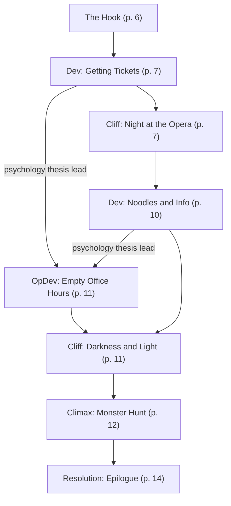

# A Night at the Opera

Book pages 6–19

Mission in the University District.

## Contents

- [Beat Chart](<02 A Night at the Opera.md#beat-chart>) (p. 6)
- [Background](<02 A Night at the Opera.md#background-read-aloud>) (p. 6)
- [The Rest of the Story](<02 A Night at the Opera.md#the-rest-of-the-story>) (p. 6)
- [The Setting](<02 A Night at the Opera.md#the-setting>) (p. 6)
- [The Opposition](<02 A Night at the Opera.md#the-opposition>) (p. 6)
- [The Hook](<02 A Night at the Opera.md#the-hook>) (p. 6)
- [Dev (Getting Tickets)](<02 A Night at the Opera.md#dev-getting-tickets>) (p. 7)
- [Cliff (Night at the Opera)](<02 A Night at the Opera.md#cliff-night-at-the-opera>) (p. 7)
- [Dev (Noodles and Info)](<02 A Night at the Opera.md#dev-noodles-and-info>) (p. 10)
- [OpDev (Empty Office Hours)](<02 A Night at the Opera.md#opdev-empty-office-hours>) (p. 11)
- [Cliff (Darkness and Light)](<02 A Night at the Opera.md#cliff-darkness-and-light>) (p. 11)
- [Climax (Monster Hunt)](<02 A Night at the Opera.md#climax-monster-hunt>) (p. 12)
- [Resolution (Epilogue)](<02 A Night at the Opera.md#resolution-epilogue>) (p. 14)
- [NPCs, Obstacles & NET Architectures](<02 A Night at the Opera.md#npcs-obstacles--net-architectures>) (p. 15)

---

*By Neil Branquinho*

**Estimated play time:** 3 to 4 hours

---

## Beat Chart

**Flow summary:** Rocklin Augmentics hires the Crew to find missing student Lucy Rhinemeyer. Campus Security points them toward the Philharmonic Vampyres. The Crew buys tickets to a gothic opera at Night City Symphony Hall, survives a shootout with Lord Ruthven's lieutenants (the Monk and the Clown), then meets The Master at a noodle-truck rendezvous. The Vampyres reveal Ruthven has gone cyberpsycho and send the Crew to his lair at the Union Chapel Building to end him and rescue Lucy.

**Branching notes:**

- **OpDev (Empty Office Hours)** is optional, triggered by student gossip at **Getting Tickets** or **Noodles and Info** about missing psychology advisors.
- At **Night at the Opera**, the Monk and/or Clown flee if combat lasts more than 3 Rounds, either suffers a Critical Injury, or either reaches Seriously Wounded — otherwise they detonate concealed AP grenades.
- At **Monster Hunt**, exterior guards depend on which lieutenants survived the opera fight (see beat for details). If both died, the chapel appears undefended.

---

> **Background (Read Aloud)**
>
> Net 54 Crimewatchers: String of Missing Persons Claims Rocklin Augmentics Daughter
>
> NCPD has reported that Lucy Rhinemeyer, 19-year-old daughter of Rocklin Augmentics Executive Engineer George Edward Rhinemeyer, has joined the growing number of missing young women in Night City. Over the last four weeks, seven women have been reported missing across the University District. Their whereabouts are a complete mystery to NCPD detectives, who still have no leads. Mr. Rhinemeyer has yet to be reached for comment.
>
> Early in the morning, you receive a message from Mr. Rhinemeyer's representative:
>
> "As you may know, my client's daughter went missing in the University District. We have had little cooperation from the local authorities. My client has authorized me to pay out 2,000eb per head to contractors of my choice. You come highly recommended. You will each receive 500eb upon the signing of a contract with Rocklin Augmentics, with the remainder of the funds issued once Lucy Rhinemeyer has been recovered—in whatever state you happen to find her. Good hunting."

### The Rest of the Story

The kidnapper is Lord Ruthven, an ex-Philharmonic Vampyres member who has gone cyberpsycho. He has convinced himself he is a true vampire and deserves the ultimate vampire bride: Barbara Dahl, the nightly news anchor of Network 54 in Night City.

Unable to kill him without outside aid, the leader of the Philharmonic Vampyres has concocted a plan to pose as an intermediary to the latest victim's father in order to hire the Crew without alerting either the NCPD or the general public to their connection to the killer.

### The Setting

This story takes place mainly in the University District in Night City, and takes the Crew from a gothic opera house to a showdown with a cyberpsycho in an abandoned church at the border of the Combat Zone.

### The Opposition

- **The Monk and the Clown.** Two former gangers who now serve as Lieutenants for Lord Ruthven.
- A horde of **Bozo** and **Inquisitor Mooks** who left their gangs to follow the Monk and the Clown in service to Lord Ruthven.
- **Lord Ruthven**, a lone cyberpsycho and dangerous killer who has become convinced he is a true vampire.
- Members of the **Philharmonic Vampyres** gang (should the Crew seek violence with them).

See pg. 15 for stat blocks.

### The Hook

In a span of four weeks, seven women have vanished from the University District. Campus Security and NCPD are trying to investigate, but are overwhelmed dealing with spikes in gang activity in the University District and South Night City border. NCPD was struggling to keep up with the investigation, but that's all changed now: Mr. Rhinemeyer started bankrolling the NCPD's investigation a week ago, bribing them to change their policing priorities for the sake of his daughter. This is also where the Crew comes in. Through the cooperation of NCPD and their new patron, they've been offered a job.

Or, at least, so it seems. In truth, the Edgerunners are pawns in an over dramatic scheme by The Master, a Philharmonic Vampyre leader, to deal with the problem discretely.

Contacts at Campus Security don't have much for leads, but suspect the Philharmonic Vampyres, due to the disappearances happening on their turf and fitting their behavior.

The cops can't walk into a Philharmonic Vampyres' gathering without causing major problems (and they are also quick to mention that's outside their authority), so the Crew's patron has tasked them with gaining access to one of the Vampyres' parties and investigating.

**Go to:** [Dev (Getting Tickets)](<02 A Night at the Opera.md#dev-getting-tickets>)

### Dev (Getting Tickets)

The Edgerunners notice an ostentatious poster plastered over a nearby bus stop. It reads *Come to a Night at the Opera with the Philharmonic Vampyres* and on the poster are a collection of shadows striking classic vampire cinema poses.

The date is for tomorrow night. At the bottom of the poster is a link to Garden Patch, from which you can buy tickets. It also includes a note about the event's dress code, which is listed as *Old World meets New World: Drama, Sensuality, Black Velvet, Danger*.

The location of the show is the old Night City Symphony Hall, just off campus in the University District. The Philharmonic Vampyres have been busy promoting around the district. The show is gaining steam, and university students have been buying up tickets. Even if the show were to flop, the students would likely turn it into a rave.

There are six students crowding the area, waiting for the bus. They are all talking about the party, and answer questions if asked. Here's a sampling of what they have to say.

- "The Philharmonic Vampyres are such a joke. The only reason people like them is because the audience usually ends up naked—hell, half the time it's just a glorified orgy. And these kidnappings are serious. Seven women missing is nothing to dismiss. NCPD needs to do something. Campus security is useless."
- "What do you want? I'm sorry, I don't talk to street people. Kidnappings? Terrible business. I've got enough to deal with—like my stupid psychology thesis advisor not answering his damn mail." If the Crew follow up on this **Go to:** [OpDev (Empty Office Hours)](<02 A Night at the Opera.md#opdev-empty-office-hours>).
- "This is going to be the event of the week. Those vamp shows are always so stylish. Missing women? Don't be such a downer."
- "I like cute theater guys. That's why I'm going. And it's not like everyone gets laid. It's a party, people hook up. Big deal. Kidnappings? Really? I mean, people shouldn't be walking alone at night."
- "Those vamps are artists, man. Kidnappings? You'd think that the vamps would be pulling a stunt like that. Nah, word on the street is Vamps are just as concerned about the missing women. Heard a pair of vamps talking about it. Pretty hush, hush stuff there."
- "The vamp show? What would I want to see those neck-sucking freaks for? Not my scene. All the weirdos will be there for sure. I'll be working out instead. Check out these biceps. Mm-hmm—premium A1 Freshpak beef right here. Kidnappings? If I knew anything, I'd be the one kicking serious chrome, but no. And that shit isn't cool, man. The babes are not as willing to go out on dates. I haven't gotten any output in a week."

**Go to:** [Cliff (Night at the Opera)](<02 A Night at the Opera.md#cliff-night-at-the-opera>)

### Cliff (Night at the Opera)

Just after sundown on the night of the party, a line forms outside the symphony hall. A Campus Security aerodyne that's seen better days sits parked outside, and a pair of Campus Security officers direct the crowd. A DV9 Perception Skill Check reveals that both officers have Vampyres (see pg. 363) installed.

> **Infobox: Night City Symphony Hall (DV9)**
>
> A crumbling gothic landmark in the University District, the symphony hall hosts everything from student raves to the Philharmonic Vampyres' theatrical productions. Worn marble steps, neglected stonework, and red velvet interiors set the mood for the Vampyres' blend of classic horror cinema and modern performance art.

The hall itself features four large pillars atop a large set of old marble steps. The stonework is worn and neglected. Between the two center pillars stands a massive door that hangs wide open. A man in a black suit and a black top hat stands in the doorway. A red cloak rests on his shoulders and drapes down his back. In his right hand he holds a black cane with a silver bat head handle. His face is ghost white, matching his fancy gloves.

"Come one, come all! Come, come! Come see sights of amazement from an age long since lost in! You will see wonders that will astonish! Come, come all!"

Behind the host, a handful of burlesque figures dance. The vamp at the main door reads ticket codes with their cybereyes. Nobody checks for weapons. The vamp ticket-taker tells the Crew to enjoy the show as they flash a pair of pearly white fangs.

The lobby is decorated with long red drapes and holograms featuring notable vampires of classic cinema. The doors leading to the auditorium have red velvet padding and gold rivets. Twin burlesque dancers perform beside the doors, their skin ghost white. They croon: "Please be seated, the show is about to begin."

Inside the auditorium, plastic covers the seats.

A bellhop hands out white synthetic silk handkerchiefs as people sit. Fake trees adorn the stage, with large white tapestries hanging from both sides. Tchaikovsky's *Swan Lake* serenades the audience as people find their seats.

The lights dim. The show begins. The production of *Dracula* mixes classic horror cinema with a futuristic motif. Half-naked performers sling buckets of fake blood at each other and the audience as classic theater meets modern performance art.

#### Fight at the Opera

Suddenly, from backstage, a voice cries out: "You two can't be back here," followed by gunshots. Chaos breaks out as people quickly realize the gunshots aren't part of the show. People begin to stampede out of the venue. The Crew is locked in by the crowd behind them and the firefight in front of them, and have no choice but to roll Initiative as the combat spills out onto the stage and the assailants reveal themselves: a Bozo (the Clown) with some serious optical cyberware (see pg. 15), and an Inquisitor (the Monk) dressed in brown robes (see pg. 16).

At the start of combat, a number of Vampyres (see pg. 15) equal to the Crew draw their weapons and enter the fight. Initially, they target the Bozo and the Monk, but defend themselves against the Crew if attacked. During the first 3 Rounds, all Skill Checks suffer a −4 modifier due to the screaming chaos of the opera house. Any Edgerunner with a Cyberaudio Suite is immune to this negative effect, as they can automatically tune out the horrible noise.

For the first 2 Rounds of the combat, the Bozo and the Monk divide their attacks evenly among the Edgerunners and the Philharmonic Vampyres. The Bozo and the Monk will attempt to escape if one of three things occur:

- Combat lasts more than 3 Rounds.
- Either one suffers a Critical Injury.
- Either reaches the Seriously Wounded Wound State.

When attempting to escape, they will use their full Turn and the Dash Action. Should either be unable to escape, they use their final desperate action to detonate a held Armor Piercing Grenade, camouflaged either as a rosary bead or a water balloon, killing themselves instantly.

As GM, don't step in to save either the Monk or the Clown if it would seem like a cheap or unearned escape. The Edgerunners will get another chance at them before the ending of the mission, though, so do try and get one to safety.

When the battle is over, the lights in the hall go dark. An Edgerunner with an ability to see or sense in low light/darkness will detect dozens of figures moving about, most grabbing the dead or wounded. Other well-armed figures wearing black cloaks take up strategic positions. Suddenly, dozens of red eyes appear in the dark.

The squeaking of bats and a flurry of wings precedes the arrival of a figure who steps out of a cloud of holographic smoke. He wears a fine black suit from an era long since passed. His black hair is parted to the right, identical in looks to horror legend Bela Lugosi.

"My production of Dracula is in shambles. Some of my children are dead. I am beside myself with grief. Leave. All of you. I need time to think and bury my dead. I may summon you again, but now is not the time. There will be no retaliation. Leave now—before I change my mind."

Outside the hall the streets are empty. No one stuck around to see how it all played out. Even the junky Campus Security aerodyne is gone. Apparently, they aren't being paid enough to risk their lives for an off-campus theatrical production.

The Crew has time to rest up and heal, if they need it. When they are ready, **Go to:** [Dev (Noodles and Info)](<02 A Night at the Opera.md#dev-noodles-and-info>).

### Dev (Noodles and Info)

Several days have passed since the encounter at the Night City Symphony Hall. Everyone should have received medical attention and be back in working order. In the afternoon, the Crew receives another message from Mr. Rhinemeyer's representative.

"Purchase an extra-large bowl of noodles with kibbleflakes at the indicated coordinates. Wear a green hat."

The message flashes, updating the position of the goal every 15 seconds. Plugging them into an Agent reveals that the point in question is in the University District, on the Night City University Campus, outside the cafeteria.

When the Crew approaches the location, they find it swarmed with students, enjoying a break from the food offered by the university's cafeteria, sitting on the synthetic grass surrounding the student plaza. Anyone wearing visible armorjacks or openly carrying a weapon here sticks out like a sore thumb, but Campus Security is nowhere to be seen.

Walking across the Night City University lawn, the Crew can overhear several student conversations.

- "Oh my god, I knew someone that was at that party! I'm glad no students got hurt. I hear the after party was good. There were so many of us—I mean the students—that they overwhelmed security. I bet the Execs were freaked. Or maybe they were into it. I wouldn't know."
- "I hear none of the psychology majors can get their thesis papers accepted. They are totes starting to freak out. Guess they should have picked a hard science like us. A couple more months, then Biotechnica, here we come!" If the Crew follows up on this, **Go to:** [OpDev (Empty Office Hours)](<02 A Night at the Opera.md#opdev-empty-office-hours>).
- "Doesn't this taste like pancakes? I'm not crazy, right dude? This meatball sub tastes like pancakes. I think they used the wrong kibble. Try it. It's kinda good though."
- "Ugh. That vapid Professor Huntver still hasn't gotten back to me about my thesis! I went to his office hours, but he wasn't there, and the door was totally, like, locked! What an asshole. How am I supposed to defend in a week if I can't get my advisor to answer even the most basic messages. I think he's on drugs or something." If the Crew follows up on this, **Go to:** [OpDev (Empty Office Hours)](<02 A Night at the Opera.md#opdev-empty-office-hours>).
- "Guess who just got into the summer internship program at Zhirafa? Yeah, I just got the mail today. Luckily, after the midterm. Who wants to get drunk tonight?"

The location of the coordinates is a popular noodle truck in the center of campus. Ordering the correct order with or without wearing the green hat is the signal for a number of Philharmonic Vampyres in the crowd of students equal to twice the number of players to approach the party while wiggling their heads suggestively. It's also possible to spot them in the crowd beforehand with a DV13 Perception Skill Check.

Once they approach, the Vampyres are easy to identify by subtle fashion choices, fangs, and near universal application of heavy eyeshadow. One Vampyre introduces themselves as Renfield and offers the Crew an envelope with an invitation to meet "The Master" at the stroke of midnight in the opera house. After he delivers the message, Renfield bows again before the Vampyres all disperse and blend back in with the crowd. The Vampyres are not looking for a fight, and will flee if engaged in combat, leaving only the note, using Smoke Grenades to make their escape.

**Go to:** [Cliff (Darkness and Light)](<02 A Night at the Opera.md#cliff-darkness-and-light>)

### OpDev (Empty Office Hours)

The fourth floor of the social sciences building overlooks the campus and the nearby main strip of the University District. Professor Huntver's office is at the end of a hallway. On it, psychology majors have taped several notes eager to talk about their theses, written in varying degrees of desperation. The door is locked, but a DV9 Pick Lock Skill Check easily opens it. Busting it open is a DV13 Athletics Skill Check, which succeeds automatically if an Edgerunner has a Melee Weapon on hand.

If they choose to investigate, they can discover the following suspicious things.

- With a DV9 Perception Check while searching the desk: A framed picture of Barbara Dahl, anchor of the evening news in Night City for Network 54, sits on the desk. A kiss marks the photo in faded red lipstick.
- With a DV13 Perception Check while investigating the closet: A clown costume hangs in the back of the wardrobe, along with an Inquisitor uniform, both stained in blood. These are hidden behind a set of academic regalia.
- With a DV13 Perception Check while searching the desk: A lock secures a mini fridge underneath the desk. Breaking it open requires a DV13 Athletics Skill Check, which succeeds automatically if an Edgerunner has a Melee Weapon on hand. A DV9 Pick Lock Skill Check also pops it open. Inside is a bottle of genuine vodka (worth 500eb), a squat bottle of bloody mary mix, a jar of real pickled asparagus, a frosted glass, and a preserved human head.

A DV13 Criminology, Library Search, or Streetwise Skill Check reveals the severed head belongs to the late Kenneth Dahl, Barbara Dahl's late husband. If the Crew seeks to return the head to Barbara Dahl, she accepts it graciously through an intermediary, mentioning that his grave was robbed months ago, and she has been dealing with it privately. If the Crew agrees to keep this under wraps, she owes them a small favor. Strangely, if asked, she doesn't know anyone named Huntver, but she does offer that she's been stalked several times before. For her, it comes with the territory.

**Go to:** [Cliff (Darkness and Light)](<02 A Night at the Opera.md#cliff-darkness-and-light>) or [Climax (Monster Hunt)](<02 A Night at the Opera.md#climax-monster-hunt>) as appropriate.

### Cliff (Darkness and Light)

The Crew returns to the Night City Symphony Hall to meet with the Philharmonic Vampyres. The area is pretty busy, with university students heading back to their apartments and dorms. There are no outward signs of what transpired a couple nights ago. At the top of the marble steps stands one of the vamps, dressed in the typical fancy black suits with that classic Hollywood vampire motif. When he sees the characters, he smiles, his fangs glistening in the illumination from street lamps.

"The Master has been awaiting you. Come." The vamp motions for the characters to follow.

The vamps show no signs of aggression. They offer the characters refreshments—cherry red drinks and tasteless cookies—when they enter the lobby. The burlesque dancers wave and blow kisses. The characters are led down a hallway which ends at a pair of synthetic wooden doors with what is probably the seal of Vlad Tepes in gold on it. The vamp knocks on the door three times and it opens majestically. Inside there is a large room illuminated by black candles. Red carpets cover the floors and red tapestries hang from the walls. There are two large chairs at the opposite end of the room and a fake fireplace with a holographic fire flickering. A man and a woman stand in front of the fire, holding hands. The man turns, a perfect replica of Bela Lugosi. The woman leaves swiftly, carefully checking a box on an oversized clipboard. The Master speaks.

> **Infobox: Philharmonic Vampyres (DV13)**
>
> A University District poser gang devoted to gothic horror aesthetics, archaic rituals, and theatrical excess. They drink the occasional glass of blood and style themselves as creatures of the night, but they are romantics—not murderers. Their leader, The Master, has hired the Crew to deal with a former member who has gone too far.

"We have a mutual problem that must be dealt with. By now you may have probably deduced that this problem was once one of us. Lord Ruthven arrived here just after Night City was bathed in fire and offered to fund the Philharmonic Vampyres' rebirth. He was a visionary and an artist. Plus, he had… considerable monetary resources. But he had a dark side and many secrets that he wouldn't share with us. What we do pays homage to the past. We may partake in archaic rituals and drink the occasional glass of blood, but we are not monsters—not murderers. We are romantics. There is no art left in Lord Ruthven. Now, he is only a monster. Truly. He began taking it too far and when we confronted him, he threatened to kill us all … and he is more than capable. You see, he's gone cyberpsycho."

The Master rubs his forehead, evidently beside himself at the pronouncement. Or perhaps just committing to his role. It's hard to tell.

"Ruthven is beyond our control. That's why we've summoned you here. We will allow you to kill him without retribution. While we cannot be seen to be aiding NCPD, we have discovered where this monster's lair is. Take it. Along with this wooden stake, make haste to the Union Chapel Building, and make sure the task is done right. Do so, and you will earn our favor. I will also make sure you are paid through your intermediary with the venerable Mr. Rhinemeyer. Good hunting, Edgerunners."

**Go to:** [Climax (Monster Hunt)](<02 A Night at the Opera.md#climax-monster-hunt>)

### Climax (Monster Hunt)

The Master's data puts Lord Ruthven's base of operations just across the border in South Night City. The silence here is eerie. The front door to the Union Chapel stands wide open. A neon "Open" sign flickers every few seconds. Looking at the entrance carefully, it's almost like a large mouth awaiting a meal to just walk right in. All other access points to the Union Chapel are blocked by rubble.

> **Infobox: Union Chapel Building (DV13)**
>
> An abandoned church on the South Night City border, converted into Lord Ruthven's grotesque lair. Human remains decorate every room; automated turrets guard the basement chapel where Ruthven conducts his "black masses."

The outside is well guarded, too. If the Monk or the Clown survived, they guard the door, alongside a number of mooks (see pg. 16 & 17) equal to the number of Edgerunners minus 2. If only the Monk survived, all of the mooks are Inquisitor Mooks. If instead only the Clown survived, all of the mooks are Bozo Mooks. If both the Monk and the Clown survived, the Mooks are split in allegiance 50/50. If neither survived, skip this encounter, and the Union Chapel Building is seemingly undefended.

In this combat, all adversaries fight to the death. They are too terrified of the torture that awaits cowardice by the hands of Lord Ruthven to do anything else, and they have long since been driven mad by him in strange torturous "therapy sessions," which earned him their defection from their former gangs. Neither The Monk nor the Clown have any grenades in this encounter.

Just inside the doorway hangs two large candelabra candle holders with blood red candles fully lit. There is what looks like a leather carpet rolled out. A closer look reveals that it's not leather, but human skin on the flip side. The sections are sewed together with awning thread. The skin displays random gang tats. Whoever made this carpet did a number on gangers. The bar area is a large, open room with dozens of decaying tables with chairs. Rotting, skinless bodies sit neatly at each table. A rather colorful display of cybered heads rests on the bar with red candles melting blood red wax into the metal. On the far wall, a stage dominates the space. A pentagram, presumably painted in blood, decorates what appears to be an altar made of human remains. Strung from the ceiling is a ganger, dripping blood, breathing barely, chanting the same phrase, until he soon dies of blood loss. His words are not a comfort. "Black Mass for Our Lord... Black Mass for Our Lord."

To the right of the main door, a large staircase leads down. Music echoes from below, a great symphonic score from Tchaikovsky. There is a scratching sound that seems to accompany it. If the characters listen carefully they can hear footsteps below pacing back and forth.

The stairs leading down into the chapel are littered with ammo casings. There are blood red candles neatly placed along the handrails. At the bottom of the steps, two large white doors stand adorned with red pentagrams. A crucifix hangs upside-down above the door. Inside the chapel stands ten rows of pews with the rotting remains of other unlucky souls that wandered into this little hell. At the far end, an altar with a Full Body Conversion bolted to a large metal chrome crucifix. Music drones from an old sound system just to the left with large speakers. Two large cables hang over the first row of pews, one on each side. The cables are hooked to two black robed figures seated up front. Neither moves, nor do they offer a heat signature.

As the Edgerunners move to the altar, two figures jerk to life and stand up. They quickly spin around. The two robed figures are automated turrets armed with Assault Rifles (see pg. 174). They can't move from their spot, but pivot and track Edgerunners. The sentries don't stop shooting until stopped or the characters are dead. Each is controlled by its own NET Architecture.

Once the turrets are dealt with, immediately, the characters are interrupted by a towering figure who steps out from behind the tapestry. He wears a black medical uniform and a flowing black hooded cloak. His face is gnarled by large metallic fangs which have stabbed jagged curves into the corners of his mouth. Lord Ruthven (see pg. 17) quickly attacks.

"Witness my supremacy, vermin!"

The battle with Lord Ruthven is to the death. Once he is killed, the Crew can look behind the tapestry where they find a sterile white hallway illuminated by the glow of soft white LED lights. There is an oversized medical pod with six naked women crammed inside, each biosculpted to look like Barbara Dahl, Network 54 anchor woman, to varying levels of accuracy. Whatever twisted reasoning was behind this died with Ruthven. Only one is alive, barely conscious, and slicked wet with cryo fluid from a smashed pod, clothed in a shawl and paralyzed with fear. The others have long since been lobotomized. The lone survivor is Lucy Rhinemeyer, underneath the bodysculpting. After confirming this, she faints at the feet of her rescuers.

**Go to:** [Resolution (Epilogue)](<02 A Night at the Opera.md#resolution-epilogue>)

### Resolution (Epilogue)

Lucy Rhinemeyer, after therapy, will be able to lead a fulfilling life once again. The bodies of the other six women are returned to their families, and for their funeral services, Lucy and her father arrange for Rocklin Augmentics to pay for postmortem biosculpting so they can be laid to rest with their original faces. The Crew are paid the remainder of their wages, and if they remembered to stake Lord Ruthven through the heart, or have done something equally dramatic, such as decapitating him, they have earned a favor with the Philharmonic Vampyres.

As our tale meets its bloody end, the curtain falls on tonight's entertainment. Sleep tight, Night City. Lock your doors, bar the windows, and turn out the lights, and maybe, just maybe, the monsters will pick another house tonight.

---

## NPCs, Obstacles & NET Architectures

Important NPCs in *Tales of the RED: Street Stories* are presented in two formats. Mooks and minor combatants have an abbreviated stat block presenting only essential information. Use their Combat # for any attack checks and when evading melee attacks (they can't dodge ranged attacks). NPCs with whom the Crew might have a deeper interaction have a full stat block. We include a Combat # (C#) for each listed attack to help speed up the fight.

For more information on important NPCs see Appendix C: Biographies.

### Philharmonic Vampyre (Mook)

| HP 30 · INIT 10 · MOVE 7 · Combat # 7 · REP 0 |

**Weapons & Armor**

| Weapon | ROF | Damage | Armor/SP |
|--------|-----|--------|----------|
| Vampyres | 2 | 1d6 | Head: Leathers SP 4 |
| Medium Melee Weapon | 2 | 2d6 | Body: Leathers SP 4 |

**Skills:** Acting 10, Athletics 7, Brawling 7, Concentration 7, Contortionist 9, Conversation 9, Dance 8, Education 11, Evasion 7, First Aid 6, Human Perception 9, Language (Native) 10, Language (Streetslang) 8, Local Expert (University District) 8, Melee Weapon 12, Perception 8, Personal Grooming 10, Persuasion 10, Stealth 10, Streetwise 9, Wardrobe & Style 10

**Gear:** Disposable Cellphone

**Cyberware:** Nasal Filters, Shift Tacts, Techhair

---

### The Clown — NPC Stat Block

**REP 1**

| INT | REF | DEX | TECH | COOL | WILL | MOVE | BODY | EMP |
|-----|-----|-----|------|------|------|------|------|-----|
| 7 | 4 | 7 | 7 | 6 | 5 | 6 | 4 | 1 |

| HP 35 · Seriously Wounded 18 · Death Save 4 |

**Weapons & Armor**

| Weapon | ROF | Damage | Armor/SP |
|--------|-----|--------|----------|
| Heavy Pistol (C# 12) | 2 | 3d6 | Head: Light Armorjack SP 11 |
| Air Pistol (C# —) | 2 | — | Body: Light Armorjack SP 11 |

**Skills:** Athletics 6, Brawling 9, Conceal/Reveal Object 7, Concentration 7, Contortionist 7, Conversation 3, Education 6, Evasion 9, First Aid 9, Handgun 12, Heavy Weapons 12, Human Perception 3, Interrogation 12, Language (English) 8, Language (Streetslang) 8, Local Expert (South Night City) 6, Melee Weapon 9, Perception 10, Persuasion 8, Stealth 6

**Gear:** Heavy Pistol Ammo x8, Acid Paintball x16, Poison Arrow x2 (in Cybereyes), Rubber Arrow x2 (in Cybereyes), Disposable Cellphone

**Cyberware:** MultiOptic Mount, Cybereye x6 w/ Anti-Dazzle, Low Light/Infrared/UV, Dartgun x4

---

### Bozo Mook

| HP 30 · INIT 10 · MOVE 5 · Combat # 10 · REP 0 |

**Weapons & Armor**

| Weapon | ROF | Damage | Armor/SP |
|--------|-----|--------|----------|
| Poor Quality Shotgun | 1 | 5d6 | Head: Skinweave SP 7 |
| Brawling | 2 | 1d6 | Body: Skinweave SP 7 |

**Skills:** Athletics 8, Brawling 11, Conceal/Reveal Object 8, Concentration 5, Conversation 4, Demolitions 9, Education 6, Evasion 10, First Aid 7, Heavy Weapons 11, Human Perception 4, Language (Native) 8, Language (Streetslang) 6, Local Expert (South Night City) 6, Perception 6, Persuasion 6, Shoulder Arms 8, Stealth 8, Streetwise 7

**Gear:** Slug Ammo x10

**Cyberware:** Nasal Filters, Shift Tacts, Skinweave, Techhair

---

### The Monk — NPC Stat Block

**REP 1**

| INT | REF | DEX | TECH | COOL | WILL | MOVE | BODY | EMP |
|-----|-----|-----|------|------|------|------|------|-----|
| 6 | 7 | 6 | 3 | 4 | 7 | 6 | 6 | 1 |

| HP 45 · Seriously Wounded 23 · Death Save 6 |

**Weapons & Armor**

| Weapon | ROF | Damage | Armor/SP |
|--------|-----|--------|----------|
| Excellent Quality Heavy Pistol w/ Extended Clip (C# 15) | 2 | 3d6 | Head: Kevlar® SP 7 |
| — | — | — | Body: Kevlar® SP 7 |

**Skills:** Athletics 12, Brawling 12, Concentration 9, Conversation 3, Education 10, Endurance 11, Evasion 12, First Aid 5, Handgun 15, Human Perception 3, Language (English) 8, Language (Streetslang) 10, Local Expert (South Night City) 8, Perception 9, Persuasion 6, Resist Torture/Drugs 13, Stealth 8, Tactics 10, Wilderness Survival 10

**Gear:** Expansive Heavy Pistol Ammo x14, Disposable Cellphone

**Cyberware:** None

---

### Inquisitor Mook

| HP 30 · INIT 11 · MOVE 6 · Combat # 11 · REP 0 |

**Weapons & Armor**

| Weapon | ROF | Damage | Armor/SP |
|--------|-----|--------|----------|
| Very Heavy Pistol | 1 | 4d6 | Head: Leathers SP 4 |
| Brawling | 2 | 1d6 | Body: Leathers SP 4 |

**Skills:** Athletics 13, Brawling 13, Concentration 8, Conversation 6, Education 6, Evasion 9, First Aid 4, Handgun 11, Human Perception 6, Interrogation 8, Language (Native) 8, Language (Streetslang) 8, Local Expert (South Night City) 6, Perception 6, Persuasion 7, Resist Torture/Drugs 10, Stealth 11

**Gear:** Very Heavy Pistol Ammo x16

**Cyberware:** None

---

### Lord Ruthven, Night Predator — NPC Stat Block

**Medtech: Medicine 4 (Surgery 4)** · **REP 2**

| INT | REF | DEX | TECH | COOL | WILL | MOVE | BODY | EMP |
|-----|-----|-----|------|------|------|------|------|-----|
| 5 | 8 | 8 | 4 | 5 | 6 | 8 | 10 | 0 |

| HP 50 · Seriously Wounded 25 · Death Save 10 |

**Weapons & Armor**

| Weapon | ROF | Damage | Armor/SP |
|--------|-----|--------|----------|
| Vampyres (C# 16) | 2 | 1d6 | Head: Subdermal SP 12 |
| Excellent Quality Wolvers x2 (C# 18) | 2 | 3d6 | Body: Subdermal SP 12 |

**Skills:** Acting 10, Athletics 16, Basic Tech 12, Brawling 16, Conversation 2, Cybertech 12, Education 7, Evasion 16, First Aid 6, Human Perception 2, Interrogation 14, Language (English) 13, Language (Streetslang) 9, Local Expert (University District) 10, Melee Weapon 18, Paramedic 10, Perception 12, Personal Grooming 11, Persuasion 12, Resist Torture/Drugs 14, Stealth 16, Surgery 12, Wardrobe & Style 12

**Gear:** Agent, Vial of Biotoxin (in Vampyres)

**Cyberware:** Cybereye x2 w/ Low Light/Infrared/UV, Grafted Muscle & Bone Lace, Neural Link w/ Chipware Socket x2, Kerenzikov, Pain Editor, Subdermal Armor (Tech Upgraded to 12 SP), Wolvers x2 (Tech Upgraded to Excellent Quality), Vampyres

---

### Union Chapel Turret Control #1

| Demons Installed | None |
| REZ | — |
| Interface | — |
| NET Actions | — |
| Combat Number | — |

| Floor | DV | Node |
|-------|-----|------|
| 1 | — | Black ICE: Raven |
| 2 | — | Black ICE: Raven |
| 3 | — | Black ICE: Hellhound |
| 4 | 8 | Control Node: Automated Turret |

---

### Union Chapel Turret Control #2

| Demons Installed | None |
| REZ | — |
| Interface | — |
| NET Actions | — |
| Combat Number | — |

| Floor | DV | Node |
|-------|-----|------|
| 1 | — | Black ICE: Raven |
| 2 | — | Black ICE: Hellhound |
| 3 | — | Black ICE: Raven |
| 4 | 8 | Control Node: Automated Turret |
