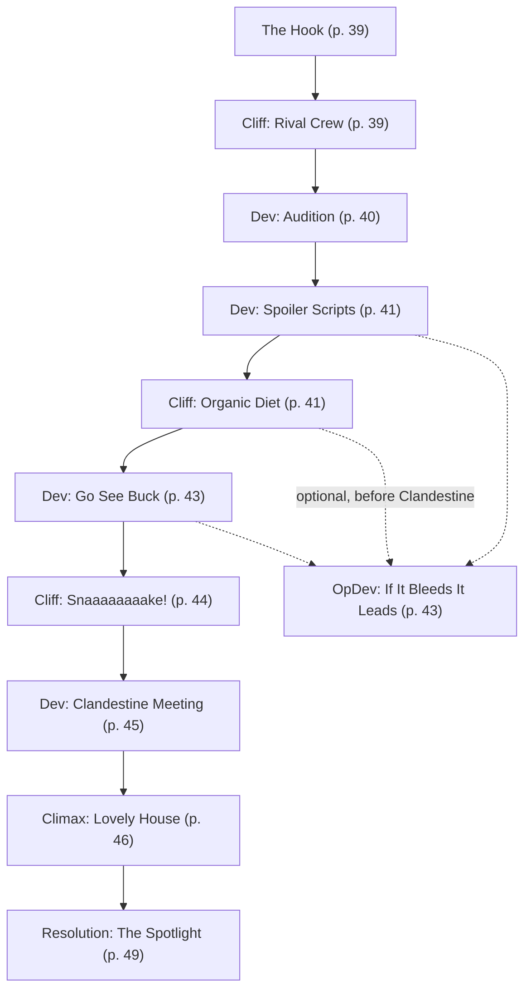

# A Bucket Full of Popcorn-Flavored Kibble

Book pages 38–51

Mission on a movie lot.

## Contents

- [Beat Chart](<04 A Bucket Full of Popcorn-Flavored Kibble.md#beat-chart>) (p. 38)
- [Background](<04 A Bucket Full of Popcorn-Flavored Kibble.md#background-read-aloud>) (p. 38)
- [The Rest of the Story](<04 A Bucket Full of Popcorn-Flavored Kibble.md#the-rest-of-the-story>) (p. 38)
- [The Setting](<04 A Bucket Full of Popcorn-Flavored Kibble.md#the-setting>) (p. 38)
- [The Opposition](<04 A Bucket Full of Popcorn-Flavored Kibble.md#the-opposition>) (p. 38)
- [The Hook](<04 A Bucket Full of Popcorn-Flavored Kibble.md#the-hook>) (p. 39)
- [Cliff (Rival Crew)](<04 A Bucket Full of Popcorn-Flavored Kibble.md#cliff-rival-crew>) (p. 39)
- [Dev (Audition)](<04 A Bucket Full of Popcorn-Flavored Kibble.md#dev-audition>) (p. 40)
- [Dev (Spoiler Scripts)](<04 A Bucket Full of Popcorn-Flavored Kibble.md#dev-spoiler-scripts>) (p. 41)
- [Cliff (Organic Diet)](<04 A Bucket Full of Popcorn-Flavored Kibble.md#cliff-organic-diet>) (p. 41)
- [Dev (Go See Buck)](<04 A Bucket Full of Popcorn-Flavored Kibble.md#dev-go-see-buck>) (p. 43)
- [OpDev (If It Bleeds It Leads)](<04 A Bucket Full of Popcorn-Flavored Kibble.md#opdev-if-it-bleeds-it-leads>) (p. 43)
- [Cliff (Snaaaaaaaake!)](<04 A Bucket Full of Popcorn-Flavored Kibble.md#cliff-snaaaaaaaake>) (p. 44)
- [Dev (Clandestine Meeting)](<04 A Bucket Full of Popcorn-Flavored Kibble.md#dev-clandestine-meeting>) (p. 45)
- [Climax (Lovely House)](<04 A Bucket Full of Popcorn-Flavored Kibble.md#climax-lovely-house>) (p. 46)
- [Resolution (The Spotlight)](<04 A Bucket Full of Popcorn-Flavored Kibble.md#resolution-the-spotlight>) (p. 49)
- [NPC Stat Blocks](<04 A Bucket Full of Popcorn-Flavored Kibble.md#npc-stat-blocks>) (p. 50)

---

*By Sebastian Szmyd*

**Estimated play time:** 3 to 5 hours

---

## Beat Chart

**Flow summary:** A Fixer scores the Crew an audition as extras on the Senait Sisters' Addiswood historical romance *The Parisian Hostess*. Rival edgerunners try to steal their keycard, then a remote audition lands them on the Rancho Coronado lot. Side gigs for Catering (organic food run) and SFX (cybersnake prop tuning) lead to a private meeting with star Etan Sim, who hires them to return his ex-husband's ceramic plates. Paparazzo Markus "Malarkey" Bornholm may intercept the Crew with a bugging job. The climax at Darrel Marchant's Little Europe home pits the Crew against Malarkey's ambush while fragile heirlooms are at stake.

**Branching notes:**

- **OpDev (If It Bleeds It Leads)** can trigger at any point after the audition while the Crew is away from the lot, before **Dev (Clandestine Meeting)**.
- At **Dev (Spoiler Scripts)**, the Crew may accept the Simwives' 376eb script heist — pay on delivery, serial numbers traceable.
- At **Dev (Clandestine Meeting)**, the Crew may plant Malarkey's bug (DV13 Stealth) and/or steal Sim's script (DV17 Stealth).
- **Resolution (The Spotlight)** varies sharply based on whether the Crew filmed, bugged, stole scripts, or played straight.

---

> **Background (Read Aloud)**
>
> Lights, camera, action! It has been the dream of many a starlet to show up on the silver screen — especially now when the action can be shown off in stunning 3-D with sense-simulation streams. Now your Crew can get in on some of that sweet Addiswood action after your Fixer scored an audition invite for the famous Senait Sisters' upcoming historical romance, *The Parisian Hostess*. It's legit, the leading and supporting actors have already been cast, and you all have a chance of making it as extras — which is definitely going to be a step up in the career of any budding media star!
>
> And even if you aren't interested in a career in the light of the hologram projector, there's the pay, the access to Catering where you can score a meal that isn't kibble, and the potential for side gigs and lucrative connections. What's to dislike about this gig? Nothing at all! But you know that meme about something seeming too good to be true? Yeah, well that shit goes double in Night City, choomba.

### The Rest of the Story

Teresa and Fanta Senait are genre-busting Addiswood directors with sixteen blockbuster flicks to their credit. They co-produce and direct all of their movies with exacting care, preferring to shoot on location with local talent instead of isolating cast and crew on an Ethiopian soundstage. The Addiswood entertainment industry has Eurobucks to throw around — all that Highrider traffic and trade means a population of workers who have the cash to fling at entertainment. Not to mention Orbital Air can get them anywhere they need to go!

This means that the Senait Sisters have effectively flown into Night City with the equivalent of an AV full of cold hard currency, and are right now injecting it into the local economy as they cast extras and set up to shoot on location. They've brought the cast and crew with them in immense converted cargo vehicles — AVs, planes, trailers — via a brokered deal with several of Night City's Nomad families, all of whom are currently buzzing about recruiting any and all family members they can to assist with this massive logistical operation, because even a fractional percentage of the Senait Sisters' budget is nothing to sneeze at.

Your group of Edgerunners is among the denizens of Night City elbowing in to get a chance at that sweet, sweet vid-sim money — because you have to pay rent and buy kibble and afford medical treatment, and even if you're flush right now, more eddies are always nice, right? Fortunately for you, the Senait Sisters really do believe in hiring extras and minor cast members locally, and you all have an invite to an audition!

Unfortunately for you, the rest of Night City also really wants set access and the plush side benefits that would come with a job, so the first step to making the audition date is… making it to the audition itself.

### The Setting

After an opening in the Upper Marina, the Crew might find themselves traveling to Heywood and the University District, but most of the adventure will take place in and around various locations just across the southern bridge and below the central part of Night City. This zone is Rancho Coronado, and in better days, it was largely a mix of corporate suburban housing with industrial zones. This all changed after the War and the exodus of people from the heart of Night City that flowed into most every adjacent region. Being hit harder by this than many of the nearby zones, most of the neighborhoods are now crammed with refugee camps and tent cities filling every possible space they aren't bodily ejected from!

### The Opposition

As scarcity is, unfortunately, a condition of Night City life, there are others who want things the Crew have access to. Their opponents might include:

- **Fellow Would-Be Extras**, made up of other Edgerunners who failed to score an audition invite and hope to acquire one from the Crew.
- **Markus "Malarkey" Bornholm and his Security Escort.** Malarkey is a local Night City "journalist" of the most trashy tabloid sort. Sensation, sleaze, and almost-libel are his best friends, as he follows people around recording their worst behavior in order to manufacture a viral trend. Malarkey makes enough off his sensationalist vidjournalism that he can afford a crew of muscle to keep him largely unbruised during his missions to expose others to the searing eye of the Night City Data Pool. He's been putting on the paparazzi act ever since actor Etan Sim got caught erotically entangled with a co-star sixteen months ago, and most Night City gossips have been lapping up the scandal straight from Malarkey's feed.
- **Darrel Marchant**, actor Etan Sim's ex-husband, formidable Solo specializing in personal protection. He's not likely to fire at the Crew unless they really, really blow their approach to him. But he will shoot to kill if he spots Malarkey. So how entertaining would it be to everyone involved if Malarkey, though trusting his bodyguards to be able to protect him, is indeed out to goad Marchant into firing shots at him just to trash his reputation?

See [NPC Stat Blocks](<04 A Bucket Full of Popcorn-Flavored Kibble.md#npc-stat-blocks>) for stat blocks.

### The Hook

You've all been invited to an anonymous-looking warehouse in the Upper Marina. It's not a bad neighborhood, not really, and people are more likely to go past with a tool belt on than a holstered Heavy Pistol. Your invitation and bona fides consist of a calling card with a small chip built into it. The plastic is dull, gray, but fresh and new without the many scratches a keycard would have acquired over repeated use, and there's a number written on it in permanent marker: **27**. Maybe that's going to be your lucky number.

But first, things first — how did you glam yourselves up for the audition?

The story begins with a friendly Fixer or other well-connected contact setting the Crew up with an audition as extras for a genuine Addiswood film! Addis Ababa (hence the term "Addiswood") is one of the entertainment centers of Africa and movies made there are a major export to the Highrider Confederacy. Their point of contact stresses the film's directors, the Senait Sisters, are searching for genuine Night City flavor.

Just what "genuine Night City flavor" means is up to the Crew, but give them a chance to shop for new clothes, update their Fashionware, and generally spiff up their appearance. This is a great time to call for Personal Grooming and Wardrobe & Style Checks.

When they're ready, **Go to:** [Cliff (Rival Crew)](<04 A Bucket Full of Popcorn-Flavored Kibble.md#cliff-rival-crew>)

### Cliff (Rival Crew)

The toughs hanging around outside the warehouse are a low-rent Edgerunner group led by a newbie named Rustle. They've heard about the Senait Sisters' shoot, but lack the Nomad family ties or the Fixer access to receive an audition invite. So they're going to do what enterprising Night City Edgerunners frequently do: They're going to case a group of invitees, and take their audition keycard away from them. One group of scruffy-looking Edgerunners is pretty much identical in composition to another, right?

The rival team is made up of as many novice Edgerunners as there are Edgerunners in the Crew (for Rustle, use **Security Operative**, page 173; for everyone else, use a combination of **Bodyguards** and **Boostergangers**, page 172). Rustle does not resort to attacking the Crew immediately. He simply fires a warning shot at their feet and tells them he would love it if they put the keycard down and backed the heck away. With his friends backing him up from nearby alleyway approaches and behind dumpsters, it's quite easy to see that he's set up a pretty good ambush.

The GM is not encouraged to just spring Rustle's team upon the Crew. Any sharp group of Edgerunners would be able to spot the signs of an ambush with a DV13 Perception Check. They have several options open to them to deal with Rustle's ill-advised ambush. They can set up their own counter-ambush, baiting Rustle out into the open before ventilating him with their own weaponry. They can simply evade his ambush by taking an alternate route to the warehouse (DV13 Local Expert [Upper Marina] Check). They can intimidate him into abandoning his plan (DV13 Persuasion Check) or bribe him into going away (DV13 Bribery Check). This situation can also be resolved with a successful Facedown Test (see CP:R page 194), which will back the rival crew down and send them slinking off into the night.

If things all go pear-shaped, it should be made clear that Rustle and his team won't fight to the death. The first two serious hits on any of his people will convince them to break off and retreat.

Once Rustle and his crew have been dealt with either via violence or street smarts, the Crew gains access to the warehouse and its interior.

**Go to:** [Dev (Audition)](<04 A Bucket Full of Popcorn-Flavored Kibble.md#dev-audition>)

### Dev (Audition)

The Crew is greeted by the Senait Sisters' Night City location security staff, who funnel them behind the locked, armored door to the audition suite. There is a row of plastic desks and some austere chairs there, enough to seat eight people comfortably, facing a large screen and several cameras of the kind used in teleconference calls. The Senait Sisters are not there in person.

The Edgerunners are asked to take a seat and provided water or the non-alcoholic beverage of their choice, and then the lights on the cameras begin to glow red as they go live.

The projector blinks on, and the Crew is greeted by an image of the Senait Sisters from an as-yet-undisclosed location. They are seated comfortably on armchairs, and smile cordially, one after the other, as the Edgerunners' images are projected onto a screen on their end. Teresa, the older sister, speaks first, her voice velvety and deep. She is wearing a traditional dress of hand-woven cotton, and a gauzy shawl wrapped around her back and shoulders, one of the edges tucked over her head like a hood. "I apologize for the runaround," she says, "but hiring from the local population like we do, sometimes too many people can arrive at the same time. So we try to split our auditions up between multiple sites to prevent a stampede."

Fanta, the younger Senait sister, wears a very stylish pantsuit in Western style, with silver lost-wax cast bracelets on each wrist. "They look promising," she says, glancing over at Teresa.

The Crew may note that the Senait Sisters are choosing to check each batch of extras out on their own despite the lack of physical access. They're certainly not palming their work off on personal assistants and second unit directors, nor on casting agencies. Nope. They pay the Crew the attention that they're famous for devoting to every aspect of their film work.

The Edgerunners are invited to stand up and turn around, one by one, but as extras don't generally have extensive speaking roles there are no script reads. The screen goes briefly blank thereafter as the Senait Sisters discuss amongst themselves, and then blinks on three or four minutes later.

"We are pleased," Fanta says, "to offer you roles as extras in our current shoot. The crowd scene we think you will fit best in will be shot at the Highcourt Plaza Hotel. We are renting the entire place out for that week of shooting, so we will need to provide our own street color, which is where you come in."

"If you consent, our extra rate is 200 Eurodollars a day, and we will likely need you for two days. If that is amenable, one of our security staff will pass you the contracts, and direct you to the next room where several of our costume stitchers will measure you for costumes."

Once they've finished their paperwork, the Crew is indeed directed to the next room where they are measured for costumes. As extras, they don't rate custom-made duds, but being a period piece, most of the clothing they're wearing doesn't quite work for the look the Senait Sisters have in mind. One of the costume technicians, Lazar, waves them one by one to a laser measuring booth, where their physical measurements are taken with a quick scan, and then logged for reference.

After they're done, Lazar notes the Crew seems capable and shares some information.

"I hear Catering is having some trouble over in Rancho Coronado — that's where we've set up. Very hush-hush, so don't blab this around, but if you want to make a bit of side money I'm sure they'd appreciate some local assistance. Maybe they'll even upgrade you to the nicer catering tables that we keep for the main cast, if you help. Here, let me set up an appointment."

Lazar whips out an Agent and, after a series of exchanged messages, informs the Crew that they're to go straight to the location and ask to speak to Cookie.

**Go to:** [Dev (Spoiler Scripts)](<04 A Bucket Full of Popcorn-Flavored Kibble.md#dev-spoiler-scripts>)

### Dev (Spoiler Scripts)

On the way out of the audition location, the Edgerunners are accosted by a clutch of teen and tweenage youths all dressed in cosplay costumes of characters from Etan Sim's prior videography.

"Hey, hey!" the loudest and most persistent kid says, waving a wad of Eurobucks in the Crew's faces. This is still a slightly rough neighborhood and waving cash like this can get the youths mugged, so benevolent-minded Edgerunners may want to warn them about it. The Crew, if curious, may also wish to hear them out, at which point they decamp to a nearby parked food truck to talk.

If so, this is what the loudest of the group, an androgynous teenager named Ashley, says:

"We're the Simwives, the biggest Etan Sim fan club in Night City, because we all want to be his waifu. The Senait Sisters are notorious for anti-spoiler efforts — they only have hardcopy scripts printed on dark red flimsies so nobody can scan them optically and put the text online, and stuff like that. But we want to be able to say sweet Etan's lines along with him when the movie comes out… so we've decided to put all our savings together and ask if you're willing to get hold of a script."

Their savings comes up to a respectable 376 Eurobucks, not bad for an unofficial Etan Sim fan club. It is up to the Crew whether they want to actually work for the kind of people who will probably post spoilers and talk aloud in the theater. There's a special place for people like that, some believe.

"Pay on delivery," Ashley says, "And no fake scripts. Will's dad works for Ziggurat and knows what they're supposed to look like. The Senait Sisters' scripts will be serial-numbered so they can trace leaks."

Ashley gives the Crew a contact number so they can call the fan club if they happen to procure a script.

Once they've dealt with the fan club, the Crew should make their way to Rancho Coronado.

**Go to:** [Cliff (Organic Diet)](<04 A Bucket Full of Popcorn-Flavored Kibble.md#cliff-organic-diet>)

### Cliff (Organic Diet)

Catering is working out of a few fancy food trucks rented from the Aldecaldo Nomad family. The location is privileged and kept very discreet because there is filming going on right now. After the Crew establishes their bona fides via Agent, they are allowed into Catering, which is a buzzing hive of activity. Trays of snacks are being prepped and put out for the actors involved in this specific shoot. Finding Cookie isn't hard. The Crew just needs to locate the most harassed-seeming individual around. Once they introduce themselves, Cookie explains the problem to the Crew.

"Yeah, Lazar told you about our trouble. He didn't specify, did he? Our leading lady, Mael Cartaret, has a very specific diet she's supposed to follow to maintain her good looks. She specifically won't eat anything that isn't 'real,' or organic. Organic food. No synthetic fertilizers, no artificial amendments to the soil, etc. I've tried to tell her personal assistant that we're not sending a Nomad AV to fly over to Lyon just to get her a cucumber and a wedge of cashew cheese from her favorite grocery store. I'm not a local, so I don't have the contacts or the knowledge to find a good source of food that, frankly, isn't kibble. Oh no. Here comes Mael's personal assistant again… look, come on over, and we'll talk. There's cash in this for you if you help me solve this."

Anyone keeping an eye out for stars will be treated to the sight of leading man Etan Sim in an artfully distressed costume, fake bullet holes in his prosthetic makeup, staggering in to ask politely for a frozen kibble smoothie bowl, which has to be made on the spot. He's being squired by a minder and is on the clock, so no autographs, although he'll wave in a friendly manner at the Crew.

"Bless him," Cookie says, as Etan Sim walks past. "He'll eat anything. Now… Mael's personal assistant has left me with this list of specific things she's currently eating on her cleanse diet. I swear she probably sneaks a bag of bacon cheddar dumpburger kibble every night, since there's no way anyone can live on this little food. But she wants these things and she would like them ready in five hours when shooting ends. You don't have to buy them for me, but I'd love it if you can find local suppliers. I'll work out the orders, and then you get paid. How's about a hundred euros' finder's fee per entry on the list?"

The list reads thus, in some exaggeratedly pretty handwriting:

- Vegan juice cleanse smoothies for dinner.
- Berry-yogurt fruit parfaits for breakfast.
- Grilled fish and steamed vegetables for lunch.
- Vegetarian faux-charcuterie and cheese for between-scene snacks.

There is, moreover, a note on the bottom that reads: *It has to be all-organic or she won't touch it, thanks!*

That is a tidy 400eb for an afternoon of work, and if the Crew succeeds Cookie will upgrade them to the actor catering list as opposed to the extras catering list, allowing them to partake of some of the fruits of their labor. Now. How are some ambitious Edgerunners to get hold of a list of normally-unattainable delicacies?

This is where Edgerunners with Corporate, Nomad, or guerrilla farmer contacts get to shine. Corporations would definitely have access to some of these pure, organic foods, and would love to be a sponsor. Nomad families simply have access to goods, seeing as they are the heart of Night City logistics and shipping. Then there are the usual suspects in Night City — Night Markets. Some Night Markets have Dirty Hippie representation. Surely they would have a plethora of delicious produce to hook the movie shoot up with, for the right price. Edgerunners may make the appropriate Streetwise, Trading, Persuasion, or Bribery Checks at DV15 to secure each item on the list.

If a Player comes up with an unorthodox means of acquiring an item, the GM should encourage them to do so, substituting the right Skill Check. If your Crew know an ornery gunsmith with an aquaponics setup who'll trade fish and veg for labor, heck, the Crew Tech may just help the old coot for a shift just to get hooked up.

This task is fairly trivial, all things considered — but it's just a way for the crew of the movie to establish the Crew's competence.

> **Infobox: The Dirty Hippies**
>
> Though frequently mistaken for a gang, the Dirty Hippies are a group of urban Reclaimers who help clean up blighted zones by using eco-friendly technologies. They're also famous for their ganga.

> **Infobox: The Grocery Run**
>
> Beyond the Dirty Hippies, clever Edgerunners can figure out a few other spots capable of delivering the organic, fresh foods needed. Feel free to invent more!
>
> **Nana Meow's Nursery:** A family-run business in lower Heywood that sells aquaponic equipment and seeds. *Complication:* Gramma needs help cleaning out a grow room!
>
> **Stems & Seeds:** A guerrilla gardening collective found near NCU. *Complication:* Lily, the lead gardener, wants Mael's autograph.
>
> **Jack 'N' the Green:** A Reclaimer company located in Rancho Coronado. Cheech, aka The Wizard, runs this group. *Complication:* They will want a favor later.
>
> **Vargtimmen:** Neo-pagan "meadery." Wily proprietor Freki owns this faux Viking hall in Watson. *Complication:* They want a deal to sell their "mead" on the lot.

Passing this simple task will give them access to more side gigs, which will add up in time. Once they return from their various sources in triumph, Cookie pays them and hooks them up with premium rations, which they are allowed to sample from here on in. This will raise the group's Lifestyle (see CP:R page 377) to Fresh Food for this month, as far as it relates to food only.

**Go to:** [Dev (Go See Buck)](<04 A Bucket Full of Popcorn-Flavored Kibble.md#dev-go-see-buck>)

### Dev (Go See Buck)

Once the Crew finishes their work for Cookie, she directs them to the Special Effects team, who are working out of a rented warehouse nearby.

"Practical effects fabrication is handled by a dude named Buck, you'll know him, he's about yay tall" — Cookie holds a hand far above her own height — "and he wears a flannel shirt everywhere. Also, he says 'about' like 'aboot'. You can't miss 'im. He and his folks are having a little fun coming up with a puppet Cybersnake for Morgane Sonnentag's Yakuza assassin character and would love some feedback from folks who have been in the thick on the street. You know. Edgerunners." She grins and sends them off with actual Freshpak lunches leftover from the actors' catering tables — real pastrami sandwiches on rye with a cup of bean soup and a small cup of real coffee each.

**Go to:** [Cliff (Snaaaaaaaake!)](<04 A Bucket Full of Popcorn-Flavored Kibble.md#cliff-snaaaaaaaake>)

### OpDev (If It Bleeds It Leads)

This Development can occur at any point before **Dev (Clandestine Meeting)** while the Crew's away from the movie lot. As they're going about their business, Edgerunners are politely accosted by a dude shaped like a refrigerator with a head.

"I represent a journalist who wishes to speak to you." He points to a dark, low sedan, and nods encouragingly. The Crew may tell him to eff off, or they may be curious enough to accept the invite. If they do, the sedan rolls up to the curb and the window comes down to reveal Markus "Malarkey" Bornholm, Night City gossip blogger and paparazzo-in-chief. "Hey. I have a job for you, if you're interested." He smirks. "I've got a sweet 500 Eurobucks for you if you do it, and that's probably more than the Senait Sisters are going to pay you for extra work. It's practically free money." His bodyguard offers the Crew a little fingertip-sized plastic nub in a small plastic bag.

"That's a low-profile audio bug. Pull out the white tab on the bottom edge for the battery to connect and it'll start recording. I want you to find your way to Etan Sim's trailer and put it there. You have set access now, and they're going to ask you to do a bunch of scut work. Might as well stop by his place on the way, right?"

If the Crew objects, Malarkey points this out. "I've approached quite a few extras already. Sure you don't want to beat the others to it?" He isn't offended if they leave, however.

Malarkey is a thin, almost-skinny dude of middling height, unremarkable except for the lime-green cybereyes he has implanted, and the show-off LEDs that indicate when his camera is live (because he enjoys the way people squirm when they realize he's filming everything he sees). He is almost always seen wearing a black mock turtleneck and a pair of sturdy chinos but has been known to slap on the Light Armorjack when going into situations where irate subjects may start firing shots at him.

> **Map key: The Parisian Hostess Movie Lot**
>
> 1. Soundstage · 2. Catering Area · 3. SFX Warehouse · 4. Cast Trailers

### Cliff (Snaaaaaaaake!)

Buck is in fact as tall, as flannel-clad, and as Midwestern as Cookie has described. He waves the Crew in.

"Cookie sent me pictures on her Agent, I know you. You're the folks who helped out at Catering. Come on in. We've got our own little nest here where we make some of the movie magic happen."

Buck's workshop buzzes a little less than Catering — the pace of work is less frantic, more steady, with caffeinated beverages essentially on tap. The warehouse has been divided into several workshops and mini-facs in an open plan — there's a welding station, an area where they sculpt clay masters and cast resins for props and prosthetics, soldering stations, various little laptops hooked up to animatronics, which at present they are testing for range of movement and reliability.

"Teresa and Fanta are great bosses to work with. And they don't go for the salacious pretty much, so this is what we're working on."

"This" is a prosthetic cyberarm built to medical specifications, with an impressive facsimile of a cybersnake made in soft silicone foam that shoots out of an orifice in the palm. It looks very much like the real thing, and is temporarily hooked up to a laptop so that Buck and his folks can control it with keystrokes to make it move.

"Morgane wasn't so much cast as much as just called by Fanta and asked to play the Yak assassin, they're really professional too, and they've come in to try on the prosthetic several times for fit. It works fine, and they can control both the arm and our fake snake just fine. We're just concerned about verisimilitude. Big word, I know, but the fake snake has to look not fake after effects. I'm just a great big nerd under the flannel, so I have no real experience with ever seeing someone deploy one of these. You're largely here to help us either figure out whether it's working well, or looking like an out-of-control garden hose. Tell you what. You help me fine-tune this thing, and I'll tack on a 250 Euro consultant fee, I've room in the budget for that."

This is where Edgerunners, who have either used or seen Cybersnakes in combat or are Techs, get to show off their expertise. Lacking those two options, an Edgerunner can also bring in a local contact who either has a Cybersnake or has seen one deployed. Given this type of Cyberware is often used by assassins, covert operatives, and sex workers, there may have to be some serious Persuasion Checks and/or promises made to get someone to come in and reveal such a discreet implant. Buck lets them at the little remote control that is wirelessly hooked up to the prosthetic/prop, and they're allowed to aim it at styrofoam targets and generally make like a wrecking ball and have all the fun in the world.

The appropriate Checks to make here would be Tactics, Brawl, or Cybertech, at DV17. Buck's folks have made a very good puppet, but it doesn't move quite right, yet. As before, Players with amusing and plausible alternative Skill Check suggestions should be allowed to attempt them — this can be a group effort.

Once they've finished with this particular assignment, **Go to:** [Dev (Clandestine Meeting)](<04 A Bucket Full of Popcorn-Flavored Kibble.md#dev-clandestine-meeting>)

### Dev (Clandestine Meeting)

On the way out of the effects warehouse, the Edgerunners are approached by a slender purple-haired man in a nice, boring, gray suit. He is Oliver Riddle, personal assistant to Etan Sim, and he has a tray of synthcoffees balanced on one hand. The drinks are all labeled for various members of the effects crew, his ostensible errand for being in this area.

"Excuse me," Riddle says, "but Mr. Sim saw you all in the catering area earlier, and he would like to invite you to a private meeting at his trailer tonight at 8 p.m. as shooting ends at sundown today and he'll need a bit of time to get all that gore makeup off. I'll authorize your Agents to gain access to his trailer. If you wish not to meet him, you need only not show up, your authorizations will only be valid between 8 and 8:10 p.m."

That said, he smiles, nods, and steps politely away.

Etan Sim's trailer is surprisingly small and pleasantly austere, unadorned with frippery. It has the atmosphere of a working place as opposed to a posh retreat from the world. Say what you will about his personal mishaps, he is known to be a very dedicated actor trained in both the Stanislavski and Adler Methods. A dog-eared copy of the movie script sits on the trailer's sole dining table. His bed is clean but unmade, and there is no trace of his personal assistant, since this is a private meeting. While he has no bodyguards on hand, the actors' trailers are moored in an area crewed by hired security workers, who can be summoned with the press of a panic button.

Sim is his usual handsome self. Well, no. He's a little less tall, a little less angular, much less craggily perfect minus all the editing people do in photos and on film to make his appealing face even more appealing, but he is still quite handsome and charming. He is clad simply in a button-collar Henley shirt and a pair of jeans, and is currently wearing an incongruous pair of fluffy slippers.

"Hi," he says, a little awkwardly as he greets the Crew at the door, "can I offer you something to drink? I've got some mineral water, sweet stuff out of a carton, tea, coffee. I don't have alcohol around right now, I'm working on breaking the habit."

Once beverages have been dispensed or refused, he waves them to various chairs he has about the place — there's a small loveseat and an armchair around a coffee table and various kitchen chairs to go with his combination work desk/dining table. If the Crew is a large one there's even seating on his unmade bed. Edgerunners who wish to take Malarkey up on his offer may place the bug now or as they leave with a DV13 Stealth Check. Etan Sim is preoccupied, and not quite looking around for bugs or attempts to plant them discreetly. The GM should take note of the degree of success which they rolled, as it will be relevant later.

"I've been going through the things in my rented storage cube — I let Darrel keep the house in the divorce — and I found some things of his mixed in my stuff. I must have grabbed the wrong box on the way out."

He goes to his closet and pulls a cardboard box out of it, laying it gently on the table. In it, double-bagged and packed in tape and shreds of nestlike padding is a set of pale-green ash-glazed ceramic plates. They are made with exacting simplicity, with the marks of the potter's hands left behind in the clay. They seem to glow like pearls in the light of the fixture above the dining table.

"He's got the rest of the set with him, cups, bowls, jugs, salt and pepper shakers — these were made by his mother, who was a ceramicist, she gave them to us when we got married. Died a year later. Massive aneurysm. Anyway. They're the last keepsake he's got from her, and… right now I don't feel worthy of holding on to them, even though they were a gift to us both. I'm trying to be a better man, and I want him to have them back, because Margaret was always very nice to me."

It's clear he misses his late mother-in-law, as his eyes are very bright with unshed tears. They are not feigned, despite his reputation for convincing acting skills.

"Anyway. I know Darrel's address, since I used to live there, and I'm fairly sure he's at home right now. I can't just call him up to check because he's blocked my Agent, but I'll give you his personal number as long as you promise not to misuse it, please. He's had enough shit from my misbehavior. I want you to arrange a drop-off and deliver the plates to him. I can't do it myself, the gossip rags would be all over it if we met again. I'll pay you. 500 Eurobucks for the delivery, plus 500eb hazard fee in case Darrel is still upset."

Should the Crew agree with the conditions Etan has set, continue with the mission as follows. If they refuse, then he thanks them for their time and asks them to leave. Edgerunners who wish to accept the Simwives' request may make a Stealth (DV17) Check to steal the script — while Sim is distracted and not looking out for bugs, he is pretty attentive to the contents of the table, especially because the script is something he's currently revisiting constantly. If they fail greatly and get caught, they may be removed from the set by security. GM discretion should be used in how to handle the possibilities.

Once the Crew's agreement has been secured, Etan gives them two pieces of information. Firstly he gives them Darrel Marchant's number, and asks them to call him from another location since he can't be sure if he's being bugged by Malarkey. Next, he gives them the delivery address, which is a beautiful three-bedroom house in Little Europe. He also provides them with a foam cooler to put the box of plates in, for extra padding. "Try to get them there intact. Maybe Darrel will send one of his security crew out to meet you. That's what he'd probably do, knowing him. Tell him — Nevermind. He might not believe you were given his number, so use this password — 'two Tequilas and a pretzel.'"

The Crew now needs to find the best privacy they can to contact Darrel Marchant in. Fortunately, they know exactly where to go. The effects warehouse workshop in Rancho Coronado has security on all entrances as is standard leak-prevention policy and Buck owes them a small favor if they did help him with the fake snake prop. Otherwise, he has to be bribed with the junk food he is currently craving, and a good coffee (the sort that costs at least 50eb) to clear the workshop and let them use it for a few minutes.

Darrel Marchant is originally hostile when he answers, if only because his Agent does not recognize the Agent of the Edgerunner calling him. "Who is this? If you're one of those gossip hound, shit-vid assholes I have nothing to say to you."

Use of Etan's password will render him temporarily silent, and then he speaks back up. "Tell Etan I'm not interested in getting back in his bed." He will calm down somewhat if the Edgerunner explains the situation, however.

"So that's where they were. Yes. I do want them back. No, I understand why he can't deliver them in person. Yeah, that is decent of him." He sighs. "I don't have any engagements for the night, so it's probably best if you come along and deliver them to me right now, before word gets out. I don't know how, but that Malarkey fucker — never mind. Security will still be up. Have your Agent check out with my security program and you'll have a five-minute window to enter the yard. I'll be there."

**Go to:** [Climax (Lovely House)](<04 A Bucket Full of Popcorn-Flavored Kibble.md#climax-lovely-house>)

### Climax (Lovely House)

The trip to Little Europe is a fairly uneventful one. Edgerunners who have retained the presence of mind to check their vehicle for bugs may search with a Conceal/Reveal Objects Check (DV17). Success indicates that they find at least two devices, which are easily disposed of by crushing under a boot heel or a weapon butt. Knowing Malarkey, though, this might not be the only means by which he's gathering information on his marks, so they should still keep their guard up.

Darrel Marchant's home is lovely — it's an old stone-shod building that survived the 4th Corporate War, and has recently been renovated with contemporary materials, while preserving the historical façade. It is covered with what appears to be ivy at first sight, but a closer examination reveals each of the ivy leaves to be a synthetic bioengineered solar panel, likely to keep the home's security systems online even in the case of an extended power outage.

An advisory pops up on the Crew's Agents the moment they approach the gate, telling them that it is private property, and that trespassers will be shot. An encrypted handshake takes place between the Agent of the Edgerunner who called Marchant and the system, however, and the security goes passive for the few minutes required to cross his gently (artificially) overgrown garden.

The front door opens the moment the Crew steps up to the porch to reveal Marchant (see [NPC Stat Blocks](<04 A Bucket Full of Popcorn-Flavored Kibble.md#npc-stat-blocks>)), clad in a t-shirt and a pair of sweatpants, carrying a Heavy Pistol, just in case. There's a rough charm to him even on first meeting to give the Crew the impression of what made Sim fall head-over-heels for him.

The moment the door opens, Malarkey rushes up to the fence and points his eye-mounted camera in Marchant's direction.

"You asshole!" Marchant yells the moment Malarkey reveals himself. He brings his pistol to bear, aiming it swiftly and carefully, but hesitates to pull the trigger right away because, like any seasoned professional, he needs to make sure there isn't anyone he might accidentally kill should he do so.

"Go ahead, shoot me, see how that looks on my vid-show. I've got a Trauma Team membership right here!" Malarkey crows, in return, as his escorts also reveal themselves.

None of them has a weapon drawn, so they're just standing in front of someone else's house minding their own business.

With the right editing of his footage, Malarkey could make a lot of trouble. The Crew has A Problem. Several problems, in fact.

- **Problem #1:** If Darrel Marchant commits murder right now, it's going to be bad for him and for Etan, if the Edgerunners care about that. Little Europe is a nice neighborhood, which means Corpo police, and that's if Malarkey's Security Escort doesn't maim Darrel first. Moreover, Edgerunners who did bug Etan Sim's trailer are going to need Malarkey alive to get paid.
- **Problem #2:** Should the Edgerunners dissuade Marchant from killing Malarkey, Malarkey is going to run off and edit their little interaction into something salacious. That is going to be bad for everyone except Malarkey. That includes the Edgerunners, who will see their faces plastered all over the Data Pool. Malarkey doesn't know what "friendly fire" is. He'll throw his grandma under a bus if it gets him more shares.
- **Problem #3:** All this is happening while one of the Edgerunners has a very fragile set of handmade ceramic plates in their arms. They need to get the box somewhere safe before a fight erupts.

Malarkey (see [NPC Stat Blocks](<04 A Bucket Full of Popcorn-Flavored Kibble.md#npc-stat-blocks>)) is smart enough to leave any fighting to his muscle (use **Bodyguard**, page 172). There's one per Edgerunner.

The Crew has several options to resolve this standoff.

- A clever Edgerunner could fling a random object at Malarkey and convince him that it is a grenade with a DV17 Acting or Persuasion Check. That would startle him, at which point the Crew could hustle Marchant and their precious cargo safely indoors where the security system would do the rest.
- Someone in the Crew could simply start filming, if they haven't already, and turn the tables on Malarkey with a well-timed upload to their Garden Patch (see CP:R page 280). Malarkey's own jeering taunt is ample ammunition for the kind of people who watch his show, and the visual of him trying to get a recently-divorced man to shoot him over a continued campaign of harassment would have said viewers turn on him for the ratio-ing of a lifetime. Revenge is sweet, no?
- Or the Crew could simply let Darrel pop Malarkey in the face, duck out of the firefight, and let Marchant's presumably powerful attorneys sort it out? Perhaps? Of course, Malarkey's security escorts aren't exactly the most disciplined of shooters and might actually hurt someone else in the crossfire. That might not matter to some Edgerunners, though.
- Edgerunners may attempt a non-lethal takedown where they bonk the living daylights out of Malarkey and his crew and justify their violence to the law as a citizens' arrest of a trespasser, especially if they pull him off the sidewalk and into the yard. If they go this route, Darrel will insist they avoid trampling the Biotechnica RealBlooms™. They're a limited edition and the color is no longer available.

Players are encouraged to come up with creative and entertaining ways to deal with the approach and the problem of Malarkey's ambush. Bonus points if they manage to punk him non-lethally so nobody gets in too much trouble.

Once the situation has calmed down, the Edgerunners are able to hand the plates over to Darrel, who thanks them. If they manage to deal with Malarkey without getting the law involved, he invites them inside for a beer (and soda for teetotalers), and tells them he owes them a favor for that. He hands them a calling card with his work contact info, but scrawls his personal number on the back, which the GM is encouraged to exploit for a plot hook. Then he carefully puts the plates his mother made in a glass vitrine where the rest of the set lives, and smiles a little sadly at the sight of all the pieces reunited again.

If the law gets involved, Marchant is too busy being questioned to do more than thank them. But later, he sends confirmation of the delivery to Etan Sim, and the Crew receives the promised 1,000 Eurobucks shortly after.

**Go to:** [Resolution (The Spotlight)](<04 A Bucket Full of Popcorn-Flavored Kibble.md#resolution-the-spotlight>)

### Resolution (The Spotlight)

At this point, the Crew are at a loose end, and the GM can do a time-skip to get them to their fifteen minutes of fame. This, however, depends heavily on some of the Edgerunners' decisions.

If they chose to acquire a copy of the script for the Simwives, one of the impressionable teenagers will have posted spoilers online despite their promise to use it only to learn Etan Sim's lines. This has caused security at the shoots to ramp up quite impressively.

If they chose to bug Etan Sim's trailer for Malarkey: Guess what? Malarkey doesn't actually pay up, because he's a jerk. If he's still alive after the Crew's confrontation with him in the Climax, they may wish to follow up on him and get the money he promised them.

If the Crew decided to acquire a copy of the script **and** bug Sim's trailer, security will have puckered up tighter than a sea cucumber's mouthparts. A sweep of the security footage will have placed them at Sim's trailer shortly before the bug turns up, which means their contracts are now rendered null and void and they are going to be gently (or forcibly) disinvited from the shoot when they show up.

If the Crew only did one or neither of the two dirty deeds, however, they get to experience two wonderful days of filming a protest scene outside the hotel! Props has acquired supplies for sign-making so the Crew can make as deranged a sign as tickles them. They also get to wear some seriously vintage clothes to match the 2000s setting of the movie. It's hot, sweaty work for hours at a time for 200eb a day and the promise of exposure, which may not feel particularly worth it even if said exposure is in the form of their elbow (glimpsed at a corner of the shot) as they raise their sign and wave it while Mael Cartaret runs sobbing by them in the dramatic scene where she flees her Yakuza handlers and sprints towards Etan Sim's protective embrace.

Once the shoot's done, have each Player roll a 1d10 at this time. Any LUCK remaining can be spent on this. With a 6 or greater, their shot did not end up on the cutting floor, and they are visible on the big screen. Hell yeah! When the movie debuts, the lucky Edgerunners can parlay their brief appearance into a free drink or two.

If the Crew helped Cookie, Buck, and Etan and did not steal a copy of the script or plant the bug, the Senait Sisters include a gift basket of real Ethiopian coffee beans and crew-only coffee mugs with their production company logo on it. There are enough coffee beans to flog in Night Markets for a sweet payment of 500eb. Included also is a calling card with the work number of their local producer, Juri McCullough, who might have more movie-related work for the Crew to help out with in the future.

> **Infobox: A Bit About the Movie**
>
> *The Parisian Hostess* tells the story of a pair of star-crossed lovers, one a popular bar hostess and the other a rough and tumble Edgerunner. It all takes place in the early 2000s as the populace and Megacorps began turning on the various criminal organizations running Night City. The bulk of the action occurs in the Parisian, a Yakuza front business and theme hotel where staff and guests all dress up in late 1800s costuming. The Parisian has long since shut down but the building remains and has been dressed up in a semblance of its original glory for filming.

---

## NPC Stat Blocks

Important NPCs in Tales of the RED: Street Stories are presented in two formats. Mooks and minor combatants have an abbreviated stat block presenting only essential information. NPCs with whom the Crew might have a deeper interaction have a full stat block. We include a Combat # (C#) for each listed attack to help speed up the fight.

For more information on important NPCs see Appendix B: Biographies.

### Markus "Malarkey" Bornholm — NPC Stat Block

**Media: Credibility 5** · **REP 4**

| INT | REF | DEX | TECH | COOL | WILL | MOVE | BODY | EMP |
|-----|-----|-----|------|------|------|------|------|-----|
| 7 | 5 | 5 | 4 | 8 | 7 | 7 | 5 | 4 |

| HP 40 · Seriously Wounded 20 · Death Save 5 |

**Weapons & Armor**

| Weapon | ROF | Damage | Armor/SP |
|--------|-----|--------|----------|
| Heavy Pistol (C# 11) | 2 | 3d6 | Head: Kevlar SP 7 |
| None | — | — | Body: Kevlar SP 7 |

**Skills:** Athletics 7, Brawling 7, Bribery 14, Composition 13, Conversation 11, Deduction 13, Education 9, Evasion 11, First Aid 6, Handgun 11, Human Perception 13, Language (English) 11, Language (Streetslang) 9, Library Search 11, Lip Reading 13, Local Expert (The Glen) 13, Perception 13, Persuasion 14, Photography/Film 10, Stealth 8

**Gear:**

- Heavy Pistol Ammo x8
- Agent
- Binoculars
- Camera Drone
- Homing Tracer x5

**Cyberware:**

- Cyberaudio Suite w/ Audio Recorder
- Cybereye w/ MicroVideo

---

### Darrel Marchant — NPC Stat Block

**Solo: Combat Awareness 6** · **REP 4**

| INT | REF | DEX | TECH | COOL | WILL | MOVE | BODY | EMP |
|-----|-----|-----|------|------|------|------|------|-----|
| 5 | 8 | 6 | 3 | 5 | 6 | 6 | 8 | 4 |

| HP 45 · Seriously Wounded 23 · Death Save 8 |

**Weapons & Armor**

| Weapon | ROF | Damage | Armor/SP |
|--------|-----|--------|----------|
| Excellent Quality Heavy Pistol (C# 12) | 2 | 3d6 | Head: Skinweave SP 7 |
| None | — | — | Body: Skinweave SP 7 |

**Skills:** Athletics 12, Autofire 12, Brawling 12, Concentration 7, Conversation 5, Drive Land Vehicle 12, Education 7, Endurance 10, Evasion 12, First Aid 7, Handgun 12, Human Perception 5, Interrogation 11, Language (English) 9, Language (Spanish) 7, Language (Streetslang) 9, Local Expert (Badlands) 9, Local Expert (Little Europe) 7, Melee Weapon 12, Perception 11, Persuasion 5, Resist Torture/Drugs 11, Shoulder Arms 12, Stealth 9, Tactics 11, Wilderness Survival 9

**Gear:**

- Heavy Pistol Ammo x8
- A nice house in Little Europe w/ a state-of-the-art security system and a basement armory
- A broken heart

**Cyberware:**

- Cyberarm w/ Subdermal Grip
- Cybereye x2 w/ Anti-Dazzle, Low Light/Infrared/UV
- Neural Link
- Skin Weave
