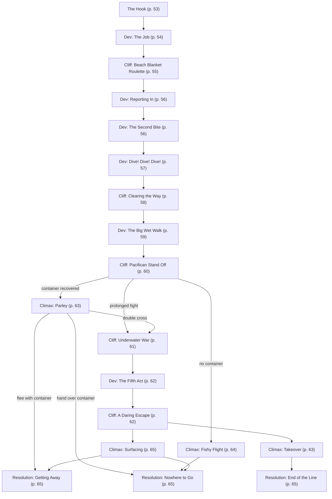

# Drummer and the Whale

Book pages 52–73

Mission involving a Pacific salvage job.

## Contents

- [Beat Chart](<05 Drummer and the Whale.md#beat-chart>) (p. 52)
- [Background](<05 Drummer and the Whale.md#background-read-aloud>) (p. 52)
- [The Rest of the Story](<05 Drummer and the Whale.md#the-rest-of-the-story>) (p. 52)
- [The Setting](<05 Drummer and the Whale.md#the-setting>) (p. 53)
- [The Opposition](<05 Drummer and the Whale.md#the-opposition>) (p. 53)
- [The Hook](<05 Drummer and the Whale.md#the-hook>) (p. 53)
- [Dev (The Job)](<05 Drummer and the Whale.md#dev-the-job>) (p. 54)
- [Cliff (Beach Blanket Roulette)](<05 Drummer and the Whale.md#cliff-beach-blanket-roulette>) (p. 55)
- [Dev (Reporting In)](<05 Drummer and the Whale.md#dev-reporting-in>) (p. 56)
- [Dev (The Second Bite)](<05 Drummer and the Whale.md#dev-the-second-bite>) (p. 56)
- [Dev (Dive! Dive! Dive!)](<05 Drummer and the Whale.md#dev-dive-dive-dive>) (p. 57)
- [Cliff (Clearing the Way)](<05 Drummer and the Whale.md#cliff-clearing-the-way>) (p. 58)
- [Dev (The Big Wet Walk)](<05 Drummer and the Whale.md#dev-the-big-wet-walk>) (p. 59)
- [Cliff (Pacifican Stand Off)](<05 Drummer and the Whale.md#cliff-pacifican-stand-off>) (p. 60)
- [Cliff (Underwater War)](<05 Drummer and the Whale.md#cliff-underwater-war>) (p. 61)
- [Dev (The Fifth Act)](<05 Drummer and the Whale.md#dev-the-fifth-act>) (p. 62)
- [Cliff (A Daring Escape)](<05 Drummer and the Whale.md#cliff-a-daring-escape>) (p. 62)
- [Climax (Takeover)](<05 Drummer and the Whale.md#climax-takeover>) (p. 63)
- [Climax (Parley)](<05 Drummer and the Whale.md#climax-parley>) (p. 63)
- [Climax (Fishy Flight)](<05 Drummer and the Whale.md#climax-fishy-flight>) (p. 64)
- [Climax (Surfacing)](<05 Drummer and the Whale.md#climax-surfacing>) (p. 65)
- [Resolution (Getting Away)](<05 Drummer and the Whale.md#resolution-getting-away>) (p. 65)
- [Resolution (Nowhere to Go)](<05 Drummer and the Whale.md#resolution-nowhere-to-go>) (p. 65)
- [Resolution (End of the Line)](<05 Drummer and the Whale.md#resolution-end-of-the-line>) (p. 65)
- [NET Architectures](<05 Drummer and the Whale.md#net-architectures>) (p. 66)
- [NPC Stat Blocks](<05 Drummer and the Whale.md#npc-stat-blocks>) (p. 68)
- [Drones, Vehicles, and Gear](<05 Drummer and the Whale.md#drones-vehicles-and-gear>) (p. 70)

---

*By Neil Branquinho*

**Estimated play time:** 4 to 6 hours

---

## Beat Chart

**Flow summary:** Fixer Rex Royale connects the Crew with corporate data analyst Drummer, who pays them to recover a mystery cargo pod washed ashore on the Night City waterfront. A second contact, Fife, hires the Crew for an underwater retrieval in flooded NCART tunnels — where Militech's SS *MacDonnelson*, a spider-crab guardian, and a commando dead drop collide. Outcomes range from escaping with Arasaka covert-ops gear to capture aboard a Militech sub, a daring Arasaka double-agent jailbreak, or seizing (and likely scuttling) a Garfish-class stealth submarine.

**Branching notes:**

- At **Cliff (Pacifican Stand Off)**, the Macrocheira crab attacks Militech drones on sight; restrained Crew may slip past.
- **Climax (Parley)** vs **Climax (Fishy Flight)** depends on whether the Crew recovers the second container.
- **Cliff (Underwater War)** and surrender lead to **Dev (The Fifth Act)** → **Cliff (A Daring Escape)** (Arasaka agent Jaya Almazan frees prisoners during a distant shock wave).
- Three resolutions track escape with loot, escape empty-handed, or catastrophic submarine takeover.

---

> **Background (Read Aloud)**
>
> It seems like it's been raining for a week straight. The weather reports keep talking about the rain washing away the dirt and grime, but last night's caustic acid rain and the greasy blood rain the day before just made things dirtier. In times like these a person needs a hobby to keep them sane. Luckily, a local Fixer by the name of Rex Royale just got in touch. There's a client looking for a crew to do some "easy" work down by the bay. Sounds too good to be true but hey, anything beats sitting on the couch watching reruns of *Hot Zone Divers* and *Pimp My Chrome*.

### The Rest of the Story

A naïve corporate data wonk named Drummer is looking to hire a team of Edgerunners to do some grunt work on his hobby project.

Drummer likes patterns. He loves finding them. He loves watching them. More than anything, he loves understanding them. He does the dullest of dull work: things like tracking microtrends in collected fault data for Raven Microcybernetics to build better repair predictions. However, in his off time, he and some acquaintances (calling themselves the Interesting Patterns Group) explore the broken, abandoned, and haunted leftover fragments of the glorious global NET.

While some people join the group looking for treasure or advancement, neither Drummer nor his close friend Fife are in this for power or money. It's all about the thrill of the chase and showing up their friends. Top explorers in the IPG, they've mapped out the remnants of EBM's abandoned voice message system. They built a moment-by-moment map of the collapse of the Trans-Pacific Backbone Routing System. In their latest expeditions, they've begun cataloging and analyzing ultra-low-frequency sonar sources that might represent old Megacorp assets deep in the ocean. Many of these are old repeaters with nothing hooked up to them, calling out to facilities or systems that no longer exist.

But not all of them.

Drummer calls it the Whale. At first it was just a series of ULF signals with a common encryption scheme. Then he discovered matching signals using the same encryption scheme irregularly popping up on the old optical network. Then, Drummer and Fife connected them to the Beachings: a series of brand new, shiny cargo pods, sources unknown, that wash ashore around the Pacific on a complex, pseudorandom schedule. No known cargo line, facility, or system can explain their data.

Something's down there. Something mobile. Given how far back the signals started, whatever it is almost certainly dates back to the 4th Corporate War.

#### So, What Is the Whale?

Somewhere deep on the Pacific floor, an experimental crawler manufactory, a joint project of CINO and Arasaka before the war, has been quietly following its preprogrammed mission: scooping up resources on the ocean floor, processing them into both manufacturing ingredients and finished products, and then dropping its work at predetermined "depot" sites.

However, not a living soul knows its location. The whole CINO branch responsible for directing the Whale in its mission was wiped out in the same artillery strike that destroyed most of its sibling craft in the Philippines. Arasaka lost most of its attached personnel in the same strike, and the rest all died in unrelated actions by the time Night City ate the big 'shroom. Add to that the damage of the Net's physical and logical collapse? The project's utterly buried and the handful of remaining Arasaka Execs who knew about the project have had no luck uncovering any information relating to it.

The Whale survives by being cautious. It never surfaces, and its communication attempts are so rare and careful that only a team of obsessive geniuses like Drummer and Fife could spot the pattern — and even then, they used over a decade of data.

In the absence of new orders for specific operations, the Whale creates a set of "staples" to drop at its hidden depots: pods full of fuel, military-grade materials, and a few with finished weapons or armor. It only stops when it realizes a depot's been uncovered or destroyed. However, nobody coded a plan for what to do if a depot was grossly overfilled, as several of them now are. A few of the depots are so overloaded with cargo containers that natural currents are carrying some of them away. So far, it's just been a few isolated cases — meaningless without the record of quiet, careful signals.

This is the pattern that Fife and Drummer have spotted. All they really care about is the discovery: understanding where the pattern's coming from and making a cool find that nobody else could have uncovered. But this discovery has a load of implications, any of which could bring a massive hammer of consequences down on some poor, unsuspecting Night City choombas just trying to make a living.

### The Setting

The Crew begins on the Night City Waterfront at Rusty's Dive Shack, where they meet their first contact, Drummer, and get the details of the initial job. From there, they'll head to South Night City to search for the first cargo container, which recently washed ashore.

After finishing their first job, the Crew will be contacted by their second contact, Fife, who meets them at a bar called Yum Seng in the Watson Development to discuss their next job. This job takes the Crew deep under Morro Bay, to a series of ruined NCART tunnels where they'll find the second cargo container. Finally, if things go poorly, the Crew may wind up aboard the Militech submarine, SS *MacDonnelson*, where they'll have to escape custody or play along to save their skins.

### The Opposition

- The **Bar Brawlers** are a ragtag group of Boostergangers equal to the Crew minus one who frequent Rusty's Dive Shack. The Crew encounters them harassing Drummer and can choose to fight them or diffuse the situation.
- The **Macrocheira Class Crabform** is a custom-made arthropod protector that guards the second cargo container. It reacts violently to anyone who comes close to the container, but will prioritize threats marked with Militech logos.
- The **Militech NASS-52 Underwater Drones** are two high tech drones being used as scouts for the SS *MacDonnelson*.
- The **SS *MacDonnelson*** is a state-of-the-art Militech Submarine, staffed by a skilled crew and outfitted with a number of dangerous weapons including drones and the Growler Sonic weapon.
- The **Dive Team of the SS *MacDonnelson*** is a crew of trained underwater operatives outfitted with diving equipment and prepared to confront and capture the Crew when the SS *MacDonnelson* enters the climactic battle.

See [NPC Stat Blocks](<05 Drummer and the Whale.md#npc-stat-blocks>) and [Drones, Vehicles, and Gear](<05 Drummer and the Whale.md#drones-vehicles-and-gear>) for stat blocks.

### The Hook

Rusty's Dive Shack is a literal heap. The front of the bar is the recovered bridge and loading doors of an old IHAG container sub. The owners carved the rest out of a stack of containers welded together. As you push through the creaking doors, you're hit by a wash of briny, beer-soaked air and the raucous shouting of dock workers, off duty sailors, nomads, and pirates. The bar takes up most of the downstairs, furnished with old tables and mess benches from commercial subs and ships. You can see a salvaged airlock which looks like it leads into the dive shop and an elevator which must go up to Rusty's private office. But one thing stands out like a neon sign.

Toward the back of the bar you spot a skinny guy in an expensive corporate suit doing the worst possible job of being inconspicuous. Half the bar's watching a couple of sailors leaning on the guy while a few others slip outside, either to avoid what's coming or to get tooled up for it.

One of the sailors puts his arm around the corp with a greasy smile. "Why you here, Money? Meeting someone? Hiring? 'Cuz I can use some cash!"

"N-no, I just—" The Corp tries his best to squirm out from under the burly man's arm but gets blocked by a heavily tattooed woman before he can finish his stuttered sentence.

"Yeah, chooms! 'Bux here can hire us!"

The first guy gives the Corp a hearty slap on the back, sending him doubling over. "Maybe 'Bux bein' here is a secret, y'aw! 'Bux, you can pay up f'us keep eyes out!"

Before the Crew can talk to their client and figure out what the job is, they need to get rid of these gangers. The Crew can calm the curious sailors (use **Boosterganger**, page 172. There are a number of them equal to the Crew minus 1) by buying them drinks with a DV9 Bribery Check or succeeding at a DV15 Persuasion Check. If the Crew fails either of these Checks the sailors become violent but won't fight to the death.

However, once the Crew has dealt with the sailors, they only have a few moments to speak with Drummer before a group of pirates (use **Road Ganger**, page 173. There are a number of them equal to the Crew) who left to get geared up return with their weapons. These dedicated head-crackers are ready for a fight and can only be dissuaded with a DV21 Persuasion Check.

Luckily, Drummer is used to taking orders from security teams, so he follows direction well. However, he's likely to freeze if violence starts and only move when someone does give him specific orders. If Drummer suffers a life-threatening injury, his corporate life-monitor summons a Trauma Team AV immediately. Needless to say, they're only interested in his welfare and may not take kindly to scruffy street types trying to thumb a ride with him.

**Go to:** [Dev (The Job)](<05 Drummer and the Whale.md#dev-the-job>)

### Dev (The Job)

Once the Crew has Drummer somewhere safer, he goes into a rambling explanation of ultra-low-frequency signals, underwater optical networks, and oceanic debris deposition that really doesn't explain much. A Crew member who makes a DV21 Cryptography or Electronics/Security Tech Check is able to piece together that Drummer tracked down a series of ULF signals from something at the bottom of the Pacific ocean and managed to determine that whatever made those signals has been depositing cargo containers at hidden locations on a semi-random schedule. After rambling for a minute, Drummer finally gets to business.

"There's a submarine cargo container somewhere on the South Night City beach or seawall. Or at least there should be. Um, I want you to find it. I know there are lots of wrecked containers in Morro Bay but this one should stand out: it'll be brand new. A big, carbon-resin thing with new paint and no logos. I don't have any photos or I'd share them. I don't really care what happens to the contents, but I need any information you can get from it that would help figure out where it came from. RFID chips, Bar Codes, Serial Numbers. Anything. I can pay you each 500eb."

**Go to:** [Cliff (Beach Blanket Roulette)](<05 Drummer and the Whale.md#cliff-beach-blanket-roulette>)

### Cliff (Beach Blanket Roulette)

The long section of beach that Drummer directs the Crew to is a mix of warehouses, flophouses, and smash-houses. None of them are safe. Few of them are legit. The roads are bad. The handful of legitimate businesses that operate here directly cater to 'gangers, criminals, and addicts. The rest are usually straight-up illegal. While there are technically security patrols, few of them are more than protection rackets. Much of the seawall was constructed by the lowest bidders and is barely maintained. Lawsuits are ongoing, but in the meantime it's risky to get too close to the water unless you're at one of the few legitimate corporate docks.

Recovering the container is a whole adventure in itself. Waste of the medical, industrial, and (worst of all) the human varieties are everywhere and the sprawl of shanty buildings make visibility on the waterfront minimal.

The Crew will have to make their way up and down the beach searching among the wreckage and refuse for the container. The beach can be divided into 6 sections. When the Crew searches a section of the beach, have each member make a DV17 Perception Check.

- If at least two members of the Crew beat the DV when searching a given section, they have found the container.
- Whenever two or more members of the Crew fail to roll above a DV of 13 on any of these Perception Checks, roll on the Hazard Table to see what happens to them.

Once they've found the container, **Go to:** [Dev (Reporting In)](<05 Drummer and the Whale.md#dev-reporting-in>)

#### Hazard Table

| 1d6 | Hazard |
|-----|--------|
| 1 | A group of drunken 'gangers of equal number to the Crew come out of a smash-house, looking for a fight (use **Boosterganger**, page 172). They can only be talked down with DV21 Persuasion Check or a DV13 Bribery Check. |
| 2 | A band of pickers (use **Road Ganger**, page 173) are scavenging the area. They make it clear they'll fight to defend their patch of sea wall though they won't fight to the death. They may shadow the Crew if they look like they have a promising lead on something good. |
| 3 | Loose wreckage shifts underfoot, toppling into the water — along with anyone standing on it. All Crew members must make a DV15 Athletics Check to avoid falling into the water and suffering 1d6 damage that ignores armor as the shifting concrete and carb-rebar collapses onto them. Those who fall in are trapped underwater and must make a DV13 Athletics or Contortionist Check to escape from under the rubble and reach the surface. |
| 4 | The tide has come in, submerging the area in a sludge so thick, so oily that it permanently and very visibly stains any cloth it touches. The clothes remain functional, but how can you wear your Joe Chiba beret in public with nasty smears on it? This kilometer stretch of the beach remains affected for the rest of the day. |
| 5 | A swarm of biting insects descend on the area. Gnats, mosquitoes, sand flies or some other nasty bugs begin to crawl into the Crew's clothing. All Crew members take a -1 to all non-combat Skill Checks that require their attention or focus until they leave this kilometer stretch of the beach. This section of the beach remains affected for the rest of the day. |
| 6 | Who threw that out? Something valuable, like a wallscreen, weapon, or even a nice piece of furniture is buried among the refuse. The object is worth up to 100eb. Why it was left out is up to the GM. |

### Dev (Reporting In)

Braving the dangers of the Night City Waterfront, the Crew finally finds the container: a sleek, coffin-sized capsule of white-painted carbon fiber nestled among the rubble. Once the Crew informs him of their find, Drummer excitedly reminds them search the container for barcodes, RFID tags, or any other identifying marks. However, even a careful search yields only a single barcode and a very simple RFID chip located next to the container's hatch.

If the Crew informs Drummer of this he suggests that maybe there's more inside and asks the Crew if they can open the container. Using a built-in hand crank the Crew can open the capsule, revealing its load: two separate compartments full of dime-sized balls, metal in one and ceramic in the other.

Drummer's disappointment at the results is obvious, but he tells the Crew they can keep the little balls — whatever they're worth. He just wants one of each to analyze. He then asks the Crew to meet him at the Short Circuit in Little Europe to drop off the goods and get paid. When the Crew gets to Short Circuit, Drummer is subdued and glum.

"I guess I thought it'd be something more… interesting." He buys a round of drinks but leaves without having anything himself.

**Go to:** [Dev (The Second Bite)](<05 Drummer and the Whale.md#dev-the-second-bite>)

> **Infobox: Cashing In**
>
> In the meantime, there's still a load of little mystery balls that may or may not be worth some money.
>
> With a DV13 Science or Basic Tech Check a Crew member can identify the balls as high-grade, purified manganese and ceramic components used to make ceramic armor.
>
> If they want to use the goods themselves, a Tech with the Fabrication Expertise can use all of the materials to Fabricate 1 suit of Metal Gear (Basic Tech Check DV29 and 1 month's time) or 4 suits of Flak (Basic Tech Check DV21 and 1 week's time per suit). Alternatively, a Tech with the Upgrade Expertise can use all of the materials to upgrade 1 vehicle with a Combat Plow and a Heavy Chassis (Vehicle Tech Check DV21 and 1 week's time per upgrade).
>
> The Crew can instead sell the materials via a Fixer, a Night Market, or a Midnight Market. The total value of the capsule and its contents is equal to 2,000eb per Crew member. A Fixer can find a buyer with a DV17 Trading Check. Anyone else must spend a day searching and roll a DV21 Trading Check to find a buyer.

### Dev (The Second Bite)

A few days pass with no news. Things may seem to be over, but then each member of the Crew gets a message from someone called Fife. "Tired of the ocean yet? More money if you're willing to dive back in. Don't worry. I'm a friend of Drummer." The message includes passes to a karaoke room at a bar called Yum Seng for the following evening.

Yum Seng is a hole-in-the-wall karaoke joint in the Watson Development which caters to the large Asian population moving into the district from Little China and Old Japantown. The bar's storefront is a riot of light and color. Barkers on the street wearing luminous clothing call out to passers-by to come inside for a good time. A large holotank mounted above the door shows hyper-real images of tuna, salmon, eels, octopi, and shrimp, all life-sized or bigger. They swim alluringly by overhead, hinting at the high-end seafood served inside.

As the Crew approaches, a holographic neon otter swirls into view, snatching one of the fish. It bobs its head toward them in greeting, then swims off as if going inside. If they watch closely, the otter pops up on screens ahead of them inside the bar as they walk to the karaoke room.

In the karaoke room, someone's set up a large holotank with a few chairs placed around it. It sits idle until the last member of the Crew arrives. Then it switches on, bringing up the image of a huge cetacean eye. The figure in the tank shrinks and changes quickly from a blue whale into a dolphin, which waves its fins in a clear greeting.

"My name's Fife!" the dolphin says. "Drummer is my friend — we share the same hobby. I guess you could call us data watchers." Fife explains their hobby more clearly than Drummer had been able to. They and Drummer are members of a group that love to explore data out of simple curiosity, reconstructing orphaned systems and even scanning the ruins of the Old NET, especially the networks that used to crisscross the Pacific seabed.

"We all love puzzles. We've unscrambled old voicemails from EBM's satellites. Drummer and I found the lost ships of the Busan Exodus based on public records. He's even developed safe ways of getting some data out of old Ihara-Grubb-based systems, though it's often pretty jumbled. Drummer asked me to help with this 'whale hunt.' I love it when he gets excited, and I know he's onto something. He's sad now. I hate that. He was so sure he had the trail, and now the water's gone still for him. He says there's no way to find it now. I keep telling him there must have been more than one container, but he's gone sad and boring and wants to sulk. So I went and did the math myself. And I think I can figure out where the containers are coming from. All I need is one more container to cross reference with the data you found with Drummer. And we're in luck. Night City's old transit system collapsed during the war, but it's still down there and big parts of it are open to the sea. Drummer isn't as good with the flow of water as he is with data. But I've re-done his model, and I'm pretty sure one of those pods got swept down into the old NCART tunnels. All I need are people who can go down there and get it. Maybe if we can find the coordinates for Drummer, he'll be happy again!"

Fife offers to pay 1,000eb per Crew member and supply equipment for the Crew to retrieve the container in the old NCART tunnels. It'll be underwater work, but only one or two hundred feet down. With the right gear, it should be easy enough.

**Go to:** [Dev (Dive! Dive! Dive!)](<05 Drummer and the Whale.md#dev-dive-dive-dive>)

### Dev (Dive! Dive! Dive!)

Fife asks the Crew to meet them at a nondescript dock in the Upper Marina as soon as possible. When they arrive, they are met by a partially submerged submarine which was obviously salvaged from the sea bottom. It's a big, sturdy, industrial design covered in lights and equipment. Its paint is chipped and there are plenty of dings and dents on its fittings, but it appears to be quite sturdy and carefully maintained. The hatch opens remotely, allowing the Crew inside, where they find an empty cabin. The only notable thing inside is another holotank installed by the pilot's seat, with a pack of holographic otters swimming in and out of it excitedly. Fife assures the Crew that they will be piloting the submarine remotely and tells them to get suited up with the provided gear at the back of the cabin.

If the Crew chooses to question Fife on why they insist on using holograms and remote communication, they are initially reluctant to explain for fear of putting off the Crew. They give the excuse that what they're doing isn't exactly legal and they don't want anything to trace back to them, though a Crew member who makes a DV15 Human Perception Check can tell this is a lie. If a Crew member makes a DV21 Persuasion Check or a DV17 Interrogation Check they can convince Fife to explain why they prefer remote communication. Their explanation is simply that they've undergone a number of exotic bio-sculpts which might make them off-putting to the average person. If the Crew convinces Fife to explain while they are in the submarine, Fife will swim up to the porthole to allow the Crew member to see them.

Several racks full of tools and diving gear line the rear wall of the cabin and contain the following.

- **Dry Suits:** Full body, neoprene suits (SP 7), which can be worn to keep the Crew member dry in the water. One per Edgerunner.
- **Flippers:** Plastic flippers which can be worn to negate the movement penalty imposed when swimming. One per Edgerunner.
- **Diving Helmets:** Armored, plastic helmets (SP 7), which have a glass view port, a mounted flashlight, and a mounted video camera which relays back to Fife's Submarine. One per Edgerunner.
- **Diving Rebreathers:** A complex, harnessed device which provides oxygen to the Crew member and keeps them neutrally buoyant. One per Edgerunner.
- **Radio Communicators:** One per Edgerunner.
- **Techtools:** One per Edgerunner.
- **Dosimeter Badges:** Designed to alert the Crew member when they come within 10m/yards of dangerous levels of Radiation. One per Edgerunner.
- **Two Remote Operated Vehicles (ROVs):** Ground Drones (see [Drones, Vehicles, and Gear](<05 Drummer and the Whale.md#drones-vehicles-and-gear>)) modified to maneuver underwater. Each one is connected to the submarine's NET Architecture (see [NET Architectures](<05 Drummer and the Whale.md#net-architectures>)).

**Go to:** [Cliff (Clearing the Way)](<05 Drummer and the Whale.md#cliff-clearing-the-way>)

### Cliff (Clearing the Way)

As the Crew gets suited up, Fife pilots the submarine out into the bay. Despite their assertion that they're piloting the submarine remotely, Fife is actually riding on the underbelly of the submarine, using a pair of sheltered handholds so that their connection with the ship's NET Architecture isn't broken.

The initial part of the cruise can be fun, looking up at the yachts and seeing the footings of the old and new Del Coronado Bridges. Then, as the sub travels onward and downward, the amount and type of wreckage begins to change. Twisted I-beams. Piles of burned-out vehicles. Chunks of buildings. Even a cargo ship with its superstructure visibly melted and blasted. All evidence of the radioactive rubble that was scraped out of the city and dumped in the ocean after the Night City Holocaust.

"Don't worry," Fife says, "I'm avoiding the really hot spots. I found a broken ship one time that was giving off Cherenkov radiation — can you image? Glowing and everything!" They chuckle.

The sub corkscrews carefully into a chasm in the seabed, sinking almost straight down into the dark. As it sinks, the work lights pick out even more remnants of the catastrophe. There's clothing that hasn't broken down, household appliances, and even the occasional cyberpart sticking out of the grime.

Finally, the sub reaches a broad ledge. "Should be right up here," Fife says, coaxing the sub in closer and closer to a dark space in the wall, stopping at times to use the sub's manipulators to clear away dangling bundles of cables, including a cloud of thin structural microfiber. If anyone onboard can direct an ROV either by hand or on the network, Fife asks for help.

"Don't want those getting into our impellers," Fife says. "I doubt you all want to walk home!"

The ROVs are semi-autonomous, so the operator's job is to give commands (forward slow, grab or release target, re-dock with sub, etc.). Directing the ROVs relies on the Concentration Skill but a Crew member with the Pilot Sea Vehicles Skill can steer the ROV by hand if they wish.

There are 2 large cables blocking the sub. They can each be shifted with a DV9 Concentration or Pilot Sea Vehicle Check.

More complicated are the 3 bunches of microfibers which are clogging the tunnel. To clear these a Crew member must make a DV13 Concentration or Pilot Sea Vehicles Check to maneuver the ROV close enough to the fibers without clogging the impellers, and then make a DV13 Concentration or Pilot Sea Vehicles Check to safely grab the fibers and move them.

If the Crew fails to maneuver the ROV close to the fibers safely, the impellers get tangled, rendering the ROV unable to move until the Crew member makes a DV13 Concentration or Pilot Sea Vehicles Check to untangle it. Once freed, the Crew member must only make the Check to grab the fibers.

> **Map key: NCART Tunnels Beneath the Bay**
>
> 1. Container & Guardian · 2. NCART Work Platform · 3. Mechanical Room · 4. NCART Work Platform · 5. Tunnel Entrance · 6. Fife's Submarine · 7. Fife's Hiding Place · 8. Direction to SS *MacDonnelson*

**Go to:** [Dev (The Big Wet Walk)](<05 Drummer and the Whale.md#dev-the-big-wet-walk>)

### Dev (The Big Wet Walk)

Once they're through, the submersible's lights reveal the broken ends of several huge tunnels made from fiberized cement. Embossed NCART logos are still visible on several of the tunnel walls.

"This is as close as I can bring you," Fife says. "Any closer and I might knock something loose."

Fife indicates the biggest tunnel. "The currents here funnel through there. Follow the flow — if the container's down here, that's where it would wind up. Don't hit anything too hard or you might destabilize the structure. And check your dosimeter badges. I'm not reading anything out here, but… the currents catch what they catch."

Now it's up to the Crew. Any Netrunners in the Crew can choose to plug into one of the ROVs instead of physically leaving the ship and other Crew members such as Techs may want to remotely control one of the ROVs from the sub's cabin. But for everyone else, the open ocean awaits.

#### Exiting the Ship

The sub's main airlock can fit 4 people at a time and takes 1 minute to cycle. Just in case the Crew members need to pass things in and out of the ship, the sub is also fitted with an equipment airlock which can hold anything smaller than 1 m/yd square and takes 3 Rounds to cycle.

Once the Crew's outside, they're now alone on the bottom of the Pacific. Kind of. There are two big complications that Fife didn't foresee.

First, their mission is not as secret as they've hoped. There's a U.S. government covert team shadowing the Crew as part of investigations into a flow of high-quality military armor components. This wasn't the first container, and satellites were watching to see who'd come looking for it. As a result, there are two Militech NASS Underwater Drones following the submersible from 60m/yds away to avoid being spotted by Fife's Submarine's Sonar. Their parent submarine, the SS *MacDonnelson* is lurking 40m/yds behind them. The Militech drones, while they're unlikely to take the first shot, are well-armed and ready for a fight.

Second, the Cargo Container that drifted into the remains of the NCART tunnels is a Covert Ops dead drop designed for Arasaka agents to dive down and pick up without being spotted. When the Whale creates covert ops containers like this, it attaches protectors to them. These protectors are force-grown, cyber-enhanced creatures derived from the Japanese spider crab with legs 3 m/yd long, claws that can tear off limbs, and an in-built compulsion to slaughter anyone tampering with the container.

**Go to:** [Cliff (Pacifican Stand Off)](<05 Drummer and the Whale.md#cliff-pacifican-stand-off>)

> **Infobox: The Prize**
>
> This second container is very different from the first. It's a low-reflective stealth container carrying a commando mission package: big-kid toys for fighting a global war. It has an external hard point for pickup and transportation to the mission site. It contains:
>
> - 6 Combat Med-Packs loaded with 1 Airhypo, 2 Doses of Speedheal, and 2 Doses of Black Lace.
> - 6 Radio Communicators with a built-in Scrambler/Descramblers.
> - 2 Satellite Target Designators used to designate targets to orbiting weapons platforms. Unfortunately, the weapons platforms linked to these designators are no more.
> - 6 Excellent Quality Heavy Pistols made from biopolymers invisible to metal/millimeter-wave detectors.
> - 6 Medium Armorjacks with removable Arasaka patches.
>
> The container balances its own buoyancy automatically, so two people can drag it using the hard point. This reduces their MOVE by 2. A submarine can tow the container easily, assuming someone attaches a line between them.

### Cliff (Pacifican Stand Off)

As the Crew moves into the tunnel, Fife swims into cover nearby (about 8 m/yds away), staying in contact by Radio Communicator.

The Militech drones (see [Drones, Vehicles, and Gear](<05 Drummer and the Whale.md#drones-vehicles-and-gear>)) move quietly toward the scene for a better look, too. Even though they're 12-foot torpedoes, they're essentially silent, only apparent to the eye. A Crew member must make a DV17 Perception Check to spot them. They only close in on the sub once they see the Crew enter the tunnel. Of course, they're not expecting an Exotic like Fife on the site.

Once the drones are within 30 m/yds of the sub, Fife sees them. "Ah. Um, I didn't expect this, but we have visitors snooping around out here. Everyone just be calm and let's hope this is nothing."

Barring any provocation, the drones split up. Their orders are to follow the group, record and relay what they find, and potentially capture the Crew if it's obvious they're handling contraband. Drone One moves into the tunnel after the Crew. Drone Two surveys the submarine, then hovers over it, keeping an eye on Fife. Anyone inside the sub can hear the quiet wash of its impellers as it maneuvers.

Meanwhile, inside the tunnel, the cargo container's protector (see [Drones, Vehicles, and Gear](<05 Drummer and the Whale.md#drones-vehicles-and-gear>)) senses disturbances in the water. It's covered in detritus that makes it very difficult to notice (DV17 Perception Check). It doesn't act against humans or animals unless they get very close (4 m/yd) to the container, in which case it strikes and then returns to guarding. However, the crab's orders assume the War is still going on. If it sees a Militech logo or encounters military vehicles or drones that don't return a valid Arasaka/CINO IFF (Identify Friend or Foe code) when challenged, it immediately attacks.

So the Crew, if they move carefully, won't set it off until they try to approach the container. But the moment one of the Militech drones heaves into view, the crab sends an IFF pulse. When the drones do not correctly acknowledge it, the crab attacks.

The crab moves directly toward the drones, striking at anyone en route, but not staying to engage them unless they've fired first. It assumes the drones are the major threat. If the Crew are incredibly restrained, they might get out of the way and have a chance to escape the fight.

However, though the drones recognize the crab as the major threat, they assume the Crew must be allied with it. Militech would like to capture and interrogate them, but not at the risk of losing its expensive drones. Because Drone One is in the tunnel, it's been ordered to use its Circular Saw (Very Heavy Melee Weapon) to defend itself rather than its Torpedoes. Outside the tunnel, Drone Two remains focused on Fife and Fife's Submarine and will only get involved if Drone One is destroyed or if something leaves the tunnel.

#### Torpedoed

The battle in the decommissioned NCART tunnel is far more dangerous than it seems at first glance. With crab claws, buzz saws, and possibly bullets flying, the unstable tunnel is at real risk of collapse. If any combatant misses their attack Check to hit a target in the tunnel, the attack instead strikes the tunnel wall and deals damage to the tunnel's HP. Additionally, an explosion in the tunnel deals damage to the tunnel's HP automatically.

The area's wreckage as a whole can take 35 points of damage before it begins collapsing. After that, silt begins drifting from the ceiling and deep groans resound through the water.

Every further damaging impact or explosion causes immediate falls of wreckage in a 6 m/yd radius around the point or area struck. Anyone in that area must immediately make a DV15 Evasion Check or take 6d6 damage and be trapped under the rubble. After being trapped, the character must make a DV15 Athletics or Contortionist Check on their Turn to get free. Mud and silt also fill the water in that area, blocking line of sight and imposing a -4 to tasks or attacks that require sight, just like a Smoke Grenade (see CP:R page 347).

After five such impacts, the wreckage falls become constant. Anyone in the tunnel must make a DV10 Evasion Check at the start of each of their Turns to avoid being hit by wreckage. Also, water throughout the entire tunnel becomes muddy and hard to see through, as described above.

#### Management Decisions

Fife went on this little adventure to cheer Drummer up by finding the next piece of his puzzle. This had all been an intellectual exercise up until now. Now their life is on the line. Fife feels some responsibility for their hirelings but won't risk their own life for anyone else. On the other hand, there's a military drone between Fife and the sub.

Fife doesn't have a combat mentality. That's what hired street types are supposed to be for. As soon as fighting starts, Fife calls the Crew. "Time to go! Those things could set off a collapse — get back to the sub!" Fife watches for a chance to reach the sub unseen. In the meantime, if they can use the sub's manipulator arms (which can be used as Cyberarms or Heavy Melee Weapons) or tools to tip combat in their favor, they'll do so.

If combat stirs up the muck, the resulting plume of silt and dirt from the tunnel surrounds the submarine and the drone in a 10m/yd radius area of dirt. This low visibility causes Fife to lose sight of the Submarine and the Drone and obscures the outside world to everyone in the Submarine as if they were in the area of a Smoke Grenade.

In two circumstances, Fife immediately leaves:

- If Fife thinks the whole Crew are beyond help, they attempt to flee with the sub.
- If the sub is knocked out, Fife swims off on their own.

#### Enemy Contact

There's also the commando submarine (the Garfish-class SS *MacDonnelson*) full of Militech naval personnel out there monitoring their drones. They're in a delicate position. While they're technically in international waters, their drones are in Night City's jurisdiction. This happens often on both sides, and rarely becomes an incident. But when shooting starts, especially if Night City citizens die (or a bunch of seismometers go off because of an underwater landslide), that's a big escalation.

If the SS *MacDonnelson* itself has to go into Night City's waters, that's really big: it's a true military incursion and likely that the independent city state would call on the aid of their more powerful partners in the Pacifica Confederation.

Before the SS *MacDonnelson* engages personally, they wait to see how their drones handle the situation. As soon as one of the Drones is destroyed or seems outmatched, the SS *MacDonnelson* deploys a Dive Team (see [NPC Stat Blocks](<05 Drummer and the Whale.md#npc-stat-blocks>); arm some with Assault Rifles) to intercept the Crew and try to capture them, all outfitted with Rebreathers and Flippers in addition to their normal gear.

- If the Crew makes it back to Fife's sub with the cargo container, **Go to:** [Climax (Parley)](<05 Drummer and the Whale.md#climax-parley>)
- If the Crew makes it back to Fife's sub but doesn't have the cargo container, **Go to:** [Climax (Fishy Flight)](<05 Drummer and the Whale.md#climax-fishy-flight>)
- If the Crew ends up in a prolonged fight, **Go to:** [Cliff (Underwater War)](<05 Drummer and the Whale.md#cliff-underwater-war>)

### Cliff (Underwater War)

If the Crew decides to continue fighting and perhaps try to make it back to Fife's ship, the battle resumes but with the crew of the SS *MacDonnelson* at the top of the Initiative order. The Crew of the SS *MacDonnelson* operate the ship's weapons and maneuver the ship.

The two crew members in the Weapons Control room work together to fire and reload the Growler (see [Drones, Vehicles, and Gear](<05 Drummer and the Whale.md#drones-vehicles-and-gear>)), while Commander Walsh makes any maneuvers needed for the SS *MacDonnelson*. The Commander has forbidden the crew from firing the Torpedoes to avoid causing a stir underwater that might be recognized by the city above, but the Growler itself doesn't cause the same recognizable signature.

On Round 5 of the combat, the SS *MacDonnelson* (see [Drones, Vehicles, and Gear](<05 Drummer and the Whale.md#drones-vehicles-and-gear>)) makes its way into the fray, leveling the Growler at the Crew. With a new, more dangerous threat on the board, Fife radios the Crew.

"We can't win this fight! They have way too many guns! I don't even know what that thing on the belly of their ship is, but it looks military grade! Lay down your weapons and maybe we can talk this out!"

Fife then swims out of cover and raises his hands in surrender.

Fife is whisked off the battlefield into the SS *MacDonnelson* by one of the Divers as soon as they can and if any of the Crew opts to surrender, the crew of the SS *MacDonnelson* will allow them to. They then take the Crew into the SS *MacDonnelson* as prisoners.

**Go to:** [Dev (The Fifth Act)](<05 Drummer and the Whale.md#dev-the-fifth-act>)

### Dev (The Fifth Act)

If the Crew agree to go quietly or are captured, the SS *MacDonnelson*'s Dive Team takes them into the ship and strip them of their gear, excluding their clothing. The Crew's weapons, gear, and tools as well as the Cargo Container are all stashed in Gear Stowage. Anyone with obvious cyberweapons is placed in a separate cell and watched carefully by one of the Divers.

The Crew are left in the cell for what feels like a few hours, while the Militech agents examine the cargo container, looking for data. They are guarded by the remaining divers, save for one, who have been ordered not to speak with the prisoners. Fife is struggling to remain positive, assuring the Crew that if they just play along Militech will let them go with a warning. If the Crew chooses to fight the SS *MacDonnelson*, Fife is less positive, concerned that the Crew's actions may have doomed them to being carted off to a black site or killed and dumped in the ocean. Still, they try to be positive.

Eventually, Commander Walsh will come down to speak with the Crew. He strides into the room, confident of his position and says with derision: "The United States Government thanks you for your cooperation, civilians. The cargo container you stumbled on is actually contraband, left over from the 4th Corporate War. Very dangerous and highly unstable. For the betterment of the Nation, we'll be transporting it back to Militech headquarters for disposal."

Any Crew member who makes a DV15 Human Perception Check is aware that this is a blatant lie on the part of Commander Walsh, and any Crew member who makes a DV13 Streetwise, Local Expert (Night City Harbor) or Bureaucracy Check is aware that they are still in Night City waters meaning the United States Government does not have jurisdiction here. This matter should be resolved by the Night City Council. If the Crew points either of these things out, Walsh gets visibly irritated but then calms himself.

"I'll give you one chance to end this in your favor, pirates. Because I'm feeling generous. Forget what you saw here today and you'll be compensated and let free. One hundred euro dollars for each of you. I'd rather this not have to get messy."

**Go to:** [Cliff (A Daring Escape)](<05 Drummer and the Whale.md#cliff-a-daring-escape>)

### Cliff (A Daring Escape)

As the Crew is being strong-armed by Commander Walsh, an alarm suddenly blares over the loudspeakers. Over the intercoms, a panicked voice says "Commander Walsh, long range sensors just registered a shock wave off the coast! The blast must have been massive!"

Commander Walsh goes pale and curses loudly before running out of the brig, headed for the Control Room. As he does, the remaining diver comes into the room with a duffel bag and says to the others, "Go with the commander. I'll handle them."

When the room empties, Jaya looks over the Crew, drops the bag in front of the cell, and walks to the door. "Arasaka thanks you for helping us secure our lost asset. The airlock is down the hall to the left."

Moments after Jaya leaves the room the cell doors open, letting the Crew loose. Inside the duffel bag is their gear, all exactly as it was when it was taken. By the time they get outside, Jaya is in the airlock, leaving the submarine. From here, the Crew has a choice. They can get the cargo container and leave through the airlock in which case they can sneak back to Fife's ship or they can try to investigate the *MacDonnelson*.

If the players try to chase down and confront Jaya, use the **Security Operative** (see page 173), equipped with diving gear. Jaya has no interest in fighting the players and is under orders not to explain her mission further. She is heading for her personal submarine (use **Fife's Submersible**, see [Drones, Vehicles, and Gear](<05 Drummer and the Whale.md#drones-vehicles-and-gear>)) which is floating just out of sonar range of the *MacDonnelson*.

Three Rounds after the Crew exits the Brig, the Balron in the Submarine's NET Architecture (see [NET Architectures](<05 Drummer and the Whale.md#net-architectures>)) spots the Crew through observation cameras, sounds the alarm, and activates the Mini Air Drone (see page 174) in the Drone Bay on the bottom level. The remaining divers, who had been in the Command Deck scramble but a security officer remains on the Command Deck with Commander Walsh as protection.

If the Crew decides, for whatever reason, to try to take control of the *MacDonnelson*, **Go to:** [Climax (Takeover)](<05 Drummer and the Whale.md#climax-takeover>). Otherwise, **Go to:** [Climax (Surfacing)](<05 Drummer and the Whale.md#climax-surfacing>)

> **Infobox: The Double Agent**
>
> While the Crew were being loaded into the Brig, one of the divers lugged the cargo container to the Gear Storage. This diver, Jaya Almazan, is actually a double agent, working for Arasaka. Once left alone with the container, she transferred the data on the container through a series of covert relays to an Arasaka ship further out in the Pacific. This ship cross-referenced the data with the numerous other containers it already found and relayed the path of the Whale to a group of Arasaka Submarines which have been combing the ocean floor looking for it. With the coordinates, the Submarines set off to destroy the Whale before it can be discovered.

### Climax (Takeover)

The Crew of the SS *MacDonnelson* will fight to the death to keep control of the ship. If the Crew looks like they're going to take over the ship, Commander Walsh (or another crew member) will run to the controls on the command deck and activate the emergency scuttling program. Immediately after activation, the detonator charges along the hull of the ship blow open the two Engineering Bays, killing power to the ship. The ship's lighting switches to dim red emergency lighting, the NET Architecture shuts down, and the ship begins to flood with water. At the beginning of every Round, any room or hallway adjacent to a flooded chamber is flooded by seawater. After activating the Scuttling Program, Commander Walsh and the remaining crew attempt to escape the sinking ship and get to shore.

If the Crew somehow manages to take over the SS *MacDonnelson* before Commander Walsh or one of his subordinates activates the Scuttling Program, they are now in command of a Militech Submarine which is also the property of the United States Military.

**Go to:** [Resolution (End of the Line)](<05 Drummer and the Whale.md#resolution-end-of-the-line>)

### Climax (Parley)

If the Crew manages to get back to Fife's Submarine with the cargo container, the Militech forces focus entirely on them. The crew of the SS *MacDonnelson* would rather take the cargo container whole and the Crew alive if possible and they hail the Crew.

"Attention, unregistered vessel. This is Commander Walsh of the SS *MacDonnelson*. The container you have aboard your vessel is contraband. Under the jurisdiction of the United States Government I am ordering you to return the container and any and all associated materials. If you refuse, we will be forced to open fire on your vessel."

Any Crew member who makes a DV15 Human Perception Check is aware that this is a blatant lie on the part of Commander Walsh, and any Crew member who makes a DV13 Streetwise, Local Expert (Night City Harbor) or Bureaucracy Check is aware that they are still in Night City waters meaning not only does Commander Walsh not have jurisdiction but if he does open fire, it's very likely to cause an international incident. If the Crew points either of these things out, Walsh changes his tactic.

"Who are you? Pirates? Nomads? Fine. If money is what you're after, I can promise you more than you'll find in that cargo container. Turn over the container and you'll be paid handsomely. Two thousand euro dollars per person and I won't mention this little incident in my report."

If they are made aware of the Commander's bluff, and Fife is aboard the ship, they're adamant that fleeing is the best course of action. They plead with the diving Crew on behalf of Drummer and the mystery of the Whale. "You said it yourselves! He's bluffing! We can just leave! They can't do anything to us and we can take the container back to Drummer! We need to study this container! We need time!"

Still, not being a combatant, Fife is in no real place to force the Crew to do anything. If the Crew chose to hand over the cargo container, the SS *MacDonnelson*'s Dive Team meets them outside the ship and hands off a credit chip with the appropriate amount of money. They take the container and head back out into international waters. **Go to:** [Resolution (Nowhere to Go)](<05 Drummer and the Whale.md#resolution-nowhere-to-go>).

If the Crew still decides to flee, there is very little Commander Walsh and the Crew of the SS *MacDonnelson* can do without getting themselves in deep trouble. They let the Crew leave, but the Edgerunners and Fife have made a powerful enemy with ties to Militech and in the USA Military. Commander Walsh is a cunning man who has fought guerrilla wars before, and he doesn't forget a failure or a slight easily. **Go to:** [Resolution (Getting Away)](<05 Drummer and the Whale.md#resolution-getting-away>).

If the Crew tries to double cross Walsh and take the money without giving him the container, the Dive Team will open fire with intent to kill the Crew. They can't afford to blow up the Crew's submarine, but they can clean up a few dead bodies in the ocean. **Go to:** [Cliff (Underwater War)](<05 Drummer and the Whale.md#cliff-underwater-war>).

> **Infobox: The NET**
>
> There are no Netrunners stationed aboard the SS *MacDonnelson*. Instead, they rely on the Balron Class Demon in the NET Architecture to handle intruders. There are still a number of Access Points in the ship. A Netrunner Crew member can find an Access Point to the SS *MacDonnelson*'s NET Architecture in the following rooms: The Command Deck, Engineering (Upper), Engineering (Lower), and The Drone Bay.
>
> From within the Architecture, the Crew could take over the ship, mess with the ship's security measures, command the ship's drones, fire the ship's weapons, or even unmount the Militech Growler to take. But they will have to contend with the Architecture and the Balron if they want to do any of that. If they feel that the Crew has the situation under control, Fife will help the Crew deal with the Balron.

> **Map key: SS *MacDonnelson* Upper Deck**
>
> 1. Command Deck · 2. Combat Lock · 3. Muster Area · 4. Crew Cabins · 5. Gear Stowage · 6. Infirmary · 7. Brig · 8. Troop Cabin · 9. Engineering (Upper)
>
> **Lower Deck:** 1. Weapons Control · 2. Magazines · 3. Drone Bay · 4. Machine Room · 5. Engineering (Lower)

### Climax (Fishy Flight)

If the Crew manages to get back to Fife's Submarine without the cargo container, the Militech forces shift their focus to securing the cargo container.

If any of their drones remain, Walsh orders one to follow the Crew and make sure they don't double back, but it stops following them after they get about 1 mile (1.6 kilometers) away.

If Fife is still alive, they join the Crew in their flight whether they were able to make it aboard the submarine or had to follow behind. The Militech operatives aren't interested in the Crew and won't give chase.

**Go to:** [Resolution (Nowhere to Go)](<05 Drummer and the Whale.md#resolution-nowhere-to-go>)

### Climax (Surfacing)

If the Crew escapes the Militech vessel they are able to make it back to Fife's Submarine. The Militech agents are far more interested in the current emergency than the prisoners they think are in the brig. The Crew are able to head back to the surface, possibly with the cargo container in tow. If they have the container, **Go to:** [Resolution (Getting Away)](<05 Drummer and the Whale.md#resolution-getting-away>). Otherwise, **Go to:** [Resolution (Nowhere to Go)](<05 Drummer and the Whale.md#resolution-nowhere-to-go>).

### Resolution (Getting Away)

If the Crew escaped with Fife and the Cargo Container, Fife excitedly brings them back to the surface and thanks them for their hard work, paying them what they're owed. Fife promises them more adventure and more money in the future once they reverse engineer the coordinates.

After returning to the surface, the Crew goes back to their normal lives but just a few days later they get a solemn message from Fife. They and Drummer were able to trace the coordinates of the Whale but seismograph readings show that there was a massive explosion directly at those coordinates on the same day the Crew found the Cargo Container. There are no more ULF signatures and the trail appears to have gone dead. Fife and Drummer are grim but thankful to the Crew for helping them. The Crew has earned two allies who could be quite useful in the future. While they're more analysts than expert Netrunners, they know lots of techs, netheads, and academics, which can be enormously useful on tricky jobs.

### Resolution (Nowhere to Go)

If the Crew escaped without the cargo container, the trail has more or less ended. Fife is sullen and pays the Crew half of what they agreed upon before disappearing back into the ocean. They don't see the use in trying to steal the cargo container back from Militech and if the Crew gave the container to Commander Walsh, Fife resents them for it.

### Resolution (End of the Line)

The Crew must decide on what to do with their spoils. Their smartest choice would be to steal everything that isn't nailed down and scuttle the ship. No one but a Fixer with an Operator Rating of 9 or higher could find a buyer willing to buy something so hot and the ship has the eyes of the USA Military on it. Militech and the USA military will come looking for the SS *MacDonnelson* and the Night City Council isn't interested in starting an international incident to protect some random Edgerunners who've stolen USA property.

Fife is smart enough to want nothing to do with the Crew after this and breaks off contact entirely. If the Crew has the cargo container, it is up to them to decide what to do with it.

> **Infobox: Losing Fife**
>
> If Fife died during the mission, life goes back to normal. The Crew won't be paid for this latest job, obviously. If they got away with the container, they could try take it to Drummer but he's in mourning and wants nothing to do with them. Drummer ghosts them. The ULF Signatures stopped and he didn't think to tell the Crew anything.

---

## NET Architectures

### Fife's Submarine NET Architecture

| Demons Installed | None |
| REZ | — |
| Interface | — |
| NET Actions | — |
| Combat Number | — |

| Floor | DV | Node |
|-------|-----|------|
| 1 | — | Password |
| 2 | 8 | Black ICE: Killer |
| 3 | 8 | Password |
| 4 | 8 | Password |
| 5 | — | Black ICE: Hellhound |
| 6 | 8 | Control Node: Manipulator Arm |
| — | — | File: Deep Ocean Exploration Recordings |
| — | — | Control Node: ROV Controls |

### SS *MacDonnelson* NET Architecture

| Demons Installed | Balron (tasked to cameras and drones only) |
| REZ | 30 |
| Interface | 7 |
| NET Actions | 4 |
| Combat Number | 14 |

Can perform any NET Action a Netrunner is capable of.

| Floor | DV | Node |
|-------|-----|------|
| 1 | — | Black ICE: Raven x2 |
| 2 | 10 | Password |
| 3 | — | — |
| 4 | — | Black ICE: Asp, Raven |
| 4B | 10 | — |
| 5 | 10 | Control Node: Observation Cameras & Blast Doors |
| 5 | 10 | Control Node: Submarine Maneuvering |
| 5 | — | Black ICE: Dragon |
| 5 | 10 | Control Node: Underwater Drones |
| 6 | 10 | Password |
| 8a | — | Black ICE: Hellhound, Scorpion |
| 9B | 10 | Control Node: Onboard Drone |
| 9a | 10 | Control Node: Torpedoes & Missiles |
| 10a | 10 | Control Node: Growler |
| 10a | — | Black ICE: Liche |

---

## NPC Stat Blocks

Important NPCs in Tales of the RED: Street Stories are presented in two formats. Mooks and minor combatants have an abbreviated stat block presenting only essential information. NPCs with whom the Crew might have a deeper interaction have a full stat block. We include a Combat # (C#) for each listed attack to help speed up the fight.

For more information on important NPCs see Appendix B: Biographies.

### Drummer — NPC Stat Block

**Netrunner: Interface 4** · **REP 1**

| INT | REF | DEX | TECH | COOL | WILL | MOVE | BODY | EMP |
|-----|-----|-----|------|------|------|------|------|-----|
| 8 | 5 | 4 | 8 | 4 | 5 | 5 | 4 | 4 |

| HP 35 · Seriously Wounded 18 · Death Save 4 |

**Weapons & Armor**

| Weapon | ROF | Damage | Armor/SP |
|--------|-----|--------|----------|
| Heavy Pistol (C# 6) | 2 | 3d6 | Head: None SP 0 |
| None | — | — | Body: Kevlar SP 7 |

**Skills:** Athletics 6, Basic Tech 13, Brawling 6, Concentration 9, Conversation 6, Cryptography 17, Deduction 15, Education 16, Electronics/Security Tech 12, Evasion 6, First Aid 12, Forgery 10, Handgun 6, Human Perception 7, Language (Korean) 14, Language (Streetslang) 14, Local Expert (Little Europe) 9, Library Search 15, Perception 11, Persuasion 6, Pick Lock 11, Resist Torture/Drugs 7, Stealth 8

**Gear:**

- Heavy Pistol Ammo x8
- Agent
- Anti-Smog Breathing Mask
- Cyberdeck (Excellent Quality)
- Memory Chip x10
- Trauma Team Silver Card
- Cyberdeck Programs: Banhammer, DeckKRASH, Eraser, Hellbolt, Shield, Sword

**Cyberware:**

- Biomonitor
- Cybereye x2 w/ Virtuality
- Neural Link w/ Interface Plugs

---

### Fife — NPC Stat Block

**Netrunner: Interface 4** · **REP 1**

| INT | REF | DEX | TECH | COOL | WILL | MOVE | BODY | EMP |
|-----|-----|-----|------|------|------|------|------|-----|
| 7 | 5 | 4 | 7 | 4 | 5 | 3 | 6 | 4 |

| HP 35 · Seriously Wounded 18 · Death Save 6 |

**Weapons & Armor**

| Weapon | ROF | Damage | Armor/SP |
|--------|-----|--------|----------|
| None | — | — | Head: Skinweave SP 7 |
| None | — | — | Body: Skinweave SP 7 |

**Skills:** Athletics 10, Basic Tech 13, Brawling 6, Conceal/Reveal Object 11, Concentration 12, Conversation 6, Cryptography 17, Deduction 15, Education 14, Electronics/Security Tech 13, Evasion 8, First Aid 13, Forgery 13, Handgun 10, Human Perception 8, Language (English) 14, Language (Streetslang) 12, Local Expert (Night City Harbor) 16, Library Search 11, Perception 11, Persuasion 8, Pick Lock 13, Resist Torture/Drugs 9, Stealth 9

**Gear:**

- Aquaform Exotic Biosculpt
- Waterproof Cyberdeck (Excellent Quality) w/ Range Upgrade
- Radio Communicator
- Cyberdeck Programs: Banhammer, DeckKRASH, Eraser, Hellbolt, Shield, Sword, Worm

**Cyberware:**

- Cybereye x2 w/ Low-Light/Infrared/UV, Virtuality
- Cyberleg x2 w/ Web Foot
- Gills
- Neural Link w/ Interface Plugs
- Radar/Sonar Implant
- Skin Weave

---

### Commander Aaron Tyler Walsh — NPC Stat Block

**Solo: Combat Awareness 6** · **REP 3**

| INT | REF | DEX | TECH | COOL | WILL | MOVE | BODY | EMP |
|-----|-----|-----|------|------|------|------|------|-----|
| 6 | 7 | 7 | 3 | 8 | 7 | 5 | 6 | 6 |

| HP 45 · Seriously Wounded 23 · Death Save 6 |

**Weapons & Armor**

| Weapon | ROF | Damage | Armor/SP |
|--------|-----|--------|----------|
| Very Heavy Pistol (C# 14) | 1 | 4d6 | Head: Light Armorjack SP 11 |
| Light Melee Weapon (Dive Knife) (C# 13) | 2 | 1d6 | Body: Light Armorjack SP 11 |

**Skills:** Athletics 14, Basic Tech 6, Brawling 14, Concentration 14, Conversation 8, Deduction 10, Education 10, Electronics/Security Tech 6, Endurance 14, Evasion 13, First Aid 8, Handgun 14, Heavy Weapons 10, Human Perception 10, Language (English) 14, Language (Streetslang) 14, Local Expert (Pacific Coast) 16, Melee Weapon 13, Perception 12, Persuasion 12, Pilot Sea Vehicle 16, Resist Torture/Drugs 14, Sea Vehicle Tech 10, Shoulder Arms 14, Stealth 10, Weaponstech 10, Wilderness Survival 10

**Gear:**

- Very Heavy Pistol Ammo x16
- Agent
- Memory Chip x5
- Radio Communicator w/ Scrambler/Descrambler
- Techtool

**Cyberware:**

- Cybereye x2 w/ Chyron, Low-Light/Infrared/UV
- Cyberarm w/ Popup Shield
- Gills
- Neural Link w/ Chipware Socket

---

### SS *MacDonnelson* Crew/Diver (Mook)

| HP 40 · INIT 10 · MOVE 6 · Combat # 6 · REP 0 |

**Weapons & Armor**

| Weapon | ROF | Damage | Armor/SP |
|--------|-----|--------|----------|
| Heavy Pistol | 2 | 3d6 | Head: Light Armorjack SP 11 |
| Light Melee Weapon (Dive Knife) | 2 | 1d6 | Body: Light Armorjack SP 11 |

**Skills:** Athletics 12, Basic Tech 10, Brawling 10, Concentration 12, Conversation 6, Deduction 7, Education 10, Electronics/Security Tech 10, Endurance 12, Evasion 10, First Aid 8, Handgun 12, Heavy Weapons 10, Human Perception 8, Sea Vehicle Tech 13, Language (English) 14, Language (Streetslang) 14, Local Expert (Pacific Coast) 15, Melee Weapon 11, Perception 10, Persuasion 12, Pilot Sea Vehicle 16, Resist Torture/Drugs 12, Shoulder Arms 10, Stealth 10, Weaponstech 9, Wilderness Survival 9

**Gear:** Heavy Pistol Ammo x16, Radio Communicator w/ Scrambler/Descrambler, Techtool

**Cyberware:** Cybereye x2 w/ Chyron, Low-Light/Infrared/UV, Independent Air Supply

---

## Drones, Vehicles, and Gear

### Fife's ROV Drones

Underwater drones in the form of small submarines.

| Loadout | Default Trigger | Data |
|---------|-----------------|------|
| Observation Camera, Lightweight Manipulator Arm | None. Controlled Directly. | 4 MOVE · 30 HP · Perimeter of Defended Area · DV21 Electronics/Security Tech, 5min to counter. |

### Macrocheira-Class Crabform

A giant, enhanced semi-organic guardian. Each one has a conditioned bond with whatever object or location it's given to guard. It recognizes wartime CINO/Arasaka IFF codes and accepts those who broadcast them as allies. The semi-organic nature of the creature prevents Netrunners from altering its behavior. It's possible to locate the RFID/pheromone tag that binds it which is located on the outside of the Cargo Container by making a DV15 Perception Check. Once an Edgerunner reaches the tag, they can roll a DV17 Electronics/Security Tech Check to make the Crabform docile.

| Loadout | Default Trigger | Data |
|---------|-----------------|------|
| Low-Light/Infrared/UV, IFF System, Olfactory Boost, 2 Very Heavy Melee Weapons (Claws) | Target comes within 4 m/yds of its assigned container without a proper IFF code. | Combat Number 14 · 6 MOVE · 60 HP · Perimeter of Defended Area · Cannot be countered |

### Militech NASS-54 Underwater Drones

A semi-autonomous torpedo drone designed for surveillance with a secondary sabotage/defense role. These drones are military gear, controlled by a Balron-Class Demon in the NET Architecture of the SS *MacDonnelson*. The Demon has a prioritized list of objectives, with direct emergency orders at the top, but can make relatively complex decisions on their execution.

| Loadout | Objective Priority List | Data |
|---------|-------------------------|------|
| 2 Grenade Launchers, Retractable Manipulator Arm w/ a Circular Saw (Very Heavy Melee Weapon) and a Tool Hand, Sonar, Observation Camera | 1. Follow direct combat commands. 2. Defend self/allies if attacked. 3. Follow non-combat directives/mission objectives. 4. Seek out nearest command/retrieval asset. | Combat Number 14 · 6 MOVE · 60 HP · Perimeter of Defended Area · DV21 Electronics/Security Tech, 5min to counter. |

### Fife's Submersible

This sub probably dates back to the war years. It has full sensors, good comms, and big lighting arrays designed to support a full construction and repair dive team through their day's work underwater. Fife pilots their submersible from outside via the Control Nodes in the Submarine's NET Architecture, while clinging to its hull or swimming nearby. Fife can enter the sub and control it from inside, but vastly prefers to stay in their "native" element.

| Upgrades | SDP | Seats | Speed (Combat) | Speed (Narrative) |
|----------|-----|-------|----------------|-------------------|
| Seating Upgrade x2, Manipulator Arms x2, Sonar System | 100 | 8 | 10 MOVE | 15 MPH/24 KPH |

### Militech Garfish Stealth Submarine (SS *MacDonnelson*)

A compact military submarine built to direct reconnaissance and incursion. Designed after the 4th Corporate War for quiet, low-intensity conflicts where jurisdiction is a contentious question, the Garfish class trades direct offensive power for invisibility, flexibility, sabotage, and surveillance features. It has a NET Architecture loaded with a Balron-Class Demon to control naval and aerial drones and coordinated commando teams to recover agents in enemy territory. The Garfish has 3 full-size torpedo tubes (use **Onboard Rocket Launcher**, CP:R page 164).

| Upgrades | SDP | Seats | Speed (Combat) | Speed (Narrative) |
|----------|-----|-------|----------------|-------------------|
| Armored Chassis (SP 13), Communications Center, Heavy Chassis Upgrade, Onboard Torpedo Launcher x3, Militech Growler, Security Upgrade | 200 | 16 | 20 MOVE | 60 MPH/97 KPH |

### Militech Growler

**Cost:** 10,000eb (Super Luxury)

This experimental weapon represents the latest in Militech crowd control technology and is being field tested by the SS *MacDonnelson*.

An Exotic Rocket Launcher that forces any creature in the area of its blast with an organic brain to make a DV19 Resist Torture/Drugs Check or suffer the Brain Injury Critical Injury (see CP:R page 221). Reloading this weapon requires 2 Actions, and thus can only be done over the course of 2 Turns. Firing this weapon requires BODY 11 or higher unless it is mounted.
