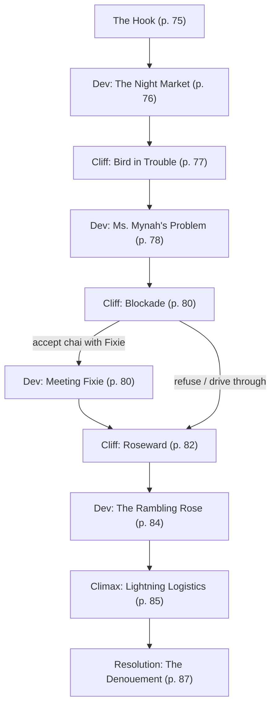

# Haven't Got a Stitch to Wear

Book pages 74–91

Mission aboard the D.V. Rambling Rose.

## Contents

- [Beat Chart](<06 Haven't Got a Stitch to Wear.md#beat-chart>) (p. 74)
- [Background](<06 Haven't Got a Stitch to Wear.md#background-read-aloud>) (p. 74)
- [The Rest of the Story](<06 Haven't Got a Stitch to Wear.md#the-rest-of-the-story>) (p. 74)
- [The Setting](<06 Haven't Got a Stitch to Wear.md#the-setting>) (p. 74)
- [The Opposition](<06 Haven't Got a Stitch to Wear.md#the-opposition>) (p. 74)
- [The Hook](<06 Haven't Got a Stitch to Wear.md#the-hook>) (p. 75)
- [Dev (The Night Market)](<06 Haven't Got a Stitch to Wear.md#dev-the-night-market>) (p. 76)
- [Cliff (Bird in Trouble)](<06 Haven't Got a Stitch to Wear.md#cliff-bird-in-trouble>) (p. 77)
- [Dev (Ms. Mynah's Problem)](<06 Haven't Got a Stitch to Wear.md#dev-ms-mynahs-problem>) (p. 78)
- [Cliff (Blockade)](<06 Haven't Got a Stitch to Wear.md#cliff-blockade>) (p. 80)
- [Dev (Meeting Fixie)](<06 Haven't Got a Stitch to Wear.md#dev-meeting-fixie>) (p. 80)
- [Cliff (Roseward)](<06 Haven't Got a Stitch to Wear.md#cliff-roseward>) (p. 82)
- [Dev (The Rambling Rose)](<06 Haven't Got a Stitch to Wear.md#dev-the-rambling-rose>) (p. 84)
- [Climax (Lightning Logistics)](<06 Haven't Got a Stitch to Wear.md#climax-lightning-logistics>) (p. 85)
- [Resolution (The Denouement)](<06 Haven't Got a Stitch to Wear.md#resolution-the-denouement>) (p. 87)
- [NET Architectures & NPC Stat Blocks](<06 Haven't Got a Stitch to Wear.md#net-architectures--npc-stat-blocks>) (p. 88)

---

*By Jeffrey McDonald*

**Tagline:** A suit worth dying for

---

## Beat Chart

**Flow summary:** Shears hires the Crew to recover eleven bespoke suits from Fixie's couriers. At the RC Night Market, Ms. Mynah sends them to the D.V. Rambling Rose in the Heywood Industrial Zone, where Lightning Logistics has seized Fixie's HQ. After fighting or sneaking through the industrial zone — optionally with ally John Doe — the Crew confronts ConEx (Harry Depuy) and his Edgerunners in the command center.

**Branching notes:**

- At **Cliff (Blockade)**, the Crew can stop for tea with Fixie or push straight into the cordoned zone.
- At **Cliff (Roseward)**, John Doe may assist if the Crew did not turn hostile.
- At **Climax (Lightning Logistics)**, negotiation, bribery, or combat are all valid paths to resolution.

---

> **Background (Read Aloud)**
>
> Night City has taken a number of nasty blows over the years but even during the Time of the Red life goes on. And as traditional supply chains continue to be fractured and unreliable, the inhabitants of the city turn to new… alternative… economies to get what they need. Even when what they need is as simple as a damn good suit.
>
> You've all been summoned to one of the buildings that still stand in Westhill Gardens, out where exclusive tailors Torrell and Chiang do most of their actual work. You're all here because one of the tailors working for Torrell and Chiang needs some expert troubleshooters. They put the word out to local Fixers, who brought in you.

### The Rest of the Story

The Torrell and Chiang's fortunes have been on a recent upswing as the demand for bespoke tailored high fashion has risen. But that leaves the small business scrambling to find suitably qualified labor — trained bespoke tailors don't just grow on trees or pop out of the vats at Biotechnica. In an effort to delegate their skilled labor where it's needed most, the shop's management have been farming out simple repairs and alterations to piece-work stitchers located all over the city. The suits are packaged neatly in poly dry-cleaner bags, shipped out via couriers, and then shipped back once the work is complete for customers to collect. The logistical coordination is handled through Ms. Mynah, a specialist Fixer who has her fingertips on the pulse of Night City's informal labor market, and the deliveries are done largely through Fixie's anarchist bicycle couriers.

However, unbeknownst to the tailors at Torrell and Chiang's, Fixie's is currently struggling with a hostile takeover from Lightning Logistics, an enterprising group of Edgerunners who think they can make the couriers more efficient. Lightning Logistics has taken over the Rambling Rose, the Fixie's HQ, at gunpoint. But things are not going well for the new bosses, with few parcels reaching their intended destination. Which, in turn, has led to a virtual standstill of Night City's informal courier post. And left the tailors at Torrell and Chiang in a real pickle. Some of the suits waiting to be delivered are for customers with pressing engagements: black-tie weddings, opera premieres, and high-powered board meetings. That's where the Crew comes in.

### The Setting

The story begins in the charming manufacturing headquarters of famed tailors Torrell and Chiang's before moving to an abandoned mall turned perpetual Night Market in Rancho Coronado. From there, the Crew heads to the Heywood Industrial Zone and boards the D.V. Rambling Rose, once a ship in drydock and now home to a thriving courier network.

### The Opposition

- **Angry Customers**, largely civilians with side-arms lining up outside of Ms. Mynah's consulting offices to complain about their missing packages.
- **Muscle** hired by Lightning Logistics will be patrolling the streets leading to Fixie's distribution center and HQ, but many of them can be evaded with stealth or cleverness.
- **Lightning Logistics**, a group of Edgerunners led by ConEx, an Exec looking to make a name.

See page 88 for stat blocks.

### The Hook

The front door of Torrell and Chiang's is discreetly armored and armed with a basic security setup — just a sensible precaution in Night City — and the Crew is buzzed in once confirmation of their identities has been made visually and verbally via intercom. The heavy door swings open to admit them, and then locks behind them with a secure thump, before they're met in the hallway by a short, androgynous figure with blue-green hair and soda-bottle glasses.

That person is Shears, the tailor at Torrell and Chiang's who has put out the troubleshooting request with local Fixers. Shears welcomes the Crew into the kitchen and dining area of the house, which serves as a break room for the tailors who work here. The furniture in the house is utilitarian and well-worn, interspersed with sewing equipment and storage for bolts upon bolts of expensive fabrics. There's a constant low-grade hiss and thrum from the tailors within operating the steam presses and industrial sewing machines, and the repeated staccato impacts of someone driving a chisel through a coat front to open up the layers of wool and canvas for buttonholes.

"Welcome to Torrell and Chiang's manufacturing center, it's where we actually make the suits, since some of our equipment isn't very portable. I hope the neighborhood security watch hasn't given you any trouble? But where are my manners? Come over to the kitchen and make yourselves comfortable. I've got some Coco Kibble cookies out, and we've got synthcoffee and herbal tea if you'd like some."

Shears takes pains to ensure that the Edgerunners are comfortably ensconced at the table with a beverage and a snack before taking a seat themselves. A DV13 Basic Tech Check reveals to any tech-savvy Edgerunners that Shears' eyewear is a stylized pair of Smart Glasses. Shears is a slight, well-dressed person of East Asian ancestry, with dyed blue-green hair. Today they're wearing a crisp pinstripe dress shirt with a vivid silk tie tucked down the front of their light gray wool waistcoat, with matching trousers and oxblood-colored cordovan dress shoes. Their hands, in contrast to their polished attire, are a little chapped, with occasional bitten-off hangnails. They carry a pair of shiny tailor's shears in a fancy, hand-tooled synthleather holster on their right hip, and have a tape measure draped around their slight shoulders.

"Let's get to business, then. We've seen a steady increase in demand over the past few months, and frankly we've been having trouble meeting that demand. We've been facing something of a labor bottleneck. Tailors skilled enough to turn out a bespoke suit are a rare commodity indeed. In times like these, we reserve our own tailoring person-hours to the parts of a suit requiring our expert touch — the canvases, which we pad-stitch by hand, the finishing work and the cutting-draping work. Almost everything else, repairs, alterations and miscellaneous assembly is farmed out to freelance piece-work stitchers across the city, paid by the piece. I sent several suits that needed alterations — mostly letting out or taking in coats and trousers, things like that — out sixteen days ago, all of which should have arrived back here two days ago. They have not. Some of those suits are for clients with pressing engagements and finite patience. I've called them to explain the extenuating circumstances and offer to replace missing suits with brand new ones if necessary, but we don't have the capacity to produce near a dozen bespoke suits in two days. So I need you all to run an errand. Bring the package of suits back undamaged within the next three days, and I'll pay you a cool 500eb each, and throw in a free suit custom tailored for one of you. To collect said package, you'll need a copy of the waybill the Fixer gave me when I turned the suits over to her, and her card. She works out of a Night Market in Rancho Coronado."

When quizzed about the job, Shears has these answers to give.

- **Why hire Edgerunners?** "Why would I need a crew of Edgerunners to run a simple errand like this? Simple answer. Torrell and Chiang suits are worth about five thousand eb apiece. There's eleven suits in the package. More than fifty thousand eb worth of bespoke clothing is a lot of potential money to be playing around with even if the suits wouldn't fit a person they weren't made for."
- **Will this be a dangerous job?** "Do I expect violence? I hope not. I'm not a very violent person myself, even if I spend my workday surrounded by sharp pointy things. Still… there is the not-untrue joke that some Execs would kill for a Torrell and Chiang suit."
- **Who are your clients?** "No. I can't name them. We guarantee confidentiality. Although I'm sure any one of you with a discerning eye could guess quite easily who in Night City is wearing one of our suits, just from how beautifully it fits them." Recognizing a Torrell and Chiang suit requires a DV13 Wardrobe and Style Check.

Briefing over, Shears escorts the Crew gently out of the manufacturing workshop, pressing several items into their hands on the way out. First is 100eb per Edgerunner, for operating expenses. This is above and beyond the promised 500eb per Crew member, because Shears is a generous soul. There's also a photocopy of a waybill noting delivery from Torrell and Chiang's workshop to the RC Night Market.

"Look for Ms. Mynah," Shears tells them, handing them a thin translucent plastic name card. Holograms built into the card gleam and reflect the image of a black-feathered tropical bird, along with an Agent-readable code that brings one to the Garden Patch of the Fixer herself. "Ms. Mynah," the card reads. "Labor and Logistics Consultant."

Lastly, Shears hands them a paper bag with a packed lunch and a half-dozen bottles of Cactus Water to eat on the road. It's easy to get a feeling Shears has managed to retain the talent working for them by feeding them until they lose the ability or desire to run away. The packed lunch consists of simple homemade sandwiches wrapped in waxed paper — soy cheese and SCOP on kibble loaf with a delicious scrape of simulated wild crabapple chutney, but it's free.

"Keep me updated as you go," Shears says as they see the Crew out of the door. "You can always call me on my Agent, I'll keep the earpiece in all day."

**Go to:** [Dev (The Night Market)](<06 Haven't Got a Stitch to Wear.md#dev-the-night-market>)

### Dev (The Night Market)

With this the Crew are left to make the journey to the RC Night Market, which is run out of a reclaimed and refurbished mall. They can get there via their own transport, but the Night City Transit Corporation runs buses across the bridge on a regular basis.

On arrival the Crew finds a long line of grumbling customers wending through various stands of the Night Market. A DV13 Perception or Deduction Check lets the Crew notice that some of the stands are left empty, despite being open for business, allowing them to deduce that the disgruntled customers are in fact other Night Market vendors.

> **Infobox: The RC Night Market**
>
> The RC Night Market isn't a single venture but dozens of them, each put together by various Fixers working in cooperation with one another. The one thing they have in common is their location — they all take place in Minimallism, a once trendy but now abandoned shopping plaza located in the heart of Rancho Coronado. The multiple Night Markets setting up, often concurrently, in this one location provides the illusion of an ongoing bazaar instead of dozens of individual operations. The biggest constant is Ms. Mynah, who keeps an office in the abandoned shopping plaza for the sake of consistency.

The line leads all the way through the stalls to Ms. Mynah's small makeshift office, where the Fixer herself is fending off the latest group of angry customers. Edgerunners with amplified hearing who pass a DV13 Perception Check or anyone who makes a DV15 Lip Reading Check can catch the following snatches of conversation.

"Red, I know it's difficult — nobody expected the most reliable couriers in Night City to suddenly stop delivering. It's a matter of extenuating circumstances."

"I don't care about your 'extenuating circumstances,' Mynah! Your shipping screw-up has cost me money, and it's about to ruin me, unless you can come up with some kind of compensation."

The two speakers are Ms. Mynah, a well-dressed, young Fixer with an Exotic biosculpt, and a squat, broad man who looks like a vertically compressed human refrigerator. The man is dressed in a well-worn flannel shirt and faded jeans, and his fingers are lingering impatiently on the synthleather holster he wears on his hip — one that holds a Very Heavy Pistol. The woman, whose hair and eyebrows have been replaced with gleaming black feathers, is beginning to rise from her chair, her gaze fixed on the man's bulky sidearm.

**Go to:** [Cliff (Bird in Trouble)](<06 Haven't Got a Stitch to Wear.md#cliff-bird-in-trouble>)

### Cliff (Bird in Trouble)

It does not take a genius in Tactics to realize that Red (use **Road Ganger**, page 173; remove Crossbow, add Reputation 1), the man currently confronting Ms. Mynah, is about to resort to physical violence. Edgerunners may use various means to defuse the situation. For example, a well-known or particularly violent Edgerunner could make a Facedown to intimidate Red into quiescence, or a fast-talking Edgerunner could use Persuasion or another Social Skill (DV15) to deescalate the situation instead. Don't forget the Complimentary Skill Check rule (see CP:R page 130). With it, Edgerunners not on point in the scene can still help out!

If the Crew does not succeed at defusing the situation, then Red lunges for Ms. Mynah. If the Crew objects to this, a fight breaks out and Red is joined by a number of compatriots (use **Boosterganger**, page 172) equal to one half the number of Edgerunners present (rounded down) plus one. Anyone in Red's gang, including Red, gives up and surrenders if they lose 5 or more HP. These are people who have lost their tempers, not cold-blooded killers. Edgerunners who push the point further may develop a negative Reputation. If the Crew is about to lose due to bad rolls, feel free to have the Night Market's own security intervene to nip the fight in the bud before it gets too rough, since it would be anticlimactic to have them wiped out before they even reach the middle of the mission.

After the dust settles, or if the fight is averted through charm, intimidation, or other quick-witted means, the line disperses, with various vendors returning to their stands while Red and his buddies are swiftly ejected from the premises. Ms. Mynah thanks the Crew for their intervention.

**Go to:** [Dev (Ms. Mynah's Problem)](<06 Haven't Got a Stitch to Wear.md#dev-ms-mynahs-problem>)

### Dev (Ms. Mynah's Problem)

"Thank you for heading that off. I'm not sure where I would be if you hadn't nipped that in the bud. That's the last time I send my bodyguard out for lunch."

Ms. Mynah is shaky, clearly inexperienced at the nastier end of Night City wheeling-and-dealing. When presented with Shears' waybill for the missing suits, she only sighs heavily and sits back down at her desk.

"This really is Fixie's problem, but because Fixie's delivers so much in Night City, their problems become everyone's problems."

Edgerunners may make a DV13 Business or Streetwise Check to realize what Ms. Mynah is talking about, and she launches an explanation if nobody makes the roll. Fixie's is a courier network local to Night City, where freelance couriers deliver packages all over town for the right fee. All of Fixie's couriers wear a reflective cap and armband as part of their livery, and hold to strict rules of neutrality so that they can generally deliver goods unmolested even in Combat Zones. Only the most dorphed out or most discreet of gangers would try to waylay a Fixie's courier, because of how important their services are to the supply chain in Night City. Any courier breaking the neutrality rules while in Fixie's livery is swiftly punished and blacklisted, never to work for the business again, which is how they get through the rougher parts of Night City without so much as a scratch.

However, something has clearly happened to Fixie's, because almost all their packages have failed to arrive in the last 24 hours. That is both highly unusual and catastrophic for most of Night City's street vendors and Night Markets for obvious reasons. Goods have to circulate in order to reach the hands of customers.

"You really should talk to Fixie," Ms. Mynah says, referring to the semi-legendary organizer of the couriers network, "Except she hasn't been taking calls, not even from me, which means things are bad."

If asked why she would know that, Ms. Mynah replies with, "I'm not an ordinary business partner. Our fathers are cousins, and our grandfathers were from the same village in India. It's… hard to explain. But couriering and logistics is in our blood."

Ms. Mynah directs the Crew to the Fixie's clearinghouse in the Heywood Industrial Zone.

"Look for the D.V. Rambling Rose. D.V. is old shipper speak for 'Dead Vessel', which she is — the old feeder ship, I mean. A rusted hulk that's no longer fit to go out to sea. Some squatters filled the damaged drydock she was moored in with rubble, then filled the gaps with concrete and compost and converted her into a mixed-use building. The couriers took the space over as an HQ a few years back because they needed a shipping hub for their goods."

On the way out of the Night Market, the Crew is approached by various stallholders who do not have weapons drawn. In fact, they seem worried and conciliatory, and would like to hold a friendly chat. They offer the Crew additional rewards for sorting out what's going on at Fixie's, because so much of their business logistics rely on the couriers and their neutrality.

Roll 1d10 (or choose, if you prefer) for each member of the Crew, and refer to the Vendors at the RC Night Market table, rerolling duplicate results. These are the additional rewards offered to the Crew on successful completion of their troubleshooting job. Of course, the Edgerunners can also do a little shopping before they leave, if they like.

#### Vendors at the RC Night Market

| 1d10 | Vendor |
|------|--------|
| 1 | **The Chicken Lady**, a messy-haired older woman wearing a chicken hat. She will reward the Edgerunner for helping her with the gift of two pullets, healthy and ready to lay. The chickens are worth 50eb each. She will also throw in a basic coop for cost price (50eb) if the Edgerunner wants to house and feed the hens to supplement their food. The birds can be fed on leftover kibble crumbs. |
| 2 | **Spooky Sue**, a stringy-haired, white-gowned street chemist who looks like she crawled out of an old tube television in a J-horror flick. She will whip up a batch of street drugs for the Edgerunner, value up to 100eb. Spooky Sue cooks it all up, and is noted to turn out clean, high-purity stuff. |
| 3 | **Auntie Ivy**, a tough, flannel-wearing middle-aged woman with a green polymer prosthetic thumb. She's a member of the Dirty Hippies and is therefore a hydroponics expert. If the Edgerunner succeeds, she will reward them with excess produce — enough to make up the equivalent of 100eb of Freshpak meals. |
| 4 | **Vesper**, a gender-neutral street tattoo artist and qualified cosmetic ripperdoc. Vesper will perform a custom Light Tattoo commission as a reward for the Crew sorting out the shipping problem. They are also down to do a traditional tattoo instead for a change. |
| 5 | **Delphine**, a neo-hippie street psychic. Delphine's reward is slightly esoteric. After the Crew return from the Industrial Zone she will perform a Tarot reading for one of them, and the advice she gives can be an interesting way for you to foreshadow future missions. |
| 6 | **Samuelson's Locks** are a group of locksmiths who usually sell security to their customers. Most of their locks are hard to pick or otherwise circumvent. However, as a favor to helpful Edgerunners, Samuelson himself will pick one lock for them — any lock — provided that he doesn't have to leave the premises of his store to help them. He isn't interested in endangering his life to pick a physical lock surrounded by hostiles. |
| 7 | **Suzuki's General Goods** is a mobile bodega, with useful goods for anyone who prefers Japanese-American cuisine. Most of the rewards Mr. Suzuki could offer aren't going to interest Edgerunners much, but Mr. Suzuki's niece Mio is a budding Rockerboy with a band made up of adorable middle-schoolers who will write and release a song about how awesome the Crew is. |
| 8 | **Richard's Remainders** is an outlet store selling clearance items from Vendits. He will reward an Edgerunner with a large crate stuffed with 5 Vendit items of the GM's choice. |
| 9 | **Coronado Ceramics** is an independent ceramics studio that sells their wares at various Night Markets. They make an attractive variety of hand-thrown and hand-glazed ceramics decorated with the leavings of Night City life. Their wares are decorated with broken windshield glass, melted down circuit board gilding, and bone ash glaze. Their proprietor is one Sandy Sheldon, a woman of mixed ancestry with a deep, husky voice. As a favor to an Edgerunner she will repurpose their sizable ceramic kilns one time to dispose of a body, no questions asked. She will also throw in a set of matching coffee mugs. |
| 10 | **Myrtle's Mini-Livestock** is a strange shop run by a strange, tiny blue-haired old lady named Myrtle. Myrtle is also a PhD in entomology, and she ranches bugs for protein. As a reward, Myrtle will provide the Edgerunner with two ant farms in large mason jars. Those ant farms seem useless until Myrtle informs them that the ants in the jars are nasty stinging species, and that the ants will swarm angrily forth upon whomever the jars are broken upon… happy jar-flinging, choombas. Treat them as grenades that do no real damage, but will temporarily disfigure targets with swollen ant bites, giving them a -2 to any Personal Grooming Skill Checks for one week. |

**Go to:** [Cliff (Blockade)](<06 Haven't Got a Stitch to Wear.md#cliff-blockade>)

### Cliff (Blockade)

The rusting mass of the D.V. Rambling Rose is quite well-hidden among the warehouses, workshops, and tenements of the Heywood Industrial Zone. During the Time of the Red, squatters moved in and used some of the still-functioning industrial cranes to stack empty shipping containers into rough apartment blocks accessed initially by ladders, and then followed by open-air walkways and stairwells fenced off by reclaimed wrought rebar. A lot of the metalwork in those makeshift apartments is covered with bright automotive enamel paint to protect it from the salt air of the bay.

Roughly a block away from the Rambling Rose, the Crew is challenged by a roadblock. Manning the roadblock are a few of Fixie's couriers, all wearing the distinctive reflective cap and armband livery of the gang. They are all carrying their weapons at low ready, but do not bring them to bear as the Crew comes into view.

"Sorry," one of the couriers says through a loudspeaker, "please slow down, thank you, there's something going on and we're asking everyone to detour around the area."

The Edgerunners are advised to slow down and speak to the blockade-running courier, at least. The roadblock is essentially a board nailed to a pair of sawhorses and won't do much to stop a driver determined to go through — nor will any of the couriers actually fire a shot to stop them, since they're there mostly to warn people.

If the Crew does slow to a stop, they are advised thus: "I'm sorry, but this part of the Heywood Industrial Zone is not safe. We can't stop any of you from going in, but we'd at least want to warn you what you're going to face in there. We're not the boss of you or anything."

On further inquiry from the Crew, the courier with the loudspeaker approaches their vehicle to explain the situation.

"About 48 hours ago we were the target of a hostile takeover, violating our neutrality in Night City. Some gang or other has locked down our HQ and distribution center, and we're trying to keep the situation contained so nobody else gets hurt. They've been content to sit tight in the D.V., but while she's locked down no deliveries are going out, and goods can't come in. Sorry."

If the Edgerunners flash Ms. Mynah and Shears' documentation, the courier will step back and murmur to a colleague, who then radios back to someone.

If the Crew decides not to speak about their mission, the couriers instead receive a radio message, and one of the couriers calls out to the one speaking to the Edgerunners. Either way, the end result is the same. There's a rapid flicker of silent hand signs, and then the courier leans in again.

"My boss, Fixie, would like to invite you all for some soy chai, and talk to you about the current situation before you head further in, if you please."

The Crew is free to accept this offer or not. If they refuse to stay and just go further in, then the couriers haul the roadblock aside and let them pass. In that case, **Go to:** [Cliff (Roseward)](<06 Haven't Got a Stitch to Wear.md#cliff-roseward>).

If they accept, however, they're pointed to some parking space by a block of shipping container apartments, with a large awning set up across one of the ground-floor spaces.

> **Infobox: The Roadblock**
>
> If the couriers seem nervous, it isn't just because they're worried about their business. The biggest dog in the Heywood Industrial Zone is Zhirafa (see CP:R page 281), who controls a large campus of factories and offices not too far away. Setting up roadblocks, even if only around the D.V. Rambling Rose, risks calling down their wrath if it goes on for too long.

**Go to:** [Dev (Meeting Fixie)](<06 Haven't Got a Stitch to Wear.md#dev-meeting-fixie>)

### Dev (Meeting Fixie)

A group of couriers are gathered around a large folding table, updating a paperfax map of the area around the Rambling Rose with poker chips and hex nuts representing unknown forces. A tall, dark-skinned woman of South Asian descent is standing, arms folded, at the head of the table, and she looks up, unsmiling, at the Crew as they enter. She is wiry as a distance runner tends to be, with little curve on her angular frame. What muscle she has is more compact from frequent cycling and running as opposed to the bulk put on by lifting heavy burdens, and her long black hair is pulled neatly in a braid that hangs down her back.

"Ah. Welcome. I'm sorry I have so little hospitality to offer you, but we've been locked out of our home for the past two days. Still, please, take a seat, I'll have some chai poured." One of the other couriers serves you all tall glasses of hot soy chai made largely of wild raspberry leaves, spiked with synthetic caffeine and ersatz spices, but it's still a hot, sweet drink against the cooling air of the evening.

"I am Fixie," the woman says, "and I'm the leader of the couriers… well, as much as we have a 'leader.' We're all a bit anti-system here. I organize what little will be organized among us, so you might say I keep the tracking moving. Which no longer moves. No doubt, you will have been informed that we've become the targets of a hostile takeover."

Fixie takes up her own glass of chai and takes a long sip, then sighs. "Honestly, I would be glad to leave whoever's taken over the Rose to the business and let them handle the deliveries, except they're not delivering. I'm not exactly sure what they want. All we do is get things to where they're needed. It's our niche, and every economy needs someone to smooth the logistics along. My own great-grandfather spent his whole life delivering lunch boxes from one end of Mumbai to another."

An Edgerunner who makes a Business or Education (DV15) Check will have heard of the dabbawalas of Mumbai, lunch couriers who are legendary for their accuracy despite having devised their logistics systems before computers were in common use. They have been estimated to make less than one mistake every sixteen million deliveries, using a series of color-coded markings to determine the origin of a given lunch box, the train station it is taken to, the train station it is unloaded from, and then the end address it is meant to be delivered to.

The Crew might have questions for Fixie, after she has finished her statement. These are her answers.

- **Why haven't you taken your HQ back?** "Well, most of us aren't fighters. Besides, we fight only in defense of life. Property isn't worth killing for. Mostly. I admit I made a mistake and allowed us to become too centralized… when I started out, whenever someone threatened us we'd just move from one temporary HQ to another. But the business has gotten too big to move, and we don't really have the time right now to organize another meeting to determine if we're going to take up arms or not."
- **Do you know why deliveries stopped?** "I have some idea, yes. We may be anarchists, but we're not completely stupid. I suspect they've bitten off rather more they can chew — an outsider isn't going to make any sense of our own logistics setup since I based it off my own grandfather's experience as a dabbawala before he came to America."
- **Why don't you just give up?** "Would I be willing to abandon my life's work so lightly? The way I see it, if they can take over our business and run it better than I can, then they're welcome to it, and I could stand to learn some things from them. But this is not a takeover, they're just locking themselves in the toilet and not taking a shit, pardon my crudity."
- **Why did you block off the Rambling Rose?** "For everyone's safety. The gang muscle our opponents are relying on are ill-disciplined and squeeze off shots the moment they see someone they don't know — which could mean an innocent getting hurt. You're professionals, of course, and I'm sure you could handle this well."
- **Has anyone tried going in?** "Yes, actually. There was a man who was bent on finding one of the shipments there. He said his favorite suit was in it and he had an engagement to keep in the coming days. I thought him suicidal, but he seemed competent. My scouts haven't heard any gunfire, so he could still be in there. And alive."

Once the Crew's curiosity has been satisfied, Fixie will order a refill of everyone's chai, and begin explaining the situation.

"There's two tiers to Lightning Logistics, the organization that took us over. It's made up of a core of capable Edgerunners. The rest is crude muscle imported from SoCal. Most of the people in Night City know better than to interfere with our business — anyone who tries to disrupt our couriers stops getting deliveries, for good. It makes life a good deal harder in the long run. As to who the leadership of this group is… well."

Fixie slides over a photograph of a sharp-looking man in typical Corporate gear, an off-rack suit and some flashy Smart Glasses. The smug smile on his face is visible even through the telephoto zoom on the image.

"That's Harry Depuy. We were… acquaintances." The look on her face hints that they were rather more than just acquaintances. "He has always been very much interested in backing my business for a share of the dividends, without actually realizing that we aren't a business. We're closer to a union or a guild. I think he wants to modernize the couriers… but he's not going to be able to do that if he doesn't even understand how we do things in the first place. We parted ways somewhat bitterly after I told him what I had just told you, which is probably why he's decided to prove that he can do this better than I can. He's put together a group of freelancers, probably promising to pay them from the profits everyone stands to make after they streamline the couriers and cut the fat."

With that, Fixie uploads maps of the Rambling Rose to the Crews' Agents and lets them go. She murmurs some orders to her couriers over the radio, requesting that they let the Crew into the perimeter they've established.

**Go to:** [Cliff (Roseward)](<06 Haven't Got a Stitch to Wear.md#cliff-roseward>)

### Cliff (Roseward)

The warren of dead-end roads and alleyways that have sprung up around the Rambling Rose are patrolled indifferently by the mooks (use **Boosterganger**, page 172) in Lightning Logistics' employ. They are loud and obtrusive, relying on their guns to keep noncombatants cowed. Armed combatants such as the Crew will soon find themselves challenged if they venture openly, and while line of sight is hard to establish in the lanes, clever Edgerunners could make use of the outdoor stairwells welded to the shipping-container apartment blocks to snipe and ambush.

The Crew can attempt to stealth their way through but the mooks control key passageways and at some point, there should be a confrontation of some sort.

When the confrontation begins, the opposing group of mooks has a number of members equal the Crew's own head count. Feel free to subtract forces if the Crew is not combat-focused, and add more opponents if they are in fact a well-tuned cyberpunk killing machine.

There are frightened civilians hiding out in their locked homes, so grenades and other armaments that induce large amounts of collateral damage may be contraindicated, if the Edgerunners care. If they do not care, the mission proceeds as normal, except that they may receive a reputation for being bloodthirsty. The mooks themselves are under no real constraint and will very much make a big noise and mess unless handled stealthily.

During the confrontation, have the Edgerunners make a DV15 Perception Check to realize that they are being watched as the combat unfolds. Someone has taken up a perch from a nearby building and is observing the fight.

As the fight goes sideways for them, have the mooks call in reinforcements. Another group, equal to half the size of the original, begins filing in. Just as those reinforcements file into the alleyway, a long-range shot rings out from a nearby apartment, aiming for the boostergangers, and not the friendlies. A message blips briefly on the Crew's Agents, sent out on an indiscriminate short-range blurt.

*Friendly. Don't wanna scare you.*

The friendly shooting at the mooks is the Tech/Solo John Doe (see page 90), who has in fact gone into the cordoned off area alone to find his favorite suit. If the Edgerunners stopped to talk to Fixie, they might know that there was someone else in there with them. If they didn't, this is a good time for him to introduce himself.

Mopping up those reinforcements should be trivial with John's assistance. When the fighting is over the Crew receives another message on their Agents:

*Into the alley with the burned-out cars. Coming down.*

As they enter the alley, a figure descends rapidly, rappelling from the open window of one of the apartments above. They land in the alleyway by the Crew, and put their hands up in peace. Said figure is the Tech and Solo John Doe, who is wearing an immaculate armored Torrell and Chiang three-piece suit. His long blond hair is pulled into a tidy manbun, and he flashes everyone a calm, assessing glance as he puts his hands slowly down. He's fairly tall at 1.8m (6ft) but not unusually so, and he's built like a dancer, slender enough that the Edgerunners can imagine Shears carefully tapering his trouser legs to highlight the curves of his calves. His lush silk necktie is covered in tiny paisley motifs that look a little like amoebas.

"You're not gangers," he says, "so you must be troubleshooters coming in from outside to sort out this situation. Unless it's a hostile takeover of another hostile takeover?"

John Doe is armed with an Assault Rifle but he's clearly not intending violence. Not at them, anyway.

If asked if he was the man Fixie was referring to, who was looking for his favorite suit: "Yes, that was me. I have um. A hot date this coming weekend and that's my favorite suit. Chocolate-brown English flannel, vintage pre-War fabric, with a violet and gold Bemberg lining. I was having it repaired after it sprouted a couple bullet holes. You know how the business goes."

If someone notes this is just some clothing, he repeats, "It's my favorite suit." This is said with the calm of someone who expects his explanation to make sense even if it does not.

On why he helped the Crew during the gunfight: "The enemy of my enemy, right? I mean, it's no skin off my nose who you work for, as long as I get my suit back… and there's probably a few other suits from the tailor's there, if I know how Shears works. I'd love to get those back for Shears if you're not interested in them, but I'm not going to interfere as long as I get my own suit back first and foremost."

And on whether he can vouch for his skills: "I'm sorry, but if I told you, I'd have to kill you." This said with the faintest hint of a gentle smile.

Impertinent Edgerunners may ask him about his "hot date." At which point he actually blushes a little, and says, "No comment."

All this is delivered in a general tone of dissonant serenity, as though there really isn't anything that can shock him. He's unperturbed but not unfriendly. A DV13 Streetwise Check will confirm his reputation to Edgerunners who are in on the gossip — that John Doe seemed to have sprung up fully grown on the Night City Edgerunner scene three or four years ago. His reputation is that of a consummate professional, someone who probably was in the spook business for Uncle Sam or some other national government before he went freelance. His specialties are black-bag and surveillance work, but he's a capable combatant in a firefight as well.

A DV13 Perception Check brings to an Edgerunner's notice a small enamel Elflines Online pin gleaming on the flap of his backpack, which brings an additional bit of gossip to mind — rumor has it that he likes to hack his Segotari headset and multi-box four elves in a synchronized group so he can solo group content.

The Crew is free to take John Doe along with them, or not. If they do accept him into their group, he will tag along as the rearguard. Increase the number of opponents facing the Crew in coming fights to balance the additional firepower he provides the team.

If they turn his offer down, he tips them a casual salute. "Try not to get killed, huh? I'll see you deeper in." With that, he will move on.

If the Crew opens fire or are otherwise hostile, he will defend himself only long enough to get away. The noise will certainly attract additional hostiles in the form of Lightning Logistics' mooks.

**Go to:** [Dev (The Rambling Rose)](<06 Haven't Got a Stitch to Wear.md#dev-the-rambling-rose>)

### Dev (The Rambling Rose)

The D.V. Rambling Rose is very much as Fixie described it — it's a ship (classified as a small feeder, rather than a full-size container ship) that was abandoned in its dry dock after the nuke, and then was stabilized and re-purposed as housing and an operational headquarters for the commune that would eventually make up Fixie's couriers. As a small-sized container ship, the Rose is 100 m/yds long and 16 m/yds wide and scouring her would take days, if not a week. Given the unique system used to organize storage and deliveries, the best way to find the suits is to return control of the Rambling Rose to Fixie.

> **Infobox: Giving You Control**
>
> We haven't listed out specific guard patrol routes or encounters in the area around and aboard the Rambling Rose for a reason. As GM, it is up to you to decide how many encounters you want to throw at the Crew and how dangerous those encounters are. If you want a shorter session or don't want a lot of combat focus, make patrols and potential ambushes sparse. If you want the Crew to feel as if they're inching their way through enemy territory, make them frequent but give the Crew chances to set up their own ambushes and use clever tactics. Customize this part of the mission to suit your table.

If the Crew talked to Fixie, she'll have uploaded maps of the Rose to their Agents. If they did not, then they will have to do this blind. If a Netrunner is in the Crew, they can hack into the Rose's NET Architecture (see page 88) to find maps of the ship's layout and utilize the ship's surveillance systems to spot potential ambushes.

Most of the infiltration can be done as a stealth mission if the team's makeup allows for it — Stealth Checks of the appropriate DV can be substituted for combat Checks, allowing Edgerunners to evade fighting. The GM should therefore vary the number of remaining encounters in the Rambling Rose, gauging according to Crew's strength and their remaining reserves and resources.

Having John Doe with the Crew will help, as he's an expert on surveillance and can sneak ahead in order to check for ambushes. If John Doe is not in the group but still on fairly friendly terms, the GM may roll 1d10 every time the Edgerunners are about to head into a dangerous situation. On a 10, John Doe will update them with a warning on their Agents before they come into sight of the security using short phrases like "Watch out!" or "Gangers up ahead!"

If John Doe is hostile after the Crew opened fire on him, they will find the trek into the Rambling Rose rather more difficult, as John Doe will have gone ahead and made a deal with Lightning Logistics and warned them of the Crew's approach, in exchange for the box of suits. He will opt to sit the rest of the combat out and is in fact on his way out of the Heywood Industrial Zone. Increase the number of mooks the Crew faces in any encounter by 2.

Once the Crew reaches the command center, **Go to:** [Climax (Lightning Logistics)](<06 Haven't Got a Stitch to Wear.md#climax-lightning-logistics>).

### Climax (Lightning Logistics)

There is a command center built into the altered structure of the D.V. Rambling Rose from which Fixie used to organize the shipments of goods into the rest of Night City proper. This is where the new owners of the ship have holed up, attempting to make sense of Fixie's idiosyncratic documentation while they try to consolidate control over the surrounding area.

#### D.V. Rambling Rose Top Deck

1. Gangplank (Guarded)
2. Command Center
3. Stairs to Lower Decks
4. Rickety Scaffolding (Opens to Lower Decks)
5. Cargo Crane
6. Battery Stack
7. Garden and Water Storage
8. Cargo Hatches
9. Cargo Containers

Sitting at the scratched desk in the back of the room is Harry Depuy (aka ConEx, for Continental Express, a shipping company he used to work at, see page 88). Depuy may be familiar to the Crew if they sat down to talk with Fixie earlier. He looks a little less together and a lot less smarmy than he does in the photograph they were shown. This is largely because he looks stressed and harried instead.

Backing him up are several other Edgerunners — his crew, as it were, consisting of Sugarplum, a Netrunner (see page 89), Boom-Boom, a Tech (see page 90), and 512, a Solo (see page 88). Additional muscle, in the form of mooks, can be present if the Crew's numbers are superior or the GM feels they need more of a challenge. Wheels, ConEx's driver, isn't present.

The command center is less a room proper and more a cavernous holding area for boxes and boxes and boxes of stuff — all labeled neatly with recipient name and address. There are dollies and pallets used to organize and move shipments, and a pair of well-maintained forklifts and lifter exoskeletons are propped in charging cradles, idle while the work of shipping remains disrupted.

512 will attempt to point his rifle at the Edgerunners when they enter the HQ office, but Depuy will wave him off with a sigh and the shake of a head. "They've gotten this far," he tells his colleague, "let's just talk first."

If John Doe is with the team, 512 will lower his rifle to a low ready position and tip him a brief, if mocking salute, and Doe will return the gesture with a blown kiss. Seems like there's history between the two. If John Doe is absent, then he will just lower his rifle to low ready and watch the Crew from behind his mirrorshades, alert but not alarmed.

There are several chairs by the desk ConEx is sitting at. They are insufficient to hold the entire Crew, but there are also nearby crates and desks on which they can perch. Depuy offers them cups of Koff Pop as they parley, but will not be offended if they refuse.

"I assume you're Fixie's troubleshooters, then," Depuy continues after everyone is settled to their satisfaction. "What's she offering you to kick us out? I could offer better, but I'd have to know the terms first," he says, waving a well-manicured hand in what is supposed to be a casual manner.

As the Crew probably remembers, Fixie offered them nothing but advice — but they do have the box of suits to get back for Shears, and there's the folks at the RC Night Market who are begging them to get business back to normal. Still, they can most definitely bluff, if they're willing to bargain. Depuy is willing to pay each of the Edgerunners up to 100eb to leave him alone, since they've gone through enough of his mooks that he won't have to pay as many of them for security come the end of the week. He'll even let them leave with the suits.

This, however, means that the services of Fixie's couriers will be denied to most of Night City's street merchants until Depuy and his crew get things realigned to their liking. And that would also make the Chicken Lady sad.

You wouldn't make her sad, would you?

Of course, if they really wanted to be the kind of folks who are known as A-holes, then they can even deal with Depuy, give John Doe his suit, and then sell the others on the black market. That would make them a pretty eddy… but also piss off Shears, whose clients include people such as John Doe.

If the Crew wavers in their discussion, remind them of the nice, home-made sack lunches Shears packed for them, just to rub it in a little. But it's a hard life out there, choomba, and certainly enterprising Edgerunners can't be faulted for trying to make a quick buck.

If the Crew decides to dislodge Depuy, they have two options: combat, and negotiation. Edgerunners can make a DV15 Business or Streetwise Check to realize that while Depuy is sitting in a very defensible location, he's only remained unmolested by angry couriers because they want the stuff being shipped to remain intact. Perishables in the warehouse will continue to perish as he sits around trying to figure out the scheme Fixie used to mark addresses and drop points… and eventually his advantage will dwindle to nothing.

He is in, as some would say, a fairly untenable situation. Any Edgerunners taking pity on him might be able to work out a deal with Fixie herself. She could be persuaded to let him leave without a beating if they deliver photographic proof via Agent that the warehouse and goods are unharmed. They are, of course, going to have to persuade him that it's a good idea to cut his losses before he winds up with a bad case of lead poisoning.

A useful bluff would be to imply that all of Night City is up in arms about this disruption in commerce (which is not entirely untrue), and that several teams are getting ready to come down here to set things right. The Crew is just the first to arrive. Deal with them now and things can go easy; Depuy can walk away relatively clean. The next team might not be prepared to negotiate. And Depuy knows he only has so many boostergangers.

There is also the option of a good old-fashioned firefight, which is the harder option, since the Crew is surrounded by Lightning Logistics.

If there are fewer Crew than adversaries in the office, then have Sugarplum the Netrunner make a break for it, because it's not worth her neck to take over this "stinking rusty ship," as she would say. She will not fight back if left to flee, and will not bring reinforcements. Depuy himself may decide discretion is the better part of valor with a professional like John Doe backing the Crew up — at which point, 512 will stay and fight because it's what he does, and he's a professional too.

For fun and color, the GM is encouraged to have Edgerunners take cover behind fragile packages that break entertainingly when shot through. People will ship anything via Fixie's couriers, as it turns out. Socks. Underwear. Live crickets in 1m/yd by 1m/yd by 1m/yd cardboard boxes. Highly volatile chemicals. The sky's the limit.

Once the Crew has dealt with Lightning Logistics via negotiation, combat, or another method, **Go to:** [Resolution (The Denouement)](<06 Haven't Got a Stitch to Wear.md#resolution-the-denouement>).

### Resolution (The Denouement)

Assuming the Crew did the "right" thing by evicting Depuy and his crew from the Rambling Rose, the mooks will beat a retreat because it's not really worth getting shot at for no pay. This will allow Fixie to return to the Rambling Rose with her other couriers in tow, and the Edgerunners are feted for having returned street life there back to normal.

Depending on how trigger-and-explosion-happy the Crew may have been, Fixie may return to a complete shambles of an HQ. In that case, she will be grateful nevertheless, but her gratitude may not be as emphatic. She will retrieve the box of suits they are looking for and hand it over.

Assuming they worked together, this is where John Doe will part ways with the Crew — once he has reclaimed his favorite suit. "You're not a bad crew to work with," he says, with his usual dissonant calm, before he hands one of them a calling card with his number on it. The number, if called, leads to a burner voicemail box that he checks occasionally. Leave a means of contacting you in your message, and he'll get back to you. Any Edgerunners who play Elflines Online might encounter a team of synchronized elves in the future, who may help them out of a tight spot or defend them against hostile PKers, and then run off into the simulated wilderness. Checking in with John Doe after the coming weekend might result in him asking an Edgerunner he particularly clicked with to dinner. He will be wearing another very nice suit.

Shears will be extremely relieved to get the suits back. They will pay the Crew the agreed-on fee, and add one of them to the customer files at Torrell and Chiang. That means a free, full set of personally tailored Businessware for that Edgerunner (see CP:R page 356).

The merchants at the RC Night Market are equally effusive and grateful. If the Crew allowed Fixie to reclaim her HQ, they will reward the Edgerunners as promised, and continue to be useful contacts in the future.

If the Crew alienated John Doe, then they now have a professional black-bagger upset with them, which might be a bigger problem.

If the Crew decided to be enterprising A-holes, they lose the rewards from Shears and the RC Night Market vendors, but are able to flog the remaining suits in the package for about 1,000eb per Edgerunner. Don't let John Doe know what they did, he'll be a bit put off by their disrespect for the bond between a suit and their owner.

Both the above options will cost them any chance at a bespoke suit from Torrell and Chiang, naturally. You don't bite the hand that's fitting you for a garment unless you want the rise of the trouser to be way too short, forcing a perma-wedgie.

---

## NET Architectures & NPC Stat Blocks

For more information on important NPCs see Appendix B: Biographies.

### Rambling Rose NET Architecture

Currently controlled by Sugarplum via a Virus. She stays jacked into the system unless fleeing.

| | |
|---|---|
| **Demons Installed** | None |
| **REZ** | — |
| **Interface** | — |
| **NET Actions** | — |
| **Combat Number** | — |

| Floor | DV | Node |
|-------|-----|------|
| 1 | 6 | Password |
| 2 | — | Black ICE: Wisp |
| 3 | 6 | Control Node: Observation Cameras |
| 4 | 8 | File: Rambling Rose Deck Plans |

---

### ConEx (Harry Depuy) — NPC Stat Block

**Exec: Teamwork 3 (Company Driver — Wheels)** · **REP 2**

| INT | REF | DEX | TECH | COOL | WILL | MOVE | BODY | EMP |
|-----|-----|-----|------|------|------|------|------|-----|
| 5 | 7 | 7 | 3 | 6 | 7 | 5 | 5 | 5 |

| HP 40 · Seriously Wounded 20 · Death Save 5 |

**Weapons & Armor**

| Weapon | ROF | Damage | Armor/SP |
|--------|-----|--------|----------|
| Heavy Pistol | 2 | 3d6 | Head: Kevlar SP 7 |
| — | — | — | Body: Kevlar SP 7 |

**Skills:** Accounting 11, Athletics 9, Brawling 9, Bureaucracy 11, Business 11, Concentration 9, Conversation 11, Deduction 11, Education 11, Evasion 13, First Aid 5, Handgun 13, Human Perception 11, Language (English) 9, Language (Streetslang) 7, Lip Reading 11, Local Expert (Heywood Industrial Zone) 7, Perception 9, Personal Grooming 10, Persuasion 12, Stealth 9

**Gear:** Heavy Pistol Ammo x16, Agent, Computer, Vial of Synthcoke

**Cyberware:** Biomonitor

*See page 183 for biography.*

---

### 512 — NPC Stat Block

**Solo: Combat Awareness 4** · **REP 2**

| INT | REF | DEX | TECH | COOL | WILL | MOVE | BODY | EMP |
|-----|-----|-----|------|------|------|------|------|-----|
| 7 | 7 | 6 | 5 | 7 | 6 | 7 | 7 | 2 |

| HP 45 · Seriously Wounded 23 · Death Save 7 |

**Weapons & Armor**

| Weapon | ROF | Damage | Armor/SP |
|--------|-----|--------|----------|
| Assault Rifle w/ Smartgun Link | 1 | 5d6 | Head: Light Armorjack SP 11 |
| Heavy Melee Weapon | 2 | 3d6 | Body: Light Armorjack SP 11 |

**Skills:** Athletics 8, Autofire 13, Brawling 8, Concentration 8, Conversation 5, Education 9, Evasion 12, First Aid 11, Handgun 13, Human Perception 5, Interrogation 13, Language (German) 11, Language (Streetslang) 9, Local Expert (Heywood Industrial Zone) 9, Melee Weapon 12, Perception 13, Persuasion 9, Resist Torture/Drugs 12, Shoulder Arms 13, Stealth 8, Tactics 13

**Gear:** Rifle Ammo x50, Agent

**Cyberware:** Neural Link w/ Interface Plugs

*See page 182 for biography.*

---

### Sugarplum — NPC Stat Block

**Netrunner: Interface 3** · **REP 1**

| INT | REF | DEX | TECH | COOL | WILL | MOVE | BODY | EMP |
|-----|-----|-----|------|------|------|------|------|-----|
| 6 | 6 | 6 | 7 | 8 | 4 | 7 | 6 | 4 |

| HP 35 · Seriously Wounded 18 · Death Save 6 |

**Weapons & Armor**

| Weapon | ROF | Damage | Armor/SP |
|--------|-----|--------|----------|
| Very Heavy Pistol | 1 | 4d6 | Head: Bodyweight Suit SP 11 |
| — | — | — | Body: Bodyweight Suit SP 11 |

**Skills:** Athletics 8, Basic Tech 10, Brawling 8, Concentration 6, Conversation 6, Education 12, Electronics/Security Tech 12, Evasion 12, First Aid 9, Handgun 12, Human Perception 6, Language (Spanish) 10, Language (Streetslang) 8, Library Search 12, Local Expert (Heywood Industrial Zone) 8, Perception 8, Persuasion 10, Stealth 12, Wardrobe and Style 10

**Gear:** Very Heavy Pistol Ammo x8, Agent, Cyberdeck Hardware: Insulated Wiring (in Bodyweight Suit), Cyberdeck Programs: Armor x2, Poison Flatline, See Ya, Sword, Vrizzbolt, Worm

**Cyberware:** Cyberarm w/ Cyberdeck, Neural Link w/ Interface Plugs

*See page 192 for biography.*

---

### John Doe — NPC Stat Block

**Tech/Solo** · **REP 3**

| INT | REF | DEX | TECH | COOL | WILL | MOVE | BODY | EMP |
|-----|-----|-----|------|------|------|------|------|-----|
| 8 | 6 | 7 | 8 | 4 | 4 | 6 | 7 | 5 |

| HP 40 · Seriously Wounded 20 · Death Save 7 |

**Weapons & Armor**

| Weapon | ROF | Damage | Armor/SP |
|--------|-----|--------|----------|
| Assault Rifle | 1 | 5d6 | Body: Light Armorjack SP 11 |
| Heavy Pistol | 2 | 3d6 | Head: None SP 0 |

**Skills:** Athletics 12, Autofire 12, Basic Tech 14, Brawling 12, Concentration 12, Conversation 9, Cybertech 12, Education 12, Electronics/Security Tech 14, Evasion 12, First Aid 12, Handgun 12, Language (English) 12, Language (Streetslang) 10, Local Expert (The Glen) 12, Perception 12, Personal Grooming 8, Persuasion 8, Pick Lock 12, Resist Torture/Drugs 10, Shoulder Arms 12, Stealth 14, Tactics 14, Wardrobe and Style 8, Weaponstech 12

**Gear:** Rifle Ammo x50, Heavy Pistol Ammo x8, Agent, Duct Tape, Smart Glasses w/ Low-Light/Infrared/UV, Tech Bag, Techtool

**Cyberware:** Contraceptive Implant, Neural Link w/ Sandevistan

*See page 186 for biography.*

---

### Boom-Boom — NPC Stat Block

**Tech: Maker 2 (Field Expertise 2, Fabrication Expertise 2)** · **REP 1**

| INT | REF | DEX | TECH | COOL | WILL | MOVE | BODY | EMP |
|-----|-----|-----|------|------|------|------|------|-----|
| 7 | 7 | 7 | 6 | 3 | 3 | 6 | 6 | 5 |

| HP 35 · Seriously Wounded 18 · Death Save 6 |

**Weapons & Armor**

| Weapon | ROF | Damage | Armor/SP |
|--------|-----|--------|----------|
| Very Heavy Pistol | 1 | 4d6 | Head: Light Armorjack SP 11 |
| Heavy Melee Weapon | 2 | 3d6 | Body: Light Armorjack SP 11 |

**Skills:** Athletics 11, Basic Tech 11, Brawling 9, Concentration 5, Conversation 7, Cybertech 11, Demolitions 12, Education 10, Electronics/Security Tech 11, Evasion 11, First Aid 10, Handgun 12, Human Perception 7, Language (English) 11, Language (Streetslang) 9, Local Expert (Heywood Industrial Zone) 9, Perception 9, Persuasion 5, Stealth 7, Weaponstech 12

**Gear:** Very Heavy Pistol Ammo x16, Armor Piercing Grenade x2, Incendiary Grenade x2

**Cyberware:** Cyberarm w/ Tool Hand

**Role Ability Upgrades:** Tech: Maker 4 (Field Expertise 4, Fabrication Expertise 4, Upgrade Expertise 2), Solo: Combat Awareness 2

*See page 183 for biography.*
