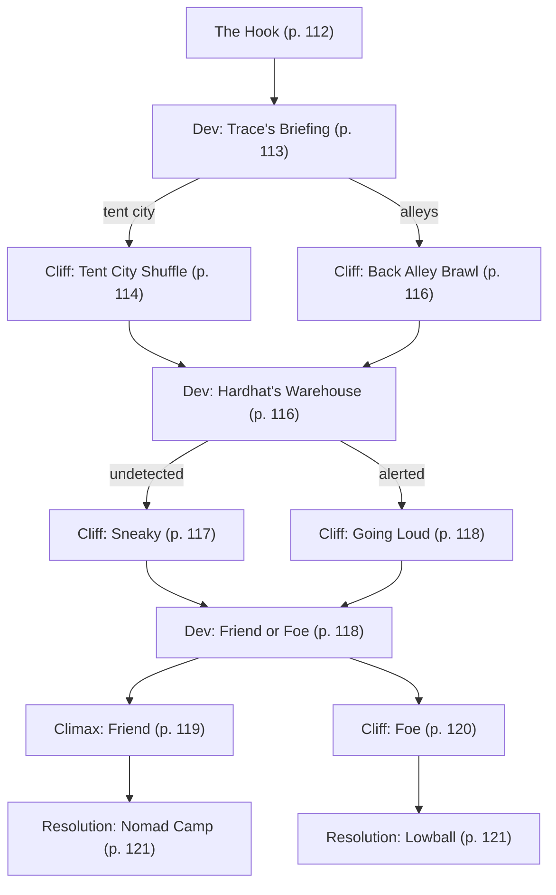

# Staying Vigilant

Book pages 112–127

Mission involving Hardhat's warehouse.

## Contents

- [Beat Chart](<08 Staying Vigilant.md#beat-chart>) (p. 112)
- [Background](<08 Staying Vigilant.md#background-read-aloud>) (p. 112)
- [The Rest of the Story](<08 Staying Vigilant.md#the-rest-of-the-story>) (p. 112)
- [The Setting](<08 Staying Vigilant.md#the-setting>) (p. 112)
- [The Opposition](<08 Staying Vigilant.md#the-opposition>) (p. 112)
- [The Hook](<08 Staying Vigilant.md#the-hook>) (p. 112)
- [Dev (Trace's Briefing)](<08 Staying Vigilant.md#dev-traces-briefing>) (p. 113)
- [Cliff (Tent City Shuffle)](<08 Staying Vigilant.md#cliff-tent-city-shuffle>) (p. 114)
- [Cliff (Back Alley Brawl)](<08 Staying Vigilant.md#cliff-back-alley-brawl>) (p. 116)
- [Dev (Hardhat's Warehouse)](<08 Staying Vigilant.md#dev-hardhats-warehouse>) (p. 116)
- [Cliff (Sneaky)](<08 Staying Vigilant.md#cliff-sneaky>) (p. 117)
- [Cliff (Going Loud)](<08 Staying Vigilant.md#cliff-going-loud>) (p. 118)
- [Dev (Friend or Foe)](<08 Staying Vigilant.md#dev-friend-or-foe>) (p. 118)
- [Climax (Friend)](<08 Staying Vigilant.md#climax-friend>) (p. 119)
- [Climax (Foe)](<08 Staying Vigilant.md#climax-foe>) (p. 120)
- [Resolution (Nomad Camp)](<08 Staying Vigilant.md#resolution-nomad-camp>) (p. 121)
- [Resolution (Lowball)](<08 Staying Vigilant.md#resolution-lowball>) (p. 121)
- [NET Architectures](<08 Staying Vigilant.md#net-architectures>) (p. 122)
- [NPC Stat Blocks](<08 Staying Vigilant.md#npc-stat-blocks>) (p. 123)

---

*By Bad Moon Art Studio*

**Tagline:** Three crews dead. Will yours be next?

---

## Beat Chart

**Flow summary:** Trace Santiago hires the Crew to investigate a rumored cyberpsycho who has killed three Edgerunner crews. The path to Hardhat's warehouse runs through a tent city or alleyways. Inside the warehouse, the Crew faces Hardhat's Continental Brands–sponsored team, then Nat — the real "psycho," a Nomad seeking revenge. The Crew chooses to help Nat or collect Lowball's bounty.

**Branching notes:**

- At **Dev (Trace's Briefing)**, choose the tent city or alley route.
- At **Hardhat's Warehouse**, stealth leads to **Sneaky**; tripped defenses lead to **Going Loud**.
- At **Dev (Friend or Foe)**, talk to Nat or fight her for the bounty.

---

> **Background (Read Aloud)**
>
> It isn't every day the child of a legend calls and asks to meet. Everyone in Night City knows the name of Nomad Santiago. He was Rogue Amendiares' partner back during her Solo days, and with her and Silverhand during the Arasaka riot of 2013. After that, he took charge of the Aldecaldos and grew them into the leading Nomad family in the American West. Hell, maybe anywhere. Santiago's kid, Trace, is no slouch, either. He's a Media with a track record of breaking stories the Corps would rather keep quiet. Normally he runs with his own team but for some reason, he wants to meet your Crew at the Afterlife.

### The Rest of the Story

Trace Santiago is chasing a rumor of a cyberpsycho terrorizing The Street. The psycho has supposedly taken down three Edgerunner crews in a matter of days and everyone wonders who might be next. Regulars at the Afterlife have even begun placing bets on which crew will next taste the dirt. Trace has been chasing this elusive vigilante with typical Media zeal, aiming to shed light on the situation. He hires the Crew to flush out the psycho and figure out their story, coordinating their efforts via remote drone. After making their way through alleyways and tent cities laden with scavs, either by stealth or by carving a path of flesh, the Crew finds themselves at odds with a Continental Brands–sponsored team of Edgerunners waiting to ambush the vigilante. Finally, they are confronted by the supposed cyberpsycho, a Nomad named Nat looking for payback after a Continental Brands strike team attacked her pack. After hearing her side of the story, the Crew can decide either to assist Nat and escort her to the safety of the Badlands or turn on her to earn some heavy Corporate cash.

### The Setting

The story begins in the Afterlife, the legendary Solo bar. Once they've taken the job, the Crew will make their way through alleyways and a tent city towards an old warehouse where another Edgerunner team's getting ready to confront the supposed cyberpsycho. There, they'll have a choice: take down the "psycho" and end it there or escort her on a wild chase through the streets of Night City and into the Badlands.

### The Opposition

- **Scavvers** line the alleyways and huddle in the tent city the Crew will pass through on the way to the other group's ambush point. They might be desperate enough to jump the Edgerunners in an attempt to grab their gear.
- There's a chance the Crew will come across a few members of the **Reckoners** cult stirring up trouble in the tent city.
- **Hardhat's Crew** is a team of four, led by a Solo, each well-armed by their sponsors.
- Depending on the Crew's choices, at the end of the mission, they'll either face the "cyberpsycho" **Nat**, a Nomad who won't let anything stand between her and payback for her pack's death, or a **sniper** positioned aboard a gyrocopter, looking to end Nat's life.

See [NPC Stat Blocks](<08 Staying Vigilant.md#npc-stat-blocks>) for stat blocks.

### The Hook

In the Upper Marina, near the edge of the Hot Zone, the Afterlife plays host to the best and the worst Night City has to offer — depending on whom you ask. Solos meander through the crowd before taking a seat at the bar to wait for an open contract or a ping from their favorite Fixer. With the mayhem running rampant on The Street, they're never waiting long.

A few crews lounge in booths chatting amongst themselves, while others prefer the more discreet alcoves available deeper inside. Rumors of an over-chromed cyberpsycho aiming for Edgerunner crews circulate. A fresh wave of panic has swept across the Street as screamsheets and local Medias report a third massacre in as many days. Another crew flatlined, this time one that frequented the Afterlife. If the crews in attendance tonight are worried, though, they don't show it. If anything, they look ready. Daring someone to make a move.

The Team enters the Afterlife after receiving a message from famed Media Trace Santiago, with the promise of a job. Those who don't know him at least know of his father, the revered Nomad Santiago. Anyone who doesn't is soon reminded by Santiago's former partner — and current owner of the Afterlife — Rogue. She leans against the bar surveying the room, and upon seeing the Crew motions for them to follow her. Passing the end of the bar, a few Solos can be seen cashing out their bets and placing new wagers on which crew will take out this new threat… or be the next to buy the farm.

Trace sits in a corner alcove, his feet up on the table as a miniature drone projects a series of news reports and found footage of the recent killings. Rogue nods to Trace and says a simple, "Don't push yourself, kid." before leaving. Trace winces as he sits up a bit straighter and speaks.

"Please, sit. I'm guessing you've heard the news. Three crews dead. I've been chasing this for a few days. A five-man crew found dead, that's just business as usual. Life's cheap in Night City. But with no other dead or injured? None of their bodies looted or hideouts ransacked? Now that's a fuckin' story! And with two more crews gone in a similar fashion, it's got everyone on alert. Circumstances have benched me and my usual team's already got a job, so I'd like to hire you. A thousand each for you to track down this supposed cyberpsycho and get me the info I need to break the story. What do you say?"

**Go to:** [Dev (Trace's Briefing)](<08 Staying Vigilant.md#dev-traces-briefing>)

### Dev (Trace's Briefing)

Trace shares the screamsheets he's collected. The reporting's lazy, with stories essentially quoting NCPD or local security representatives word for word but some facts can be gleaned.

- So far, three crews have died. One yesterday, one the day before, and one the day before that. According to Trace, the first two crews were newbies but the third had a decent track record.
- The dead Edgerunners all had cyberware and at least some of it was fried.
- Everyone was killed with a bladed weapon. Something along the lines of a sword or machete.
- The victims all had firearms but few shots were fired.
- An Oasis clerk working across the street from the first murder site saw a single figure, "all chromed out", running away from the building. That started the rumors of the murderer being a cyberpsycho.

In addition, Trace's investigations have revealed two additional pieces of information. Trace has spent some ebs and obtained two pieces of visual evidence. The first comes from an Oasis market security camera, located across the street from where the first crew was found. It shows a figure, possibly female, running out of the building and away from the scene. The second is a photo he purchased from a courier company whose delivery drone was passing overhead. It shows a lone figure in an alleyway, surrounded by prone bodies. This was the third crew murdered.

Each of the three crews has one thing in common: They've all taken jobs from Lowball, a mid-level Fixer who does work for various Corporate clients, including REO Meatwagon, Raven Microcybernetics, and Continental Brands.

"I don't have any evidence these crews were out on a job for Lowball but he won't take my calls. Something's off. I've got a lead though. I've made a list of other crews Lowball works with and there's only two left. One specializes in transport and delivery via air. Word around the Afterlife is that the other group, led by a Solo named Hardhat, has gone to ground in a warehouse near here. Go over and see what's what."

Trace recommends walking rather than driving over to the warehouse. An approaching vehicle might spook the other crew that's gone to ground and turn things messy.

Finally, he holds up a drone. "I can't go with you or I'll probably pop my stitches," Trace says as he pulls his shirt open to reveal his entire torso is bandaged up, "But I'm sending this drone along with you to get footage for my story. It'll also let me talk to you."

Trace's coordinates take the Crew on a path that skirts the Hot Zone along the edge of the Old City Center. As they stray further from the Afterlife, the surroundings become noticeably grim. Along the route lies a maze of tent cities and crowded alleyways, near to bursting with scavengers and homeless desperate to escape the Hot Zone but too poor to go much farther than the edge of the ruins.

There are two routes through this area, either through the tent city or around it. The former allows for safer travel, but occasionally gangs, corporate security, and NCPD sweep through the area looking for trouble. The other route will lead the Crew to their destination via alleyways, which is less likely to cause a disturbance and alert upcoming opposition. However, the further they get from populated areas the more likely they are to be jumped by scavs or other marauders.

Before leaving the Afterlife, the Crew can check in with the bookies taking bets on this whole mess. They can bet on how many additional crews the cyberpsycho will slaughter before they either stop or are killed and must choose a number between 0 and 10. The minimum bet is 100eb and the maximum is 500eb. Any Edgerunner placing a bet should make a DV13 Gamble Check. If they fail, they double their bet if they pick the correct number. If they succeed, they triple it. The Crew can return to the Afterlife to collect their winnings once the mission ends.

If the Crew decides to travel through the tent city, **go to** [Cliff (Tent City Shuffle)](<08 Staying Vigilant.md#cliff-tent-city-shuffle>). If they decide to travel through the alleyways, **go to** [Cliff (Back Alley Brawl)](<08 Staying Vigilant.md#cliff-back-alley-brawl>).

### Cliff (Tent City Shuffle)

Clustered among abandoned storefronts and stretching across nearby intersections lies a clear symptom of Night City's rampant homelessness. The tent city expands ever outward, filled with the destitute and downtrodden of Night City. Some gamble their last Eurobucks and scraps of food on games of chance. Others do their best to go unnoticed, not wanting to attract the attention of scavs and other predators of the camp.

Trace's electronic voice speaks from the drone.

"These poor souls might have information but keep in mind our cyberpsycho's good at going undetected. They, or this crew we're looking for, might have spies here. Your choice."

If the Crew tries to communicate with the residents of the tent city, they'll need to succeed at a Conversation or Persuasion DV15 Check to get any information. Reduce the DV if the Crew share food, money, or gear with people. On a success, they learn Hardhat's crew received a shipment of crates earlier this morning at their warehouse and they've spent the whole day rigging the place with defenses.

Toward the center of the slums, a small crowd gathers around a group of strangely clad individuals gesturing manically. A group of Reckoners, members of a doomsday cult, proclaim the coming Harvest of Souls to be imminent. Some of the tent city residents listen, either for amusement or because they want to hear the message. At the feet of the Reckoners lies an unconscious man, who appears to have been beaten savagely after refusing to join their cause.

As soon as one of the Reckoners spots the Crew, they'll shout for joy.

"Friends!" One of the Reckoners proclaims, "You have come at just the right time to donate to our cause! Cleanse your souls by turning out your pockets! After all, what good will your money be when the Harvest comes?"

The Reckoners demand the Edgerunners donate to their cause and won't be satisfied with anything less than 200eb each. If the Edgerunners give less or refuse to give, they'll move in to attack. There are a number of Reckoners present equal to the number of Edgerunners in the Crew plus 1. One is a Reckoner leader (use **Road Ganger**, page 173; remove the Crossbow) and the rest are followers (use **Boosterganger**, page 172).

After the Crew defeats the Reckoners, **go to** [Dev (Hardhat's Warehouse)](<08 Staying Vigilant.md#dev-hardhats-warehouse>).

### Cliff (Back Alley Brawl)

Running parallel to the tent city, just inside the Hot Zone, are a series of alleyways between a group of abandoned buildings. Despite its proximity to the nearby camp, the path is eerily quiet. Except for several large piles of junk left rotting and rusting in the alleyways, the narrow pathways are bare. Any signs, lamps, or sources of light have long since been stolen or destroyed, plunging the alleys into near-total darkness.

Once the Crew travels deep into the alleyways, shapes stir among the junk piles along the side of the alley. Windows can be heard opening farther down the street, as more shadowy figures climb down to the ground. A group of scavvers armed with a variety of makeshift melee weapons advances cautiously from all sides. One scavver speaks from the shadows.

"This here's a Night City tollway. Gotta pay to play. Some nice hardware you got there. It'd buy us some good boosts, maybe even some anti-rad. Or you could just drop some Eurobucks our way. Say 200?"

If the Crew doesn't pay up or succeed in a Facedown (the scav group has a Reputation of 1), the scavvers (use **Boosterganger**, page 172) will attack in two waves. Each consists of one scavver per two Edgerunners present (minimum of two in each wave). In addition, scavvers inside the buildings lean out from the broken windows overlooking the alleys and throw heavy objects (treat as Heavy Melee Weapons) down at the Edgerunners from above. If the scavvers on the ground are defeated, the ones in the building scurry deeper into the Hot Zone and away from the Crew.

After the Crew defeats the scavvers, **go to** [Dev (Hardhat's Warehouse)](<08 Staying Vigilant.md#dev-hardhats-warehouse>).

### Dev (Hardhat's Warehouse)

After making their way through either the tent city or the dark alleyway, the Team arrives at their coordinates — a shipping warehouse that, at first glance, seems abandoned. To be fair, obscurity can be incredibly helpful to many crews when it comes to picking a hideout. Trace insists Hardhat's crew is holed up here and he's sure they're involved in this somehow.

> **Infobox: Hardhat's Warehouse**
>
> 1. Observation Cameras
> 2. Laser Grids
> 3. Automated Turret

If the Crew thinks to knock on the front door, they'll get no answer. Hardhat's crew isn't interested in anyone who stays outside the warehouse.

No matter what, Trace insists on the Crew going inside.

"I can't break this story without more information and I'm convinced it's in there. We should go inside."

The warehouse is home to the sort of defense system one normally expects in a Corporate-controlled building. There are four perimeter Observation Cameras (see page 174) on the exterior of the building along with two inside. Just inside the two lower entrances are Laser Grids (see page 174) and an automated turret equipped with a Heavy SMG (see page 174) monitors the entrance near the fire escape. An Imp in the NET Architecture (see [NET Architectures](<08 Staying Vigilant.md#net-architectures>)) monitors the defenses. If the cameras spot anyone entering the building or the other defenses are activated, it will inform Hardhat immediately.

The two lower doors are both Thin Steel (25 HP) and electronically locked (DV17 Electronics/Security Tech Check to open). Getting in via the second-story fire escape requires someone to leap to the hanging ladder with a DV15 Athletics Check or the use of a Grapple Gun. Once the ladder is lowered, anyone can climb it. Opening the window leading into the warehouse from the fire escape requires a DV15 Pick Lock Check.

If the Crew makes it inside without alerting anyone in Hardhat's group, **go to** [Cliff (Sneaky)](<08 Staying Vigilant.md#cliff-sneaky>). If they set off the defenses or otherwise alert Hardhat's group, **go to** [Cliff (Going Loud)](<08 Staying Vigilant.md#cliff-going-loud>).

### Cliff (Sneaky)

The warehouse is quite large, and the maze of empty shipping containers muffles the sound of their movements, so if the Crew can make it past the defenses without alerting anyone, they can take time to gather their wits and examine their surroundings — though there isn't much to see. Aside from a few large pieces of run-down machinery and several large cargo containers, the building is barren. Voices can be heard from the center and once the Team moves close enough they'll be able to identify them as belonging to four Edgerunners in conversation as they stand near a table loaded with boxes bearing the Continental Brands logo.

"...don't know what you're complaining about. There's four of us and it's a simple job. Shouldn't even need all this fancy shit, not that I mind a few new guns and gear for our HQ." one of the four grumbles.

"Bet Lowball's other crews said the same thing." another responds.

"Shut it," a woman wearing a reinforced hard hat growls, "Stop jabbering and pay attention. Our target could be here any second and we need to be ready. Lowball's Corp bosses want her dead so we do our job or we don't get paid."

This is Hardhat and her crew (see [NPC Stat Blocks](<08 Staying Vigilant.md#npc-stat-blocks>)). After their conversation ends, they'll move far enough away from each other to make sure no single grenade can wipe them all out but will still remain within line of sight. They're not interested in talking. If the Edgerunners step out and try to engage Hardhat or her team in conversation, they'll attack immediately on the assumption they are either allied with their prey or a rival crew trying to steal their bounty.

Hardhat and her team aren't the "fight to the death" sort. If things look bad (two or more members getting Seriously Wounded), they will try to retreat.

Once the battle ends, one way or the other, **go to** [Dev (Friend or Foe)](<08 Staying Vigilant.md#dev-friend-or-foe>).

### Cliff (Going Loud)

If the Crew tripped the defenses or made a lot of noise while entering the warehouse, Hardhat and her team (see [NPC Stat Blocks](<08 Staying Vigilant.md#npc-stat-blocks>)) are behind cover and ready for them. They won't listen to reason, assuming the Crew is either allied with their prey or a rival team trying to steal their bounty.

Hardhat and her team aren't the "fight to the death" sort. If things look bad (two or more of them getting Seriously Wounded), they will try to retreat.

Once the battle ends, one way or the other, **go to** [Dev (Friend or Foe)](<08 Staying Vigilant.md#dev-friend-or-foe>).

### Dev (Friend or Foe)

Give the Crew time to perform first aid, reload, and loot as needed. While they recover from the battle, Trace's drone begins hovering around the table, inspecting the crates.

"Continental Brands logos on the outside but these don't look like the sort of crates you ship food in. Bet this is where Hardhat's crew got their fancy hardware and the NET Architecture and defenses for this building. Why would a Megacorp be outfitting an Edgerunner crew holed up in a warehouse on the edge of the Hot Zone? What does this have to do with the cyberpsycho? Something's not right here."

Just as Trace finishes his musings, a disposable cellphone on the table rings. If someone answers, a thin, reedy voice speaks.

"Hardhat? This is Lowball. Give me a sitrep. Has the target shown up yet?"

This is Lowball, the Fixer who hired Hardhat and her crew. Provided they heard Hardhat's voice, a member of the Crew can attempt a DV17 Acting Check to imitate Hardhat's voice and try to get some additional information using an appropriate Social Skill. If the Edgerunner answering the cellphone answers using their own voice, Lowball connects the dots quickly.

"Are you the target? No, no, that doesn't feel right. You must have taken out Hardhat. Look, I don't care who does it but I've got 2,000eb per person for any crew who takes down that red-headed cyberpsycho vigilante."

Just then, a loud thud sounds behind the Crew as a figure lands on a shipping crate, having swung down from the building's rafters. Her Grapple Hand retracts back into the cyberarm on her right side as she stands, weapons at the ready.

The woman's eyes dart to each Edgerunner and then to the drone. "'Let me guess. You're here to hunt down the 'cyberpsycho'." She spits as if the word tastes sour. "Still, you did my work for me. I'd thank you for the assist, but folks seem less friendly these days."

The woman has red hair, buzzed short on one side to reveal a series of light tattoos. She wears a stylish jacket with the right sleeve torn off to allow for better movement of the chrome cyberarm that starts at her shoulder, and her left pant leg is cropped short to do the same for her cyberleg.

There's a pin on the jacket. With a DV13 Streetwise or an appropriate Local Expert Check, an Edgerunner can realize it marks her as a member of the Jodes Nomad Family. Nomads automatically recognize it. If the Edgerunners don't make the connection, Trace Santiago will comment via his drone.

"You're a Nomad?!?"

With this revelation, the Crew has a choice. They can try to talk to the Nomad woman and learn her story or they can try to take her down and collect the bounty offered by Lowball.

> **Sidebar: Staying Outside**
>
> Despite Trace's prompting, the Crew might decide against entering the warehouse. If that happens, Nat will spend some time watching them from a hidden position (Perception Check versus her Stealth Check to see if she's spotted) before approaching. She won't attack but will question the Crew about their intentions. Use elements of **Dev (Friend or Foe)** and **Cliff (Going Loud)** to replot the mission but have things go down in this order: the Crew either befriends Nat or fights her. In either case, Hardhat's team bursts out of the warehouse and attacks. After the dust settles, the Edgerunners should find the disposable cellphone nearby (Hardhat dropped it during the fight) and receive Lowball's call. From there, they can decide if they'll help Nat or take Lowball's offer. Move on to the appropriate Climax.

The woman is Nat, the supposed cyberpsycho, and she's not looking for a fight.

If the Crew decides to talk to Nat, **go to** [Climax (Friend)](<08 Staying Vigilant.md#climax-friend>).

If they decide to fight Nat and collect the bounty, **go to** [Climax (Foe)](<08 Staying Vigilant.md#climax-foe>).

What she is looking for is payback, since a Continental Brands strikeforce struck her Pack a month ago as they were transporting a shipment of food to Night City. The strikeforce stole the food and slaughtered most of Nat's mates. She's been in Night City ever since, trying to find out who ordered the job. Nat knows she can't take down an entire Megacorp but she can get revenge for her Pack by killing the person who ordered the job.

#### Switching Sides

If, at any point, the Crew decides to switch sides and collect Lowball's bounty, **go to** [Climax (Foe)](<08 Staying Vigilant.md#climax-foe>). Just change the location of the fight from the warehouse to wherever they happen to be at the time.

### Climax (Friend)

De-escalating the situation isn't hard. Nat recognizes Trace Santiago — well, his last name anyway — and so long as the Crew doesn't go aggro on her, the Nomad is happy to take a breather. At Trace's urging, she'll tell her story. He'll record the entire thing via his drone.

"Happened a month ago. My Pack was bringing a shipment of food to Night City when a strike team hit us. They killed my mates and wrecked our vehicles. I was the only survivor. They zoomed off with the food but one of their own fell off their rig. They left him for dead but he was alive enough to tell me Continental Brands hired him.

"So, I walked into Night City before I could bleed out. Got patched up. And started hunting. I know I can't take down an entire Megacorp but I can find the asshole who ordered the hit and put them in the ground. After I started digging, Continental Brands sent a crew after me. Then another. Then a third. Tonight, a Continental Brands peon I was…questioning…suggested I'd find answers here. Looks like it was a trap. And now I'm no closer to finding out who killed my family."

If the Crew mentions Lowball, Nat perks up.

"A Fixer working for Continental Brands? Bet he knows something. Or at least hired the strike team. But he'll be in full paranoid mode by this point. If I hit him tonight, I'll probably get myself dusted. That won't do anyone any good."

At this point, Trace makes a suggestion. He'll double the Crew's pay if they'll escort her to the Aldecaldo Camp so she can rest and plan her next move. If they don't have their own vehicle, Trace will offer the use of his. Either way, he asks them to return to the Afterlife to pick him up. He's going with Nat to the Aldecaldo Camp.

Trace meets the Crew and Nat outside the Afterlife. If the Crew is using Trace's vehicle, he'll hand his keys over to whoever wants to drive and stiffly slip into the backseat of his open roof truck (see [Drones and Vehicles](<08 Staying Vigilant.md#drones-and-vehicles>)). If no one can drive, Nat will take the keys. If they're taking their own vehicle, Trace will thank them and get in, being careful of his injuries.

Just as they're getting into the vehicle, a gyrocopter (see [Drones and Vehicles](<08 Staying Vigilant.md#drones-and-vehicles>)) swoops in. A sniper (see [NPC Stat Blocks](<08 Staying Vigilant.md#npc-stat-blocks>)) leans out and takes a shot. It sparks off the side of the car.

"Sniper! Head south! We can lose them in the Hot Zone!" Trace shouts.

What follows is a tense chase through the Hot Zone, with the gyrocopter and sniper right on their tail.

The Hot Zone is an absolute mess of broken streets and shattered buildings, requiring both the driver of the Crew's vehicle and the pilot of the gyrocopter to make a Maneuver (see CP:R page 192) of the GM's choice each Round, just to keep from losing control. Keep track of the number of successful Maneuver Checks made by the Crew's driver.

The gyrocopter does its best to stay within the 201 to 400 m/yds of the Crew's vehicle to give the sniper an optimal shot while making return fire difficult. When the pilot fails a Maneuver Check, the gyrocopter is forced to move one range band closer (from 201 to 400 m/yds away to 101 to 200 m/yds away and so forth), making it easier for the Crew to shoot back.

If the pilot succeeds at a Maneuver Check during a Round following a failed Check, the gyrocopter moves back a range band (from 101 to 200 m/yds away to 201 to 400 m/yds away and so forth) until they're at the preferred distance from the Crew's vehicle.

If the Crew's vehicle stops or crashes, the gyrocopter hovers above them at the 201 to 400 m/yd range and the sniper does their level best to kill their priority target: Nat.

The chase ends when one of the following occurs.

- The Crew's driver makes 7 successful Maneuver Checks, after which they've lost the gyrocopter in the urban canyons.
- The gyrocopter fails 5 Maneuver Checks in a row, after which it crashes into the ground.
- The Crew kills the gyrocopter pilot, the sniper, or reduces the gyrocopter to 0 SDP, causing it either to crash or break off pursuit.
- The GM decides, for whatever reason, the Crew has outraced or outpaced the gyrocopter.

> **Sidebar: Not Just the Driver**
>
> While there's a lot of focus on the driver in this chase, other members of the Crew can take action, too. A good shot with an Assault Rifle, for example, can take the fight to the enemy. If the Crew doesn't have an Assault Rifle on hand, they're in luck! Trace happens to have two Poor Quality Assault Rifles in the back seat of the truck and each is fully loaded.
>
> Don't forget about Complimentary Skill Checks. Let the Players pitch ideas on using Skills to provide a +1 bonus to anyone driving or shooting. Perception, Streetwise, and Tactics all represent good options.
>
> And if they suggest a wild idea beyond what we've outlined here? Figure out the DVs and let them give it a try. After all, anything's possible with the rule of cool.

Once the chase ends, **go to** [Resolution (Nomad Camp)](<08 Staying Vigilant.md#resolution-nomad-camp>).

### Climax (Foe)

If the Crew decides to battle Nat (see [NPC Stat Blocks](<08 Staying Vigilant.md#npc-stat-blocks>)), remember she's already wiped out three different Edgerunner teams. She's a canny opponent who knows how to use her surroundings to her advantage and fights smarter, not harder. In addition, Trace Santiago will take her side. He can't fight directly but will use his drone's grenade launcher to assist her.

Should the Crew try to befriend Nat in order to lure her into a false sense of security or a trap, they'll need to make a successful Persuasion Check against her Human Perception. Likewise, if Trace is present (either in person or via his drone) the Crew will need to fool him as well. If only Trace's drone is present, he suffers a −2 to his Human Perception Check.

If the Crew kills Nat, **go to** [Resolution (Lowball)](<08 Staying Vigilant.md#resolution-lowball>).

### Resolution (Nomad Camp)

The Nomads guarding the Aldecaldo Camp immediately wave the Crew through when Trace pops his head out to vouch for them. Once the Crew's inside the Aldecaldos will welcome everyone with open arms, providing food, a place to sleep if needed, and even medical care in the form of stabilization and treatment for any Critical Injuries. Trace and Nat split from the Crew to talk but meet up with them an hour later.

"Thanks for your help tonight," Nat says, "It's good to know there are at least a few decent people left in this shithole of a city. I've still got a job to do here but Trace promises me he'll help me track down my Pack's killer. If you ever need a favor from me, you've earned it."

Trace agrees, "Tonight didn't go as expected, but you all made the right choice and we brought a sister home. Thank you for helping me dig up some of Continental Brand's dirt. With luck, we can put some corp-bro in jail for this. At the very least, I can make it harder for them to contract with any Nomad family on the West Coast; that should give their stock prices a hit."

Trace pays each Crew member 1,000eb, as promised.

Trace's expose on the attacks by Continental Brands on Nomad convoys hits the air via Never Blink News a week later. If any member of the Crew is a Media, Trace gives them a byline on the story. The story's packed with enough evidence to endanger the relationship between Continental Brands and several Nomad Nations, prompting the Megacorp to scale back on raiding operations for a while. The Crew made a difference.

### Resolution (Lowball)

Feeling betrayed, Trace refuses to meet with, or pay, the Crew. If they visit the Afterlife, things might feel uncomfortable for a while. The story's gotten around. Rogue, and some Edgerunners, give the Crew the stink eye but other teams are on their side. As far as they're concerned, Nat was essentially a serial killer, not a victim. Many of the Afterlife's regulars lost friends to her.

Lowball meets with the Crew at an Oasis in Little Europe and pays them what he promised: 2,000eb. If they ask about future work, he declines, saying he's going to skip town for a while. Continental Brands isn't happy with how long it took to take Nat down and Lowball doesn't want to be around if there's blowback.

A week after the incident, Trace Santiago releases an expose via Never Blink News. He accuses Continental Brands of attacking Nomad convoys but without an eyewitness to give more information and testify on air, the story loses a lot of punch. Continental Brands denies the accusations entirely.

> **Sidebar: Curious About Hardhat's Hardware?**
>
> Wondering how Hardhat and her crew got hold of a fully loaded NET Architecture and defense package? Not to mention all those sweet guns?
>
> Hardhat's crew was the latest to be hired by the Fixer known as Lowball for a mission — to take out a lone operative who has been targeting Continental Brands operations in Night City. Three crews had already failed so Hardhat devised a plan: hole up, fortify, and wait for the enemy to come to them. She convinced Lowball to acquire a NET Architecture and defenses from Continental Brands and then spent the day setting up the traps, all while making sure the location was broadcast across Continental Brand's internal communication channels. With the trap set, they waited for it to go off. Too bad it ended up catching the wrong prey.
>
> By the way, if your Edgerunners grabbed any of that loot? Continental Brands might just want it back.

---

## NET Architectures

### Hardhat's Hideout

| Demons Installed | Imp (tasked to cameras and defenses) |
| REZ | 15 |
| Interface | 3 |
| NET Actions | 2 |
| Combat Number | 14 |

Can perform any NET Action a Netrunner is capable of.

| Floor | DV | Node |
|-------|-----|------|
| 1 | 8 | Password |
| 2 | — | Black ICE: Skunk |
| 3 | 8 | Control Node: Observation Cameras |
| 4 | — | Black ICE: Hellhound |
| 5 | 8 | Control Node: Laser Grid |
| 6 | 8 | Password |
| 7 | 8 | Control Node: Automated Turret |

---

## NPC Stat Blocks

Important NPCs in *Tales of the RED: Street Stories* are presented in two formats. Mooks and minor combatants have an abbreviated stat block. NPCs with whom the Crew might have a deeper interaction have a full stat block.

### Hardhat — NPC Stat Block

**Solo: Combat Awareness 2** · **REP 2**

| INT | REF | DEX | TECH | COOL | WILL | MOVE | BODY | EMP |
|-----|-----|-----|------|------|------|------|------|-----|
| 6 | 8 | 8 | 3 | 5 | 6 | 6 | 6 | 4 |

| HP 40 · Seriously Wounded 20 · Death Save 6 |

**Weapons & Armor**

| Weapon | ROF | Damage | Armor/SP |
|--------|-----|--------|----------|
| Ex Quality Assault Rifle w/ Smartgun Link (C# 20) | 1 | 5d6 | Head: Light Armorjack SP 11 |
| Heavy Melee Weapon (C# 12) | 2 | 3d6 | Body: Light Armorjack SP 11 |

**Skills:** Athletics 14, Autofire 12, Basic Tech 10, Brawling 12, Concentration 10, Conversation 6, Education 8, Endurance 10, Evasion 14, First Aid 5, Handgun 10, Human Perception 8, Language (English) 10, Language (Streetslang) 8, Local Expert (Upper Marina) 10, Melee Weapon 12, Perception 14, Persuasion 7, Resist Torture/Drugs 12, Shoulder Arms 12, Stealth 10, Tactics 10

**Gear:** Rifle Ammo x50, Agent, Binoculars, Disposable Cellphone (on the table), Flashlight, Handcuffs x2

**Cyberware:** Neural Link w/ Interface Plugs and Kerenzikov

---

### Bullhorn — NPC Stat Block

**Fixer: Operator 2** · **REP 1**

| INT | REF | DEX | TECH | COOL | WILL | MOVE | BODY | EMP |
|-----|-----|-----|------|------|------|------|------|-----|
| 6 | 7 | 5 | 5 | 6 | 7 | 5 | 3 | 4 |

| HP 35 · Seriously Wounded 18 · Death Save 3 |

**Weapons & Armor**

| Weapon | ROF | Damage | Armor/SP |
|--------|-----|--------|----------|
| Excellent Quality Heavy Pistol (C# 12) | 2 | 3d6 | Head: Light Armorjack SP 11 |
| Light Melee Weapon (C# 6) | 2 | 1d6 | Body: Light Armorjack SP 11 |

**Skills:** Acting 12, Athletics 7, Brawling 7, Bribery 10, Business 12, Concentration 9, Conversation 10, Education 10, Evasion 11, First Aid 7, Forgery 10, Handgun 12, Language (Cantonese) 12, Language (Streetslang) 12, Local Expert (Upper Marina) 12, Perception 10, Persuasion 10, Pick Lock 9, Stealth 7, Streetwise 10, Trading 10, Wardrobe & Style 12

**Gear:** Heavy Pistol Ammo x20, Agent, Bug Detector, Disposable Cellphone, Lock Picking Set, Vial of Poison

**Cyberware:** AudioVox, Contraceptive Implant, EMP Threading, Light Tattoo x3

---

### Spanner — NPC Stat Block

**Tech: Maker 1** (Field Expertise 1, Fabrication Expertise 1) · **REP 1**

| INT | REF | DEX | TECH | COOL | WILL | MOVE | BODY | EMP |
|-----|-----|-----|------|------|------|------|------|-----|
| 7 | 7 | 5 | 6 | 3 | 3 | 6 | 6 | 5 |

| HP 35 · Seriously Wounded 18 · Death Save 6 |

**Weapons & Armor**

| Weapon | ROF | Damage | Armor/SP |
|--------|-----|--------|----------|
| Excellent Quality Shotgun (C# 12) | 1 | 5d6 | Head: Light Armorjack SP 11 |
| Medium Melee Weapon (C# 6) | 2 | 2d6 | Body: Light Armorjack SP 11 |

**Skills:** Athletics 7, Basic Tech 11, Brawling 7, Concentration 5, Conversation 7, Cybertech 11, Education 10, Electronics/Security Tech 11, Evasion 11, First Aid 12, Human Perception 7, Land Vehicle Tech 11, Language (English) 11, Language (Streetslang) 9, Local Expert (Upper Marina) 9, Perception 9, Persuasion 5, Shoulder Arms 12, Stealth 7, Weaponstech 12

**Gear:** Shotgun Shells x10, Shotgun Slugs x10, Agent, Duct Tape x2, Tech Bag, Techtool

**Cyberware:** Contraceptive Implant, Neural Link w/ Interface Plugs

---

### Sledge — NPC Stat Block

**REP 0**

| INT | REF | DEX | TECH | COOL | WILL | MOVE | BODY | EMP |
|-----|-----|-----|------|------|------|------|------|-----|
| 3 | 4 | 7 | 2 | 2 | 3 | 5 | 8 | 3 |

| HP 40 · Seriously Wounded 20 · Death Save 8 |

**Weapons & Armor**

| Weapon | ROF | Damage | Armor/SP |
|--------|-----|--------|----------|
| Ex Quality Very Heavy Melee Weapon (C# 12) | 1 | 4d6 | Head: Light Armorjack SP 11 |
| — | — | — | Body: Light Armorjack SP 11 |

**Skills:** Athletics 11, Brawling 12, Concentration 7, Conversation 5, Education 5, Evasion 10, First Aid 4, Handgun 8, Human Perception 5, Interrogation 6, Language (German) 7, Language (Streetslang) 7, Local Expert (Upper Marina) 5, Melee Weapon 12, Perception 5, Persuasion 4, Resist Torture/Drugs 5, Stealth 9

**Gear:** Agent, Radio Scanner/Music Player

**Cyberware:** Grafted Muscle and Bone Lace, Independent Air Supply

---

### Nat — NPC Stat Block

**Solo: Combat Awareness 5** · **Nomad: Moto 1** (currently has no vehicle) · **REP 4**

| INT | REF | DEX | TECH | COOL | WILL | MOVE | BODY | EMP |
|-----|-----|-----|------|------|------|------|------|-----|
| 6 | 8 | 8 | 5 | 4 | 7 | 8 | 10 | 4 |

| HP 55 · Seriously Wounded 28 · Death Save 10 |

**Weapons & Armor**

| Weapon | ROF | Damage | Armor/SP |
|--------|-----|--------|----------|
| Very Heavy Pistol (C# 16) | 1 | 4d6 | Head: Subdermal SP 11 |
| Excellent Quality Heavy Melee Weapon (C# 16) | 2 | 3d6 | Body: Subdermal SP 11 |

**Skills:** Athletics 10, Brawling 16, Concentration 10, Conversation 7, Education 8, Evasion 16, First Aid 8, Handgun 16, Human Perception 7, Interrogation 13, Language (English) 10, Language (Scottish) 10, Language (Spanish) 10, Language (Streetslang) 8, Local Expert (Badlands) 8, Martial Arts (Karate) 16, Melee Weapon 16, Perception 12, Persuasion 7, Resist Torture/Drugs 16, Stealth 16, Tactics 14

**Gear:** Very Heavy Pistol Ammo x16, EMP Grenade x2, Smoke Grenade x2, Disposable Cellphone

**Cyberware:** Cyberarm w/ Grapple Hand and Popup Microwaver, Cybereye x2 w/ Lowlight/Infrared Vision/UV, Grafted Muscle & Bone Lace, Medical Grade Cyberleg, Neural Link w/ Sandevistan

---

### Gyrocopter Pilot (Mook)

| HP 35 · INIT 18 · MOVE 6 · Combat # 6 · REP 1 |

**Weapons & Armor**

| Weapon | ROF | Damage | Armor/SP |
|--------|-----|--------|----------|
| Heavy Pistol (C# 10) | 2 | 3d6 | Head: Kevlar SP 7 |
| Medium Melee Weapon (C# 6) | 2 | 2d6 | Body: Kevlar SP 7 |

**Skills:** Air Vehicle Tech 8, Athletics 9, Brawling 11, Concentration 6, Education 5, Endurance 9, Evasion 7, First Aid 4, Handgun 10, Human Perception 5, Language (English) 7, Language (Streetslang) 7, Local Expert (Night City Skies) 5, Perception 9, Persuasion 6, Pilot Air Vehicle 11, Resist Torture/Drugs 8, Stealth 7

**Gear:** Heavy Pistol Ammo x20, Agent, Gyrocopter

**Cyberware:** Neural Link w/ Interface Plugs

---

### Gyrocopter Sniper (Mook)

| HP 40 · INIT 20 · MOVE 6 · Combat # 6 · REP 1 |

**Weapons & Armor**

| Weapon | ROF | Damage | Armor/SP |
|--------|-----|--------|----------|
| Sniper Rifle w/ Sniping Scope (C# 16) | 1 | 5d6 | Head: Kevlar SP 7 |
| — | — | — | Body: Kevlar SP 7 |

**Skills:** Athletics 10, Brawling 10, Bribery 10, Conceal/Reveal Object 15, Concentration 10, Conversation 6, Education 9, Endurance 14, Evasion 16, First Aid 6, Human Perception 6, Language (English) 9, Language (Streetwise) 9, Local Expert (Heywood) 9, Perception 13, Persuasion 9, Shoulder Arms 16, Stealth 16, Wilderness Survival 13

**Gear:** Armor Piercing Rifle Ammo x16, Agent

**Cyberware:** Cybereye x2 w/ Lowlight/Infrared Vision/UV and Targeting Scope

---

### Drones and Vehicles

#### Trace's Remote Camera Drone

A flying drone operated by Trace. It can travel to any location with access to the same CitiNet his Agent is linked to.

| Loadout | Default | Trigger | Data |
|---------|---------|---------|------|
| Observation Camera, Holographic Projector, Grenade Launcher (2 Smoke Grenades) | None. Controlled Directly. | 6 MOVE · 15 HP | Linked to Agent · DV17 Electronics/Security Tech, 5min to counter |

#### Chase Scene Vehicles

| Vehicle | Upgrades | SDP | Seats | Speed (Combat) | Speed (Narrative) |
|---------|----------|-----|-------|----------------|-------------------|
| Trace's Truck | Seating Upgrade x2 | 50 | 6 | 20 MOVE | 100 MPH/161 KPH |
| Gyrocopter | — | 35 | 2 | 20 MOVE | 100 MPH/161 KPH |

Trace's Truck is a beat-up, open-top truck. The gyrocopter is a small, two-person rotorcraft used primarily for courier gigs.
