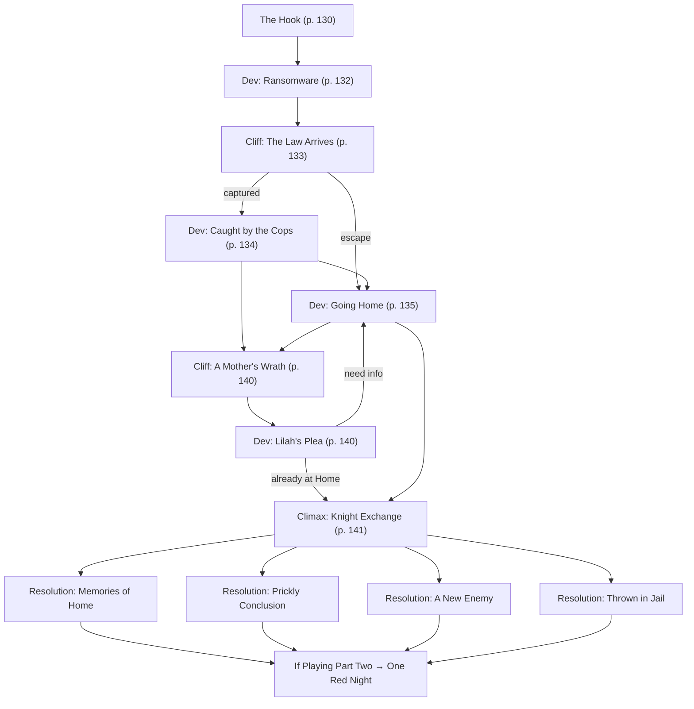

# Bathed in Red

Book pages 128–149

Part one of the Street Stories finale. Mission centered on Delirium, Home, and Red Knight.

## Contents

- [Beat Chart](<09 Bathed in Red.md#beat-chart>) (p. 128)
- [Background](<09 Bathed in Red.md#background-read-aloud>) (p. 128)
- [The Rest of the Story](<09 Bathed in Red.md#the-rest-of-the-story>) (p. 128)
- [The Setting](<09 Bathed in Red.md#the-setting>) (p. 128)
- [Suspects and Opposition](<09 Bathed in Red.md#suspects-and-opposition>) (p. 129)
- [The Hook](<09 Bathed in Red.md#the-hook>) (p. 130)
- [Dev (Ransomware)](<09 Bathed in Red.md#dev-ransomware>) (p. 132)
- [Cliff (The Law Arrives)](<09 Bathed in Red.md#cliff-the-law-arrives>) (p. 133)
- [Dev (Caught by the Cops)](<09 Bathed in Red.md#dev-caught-by-the-cops>) (p. 134)
- [Dev (Going Home)](<09 Bathed in Red.md#dev-going-home>) (p. 135)
- [Cliff (A Mother's Wrath)](<09 Bathed in Red.md#cliff-a-mothers-wrath>) (p. 140)
- [Dev (Lilah's Plea)](<09 Bathed in Red.md#dev-lilahs-plea>) (p. 140)
- [Climax (Knight Exchange)](<09 Bathed in Red.md#climax-knight-exchange>) (p. 141)
- [Resolution (Memories of Home)](<09 Bathed in Red.md#resolution-memories-of-home>) (p. 143)
- [Resolution (Prickly Conclusion)](<09 Bathed in Red.md#resolution-prickly-conclusion>) (p. 143)
- [Resolution (A New Enemy)](<09 Bathed in Red.md#resolution-a-new-enemy>) (p. 144)
- [Resolution (Thrown in Jail)](<09 Bathed in Red.md#resolution-thrown-in-jail>) (p. 144)
- [If Playing Part Two](<09 Bathed in Red.md#if-playing-part-two>) (p. 144)
- [NET Architectures](<09 Bathed in Red.md#net-architectures>) (p. 145)
- [NPC Stat Blocks](<09 Bathed in Red.md#npc-stat-blocks>) (p. 146)

---

*By Shen Fei*

**Tagline:** A night of fun or a night of terror?

---

## Beat Chart

**Flow summary:** A night at Delirium turns deadly when Roman Deckard is murdered and Red Knight's ransomware traps clubbers in their headsets. The Crew follows the Lost Kids underground to Home, learns Dave was Red Knight's puppet, and is caught between Lilah Deckard's security and the law. The warehouse climax forces an impossible choice between Dave and Lilah.

**Branching notes:**

- Multiple paths out of Delirium: brute force, leap from windows, or follow the Lost Kids.
- **Dev (Going Home)** can loop back through **Lilah's Plea** if the Crew meets her first.
- Four possible **Resolutions** at the warehouse; **A New Enemy** leads directly into [One Red Night](<10 One Red Night.md>).

---

> **Background (Read Aloud)**
>
> Regret plagues your nightmares. All those shouldas, wouldas, couldas piling on thick, flat lines, forcing you awake at 2:30 a.m. Flatline: What a conveniently shitty word for murder. You prop yourself up in bed, open your mouth to scream, but nothing comes out. You throw your blankets off, trip over your roommate's laundry, and head to the bathroom. You shake one bottle after the other, hoping to find something — cheap-ass 'Dorphs maybe — to chill the fuck out. Success! Wait. Aspirin? Crap. Welp, only one thing left to do: Find a way to burn off your guilt. Hmm … There's that new hotspot all those suburban twits keep talkin' about. Delirium. Perfect.

### The Rest of the Story

It begins with a night out, as the Crew heads to Delirium, a virtuality club. But this is Night City, and a simple night out quickly turns into a nightmare.

After the body of a wealthy CEO's son is discovered drained of blood, security turns Delirium upside down until they find some likely suspects: a group of teenage street kids dressed as vampires. The teens naturally panic and race to the exit. But are they behind the murder? Before the Crew has a chance to find out, a ransomware attack breaks out, and the teens scramble to safety. Security's hands are full, the teens slip past Lawmen, and the Edgerunners follow close behind — narrowly escaping a riot.

With Delirium surrounded, the Crew has no choice but to follow the teens to safety underground to a place the kids call Home. The Edgerunners put their lives in the teenagers' hands, and head underground to glean vital clues about the victim: Roman Deckard, son of Cactus Water CEO Lilah Deckard. The kids confess that Roman started hanging out at the club about a month ago because he wanted to hire a hacker: someone who knew the rules, but never played by them. Putting the clues together, the Crew emerges from Home with the identity of the murderer.

The Crew's luck takes a bad turn when they realize that beat cops weren't the only antagonists pursuing them. Lilah Deckard's security team waits for the Edgerunners when they re-emerge. Outnumbered and outgunned, the security team kidnaps the Crew and brings them to meet with their boss. After a tense conversation, harsh truths and deadly secrets rise to the surface: A mysterious antagonist called Red Knight has declared vengeance on Deckard and her family. What began as Lilah Deckard's interrogation of the Crew quickly turns into a distraught mother's plea for help.

Lilah Deckard begs the Crew to help her confront Red Knight once and for all; as part of the Crew's payment, she'll also clear the teenagers' ransomware fees — but only if they come with her. As a gesture of good faith, Lilah promises she'll confess live to clear them of any wrongdoing. Only it isn't so simple. In the end, everything goes wrong in a final encounter.

Faced with terrible choices, the Crew must decide whether to save a grieving mother or a teenage victim. Either decision will result in life-changing consequences that will leave the Edgerunners soaking red.

### The Setting

Walking into Delirium is like stepping foot into a shattered mirror — until the Crew remembers to put their virtuality headsets on. Part-fashion accessory, part-tech, the Dee Vee overlays specially designed optics and audio over reality, coded to only present enviros inside the steel-and-glass building. Once tuned in, the user chooses an enviro from that night's list of genres, then loses themselves in a musical dream. Most clubbers wear the proprietary headsets, because the first enviro of the night is always free. Importantly, once on, the Dee Vees lock to prevent the headset from popping off and getting damaged during the often-frenetic dancing. The Dee Vees can be manually unlocked by pressing a combination of buttons built into the headset.

After the Crew personalizes their avatars and picks their preferred virtual worlds, they'll feel a vibrating bass, bathe in an explosion of neon colors, or listen to a mournful singer hum. Suggested thematic effects include:

- **Horrorpunk:** Dim or flickering lighting, walls covered in blood, mud, or rust, throats slashed, zombie-green skin, corpse-white eyeballs, decomposing body parts, intermittent shrieks and moans, rattling chains
- **Dark Cabaret:** Antique lighting, bodices, fishnet stockings, velvet jackets, black-and-white striped pants, theater-style makeup, vintage photographs and paintings, orchestra instruments
- **Synthpunk:** Blackout with glow-in-the-dark hair, tattoos, and makeup, flickering neon lighting, symbols of thunderbolts, lips, stars and hearts, electric guitars, drums, and synths
- **Skatepunk:** Fluorescent lighting, T-shirt, hoodie, jeans, shaved heads, piercings, and beanies, skateboards and roller skates, street art, skulls, and graffiti, roving party lights, acoustic guitar
- **Deathpunk:** Dim or candlelit lighting, spiky black hair, silver crosses, the grim reaper, and coffins, pallid skin, heavy makeup, lace, vinyl, or satin outfits, gentle sobbing, violins, drums, guitar

When the Edgerunners aren't wearing their Dee Vees, they notice the club exudes a late 20th century-industrial vibe with all lighting and furniture riveted to the floors and walls. Black-and-yellow construction stripes line rusted pillars and brushed steel walls. Fluorescent lights hang from the tiled ceiling on chains.

On the second floor there's a small stage for live acts. The surrounding walls have long, ballet-style bars that clubbers can grip or lean on. The bar and stools at the opposite end of the space are brushed stainless steel.

The third floor is for staff and "invite-only" VIPs. It is split into three rooms: a security booth; a lounge filled with couches and soft lighting; and Magnus Haggard's apartment. The headsets do not function on this floor.

Later, the Crew visits Home, a community of transient kids gathered together for safety and companionship beneath the streets of Night City. Despite the location, the kids of Home do their best to make the place their own with glow paint and graffiti.

The mission's final location is an abandoned warehouse in Little Europe, unremarkable except for what can be found inside.

### Suspects and Opposition

The heart of this story is a mystery that unfolds with each dramatic turn. Edgerunners who leap to assumptions might treat certain characters as suspects until they understand their motivation and role in the murder and the larger narrative. Because this is a mystery, it is possible to move through the entire Mission without engaging directly in combat.

- The **Lost Kids** are the main suspects. This group of homeless teenagers dressed like vampires live beneath Night City in the sewers in a self-ruled community of orphans. Five teens are the primary suspects: Flaxx, The Impaler, Two Thee, Asher, and Dave. The Impaler is the primary combatant and defender of the group.
- **Lawmen** on patrol set up a checkpoint outside Delirium and chase the Edgerunners, treating them as suspects, once they're out on the street.
- **Private Security** hired by the victim's mother, Lilah Deckard, is initially convinced the Edgerunners are the murderers. The black-masked team members answer only to their boss, Lilah's bodyguard, **Hannah Prime**. Lilah also has a driver who does not engage in combat.
- **Red Knight** is a mysterious puppeteer pulling everyone's strings. In *Bathed in Red*, their goal is to cause chaos, harm, and misdirection to relentlessly pursue their victims (in this case, Lilah Deckard and Cactus Water) and avoid exposure. Their preferred method of attack is through hacking, ransomware attacks, and sharing deep fakes to torment and extort targets who "deserve" their wrath. After identifying Red Knight's role in the murder, the Crew hunts them down in [One Red Night](<10 One Red Night.md>) (see page 149).
- **Lilah Deckard** is the victim's mother, CEO of a homeopathic startup called Cactus Water, and Red Knight's real target. Why? Turns out Deckard is keeping secrets of her own…

See [NPC Stat Blocks](<09 Bathed in Red.md#npc-stat-blocks>) for stat blocks.

As the story develops, the Edgerunners are increasingly treated as dangerous suspects who must be brought to Lilah Deckard for questioning. To boost the difficulty of this scenario, put a private bounty on the Crew's head that activates once they leave Delirium.

The bounty is issued so quickly that only low-level thugs, corrupt Lawmen, and greedy mooks spot the Edgerunners before veterans have a chance to target them.

### The Hook

You're sweating out your nightmares on the dance floor, but your ghosts won't let you relax. Something about wearing a headset that hacks your sound and vision makes you squeamish, almost paranoid. Sure, Delirium is shiny and new. The second floor even smells like fresh paint and dry ice. But you can't call the club "safe." Even now, you can't tell if anyone's watching you, but you're sure someone is. You fake that "I'm-having-a-great-time!" laugh and secretly scan the crowd. That's when you notice huddled, dark shapes hanging near the far wall. You rip your headset off. Shit. They're just a bunch of scrawny kids munching on Kiwi Kibble. What horror movie did they crawl out of? Pallid skin, blood-red eyes, moon-white fangs. "Some new poser gang?" you wonder aloud. "Or is that just part of the club's schtick?" But no one listens. Not with those lights flashing and that heart-thumping bass. Lost in Delirium.

Some nights start with a job. Other nights end with one. Tonight, the Crew heads to an upscale mall-turned-nightclub called Delirium, south of the Continental Brands offices in Little Europe. Delirium is the kind of "everything goes" club that isn't supposed to exist unless you know the password. That doesn't stop all those students from the University District barreling through or those rich kid posers from the Executive Zone stinking up the place with their overpriced aftershave and Bag Lady Chic rags.

By the time the Crew arrives, there's a line out the door, and only VIPs can skip the wait. To speed things up, the Crew can use an appropriate Social Skill to bribe, cajole, hack, or con their way to the front. Once inside, the Crew picks a headset, and is free to explore the three-story club.

A Perception Skill Check against a DV13 allows Edgerunners to scan their mind-bending landscape and see the differences between reality and virtuality. The Crew can search for clues by noting what isn't in their experience. Staff and security are presented as characters in the themes. Anyone not connected or designed in the programs are displayed as a dark, humanoid shape by design — as a means of encouraging clubbers to wear the headsets and pay for upgrades.

Unfortunately, the Crew's R&R doesn't last long.

Once inside, the story begins in one of two ways: Either an Edgerunner removes their Dee Vee, or they investigate their surroundings while wearing it.

The virtuality environments provide clues by omission. Besides the occasional dancer, there is a cluster of shadows whispering at the back of the club on the second floor. If any Crew member takes off their headgear, they'll notice a group of ratty-looking teenagers huddled in the corner. There are a handful of naturalists in the club as well, too granola to blend in, drinking high-end Euro cocktails out of sugar-rimmed whiskey glasses.

When one or more Edgerunners removes their Dee Vee headsets, a crochet mini-dress-wearing naturalist with powder pink hair — too doll-like to be cool — chats them up. It's clear from her appearance she's one of those who shuns technology, but there's something off about her that smells like eurobucks.

Anya isn't wearing a headset, has no cyberware installed, and isn't using any tech — not even a phone. Her only accessory is a refillable glass bottle and a macramé wristlet. Thieves discover the purse is stuffed with 1,000eb in hard currency, several Biotechnica consultant business cards, and a tube of organic lipstick.

"So, you don't like wearing those headsets either? I would, but all this tech — ew, it's so toxic to the body. Unnatural, y'know? I just wanted to dance. Not with you, I mean. I came here with my friend Roman, but I lost him in the crowd. I… I'm worried about him. Will you help me find him? There's no reward or anything. I mean, you look kind of desperate. Hey, my name's Anya, what's yours?"

> **Infobox: About Delirium**
>
> Delirium is an alternative lifestyle club scene where every type of goth/punk fits in. It is a three-story kickass entertainment scene that ranges from cute (think Lolita fashion) to in-your-face BDSM fashion. Glitter goths, Victorian, industrial, cyber-you-name-it — this scene has something for club attendees with those interests thanks to cheap, proprietary virtuality goggles known as Dee Vees. The first enviro of the night is free, but switching virtual environments costs 20eb (Everyday). Of course, drinks cost extra, and Delirium is considered a Good Bar (see CP:R, page 376). The signature drink is the Zombie Prom, a citrusy highball served with fake eyeballs floating inside. It costs 50eb (Costly) because the eyeballs are made with real gelatin.
>
> The Dee Vee virtuality goggles only function inside Delirium and are fed data through the Control Nodes in the club's NET Architecture. Under normal circumstances, the club manager, Magnus Haggard, can download a clubber's basic data or even override experiences using the Knight's Helmet — the system's master control.

Agreeing to help Anya leads the Crew to the crowded second floor, where they discover Roman's body propped up against the wall. The lifeless body does show up as a humanoid shadow in VR but doesn't seem suspicious because the corpse has been carefully posed to chill.

If the Crew brushes the snobbish socialite off, she follows them until they're on the second floor.

"Hey, I need help. My name's Anya, and I—"

Anya stops mid-sentence, points to a body lying face down on the second floor, and screams.

"He's dead? Oh my God, I told Roman we shouldn't party in the slums with those vampire wannabes! Security! Security!"

Anya wags a finger at the teenagers, then ditches the Edgerunners to run up to the third floor. The Crew has one Round to investigate an obviously posed body dressed in Bag Lady Chic before dancers start to panic and security shows up. Each Edgerunner can take one Action to glean a valuable clue.

- The body has no cyberware installed.
- The victim has been stripped of all valuables. The tattered trench coat reeks of whiskey.
- Twin puncture wounds are found on the victim's neck.
- The body has been drained of blood and is still warm.
- Evidence overwhelmingly indicates a vampire as the murderer; there's no clear way to tell how long the body has been dead. However, it's clear the body was moved from the scene of the murder.

Scanning the room, the Edgerunners notice the Lost Kids, dressed in dusty, goth outfits and clustered by the wall. The kids seem nervous. They constantly look over their shoulders. They're also teenagers. As soon as they spot the Edgerunners, the teens don't run, but they stare. A Perception Skill Check reveals they're huddling closer together to hide their convenient exit — a staff-only stairwell connecting the other two floors.

Seconds later, alerts begin popping up on Agents: Teen Streetrats Flatline Heir to Cactus Water Empire at Delirium. Suspects Still at Large. Reward Offered. Report to Police. The crowd is slow to react. Some clubbers keep dancing because they assume the alert is part of their enviro, while others pause to listen. Few remove their headset, giving the Crew an opportunity to act first and think fast.

The Crew has moments to catch the street rats, but the Edgerunners must maneuver through a cluster of panicked dancers and the bouncers trying to corral them.

**Go to:** [Dev (Ransomware)](<09 Bathed in Red.md#dev-ransomware>)

### Dev (Ransomware)

The Lost Kids quietly slip down to the first floor while Delirium's muscle controls the crowd and safeguards the body. If the Crew tries to intervene, the bouncers (use **Bodyguard**, page 172) point them to the nearest exit: They've already called the law and news reports on the Edgerunners' Agents confirm this.

Some clubbers are slow to understand what's happening; dancers in the horrorpunk and deathpunk environs assume the chaos is "part of the experience" until told otherwise.

Edgerunners not wearing headgear experience the following.

You've never seen so much muscle standing in one place before: a wall of bouncers protects the victim's body. Suddenly, one clubber dressed in an iridescent bodysuit rips off their helmet and lunges for a white-haired street kid, tackling them to the ground. Someone screams: "Asher! Meet us at Home! We'll wait for you!" Soon as Asher's pinned, a pierced steel-and-leather goon lifts the first attacker by the shoulder and tosses them aside. Only, there's an even bigger punk standing right behind him.

Club patrons and Edgerunners wearing Dee Vees suffer from a ransomware attack. The controls for the locking mechanism on the Dee Vee shut off, making it impossible to remove the headset. A sharp, piercing sound whistles in their ears, followed by a gruff voice-modulated recording.

"You are a sinner. Your ancestors were taught breathing clean air, drinking fresh water, eating fresh food — it wasn't enough. It was never enough. Sure, you've got sins of your own. Doesn't matter. All that fucking and killing and running and fucking some more. Do you ever save anybody? Well, here's your directive: Save yourself. Do penance. Send 10,000eb to Red Knight's listed account, take off your headgear, and leave."

When the message ends, the Dee Vees begin feeding their users a blinding blast of psychedelic light and sound. Anyone wearing a Dee Vee suffers a −4 modifier to all Checks.

Panicked clubbers and armed bouncers now stand between the Crew and the accused Lost Kids heading to the exit. If the Edgerunners try to muscle their way down to the first floor, they'll need to succeed at a DV13 Athletics or Evasion Check. If the Crew is seeking an edge, using the right Skill reveals the bouncers are using unencrypted Radio Communicators to coordinate their movements; this tech can be hacked, making it possible to get through the cordon without an Athletics or Evasion Check. In addition, a DV15 Perception Skill Check highlights a loose grate the Edgerunners can remove to drop down between floors.

> **Sidebar: What's Cactus Water?**
>
> Cactus Water is trendy bottled water, said to be drawn from succulents and purified via a crystal-driven, homeopathic process to fortify it with life-affirming, health-improving minerals. It is also the name of the company, supposedly independent and founded by Michael Deckard (though now run by his wife Lilah). Cactus Water sells for 10eb (Cheap) a bottle.

> **Sidebar: Think Fast**
>
> Edgerunners who support Anya or maintain crowd control could lose sight of the Lost Kids and miss important clues. Assisting the bouncers because making sure people don't get hurt is "the right thing to do" impresses the club's manager, Magnus Haggard, who gives them access in exchange for their help solving the murder to clear the club from any wrongdoing. In this case, Asher should remain captured instead of released in order to provide the Crew with a link to Home and the Lost Kids.

Jumping through the grate allows the Edgerunners to beat the kids downstairs and avoid the panicked crowd. If the Edgerunners make it to the first floor, **go to** [Cliff (The Law Arrives)](<09 Bathed in Red.md#cliff-the-law-arrives>).

While on the second floor, the Crew has options. They can:

- **Rescue:** Rescuing the kid and ensuring Asher won't be harmed or ransomed grants them an automatic escape from the club — Asher befriended one of the bartenders and refers to her as "Mom." This can be accomplished using raw muscle, Social Skills, or any other plan the Edgerunners come up with. In future encounters with the Lost Kids, Social Skill DVs are reduced by two.
- **Pursuit:** The Crew can either move the grate or maneuver through the crowd to use the stairs and get downstairs before the teenagers do.
- **Helping Out:** Choosing to help the clubbers impresses Magnus Haggard and grants the Edgerunners a no-questions-asked favor if they can find Roman's murderer. Data Pool searches related to the mysterious hack come up empty. Whoever installed the ransomware is an elite Netrunner.

When the Crew reaches the first floor, they are free to take one Action without hindrance. Four of the Lost Kids are holding hands, forming a tight line, weaving through the crowd. Flaxx recognizes the Crew and confronts them, asking where Asher is. Any Social Skill DVs in this encounter are increased if the Edgerunners left Asher behind upstairs.

The tense scene doesn't allow for a long conversation, but the Crew can ask the teens one or two questions. The Lost Kids are tight-lipped and are reluctant to trust. They constantly look over their shoulders as if expecting someone to jump them. It's clear, however, that the teens are anxious because they know something. The Impaler and Dave tell the others to keep quiet; Two Thee points to the headsets and then their eyes. Though not as many clubbers are wearing their Dee Vees, the message is clear: Someone might be recording that night's activities.

To ally with the Lost Kids, the Crew can offer protection until they can talk somewhere safe. As soon as the Edgerunners have befriended the teens, **go to** [Cliff (The Law Arrives)](<09 Bathed in Red.md#cliff-the-law-arrives>).

### Cliff (The Law Arrives)

The Edgerunners and Lost Kids are on the first floor when someone hears a loud, popping noise.

Pop. Pisssshhhhhhhh. Pop, pop, crash! Weeeee-ooooo, weeeee-oooo. The kind of riotous noises that make your heart race, your eyes twitch, your muscles lock up. You instinctively pull the nearest person toward you, drop into a crouch, and put your hands over your ears. You hear yourself yell: "Duck!" Your mind barely registers the inevitable moment the front windows explode in a shower of orange-yellow sparks and razor-sharp shards. Your gut tells you to hang tight, to secure your Crew, but your mind tells you to run: Lawmen have arrived. Night's over — and maybe also your chance to figure out what the hell is going on.

The Crew must successfully dodge the sharp debris flying into the club (Evasion Skill Check DV13; treat anyone who fails as if they had been hit by a Very Heavy Pistol). Before the Crew can lick their wounds and check on the teens' safety, frightened clubbers start throwing punches and rush toward the exit — where the cops are waiting. Unfortunately for the Edgerunners, Lawmen (use **Security Operative**, page 173) bar the door from the street, preventing anyone from leaving. A disgruntled veteran barks through the door, but few clubbers are listening.

> **Sidebar: Making It Worse**
>
> A sure way to make the panic worse is to pull out guns and start shooting. That transforms things from a panic to a full-out riot. Should this happen, each Round spent in the club requires a DV13 Athletics or Evasion Check to avoid taking 4d6 damage from being trampled. The Lost Kids still get out unharmed but will be understandably wary of any adults who shoot in a tense situation.

> **Sidebar: Dee Vee Ransom**
>
> Removing a locked Dee Vee requires either a DV15 Electronics/Security Tech Check or a DV17 Pick Lock Check. Anyone who pays the ransomware fee receives a code they can input into the Dee Vee to unlock the helmet. Leaving the club stops the psychedelic effect, but the headset remains locked.
>
> Red Knight accomplished this act of ransomware trickery by leaving a Virus on the bottom level of Delirium's NET Architecture (see [NET Architectures](<09 Bathed in Red.md#net-architectures>)). A Netrunner looking to shut down the scheme must make their way to the bottom level and use the Virus Action (DV12; 10 NET Actions) to counter Red Knight's sabotage.

"Form a line, assholes. You want out of this club? Good news. Gotta free ride down to the precinct. That's right. You're all getting arrested for disorderly conduct. That window you shattered? What? You think popping off your mighty pistol makes you a baaaaaaaaaaaad mook? You don't know shit. That sweet kid's murderer locked in the club with you? Them's the bad guy."

An appropriate Skill Check reveals the beat cop is lying: The Lawmen smashed the window to justify breaking into the club. The beat cops' presence and the now-broken window triggers a full-blown riot. The Crew is caught between a murderous crowd, a lethal obstacle, and the kids they're now trying to protect.

What's more, a new official alert is issued from Night City PD claiming the Crew are the murderers: *New Suspects in Roman Deckard's Murder Found in Delirium. Armed and Dangerous.*

With the exit blocked from the outside, the Crew must think quickly. The stakes are high, and the only way to clear their names is to find out what the teenagers know. If the Edgerunners do not want to turn themselves in or be captured, they can:

- **Use Brute Force:** The club's entrance stands between the Crew, answers, and their freedom. Using brute force to open or break down the door causes the masses inside Delirium to pour out onto the street — which temporarily scrambles the Lawmen until they can get the crowd under control. This is a distraction the Crew and the teens can use to ditch the cops in a nearby alleyway.
- **Leaping Out:** The Edgerunners and suspects can leap out the shattered front window with an appropriate Skill and run for cover behind the club. Witnesses report and share videos of their escape with Lawmen. The cops assume the false alerts are accurate and are convinced the Crew is involved in Roman's murder.
- **Follow the Lost Kids:** Asking the teens for help results in their bartender friend leading the Crew to a hidden entrance they use to come and go from the club through the bar. This forces the Edgerunners to sneak past two bouncers and a bartender. If they're unsuccessful, the staff doesn't engage in combat; they herd them back toward the front. The Crew is free to try using Stealth or take a different Action. If Asher is not with the group, increase the DV. Two Thee will take point in Asher's absence, and utilize a more technical, rather than social, approach to slip outside.

To avoid an encounter with police, the Crew must escape the club before local authorities break into Delirium and arrest both the teens and them. When they're back on the street, **go to** [Dev (Going Home)](<09 Bathed in Red.md#dev-going-home>).

If the Crew and the Lost Kids are caught or the Crew turns themselves in, The Impaler sprints away, evading the Lawmen. **Go to** [Dev (Caught by the Cops)](<09 Bathed in Red.md#dev-caught-by-the-cops>).

### Dev (Caught by the Cops)

Before the police will listen to the Crew's professed claims of innocence, the beat cops try a bit of extortion, making it clear they're more interested in money than solving a murder.

"Well, listen up assholes. I ain't in the kind of mood to repeat myself, if you know what I'm saying. These kids might be broke, but I'm guessing you're not. You want to cooperate with the police? Make your lives easier? You gotta buy me some coffee and a pastry. The 500eb kind. For, erm, me and my friends over here. Each. You like Eddie, right? Thought so."

If a member of the Crew is an NCPD Lawman and flashes a badge, the cops let them go but insist on holding onto the rest of the Edgerunners "for safe keeping."

Continuing the conversation and making a successful Social Check or paying the Lawmen's bribe helps the Edgerunners understand why the cops are acting more corrupt than usual: Lilah Deckard is paying a sizable sum to the police to let her handle Roman's case, provided they hand over all suspects to her for questioning before booking. Once the Crew learns this crucial piece of information, they have three options.

- **Con the Cops:** The Crew can fool the Lawmen by claiming they'll recapture The Impaler, but only if they can bring their new friends along. Otherwise, the teens suspect something's wrong and won't come with them. Successfully convincing the cops of their plan frees both the Crew and the teens.
- **Agree to Meet Lilah Deckard:** The Crew can persuade the beat cops they're willing to meet Lilah Deckard without any strong-arming. The cops play with the Crew first, trying to work a bribe out of them to avoid being booked or hauled downtown. Successfully convincing Lawmen to drop the act frees the Edgerunners but not the teens. During the negotiation, Two Thee manages to slip away. If the Crew follows this path, **go to** [Cliff (A Mother's Wrath)](<09 Bathed in Red.md#cliff-a-mothers-wrath>).
- **Dump the Police:** The Crew can turn their backs on the cops and make a break for it. The kids scatter, but their destination is clear: They're heading to an alleyway behind Delirium.

Assuming they don't go to meet Lilah Deckard right away, when the Edgerunners and one or more teens have ditched the cops, **go to** [Dev (Going Home)](<09 Bathed in Red.md#dev-going-home>).

### Dev (Going Home)

Exhausted from running, the Crew helps the teens remove a sewer grate in the alleyway next to Delirium, dropping underground with Flaxx while Dave runs off. Teens who were either left behind or escaped (Asher, Two Thee, or The Impaler) wave at the Crew just up ahead.

Before the Crew reacts, The Impaler leads the Edgerunners down a short tunnel and into a meter-tall pipe. Scurrying through the pipe, the Edgerunners hear noises on the other side. When they emerge out into a large area stuffed full of makeshift furniture and kids, The Impaler drones.

"Welcome Home. Ain't much, but a sturdy roof's all we got. Don't shoot anything down here, 'kay? Gonna kick you out if you do. Lot of these kids have a story to tell. It's not the kind they want to, either. The ones that don't wind up addicted, dead, or worse. Those who wanna live come here and work with us. Survive with us. Safer in numbers, right? 'Cept there's always more coming. Always more dying. So don't fuck anything up and just chill."

An appropriate Skill Check reveals what Home is: a transient community run by street rats that doubles as an occasional Night Market run with the help of a few friendly Fixers. The location isn't important: Home moves when needed.

When the Edgerunners figure this out, The Impaler pulls out a flashlight and continues.

"Everyone assumes we're vultures picking bones, don't they? So scary. Only, we scavenge 'cause we have to. Every cold body hittin' the street is a gift for Home. We strip the corpse and take whatever eurobucks they had. Finder's fee. The rest of their shit? We use, resell, barter, trade. Sometimes for information or eurobucks; sometimes for a hot meal or a warm bed or a doctor. Food, drugs, medicine, weapons, armor — we sell nothing out of the ordinary. Just enough to survive, 'cause that's all that's left for us. We're not monsters. We've just been forgotten."

When the Crew emerges from the pipe, they find themselves lost in a maze of causeways and tunnels decorated with strange, glowing symbols. An appropriate Skill Check reveals someone used neon glow paint to brush odd symbols on the sewer walls — a secret messaging system only the kids understand to navigate the labyrinth.

Like any home, the teens have House Rules the Crew may not understand but are expected to honor.

Despite its friendly name and cobbled rules, Home is anything but. It's dingy, damp, and dark. Many of the kids suffer from malnutrition. A First Aid or Paramedic Skill Check uncovers more bad news: Many of the kids have health problems — the kind that only a Medtech with a good budget could fix. The community of homeless kids is also much bigger than the Edgerunners could've guessed. There are about 60 teens of different ages, mostly thirteen to seventeen, with a handful of kids under 10. To survive, they pickpocket and strip the dead, but only take what they can use or sell.

Many of the teens hate the sight of blood and are uncomfortable around dead bodies and avoid street drugs — some have even lost a sibling or a parent to addiction — but understand the value of medicine. A quick scan of the area proves it isn't secure, but it does seem strategically placed. The kids could retreat into the sewers if someone did attack, but they'd leave everything behind.

The Impaler asks the Crew what they think. Edgerunners who are disdainful — or who assume one good sweep by Lawmen will "fix" the homeless problem — encounter tight lips, a quick tour, and an escort to the nearest exit. The second the Crew threatens the sanctity of Home, the kids surround them, forcing them to leave.

Scanning the area, an appropriate Skill Check uncovers teenage sentries at the entry and exit points. The teens don't use tech and there aren't any cameras or drones in the area. If someone wanted to invade Home, it'd be easy to do it — which explains why the kids are so hesitant to trust the Edgerunners.

> **Infobox: Home as a Night Market**
>
> The kids of Home have made friends with a few different Fixers in Night City. On occasion, they pile up all their salvaged goods and bring it to one of the Fixers who helps the kids set up a Night Market. While the Fixers do the setup and take their cut, the Night Market itself is run by the kids, who do all the haggling and selling. Home's Night Market is never in the actual place where the kids bed down — that's just inviting trouble.

> **Infobox: Rules of Home**
>
> 1. Whatever is brought from the surface belongs to the scavenger, and they decide what to do with the stuff. Thieves are asked to leave.
> 2. No Street Drugs. If found, they get dumped.
> 3. No violence except in defense. No bullies. Period.
> 4. No one who doesn't want to talk will be forced to unless it's a secret that puts another kid's life in danger.
> 5. Adults (anyone older than 18) keep everyone safe as best they can, but they can't stay Home once they turn 21. If an adult hurts a kid, they must leave.

Edgerunners sympathetic to the kids' plight are asked for help in exchange for information. The Impaler faces the Crew with a hard look, saying:

"I don't trust you and I'm not sorry about that. Yeah, you helped us before, but if you want deets, you gotta know — anything we tell you is a risk. Anything. And I got a lot of mouths to feed. So, if you want to help? Help. If you don't, no harm done. Just leave."

If the Crew wants to leave, they can do so without gleaning any more clues. By the time they reach the street, the kids will have already started to pack up and move. If the Crew has already met with Lilah, **go to** [Climax (Knight Exchange)](<09 Bathed in Red.md#climax-knight-exchange>); otherwise, **go to** [Cliff (A Mother's Wrath)](<09 Bathed in Red.md#cliff-a-mothers-wrath>).

If the Edgerunners want to help, they can do chores. Tasks give the teens an opportunity to assess the Crew's motives, while ensuring "their" people are protected. Somebody's gotta do the work, after all. Getting info out of them will require either solid bonding or a successful Social Skill Check made against the kids.

Each Edgerunner is free to choose a task best suited to their interest and Skills. Each of the Lost Kids is skittish and slow to trust adults.

#### Find Heat with Flaxx

Flaxx is chattier than usual because they appreciate the help. The job is to find, build, or turn on sources of safe heat to warm their part of the underground without suffocating themselves. They tried heating Home with fire but couldn't control the smoke. While the Edgerunners scavenge for parts and gear, Flaxx blurts out they never want to turn 21. When a kid ages out, they're forced to leave Home for their safety, but she suspects the graduates don't live long. Sure adults have a way of messing everything up, but Flaxx is worried The Impaler won't live to see 22. None of the kids want to go into the system or back on the streets, because they've tried all that already. What choice do they have?

Flaxx shyly confesses they know what happened to Roman because they helped move the body. The kids made a pact not to tell anyone unless Dave said so but they're feeling guilty and feel the need to share the burden.

#### Sort Weapons with Asher

Piles of discarded pistols, swords, chainsaws, and purse-sized locked gun cases need to be sorted, checked, and disarmed if necessary. This chore is frustrating for anyone who doesn't know their weapons. Halfway through the task, Asher asks the Crew how old they are, what their lives are like, if they ever had a dream. They tell the Edgerunners they're 14, just started dating, and dream of turning 21.

#### Administer First Aid with Dave

Dave wordlessly pulls out a rusty first aid kit and a crate of hygiene products and cheap pharmaceuticals. Fifteen kids, aged 10 to 17, form a line and wait for help. Dave won't talk at first — not unless the Crew forces him to — but he expects the Edgerunners to help.

A slow approach can frustrate the Edgerunners; an appropriate Skill Check uncovers more details. Dave is suffering from depression and PTSD; his symptoms are consistent with witnesses of extreme violence. Helping the sick and injured gives Dave something meaningful to do. Patient Edgerunners skilled in healing will earn Dave's confession once the line winds down.

"I bullied this girl at school. Her name was Shondra something. We both studied Biz Dev at Night City University. One day, she got sick. Started losing her hair. Thought it was hilarious, right? Like a fucking horror movie. She looked like shit. Sores. Cracks in her lips. Bags under her eyes. Twitching leg. Said she wasn't contagious. Side effect. Vitamin deficiencies. Only, she couldn't wait to get healthy. Had to graduate that semester or lose her fancy new job. I just couldn't stand the sight of her. So distracting! Then, I tormented the ever-living shit out of her. She… committed suicide. I got depressed. Flunked out. I ended up down here. It seemed like somewhere I could make amends. And for a while, I think I did.

"Then Red Knight found me. Dosed me. Wired me up like a puppet. Yeah, I killed Roman — because the Knight forced me to. Should I go to prison? Do I deserve to? I did commit murder… maybe more than once. Shondra…"

Dave explains he didn't kill Roman inside Delirium; he murdered him earlier that day, then asked the other kids for help to move and pose the body. He's also wearing the murder weapon: a surgically-installed vampire package called Megabite.

Red Knight caught Dave when he was out scavving, knocked him out, and installed the Megabite. When Dave woke up, Red Knight was gone but there was a message: the installed Megabite was fully under Red Knight's control. Red Knight could remotely operate his fangs, his contacts, and even affect the temperature of his blood. Unfortunately, Dave couldn't pay the Eurobucks Red Knight wanted to remove the ransomware and the price kept climbing. Then, somehow, Red Knight found out what Dave did to Shondra and weaponized Megabite, messing with the street kid by activating and deactivating the fangs and raising his internal body temperature to dangerous levels, resulting in extreme fevers, chills, vomiting, and dehydration. After hours of this torture, Dave finally caved to Red Knight's demands and attacked Roman in a nearby alley a couple of hours before they went to the club. Then, he punctured Roman's jugular. Red Knight said all Megabite would take was a quart or two. No big deal, right? Just a prank. Dave chugged more beer than that on a Saturday night, didn't he? But Red Knight lied and Roman's blood — all five quarts of it — was sucked out faster than Dave could swallow, forcing him to puke it all over the alleyway, bathing them both in red.

Dave wasn't the only one who got isolated, cornered, and upgraded with Megabite. All the Lost Kids who were at Delirium suffered through the same thing, though only Dave was directly extorted into murder. The rest just need to pay the ransomware price to get control of their involuntarily implanted cyberware.

After Roman's blood was drained, the other kids found him. They'd seen dead bodies before, but not like this. They didn't ask questions, just helped. Cleaned everything up and brought extra clothes. That's when Dave got new instructions: Bring the body to Delirium and make sure it's on the second floor. Why Delirium? Dave guessed Red Knight found out something about the club's manager, Magnus Haggard. It's always personal. After that, Red Knight said they weren't done with him yet. And the price on his head just kept going up. The price of his freedom? 50,000eb. The others are luckier. So far, they only owe 10,000eb each.

Unfortunately, the teens do not have control of Megabite and they can't afford to hire a Ripperdoc to remove it. This fashionware has impacted their appearance. The teens' eyes are red, their skin is pallid and cold to the touch, and their porcelain fangs are held hostage by Red Knight's ransomware. Dave assumes Red Knight will never leave the kids alone because they're useful. They're also witnesses.

> **Infobox: Megabite**
>
> Megabite is the first in a new line of cyberware packages from Rocklin Augmentics called RockXotics. Designed to compete with Biotechnica's Bioexotics line, RockXotics makes use of a combination of fashionware and other cybernetics to bring people an Exotic experience without the need for Biosculpting. Megabite combines Vampyres, a temperature regulation-based Chemskin, and Shift Tacts to create a vampire-like appearance. With the help of a hired Ripperdoc, Red Knight installed a modified version of the Megabite package in the Lost Kids to allow for remote control, the rapid draining of blood via an oral suction system, and dangerously extreme dermal temperature shifts, even to lethal levels.
>
> The kids don't have the knowledge or eb to get rid of Megabite but one of the Crew might be a Medtech or know one who owes them a favor. Removing Megabite without damaging the patient requires a DV15 Surgery Check and takes four hours. The cyberware can also be "reset" with a DV17 Cybertech Check while still in the body. This gives the user one hour of freedom before Red Knight takes control again.

#### Spy on Cops with Two Thee

Heading up to the surface to see what the Lawmen are doing is Two Thee's idea. The Crew is directed to a construction worker's ladder they can climb up.

When whispering, the teen addresses the Crew as "doombas," slang for "sketchy stranger."

"Hey doombas, yo, that Roman was sniffin' for a Netrunner. Someone who could do some real shit, yeah. Stuck extorted like we are. 'Cept he wasn't wearin' no Megabite. Kept saying the vid of his dead sis got deleted or some shit. Yo, doombas, I am tellin' you. That Red Knight is bad mojo. Got us all by the short hairs."

Emerging onto the streets reveals that Lawmen are still active in the area. Spying on them audially gifts the Crew with useful chatter: The police have determined exsanguination was the cause of death and determined Roman wasn't murdered in the club. Strangely, the Lawmen are leaving the scene and heading back to the precinct. One of them mentions "This is all that Cactus Water lady's problem now."

#### Set Traps with The Impaler

The Impaler blinks — his eye color shifts from red to brown and back again — but says it's nothing. The kid points an entrance north of where they're standing and asks the Crew how they'd secure the area. Social Edgerunners notice The Impaler's observant stance and realize the kid wants to hone his combat prowess. After a while, The Impaler confesses that he'll be turning 21 in a few weeks, and his friends are doing everything they can to send him off in style.

> **Sidebar: Bonus Gossip at Home**
>
> While hanging out in Home, the Crew can also pick up rumors from the Lost Kids and other residents. GMs should feel free to seed the rumors with sidequest ideas, lay future plot hooks, or just use the chatter to do a little world building.
>
> - Last week, one of the Lost Kids turned 21 and left, so Home moved to a new spot for security reasons. It used to be directly beneath Jesse James' Kosher Deli and a lot of the kids hate this new location.
> - Broke and out of food, some of the adults found a crappy job testing beta fashionware. Except at 100eb per kid, it wasn't worth the trouble.
> - This part of town is more dangerous, because some Lawmen are starting to suspect street rats are stripping bodies.
> - The kids need food and medicine more than weapons, but their inventory is full of stuff that hurts people.
> - Most of the older kids can't afford to have cyberware installed and wonder how Two Thee got so "rich."

Once the Crew has helped perform one or more chores they can leave. When they do, they'll hear the kids packing up Home behind them. If the Crew has already met with Lilah, **go to** [Climax (Knight Exchange)](<09 Bathed in Red.md#climax-knight-exchange>); otherwise, **go to** [Cliff (A Mother's Wrath)](<09 Bathed in Red.md#cliff-a-mothers-wrath>).

### Cliff (A Mother's Wrath)

The Crew returns to Night City's streets just before dawn.

Neon lights flicker and die. The cloudless sky overhead shifts color from vibrant purple to deep pinks and blood red. The streets are empty, but still alive. An automated street sweeper brushes broken bottles and spent syringes to the gutter. The air smells like used cigarettes, stale drinks, fresh coffee, and warm doughnuts. The shrill sound of an ambulance rushing to the ER a few blocks away echoes in the quiet morn. It's almost as familiar as that first ray of sunlight reflecting off the glassy towers, piercing your mind with the truth. Forcing you to remember you're still a suspect. That's when it comes. That slow realization — as sluggish as the sun rising — the ear-splitting toll of three fateful words: You're not alone.

The Crew has resurfaced with information needed to clear their names and a murky path to follow. Though they know who killed Roman, Dave was also a victim. Red Knight is the real murderer, but for every clue they discover, more important questions remain. Who is Red Knight? Why did they want Roman Deckard dead? And why does his mother, Lilah, have so much power over the police? Or, even more worrying: Why doesn't Lilah use the Lawmen and her security force to hunt down Red Knight?

Before the Crew can find answers, they are approached by Lilah Deckard's private security force. They come in force, armed and dangerous, but don't attack unless attacked. Glossy, armored SUVs suddenly pull up like obsidian rhinos, disgorging a squad of rented bulletheads. Their guns stay in their holsters, sending a clear message: We'd prefer you alive for now. A very well-heeled woman dismounts from the second SUV.

"I'd like to buy an hour of your time." Lilah Deckard says as she steps out from behind her security, "250eb each to take a ride with me. Hear me out. If you don't like what I have to say, I'll drop you off. No harm done. What do you say?"

Deckard nods and her security team flies into motion and escorts the Edgerunners to a waiting van. They never lower their weapons and are ready for trouble to start. After loading them into a vehicle, Deckard slips in as well.

**Go to:** [Dev (Lilah's Plea)](<09 Bathed in Red.md#dev-lilahs-plea>)

### Dev (Lilah's Plea)

Lilah Deckard and her mooks drive the Crew around town. The security detail keeps their weapons trained and ready in case things go south.

Once they're moving, Lilah apologizes for putting on a show, then asks for their help.

"I bribed the Lawmen to look for my son. They wouldn't even bother, otherwise. When they reported finding his body, I headed right over and I knew, in an instant. This was the work of Red Knight.

"This isn't the first time that bastard has targeted my family. He's got it out for us. Have you heard of Cactus Water? The all natural, crystal-purified super liquid? See, my husband came up with the idea. Health water backed in secret by Petrochem. When he vanished, Petrochem insisted I take over as CEO. Then I found out the truth. Cactus Water came out of a tap. We didn't even filter it. Some people got sick. Some people died. I hated it, but I was stuck. I couldn't defy Petrochem. Couldn't run away like my husband did. And somehow, Red Knight found out and decided my family had to pay for the company's crimes. First, they tortured my daughter Layla's boyfriend until he leaped off the deep end and killed himself and her. All because she was the spokesperson for Cactus Water. Next, it was my son, Roman. Now it'll be me. I've bribed my share of cops but as investigators they're useless and my private security hasn't been able to track down Red Knight. I know you and those kids are on the hook for this crime but I know you didn't do it. Please, help me."

Lilah promises to use her influence to clear the Crew's names in the murder of her son, Roman, a process she'll begin as soon as they agree to help. If the Crew mentions the Lost Kids and Megabite, she also promises to pay for the removal of Megabite. If pressed, she agrees to pay the Edgerunners 1,000eb each when the job's done.

Should the Crew turn down the offer, Lilah says she'll contact them again in a few hours. By then, the Crew will have had a taste of being wanted murderers with a bounty on their heads and might be more willing to negotiate.

If the Crew accepts the offer and met with Lilah right after dealing with the cops, she suggests they track down the kids the Lawmen are after in order to get more information. Her contact among the Lawmen knows they live in a place called Home and suggests a possible entrance. Lilah ordered the kids released so they should all be there. **Go to** [Dev (Going Home)](<09 Bathed in Red.md#dev-going-home>) and adjust appropriately. Keep in mind, the Edgerunners might have to earn their trust after abandoning them to meet with Ms. Deckard. Lilah promises to contact the Crew as soon as the bounty has been lifted or if she receives more information. She asks that they contact her if they discover anything new.

If the Crew accepts the offer and has already been to Home, Lilah drops them off at Delirium and suggests investigating there for clues (this is a good chance to relay information from the various sidebars from the Delirium portion of the Mission). Lilah promises to contact the Crew as soon as the bounty has been lifted or if she receives more information. She asks they contact her if they discover anything new.

**Go to:** [Climax (Knight Exchange)](<09 Bathed in Red.md#climax-knight-exchange>)

### Climax (Knight Exchange)

Close to midnight, the Crew receives a call from Lilah Deckard, asking them to meet her outside a warehouse near the docks in Little Europe. Red Knight has contacted her and wants a meeting to settle the score. The murderer stipulated she couldn't bring cops or her security or they'd bolt — but Lilah's hoping Red Knight doesn't know she's hired the Crew to work for her.

The Crew arrives at an abandoned shipping company near the docks at midnight. A luxury car with a Cactus Water parking permit on the windshield is parked on the street but there's no sign of Lilah.

That's when the other shoe drops. Two Thee messages the Crew, letting them know one of the Lost Kids is missing.

By default, the missing Lost Kid is Dave. If the Edgerunners arranged to strip Dave of Megabite, then one of the other Lost Kids, who still has Megabite installed, is missing instead. If all five Lost Kids had the malicious cyberware removed, Dave is missing and Two Thee notes he's been gone "for hours," but they only just noticed because they've spent the entire day moving Home to a new location.

Circling the building reveals no guards and no traps. It has been abandoned for years and there's graffiti everywhere. A single heel, Lilah's, lies near the main entrance.

Inside the abandoned warehouse, the building has been stripped bare — even the automated conveyor belts, overhead lighting, and robotic assistants have been dismantled, sold, or stolen. Free from Corporate debris, the location presents another obstacle: CitiNet access is, for some unknown reason, disrupted inside the factory walls, meaning no one can call in or out or access the Data Pool. For the moment.

With no obvious structures present in the rectangular room and one poorly lit entrance, the Crew's view is clear.

As you step into the building, your Agent beeps with two alerts. Two messages, each linking you to a different obituary. One for "Lilah Deckard." One for "Dave." Both are dead? Is this a trap? You scan the room but don't see anything — not until you step foot inside the warehouse. As soon as you do, a road flare ignites, starting a chain reaction, burning a red knight's helmet into the floor. Then… screaming.

The cement floor is covered with burning road flares depicting Red Knight's logo. At the back of the warehouse, hiding in the corner, are two huddled figures: Dave and Lilah Deckard.

The homeless teen has his fangs bared, but it's clear from his wide-eyed expression he's not controlling his mouth and struggles against Red Knight's control. His skin begins to blister as the internal temperature rises and he literally begins cooking from the inside out.

Lilah Deckard, on the other hand, is holding a Vial of Biotoxin and a Video Camera. Filming the encounter, she turns to the Edgerunners, and accuses them of being Red Knight. Then, she mouths, "I'm sorry" to the Crew.

Another message pops up on their Agents: "Two obituaries were published tonight. One will be retracted. You get to pick which. The rules say only one can live."

> **Sidebar: Corporate Doombas**
>
> Roman Deckard's murder has forced media types and conspiracy theorists to take a closer look at his mother's company, Cactus Water. News reports are flying fast and furious on the Screamsheets and the secret's out. The company's product? Plain tap water that hasn't even been filtered. Worse: Red Knight shared evidence that Cactus Water is a secret subsidiary of Petrochem.

> **Sidebar: I'm Tryin' Choomba**
>
> Before the Climax, Two Thee private messages the Crew. They surfed the Data Pool and pulled in some favors to ask the manufacturer, Rocklin Augmentics, for help. After giving them a few serial numbers, a Rocklin customer service rep told them the company couldn't help but did let something strange slip: Those Megabite packages were stolen on-site several months ago.

Faced with the impossible, there are a few actions the Crew can take.

- **Save Dave.** The only way to save Dave is to reset or forcibly remove the surgically-implanted Megabite. A DV17 Cybertech Check resets the gear and gives Dave control. Alternatively, the Crew can also rip out or damage the cyberware, but doing it in a timely fashion is risky as it reduces his HP to 0 and forces an instant Death Save. As soon as Megabite is removed or disabled, Lilah injects herself with a deadly biotoxin that kills her within seconds. **Go to** [Resolution (Memories of Home)](<09 Bathed in Red.md#resolution-memories-of-home>).
- **Save Lilah.** Saving the CEO results in a physical struggle for the Vial of Biotoxin, requiring someone to disarm Lilah (see CP:R, page 177). When the Crew has the vial in hand, Lilah stops recording, but Dave's blood temperature rises so high his blood boils. The horrific sight forces Lilah to break down in tears. **Go to** [Resolution (Prickly Conclusion)](<09 Bathed in Red.md#resolution-prickly-conclusion>).
- **Save them Both.** It is possible to save both Dave and Lilah through splitting up or clever actions. **Go to** [Resolution (A New Enemy)](<09 Bathed in Red.md#resolution-a-new-enemy>).
- **Save Neither.** The Edgerunners can give Red Knight the middle finger and wrest control of the situation by deciding to leave, abandoning Lilah and Dave, calling for backup, or trying something else not listed here. This won't guarantee their names will be clear, however, and there will be consequences for their trickery. **Go to** [Resolution (Thrown in Jail)](<09 Bathed in Red.md#resolution-thrown-in-jail>).

### Resolution (Memories of Home)

As soon as Dave is freed from Red Knight's control, he tells the Crew to make a run for it right before passing out. The Edgerunners dash outside moments before the building explodes — destroying whatever evidence was inside. From there, they can contact the Lost Kids to get Dave help. The Impaler meets with the Crew and escorts them back to the area that was once Home. Once filled with kids, the old location is now devoid of life, but it's clear the Crew was brought to safety. The Impaler says:

"We found a cash card in Dave's pocket marked 'Megabite Removal Fund.' There's enough on it to pay off a Ripperdoc we know won't screw us over and get this crap out of our bodies. And word on the street is NCPD now believe the stiff wasn't even Roman Deckard. That plus the crime taking place elsewhere means you're all cleared. Laws probably not looking for you."

Talking with Dave, after he's woken up, reveals the reason for Lilah's actions in the warehouse. Red Knight gave them instructions via her Agent: if she didn't use the video camera to lay blame on the Crew and then kill herself, all five of the Lost Kids implanted with Megabite would die a horrible, agonizing death. Considering the charges against the Edgerunners have been dropped, Dave thinks the Red Knight was just seeing how far he could torture and push the dead CEO.

Saving Dave is the ultimate sign of trust. The Edgerunners permanently receive a 10-percent discount when purchasing goods from Home's Night Market and are granted favors from teens who just might know the streets better than they do.

### Resolution (Prickly Conclusion)

Within moments, a sizable force of Lawmen, media darlings, and private security storm the building once Lilah Deckard is saved. The grieving mother addresses the press first and tells everyone how the Crew saved her life and why she was targeted. She then admits her crime and resigns as CEO from Cactus Water. Her children are both dead, and her husband left her several months ago. She sees no reason to obey Petrochem anymore.

With no family left to protect, Lilah believed she didn't care about living anymore — until the Edgerunners forced her to realize she can still do some good in the world. Lilah then announces she already spent her Cactus Water earnings on a new orphanage in Little Europe to help Night City's lost kids.

Following her PR move, Lilah Deckard explains her actions in the warehouse: Red Knight told her if she didn't videotape the accusation and kill herself, Red Knight would kill all five of the Lost Kids implanted with Megabite.

Fortunately, the Crew will be able to confirm the other four kids are alive and Lilah will use her money to help them.

She then privately pays the Crew a 500eb reward (on top of any previously negotiated fees) for "helping her see the light." Later, they also receive an anonymous message on their Agent, marked with a familiar symbol and an inscription: A red knight's helmet. The quote reads:

"Deep vengeance is the daughter of deep silence." — Vittorio Alfieri.

### Resolution (A New Enemy)

As soon as Dave is freed from Red Knight's control, he tells the Crew to make a run for it right before passing out. Making it out before the bomb explodes requires a DV13 Athletics Check (or a DV15 if carrying Dave or Lilah Deckard). Anyone caught inside as the building explodes takes 8d6 damage and is Deadly On Fire (see CP:R page 180).

Assuming she survives the explosion, Lilah contacts the authorities and the media. See [Resolution (Prickly Conclusion)](<09 Bathed in Red.md#resolution-prickly-conclusion>) for more details on what she tells them and how she rewards the Edgerunners.

Lilah also ensures Dave receives medical care. At some point in the next day, the Crew is contacted by The Impaler, who asks them to meet him in Home's former location.

He thanks them for saving Dave and lets them know Lilah Deckard is ensuring Megabite is removed from all five Lost Kids. The Crew also receives a 10-percent discount from Home's Night Market.

And as the sun sets, the Crew receives a message marked with a red knight's helmet:

"The haft of the arrow had been feathered with one of the eagle's own plumes. We often give our enemies the means of our own destruction." — Aesop.

### Resolution (Thrown in Jail)

When the Crew takes matters into their own hands, Red Knight sends up virtual flares and the law descends on the warehouse to arrest the Edgerunners for multiple crimes ranging from extortion to murder. As far as the law is concerned, they're the Red Knight.

By the time the Lawmen find Dave and Lilah at the back of the warehouse, they're both dead. The Video Camera Lilah held didn't have a Memory Chip, but evidence does magically appear later — a grainy recording of the Edgerunners entering the warehouse.

Strangely, after spending one night in jail, the Crew is set free due to "new evidence." Back home, unharmed, the Edgerunners each receive a warning via their Agent: "Forget about Red Knight, and we'll forget you."

### If Playing Part Two

The Crew's decisions throughout this adventure affect what happens next. Their mysterious foe — Red Knight — is a practical and focused antagonist.

If the Crew abandons pursuit of Red Knight, they won't encounter them again. If, however, the Edgerunners want payback or if they got the **A New Enemy** Resolution, Red Knight's motivation shifts from passive aggressive to declarations of war: The antagonist is now determined to bring the Crew down before they are exposed.

Knowing Red Knight thirsts for vengeance is the key to understanding how they select victims worthy of their wrathful punishment.

**Proceed to [One Red Night](<10 One Red Night.md>) to hunt them down.**

---

## NET Architectures

### Delirium's NET Architecture

| Demons Installed | None |
| REZ | — |

| Floor | DV | Node |
|-------|-----|------|
| 1 | 8 | Password |
| 2 | — | Black ICE: Wisp |
| 3 | 8 | Password |
| 4 | 6 | File: Club Receipts |
| 5 | 8 | Password |
| 5a | 8 | Black ICE: Hellhound |
| 6 | 8 | Password |
| 6a | — | Black ICE: Hellhound |
| 6b | 8 | Password |
| 7a | 6 | Control Node: Club Lights |
| 7b | 8 | Control Node: Club Sound System |
| 8a | 6 | Control Node: Dee Vee Streaming |
| 8b | 10 | Password |
| 9b | 10 | Control Node: Knight's Helmet Access |

---

## NPC Stat Blocks

For more information on important NPCs see Appendix B: Biographies.

### The Impaler — NPC Stat Block

**Solo: Combat Awareness 1** · **REP 0**

| INT | REF | DEX | TECH | COOL | WILL | MOVE | BODY | EMP |
|-----|-----|-----|------|------|------|------|------|-----|
| 5 | 7 | 6 | 4 | 4 | 4 | 5 | 5 | 6 |

| HP 35 · Seriously Wounded 18 · Death Save 5 |

**Weapons & Armor**

| Weapon | ROF | Damage | Armor/SP |
|--------|-----|--------|----------|
| Poor Quality Heavy Pistol (C# 13) | 2 | 3d6 | Body: Leathers SP 4 |
| Medium Melee Weapon (C# 12) | 2 | 2d6 | — |

**Skills:** Athletics 10, Brawling 10, Conceal/Reveal Object 7, Concentration 6, Conversation 5, Education 7, Endurance 8, Evasion 8, First Aid 6, Handgun 13, Human Perception 8, Interrogation 8, Language (English) 9, Language (Streetslang) 7, Local Expert (Old Combat Zone) 7, Local Expert (Sewers) 7, Melee Weapon 12, Perception 9, Persuasion 6, Resist Torture/Drugs 6, Stealth 12

**Gear:** Heavy Pistol Ammo x8, Flashlight, Grapple Gun, Rope (60 m/yds)

**Cyberware:** Upgraded Megabite (Package containing Vampyres w/ Suction Pump, Chemskin, and Shift Tacts)

---

### Asher — NPC Stat Block

**REP 0**

| INT | REF | DEX | TECH | COOL | WILL | MOVE | BODY | EMP |
|-----|-----|-----|------|------|------|------|------|-----|
| 2 | 6 | 5 | 2 | 4 | 2 | 4 | 4 | 4 |

| HP 25 · Seriously Wounded 13 · Death Save 4 |

**Weapons & Armor**

| Weapon | ROF | Damage | Armor/SP |
|--------|-----|--------|----------|
| Light Melee Weapon (C# 8) | 2 | 1d6 | — |

**Skills:** Athletics 9, Brawling 9, Conceal/Reveal Object 4, Concentration 4, Conversation 5, Education 4, Endurance 6, Evasion 7, First Aid 4, Human Perception 5, Interrogation 6, Language (English) 6, Language (Streetslang) 9, Local Expert (Sewers) 4, Melee Weapon 8, Perception 6, Personal Grooming 8, Persuasion 8, Resist Torture/Drugs 4, Stealth 7, Wardrobe and Style 10

**Gear:** Disposable Cellphone

**Cyberware:** Techhair, Upgraded Megabite (Package containing Vampyres w/ Suction Pump, Chemskin, and Shift Tacts)

---

### Dave — NPC Stat Block

**REP 0**

| INT | REF | DEX | TECH | COOL | WILL | MOVE | BODY | EMP |
|-----|-----|-----|------|------|------|------|------|-----|
| 2 | 6 | 5 | 2 | 4 | 2 | 4 | 4 | 4 |

| HP 25 · Seriously Wounded 13 · Death Save 4 |

**Weapons & Armor**

| Weapon | ROF | Damage | Armor/SP |
|--------|-----|--------|----------|
| Poor Quality Medium Pistol (C# 8) | 2 | 2d6 | — |

**Skills:** Athletics 9, Brawling 9, Conceal/Reveal Object 4, Concentration 4, Conversation 5, Education 4, Endurance 6, Evasion 7, First Aid 8, Handgun 8, Human Perception 5, Interrogation 6, Language (English) 6, Language (Streetslang) 9, Local Expert (Sewers) 4, Melee Weapon 8, Perception 6, Persuasion 6, Resist Torture/Drugs 4, Stealth 7

**Gear:** Medium Pistol Ammo x8, Disposable Cellphone

**Cyberware:** Upgraded Megabite (Package containing Vampyres w/ Suction Pump, Chemskin, and Shift Tacts)

---

### Flaxx — NPC Stat Block

**REP 0**

| INT | REF | DEX | TECH | COOL | WILL | MOVE | BODY | EMP |
|-----|-----|-----|------|------|------|------|------|-----|
| 2 | 6 | 5 | 2 | 4 | 2 | 4 | 4 | 4 |

| HP 25 · Seriously Wounded 13 · Death Save 4 |

**Weapons & Armor**

| Weapon | ROF | Damage | Armor/SP |
|--------|-----|--------|----------|
| Light Melee Weapon (C# 8) | 2 | 1d6 | — |

**Skills:** Athletics 9, Brawling 9, Conceal/Reveal Object 4, Concentration 4, Conversation 5, Education 4, Endurance 6, Evasion 7, First Aid 8, Human Perception 5, Interrogation 6, Language (Spanish) 6, Language (Streetslang) 9, Local Expert (Sewers) 8, Melee Weapon 8, Perception 6, Persuasion 6, Resist Torture/Drugs 4, Stealth 7

**Gear:** Disposable Cellphone

**Cyberware:** Upgraded Megabite (Package containing Vampyres w/ Suction Pump, Chemskin, and Shift Tacts)

---

### Two Thee — NPC Stat Block

**REP 1**

| INT | REF | DEX | TECH | COOL | WILL | MOVE | BODY | EMP |
|-----|-----|-----|------|------|------|------|------|-----|
| 4 | 6 | 4 | 4 | 3 | 3 | 3 | 3 | 3 |

| HP 25 · Seriously Wounded 13 · Death Save 3 |

**Weapons & Armor**

| Weapon | ROF | Damage | Armor/SP |
|--------|-----|--------|----------|
| Medium Melee Weapon (C# 8) | 2 | 2d6 | — |

**Skills:** Athletics 10, Basic Tech 10, Brawling 6, Bureaucracy 6, Concentration 5, Conversation 6, Education 10, Electronics/Security Tech 10, Endurance 5, Evasion 6, First Aid 6, Human Perception 5, Language (Oromo) 6, Language (Streetslang) 6, Library Search 10, Local Expert (Morro Rock) 6, Melee Weapon 8, Perception 6, Persuasion 5, Stealth 9

**Gear:** Flashlight, Techtool

**Cyberware:** Cybereye w/ MicroOptics, TeleOptics; Upgraded Megabite (Package containing Vampyres w/ Suction Pump, Chemskin, and Shift Tacts)

---

### Lilah Deckard — NPC Stat Block

**Exec: Teamwork 5** (Bodyguard, Driver) · **REP 4**

| INT | REF | DEX | TECH | COOL | WILL | MOVE | BODY | EMP |
|-----|-----|-----|------|------|------|------|------|-----|
| 5 | 7 | 7 | 3 | 6 | 7 | 5 | 5 | 5 |

| HP 40 · Seriously Wounded 20 · Death Save 5 |

**Weapons & Armor**

| Weapon | ROF | Damage | Armor/SP |
|--------|-----|--------|----------|
| Excellent Quality Medium Pistol (C# 13) | 2 | 3d6 | Head: Subdermal SP 11 |
| — | — | — | Body: Subdermal SP 11 |

**Skills:** Accounting 11, Athletics 9, Brawling 9, Bureaucracy 11, Business 11, Concentration 9, Conversation 11, Deduction 11, Education 11, Evasion 13, First Aid 5, Handgun 13, Human Perception 11, Language (English) 9, Language (Streetslang) 7, Lip Reading 11, Local Expert (Exec Zone) 7, Perception 9, Personal Grooming 10, Persuasion 12, Stealth 9, Wardrobe and Style 10

**Gear:** Medium Pistol Ammo x12, Businesswear Jewelry, Memory Chip x2, Radio Scanner/Music Player, Smart Lens (contact lens with Chyron installed, linked to Internal Agent)

**Cyberware:** Biomonitor, Contraceptive Implant, Cyberaudio Suite w/ Internal Agent, Subdermal Armor
