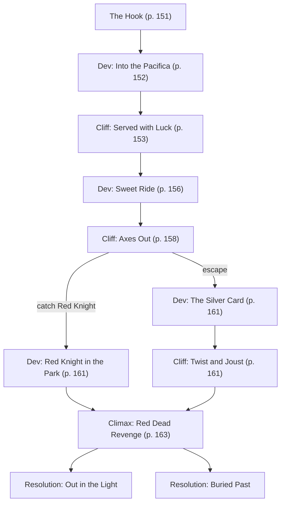

# One Red Night

Book pages 150–198

Part two of the Street Stories finale. Follow-up to [Bathed in Red](<09 Bathed in Red.md>). Mission in Pacifica and Seral Grove.

## Contents

- [Beat Chart](<10 One Red Night.md#beat-chart>) (p. 150)
- [Background](<10 One Red Night.md#background-read-aloud>) (p. 150)
- [The Rest of the Story](<10 One Red Night.md#the-rest-of-the-story>) (p. 150)
- [The Setting](<10 One Red Night.md#the-setting>) (p. 150)
- [The Opposition](<10 One Red Night.md#the-opposition>) (p. 151)
- [The Hook](<10 One Red Night.md#the-hook>) (p. 151)
- [Dev (Into the Pacifica)](<10 One Red Night.md#dev-into-the-pacifica>) (p. 152)
- [Cliff (Served with Luck)](<10 One Red Night.md#cliff-served-with-luck>) (p. 153)
- [Dev (Sweet Ride)](<10 One Red Night.md#dev-sweet-ride>) (p. 156)
- [Cliff (Axes Out)](<10 One Red Night.md#cliff-axes-out>) (p. 158)
- [Dev (Red Knight in the Park)](<10 One Red Night.md#dev-red-knight-in-the-park>) (p. 161)
- [Dev (The Silver Card)](<10 One Red Night.md#dev-the-silver-card>) (p. 161)
- [Cliff (Twist and Joust)](<10 One Red Night.md#cliff-twist-and-joust>) (p. 161)
- [Climax (Red Dead Revenge)](<10 One Red Night.md#climax-red-dead-revenge>) (p. 163)
- [Resolution (Out in the Light)](<10 One Red Night.md#resolution-out-in-the-light>) (p. 164)
- [Resolution (Buried Past)](<10 One Red Night.md#resolution-buried-past>) (p. 164)
- [Red Knight's Ramblings](<10 One Red Night.md#red-knights-ramblings>) (p. 165)
- [More About Seral Grove](<10 One Red Night.md#more-about-seral-grove>) (p. 166)
- [NET Architectures](<10 One Red Night.md#net-architectures>) (p. 167)
- [NPC Stat Blocks](<10 One Red Night.md#npc-stat-blocks>) (p. 168)

---

*By Storn A. Cook*

**Tagline:** The final curtain falls.

---

## Beat Chart

**Flow summary:** Follow-up to [Bathed in Red](<09 Bathed in Red.md>). Michael Deckard hires the Crew to hunt Red Knight. Dinner at Mister Rice Guy leads to a fight with Protocon and the Inquisitors, then a concert trap at Night City Plaza. Red Knight is cornered at Seral Grove — where the Crew learns the murderer's true identity.

**Branching notes:**

- Requires prior play of [Bathed in Red](<09 Bathed in Red.md>) for full context; references events from page 127 onward.
- At the plaza, catching Red Knight leads to **Red Knight in the Park**; escape leads to **The Silver Card**.
- **Climax (Red Dead Revenge)** branches to expose the truth or bury it for Michael Deckard.

---

> **Background (Read Aloud)**
>
> Every time you close your eyes, you sweat blood. Can't wash it off. Can't Smash it out. Drowning you in guilt. Hot, slippery blood pooling 'round your ankles. You draw your blade — you don't know why — and yell defiantly at the rising tide. Just as you lunge toward it, the bloody wave parts like the Red Sea. Only that's not Moses. A knight in red armor gallops toward you on horseback, waves of fresh blood crashing behind them, ready to—
>
> "Hello?" you hear yourself say as your Agent chimes. "Got a job for you, choomba," says the voice on the phone. Oh good, you think. A healthy distraction. "Hit me," you say. "Ready for a little knight hunt?" Your Fixer thinks they're funny, but they weren't at that warehouse that night. You fall silent. Then, with arctic ice in your voice, you reply, "Yeah, I'm ready."

### The Rest of the Story

Every Crew knows most jobs are not risk-free, but tonight's mission is not only dangerous — it's downright deadly.

This is a follow-up mission to [Bathed in Red](<09 Bathed in Red.md>) (page 127). In that mission, the Crew encountered a bloodthirsty vigilante called Red Knight. The mysterious antagonist created chaos that left the Edgerunners confused and traumatized. Every heinous crime Red Knight committed happened in front of the Edgerunners — who were then framed for much of it. Tonight, the Crew must chase that bastard down in the name of justice … and a sizable bounty.

But first, the Crew must meet a Biotechnica bigwig in the Pleasant Valley Apartments for the lowdown about the job. On the way, the Edgerunners can swap theories about Red Knight's identity and dig up more details about the Deckard family. When they park at the site, nothing's amiss — thanks to the location's unusual tech-free nature. It isn't until they find out who their client is that reality hits: The Exec's none other than Lilah Deckard's missing husband, Michael, and his mistress/secretary/now-fiancée Anya: the nature-loving clubber who was searching for Roman Deckard back at Delirium.

Deckard offers a bounty and a stipend for one-month's apartment living if the Edgerunners hunt down Red Knight and avenge his family. After the Crew finalizes details, Michael strongly suggests they eat dinner at Mister Rice Guy, located next door to find their next clue.

As the Crew enjoys the self-serve restaurant, its virtual personality, Hime Cat, offers them a treat. Their pleasant evening doesn't last long when Raegan, lead singer of the popular band Protocon, publicly accuses the Crew of being Red Knight. Shanna, de facto band manager and drummer, suggests the diners take the street fight outside.

When the dust settles, Raegan apologizes, realizing that the Edgerunners are also victims of Red Knight. Accusations turn into pleas for a team-up to swap information and plan their next move. Protocon's goal is simple: They're scheduled to perform outdoors at Night City Plaza tonight and have written a special song to draw Red Knight out in the open. After the concert prep, Protocon takes the stage while the Crew scans the crowd for Red Knight. Following Raegan's performance, a drone disrupts the show, forcing the Crew to get a handle on the crowd and the band's safety.

Red Knight will either be taken down at the plaza or eventually chased to their base of operations: Seral Grove, a secret memorial plaza dedicated to housing the city's elite. Either way, the Crew must decide. Will they reveal the hidden truth behind the Red Knight or hide it all away like their employer wants. No matter what they choose, this is the Crew's only chance to end the red night they're all trapped in, once and for all.

### The Setting

The Crew's night begins as their Fixer's tip sends them to the Pleasant Valley Apartments in Pacifica Playground. Eight-stories tall, the red-bricked building has a nostalgic Brownstone design, nestled next to Pursuit Security Incorporated's solar-powered administrative offices. To enter the art deco-designed apartment building lobby, tenants punch an entry code to unlock the security doors.

Next door to the Pleasant Valley Apartments is Mister Rice Guy, an automated sushi restaurant known for its black rice roll. The establishment recently expanded their menu, hours, and services. Diners can reserve tatami dining rooms in a zen garden for 100eb (Premium) per hour. Open 24/7, the restaurant also offers a Food, Personal, and Just Plain Weird Vendit for last-minute needs (see CP:R, page 331).

After meeting the band, the Crew help put on a show at Night City Plaza, a safe, corporate-built park located in The Glen. In the aftermath of the concert, they'll journey underground and discover one of the city's greatest secrets: Seral Grove. A neon, inorganic wonder where metal and holography replace nature and Night City's elite can watch holographic representations of their deceased loved ones.

### The Opposition

This story is rooted in the Crew's desire to right terrible wrongs. Each turn draws them deeper into Red Knight's terrain, unlocking the hacker's true goal, until their final confrontation. Edgerunners desperate to unmask Red Knight may lose sight of the mundane threats facing them.

- Rockerboys in the electric punk band **Protocon** initially treat the Crew as antagonists due to a misunderstanding.
- **Inquisitor** gang members cause trouble for the Edgerunners when a fight breaks out at Mister Rice Guy.
- **Red Knight** is a dangerous vigilante with a hidden agenda. In *One Red Night*, their goal is to destroy the Deckards and anyone they feel is associated with the family. Red Knight mercilessly attacks victims using extortion, violence, and "tips" sent to the media and the police. Their arrogance spikes every hour they remain masked until the final confrontation.

### The Hook

Your temples throb. Your neck aches. Damn your conscience! Red Knight told you to leave them alone and they'd ignore you. Well, fuck them. You don't know who Red Knight is, but you know exactly what they are: homicide in a human body. You check the meeting details. Your friendly neighborhood Fixer arranged a meetup in the Pleasant Valley Apartments with the Vice President of blah, blah, blah over at Biotechnica. How many VPs do they have again? You scan the name and cackle, loud and deep. Michael Deckard. Lilah Deckard's missing husband and father to two dead children. Well, shit. There's two ways this can go: Either Michael Deckard works for the Red Knight and you're walking into a trap, or he's one of their latest victims — and you're still walking into a trap. You check the pay one more time. 3,000eb. Gah! Can't turn down those Eddies. You slam a migraine pill, grab a Generic Prepak, and drop your heavy pistol in your holster. Tonight's gonna be another long, red night. But this time, you're going to be calling the shots.

Tonight's story begins with a mystery and a 3,000eb job. Shortly after returning home, the Crew's Fixer relays an offer from a high-level Exec with Biotechnica's Experimental Food Division: Michael Deckard, father to now-deceased Roman and Layla Deckard and Lilah's missing husband. Also an all-around con artist and probable felon for his part in selling tap water as a homeopathic remedy.

After the call, the Crew has time to prepare for their initial meet at 6:00 p.m. Deckard is promising payback against Red Knight and suggests the Edgerunners rest up and resupply before arriving at the Pleasant Valley Apartments in the Pacific Playground. Last time, the Crew couldn't prepare in advance for Red Knight; this time, Deckard suggests, they'll want to load up.

While Deckard provides some necessary gear, the Edgerunners are encouraged to spend a few minutes together. The Crew can, among other things:

- **Review the Facts:** Search the Data Pool, listen to street rats, build a timeline of events, grab some gossip, contact/spy on Lawmen, talk to witnesses, review tactics, form a plan, call an expert, and so forth.
- **Take Inventory:** Clean weapons, reload, buy ammo/weapons, run diagnostics, get extra chips, swap out installations, check plugs, balance accounts, and so forth.
- **Inspect their Vehicle:** Check the tires, fuel up, stash extra gear/ration chips, clean out those Kibble wrappers and empty Smash cans, test the alarm system, change the oil, and so forth.
- **Get Medical Help:** Visit a Medtech, get new cyberware, heal up, and so forth.
- **Grab a Quick Snack:** Visit a Vendit or bodega, go out for a drink or five. Stash some extra Kibble in the car.

> **Infobox: Pleasant Valley Apartments**
>
> A unit at Pleasant Valley Apartments counts as an Upscale Conapt (see CP:R page 379). Unlike most conapts, it can be rented in two-week increments at half the monthly price.
>
> Engineered to dissuade tech-savvy residents, the complex employs no NET Architecture, features analog locking systems, and uses manual controls for lighting, climate control, and water. Even the elevator is old fashioned, with buttons you actually push.
>
> For all its vintage beauty, Pleasant Valley has not managed to attract enough privacy-minded technophobes, naturalists, or hermits to warrant the rent or its amenities. The residential complex is full of tenants however — just not the kind for which landlords advertise.
>
> In recent months, many of Night City's Corporate entities have made use of the residential complex's short-term leases. When opportunists need a secure location in meatspace. Rental includes access to the top floor aviary, and a 50 percent discount at the juice bar in the lobby.

Halfway through their night's prep, one of the Edgerunners receives a message on their Agent containing a Garden Patch link. The Garden Patch, titled "Red Knight's Chessboard" contains a single video. The narrator, in a box in the lower left of the video, is a digitized knight in red armor.

What you're seeing here, according to the captions, is Michael Deckard's nephew, a sweet college kid enrolled in Night City University's honors program, being attacked by a trio of what appears to be clawed, red drones on campus. The drones, emblazoned with the mysterious Red Knight's helmet, use whirling blades to hack the poor kid apart.

The link must have been sent to media outlets as well, as most news channels are now running the footage. The drones are identified as belonging to Red Knight. A summary of the recent ransomware case at Delirium and the murder of Roman Deckard is mentioned. Different media outlets list the handles of different members of the Crew as being connected with the Roman Deckard case and possible suspects. Red Knight not only sent the video link to the media but also gave them background on Roman's murder and the Crew's involvement.

A successful Human Perception or Tactics Check (DV13) makes it clear to the Crew: Red Knight knows what they're doing and has declared war on them.

At this point, any Edgerunner with media contacts, or who is actually a Media, might get a call asking for more information, a statement, or an offer to sell their live, streamed murder confession for 1,000eb.

The clock is ticking and the Crew had better move. If the Edgerunners don't have transportation of their own, they can try public transport, hitch a ride, or call a cab.

**Go to:** [Dev (Into the Pacifica)](<10 One Red Night.md#dev-into-the-pacifica>)

### Dev (Into the Pacifica)

The Crew arrives at the Pleasant Valley Apartments. Michael sends a message telling the Crew to park on the street, gives them an entry code, and then invites them to Unit 8C.

Entering the antique lobby gives the Crew pause as if they've stepped out of a time machine. The front lobby is decorated in an art deco-meets-traditional Chinese theme in black, ivory, and gold trim. Sectional couches sit next to tall, bamboo plants; further in, a gold-fated elevator and a door leading to a spiral staircase. Elaborate, hand-inlayed scenes depicting swans in flight invoke a peaceful, calm feeling. Painted on the walls are red characters — pinyin, at first glance — relaying quotes from philosophers like Ah Lam: "Technology is not evil, and neither are humans. Humans who weaponize technology against other humans are the real enemy. That is why I say no to technology." And Wei Ling's popularized quote: "Earth is. We are of the earth. Return and rejoice. Naturally."

Edgerunners can either take the antique elevator or trudge up the spiral staircase to the eighth floor; both are unoccupied and don't have any tenants milling around. The Crew can search around but won't come up with anything suspicious. The building and its tenants are simply calm and quiet enough to make an anxious Edgerunner wonder when a rogue bullet might buzz by.

Knocking on the door to 8C, the Edgerunners might be surprised to find Michael Deckard and Anya, the naturalist from Delirium who claimed she was Roman's "friend," both standing in their bathrobes. Michael is taller and fitter than expected but is clearly decades older than Anya. She blushes.

"You didn't know we were together? I suppose there's no easy way to announce happy news, is there? Yeah, so obvi… to me, I mean. I know we're supposed to wait for all the paperwork to go through and everything but we're gonna be married soon and start a new company and put out a new health water! Isn't that great? And this time, we're going to take Mother Nature's approach and purify the water in sunlight before selling it. I can't wait to … oh, we're so glad you're here. Honey, I put some clothes for you on the bed. I suppose you want to—"

While Anya babbles excitedly about her fiancé and her new job, Michael Deckard doesn't say a word. A Human Perception Skill Check gives savvy Edgerunners a clear impression of the corporate Exec: Michael carries himself like a man who knows when to keep his mouth shut and when to take advantage of a situation.

Michael struts around the sparse two-bedroom/two-bath apartment as if the Edgerunners don't exist. Then, he excuses himself for a minute and retreats into his bedroom to change. When he re-emerges, he's dressed in a Torrell and Chiang suit. Extending his hand, Michael offers:

"I have a job for you. By now, you've seen the footage circulating of my nephew. Red Knight is targeting my family again, and I don't have a choice. I have additional information for you, but know this: They must be stopped. I'm prepared to pay you 3,000eb if you find and kill them, and will hand over the keys to this apartment for a month. This apartment should adequately serve your needs. I've lost my children and my nephew, and if this keeps up, Biotechnica will drop me because of bad publicity. I need this job. You understand. Maybe you haven't lost someone before, but grief is a funny thing. I don't want Red Knight caught. I want them dead and this whole mess gone. Are you ready to put down Red Knight?"

Taking Michael's offer grants the Crew immediate access to Unit 8C and all amenities for one month, including free underground parking. The Edgerunners can refuse the apartment, but Michael's offer will be harder to turn down. He wants payback for what Red Knight did to his family, and he assumes the Crew does as well. If they waffle or refuse Michael, Anya points out Red Knight leaked the Crew's name to the press and probably won't stop hunting them. At that point, Michael steps in and tells the Edgerunners the only way to catch Red Knight is with his help.

Once the negotiations are over and the Crew makes their decision, Michael strongly recommends dinner at Mister Rice Guy, and reminds Anya she's running late to her massage appointment. He also mentions he prefers regular updates as they find new information, if possible.

If the Edgerunners turn him down, Michael suggests no important decisions are made on an empty stomach and hands them 50eb vouchers for the restaurant. Of course, the Exec is too busy to come with them, but he will strongly suggest they dine there. The Crew can always accept the offer later, after dinner.

As soon as the group hits the lobby, Michael and Anya wave goodbye and quip: "Your first clue? I just gave it to you." The Crew is free for dinner. Head over to Mister Rice Guy and [Cliff (Served with Luck)](<10 One Red Night.md#cliff-served-with-luck>).

> **Sidebar: That Little Minx**
>
> Anya is engaged to Michael, but her lovesick act is just that — a performance worthy of a Rockerboy. Of the two, Anya is much more likely to talk, but only if she's separated from her fiancé. Alone, she admits Michael asked her to drop by Delirium to "look for my son, I've heard he's hanging out there." She's not even remotely in love with Michael, but agreed to marry him anyway. It's easier than admitting they're just using each other.

### Cliff (Served with Luck)

Walking into Mister Rice Guy is like finding yourself in a Rube Goldberg machine — only you're the ball. The restaurant is fully automated and is so colorful, even fashionistas do a double take. The only trick is: Self-serve only works one at a time, so stand in line, choomba.

7:30 p.m. Got a lead on a few thousand eb, temp apartment, and dinner courtesy of Michael Deckard. You wonder what Biotechnica has on him — or vice versa. 'Cept, he hasn't dropped any clues yet, and Red Knight is still out there. Convenient or just shitty timing? How sus. Free food sounds nice — even if it's unagi-flavored Kibble. You stroll into Mister Rice Guy and can't find a server anywhere. Where do you sit again? A scrolling message sign reads: "Welcome! Help yourself! Read the rules before ordering." Well, okay then.

Thankfully, there are scrolling message boxes to help you order, pay, and find seating.

**Rules for Ordering**

1. Hello! Form a queue. Don't forget to smile! You're on camera. *click*
2. Access to an Agent is recommended. Please link to find additional menu items and information about our Dining Rooms. Vendits located near the exit in the back. Or just order, eat, and pick any seat!
3. Are you a Pleasant Valley Apartment resident? Do not worry. For an additional 50eb, your meals will be added to next month's rent.
4. Did you find an unsealed plate? Don't eat it! Report it. Your account will be credited.
5. Pink: 200eb. Blue: 150eb. Green: 100eb. Orange: 50eb. Yellow: 10eb
6. Plate tampering is forbidden at Mister Rice Guy. You buy what you take.
7. Mister Rice Guy does not like crime. You steal or break it, you buy it. Punch another diner? Lawmen will be called.

A swirling maze of conveyor belts present different-colored neon plates. It's clear from the plate's colors the quality increases with the price. Edgerunners who have linked their Agents and make use of the voucher given to them by Deckard also receive notice their meals come with a special Lucky Treat.

**Example Menu Items**

- **Pink, 200eb.** Real fish, rice, vegetables. Dragon sushi rolls, maguro sashimi, pork-and-sansho ramen, rice bowls. Cold and hot. Available 200ml drinks with purchase: high-end sake, whiskey, and rice wine. Filtered water or loose-leaf teas.
- **Blue, 150eb.** Vegetarian selection. Agedashi tofu. Natto Tamaki sushi rolls. Shitake mushroom ramen. Cold and hot. Available 200ml drinks with purchase: mineral water, plum wine, organic green tea.
- **Green, 100eb.** Good Prepaks. Real rice with synthetic proteins and dehydrated vegetables. Egg-fried rice. Shrimp tempura roll. Hot only. Available 200ml drinks with purchase: a variety of hot tea bags.
- **Orange, 50eb.** Generic Prepaks. Carb-or-broth heavy. Egg drop soup and miso ramen. Hot only. Available 200ml drinks with purchase: pre-brewed green, orange pekoe, or black tea.
- **Yellow, 10eb.** Kibble. Variety of flavors with a South Asian culinary flare. Wasabi, Sriracha, Green Tea, Honey, Oyster, Sweet (Condensed Milk). Available 200ml drinks with purchase: foil-packaged water.

The flavored Kibble is sealed in a foiled bag and can be taken "To Go!" The other meals are presented on the plate. The public seats near the front windows are open; the bar on the left is full of diners. Rooms can be rented for 100eb (Premium) per hour.

As the Crew enjoys their first meal, the restaurant's virtual personality — Hime Cat — messages their Agents asking them to open their Lucky Treat.

To open Hime Cat's Lucky Treat, the Player rolls a 1d6. Hime Cat is so lucky, no two Edgerunners will get the same result.

| 1d6 | Lucky Treat |
|-----|-------------|
| 1 | Hime Cat says, "Oh no, you've run out of luck!" Subtract up to 2 LUCK from the Edgerunner's pool. The LUCK will refresh at the beginning of the next session as normal. |
| 2 | Hime Cat says: "Nyan! Relax with a refreshing cup of tea! Courtesy of Mister Rice Guy." The Edgerunner receives a voucher for a free pre-brewed green, orange pekoe, or black tea! |
| 3 | Hime Cat purrs loudly and says "Your lucky Megacorp is…" followed by a random Corp logo. |
| 4 | Hime Cat asks, "Have you said hello to your fellow diners? They might be interesting!" If the Edgerunner looks at the other patrons, have them make a DV9 Perception Check. If they succeed, they spot one of them is wearing a pin with the Inquisitor logo on it. |
| 5 | Hime Cat says: "Nyan, here's an extra treat! Take 100eb off your next order. Courtesy of Mister Rice Guy." The Edgerunner receives a voucher for 100eb at Mister Rice Guy. |
| 6 | Hime Cat says, "You're overflowing with luck!" Add 2 LUCK to the Edgerunner's pool, even if that raises their LUCK above their normal maximum. This extra LUCK must be spent by the end of the session or will be lost. |

Once the Crew has opened their Lucky Treats, they might want seconds.

Seconds? Yes, please! Screw your rent. You walk up to a conveyor belt and wait for that shrimp tempura Prepak with real goddamn rice to roll past you. Before you have a chance to grab it, someone taps you on the shoulder. You turn around, pretending to be offended, but just blink. Is that… Raegan Halley from that electric punk band Protocon? The one Bes Isis keeps raving about? Shit! Just act cool, choomba. Your mouth opens but you got nothin' to say. That's when Raegan whispers in your ear: "I know who you are, Red Knight. You're mine."

The Edgerunners take one Action to size up their accuser. Raegan's bandmates, Shanna and Kinneth, pull their chairs back and stand behind her. This trio of Rockerboys form the popular electric punk band Protocon. They are:

- **Raegan "Pro" Halley.** Lead singer. White spiked hair, half-shaved head. Neon purple skin. Wears a heart choker and a strange pendant. Neon punk aesthetic. More dangerous than she appears. Those high-heeled boots? Could stash a Light Melee Weapon or two. Has a fiery personality and leaps without thinking.
- **Shanna "To" Doole.** Drummer. Has a pair of glowing drumsticks stashed in her boots. Red-and-black plaid, fishnets, traditional punk aesthetic, impressive 'fro. Confident and patient, oozes leadership.
- **Kinneth "Con" de Léon.** Guitarist. Gripping a wireless electric guitar that could double as a weapon. Ripped goth-meets-vintage punk aesthetic with a whole lot of skulls and light tattoos. Shy, friendly smile bordering on cocky. Stands behind the other two bandmates. Definitely the "whatever you think's best" type of friend.

Following Raegan's accusation, the singer steps back, her voice rising to a shout:

"Asshole! I finally tracked you down, you heartless fucker. I thought dating Dillon Murphy was bad. But you? You're something else. You killed Layla. You murdered her brother. God-only-knows how many other people died because of your shit. Is it worth it, Red Knight? After all this, do you really want to…"

A Human Perception Skill Check reveals Raegan is bluffing for time. Either she knows Lawmen are on their way or she's messaged the band's bodyguards (use **Bodyguard**, page 172) to back them up.

Red Knight's reputation has grown so much that the other patrons eye the Edgerunners suspiciously. Several diners stand up and pull out their munitions.

Shanna yells: "Let's take this outside! I like my sushi, choombas. I'm sure you do, too."

Halfway through her command, four gang members (use **Inquisitor Mooks**, page 17) wearing Inquisitor pins (Perception DV15 to notice) grumble at the Edgerunners. The cyberphobic Inquisitors live in the Pleasant Valley Apartments and target any character with cybernetic implants to "save their soul."

Caught between a misunderstanding and a cultish gang, the Crew must think quickly before the situation gets out of hand. They can:

- **Target the Inquisitors:** Pleasant Valley Apartments might be a safe place for technophobes, but there's nothing in the brochure that says street fights are off-limits. Targeting the Inquisitors is the choice everyone wants to make but is too afraid to — especially since the band has subdermal implants they don't want forcibly removed. Taking out the gang members impresses Protocon and grants a +1 bonus to any Social Skill Checks made against the band for one for the rest of the mission. Note, it doesn't take much to provoke the Inquisitors to carry out their holy mission. If the GM wants a real rumble here, all it takes for the Inquisitors to attack is for them to notice obvious chrome on a member of the Crew.
- **Battle the Band:** The Edgerunners can attack Protocon. At the top of the second Round, the band's bodyguards appear, adding to the tension as well as firepower. Before things escalate into a real firefight, Shanna asks: "Well, are you Red Knight or aren't you?" to try and defuse the situation.
- **Fight Strategically:** The Crew can hold their punches and pretend to throw down with the band and angry patrons. (The Edgerunners fight the Inquisitors as normal and are met with cheers. Because nobody likes those guys.) After two Rounds of comical stunts, Kinneth throws his hands up. "Truce?" This strategy successfully convinces Protocon they're probably not Red Knight.
- **Staredown:** If a member of the Crew wins a Facedown against Raegan, Protocon will back down long enough to have a real conversation.
- **Run Away:** If the Crew has a vehicle, it is parked on the street. Plus, they just got access to a nice apartment in a secure building. They can ditch the fight by running out the door, but cross paths with Anya. Filling her in triggers an interesting detail: She recognizes Raegan as Layla Deckard's girlfriend and suggests they must know something. The band's giving chase.

If the Crew's stuck, remind them their goal isn't to dodge a fight or show how badass they are — it's to convince Protocon they've accused the wrong suspects to find out what they know. When one or more band members is no longer convinced of the Crew's guilt, **go to** [Dev (Sweet Ride)](<10 One Red Night.md#dev-sweet-ride>).

### Dev (Sweet Ride)

No matter the fight's outcome, the streets are quiet, and there's no sign of local Lawmen despite Mister Rice Guy's rules. Once Protocon realizes the Crew isn't Red Knight, they break up the crowd and offer them tickets to tonight's Night City Plaza Concert. The Crew can also take a moment to check in with Michael Deckard and ask if he knows Raegan; he'll say that she's why he sent you to Mister Rice Guy in the first place. Congratulations on finding your first clue.

Before they leave, Raegan approaches the Crew and confesses:

"Sorry. Look, I thought that… well, it's just that… after Layla died, I started getting messages from Red Knight, begging me for any data I had on her. Photos. Recordings. When I didn't deliver, they started sending nasty messages and messing with our gigs. So, we set up an anonymous hotline for info. If the data were solid, the informant would get a lifetime's worth of free concert tickets. Then someone sent us an anonymous message, saying Red Knight would be at Mister Rice Guy tonight. To look for the Edgerunners connected with the case."

Edgerunners paying attention notice Raegan mentioned Layla. No Check is required to confirm that Raegan is referring to Layla Deckard, Red Knight's first victim.

Appropriate Social Skill Checks encourage Raegan to better trust the Edgerunners with what she knows. The Rockerboy can confirm or reveal that:

- At Night City University, Layla was studying to be a marketer, but wanted to be a Rockerboy.
- Layla was openly polyamorous and pansexual. Raegan was one of her partners. Another was a loudmouth professional protester named Dillon Murphy.
- Layla often argued with her parents, but did have a supportive older brother named Roman and lots of great friends. After Layla's death, Roman dropped off the grid. Raegan hadn't seen or heard from him before his death.
- Layla's life changed suddenly after she got the Cactus Water spokesperson gig. Her lifestyle went from Kibble to Fresh Food almost overnight. Everyone knew her parents got her the job, and the other students resented her for it.
- Red Knight used deep fakes, cyberbullying, and eventually drugs to ruin Dillon Murphy's life, pushing him to the edge.
- Raegan and Layla had just broken up the night before she died because Layla wouldn't dump the increasingly unstable Dillon.
- Dillon Murphy killed Layla then himself in a murder-suicide. Raegan blames Red Knight for pushing Dillon into it.

The Crew is encouraged to share what intel they have with Raegan. A quick Human Perception DV10 highlights how close Shanna is paying attention, and how disinterested Kinneth is. Shanna cares deeply for Raegan, but never met Layla. Kinneth cares too, but he met Raegan's girlfriend and thought she was just another rich girl.

As the conversation winds down, Kinneth blurts out:

"We're setting a trap for Red Knight. Wanna come? Got room in our supercar. Top down. 200 mph. Nothin' like it."

Kinneth tells the Crew their concert, tonight, at Night City Plaza in The Glen is bound to draw Red Knight since he's cyber-stalking Raegan. They've written a special song to lure Red Knight out into the open and leaked the title on the Data Pool. If the Crew doesn't buy into Protocon's plan, Shanna offers to hire them for 500eb.

The Crew is free to jam themselves into Protocon's sweet convertible (use **High Performance Groundcar**, CP:R, page 190) or take their own vehicle. Then they're back on the road, racing Protocon to Night City Plaza as friends instead of enemies.

**Go to:** [Cliff (Axes Out)](<10 One Red Night.md#cliff-axes-out>)

> **Sidebar: Put Your Heart Into It**
>
> Influencers know Protocon can't agree on anything — even romance. Despite this, most fans would be surprised to know the Rockerboys have a no-gimmick approach to love and their motto is "connection before seduction." They are all polyamorous and pansexual. That said, Raegan is open to "anything," Shanna has a friends-first approach, and Kinneth is usually turned on by the smartest person in the room.

### Cliff (Axes Out)

The ride to The Glen is fun — for a change. The Crew notices that whenever Protocon whizzes past Lawmen in their convertible, the police sit quietly twiddling their thumbs. Being famous in Night City has its perks, it seems.

Crews who comment about the band's popularity earn an additional piece of intel: Raegan fired their band manager and road crew a few days ago. Normally, the band does have technical help and support from a team of people trained to manage their media presence and performances. This time, they have their bodyguards but not much else.

Raegan isn't a fool and doesn't want to involve her road crew — but she does want to draw Red Knight out into the open even if it means putting the band's lives at risk. Unfortunately, she's also wildly inexperienced and has never been in a violent fight herself.

Before work on the concert begins, Raegan takes the Crew aside and speaks to them.

"I don't know what your intentions are but, you know, I have goals here. I want to know who Red Knight is. I want to know why they targeted Layla. Hell, I want the whole world to know why. I want this whole crappy business yanked out into the light and purified by the sun. I want truth, choomba. Help me, okay?"

The crowd's mood is important to this scene. Unhappy crowds boo, trample flowers and grass, climb statues, wreck fountains, throw Kibble, even flood the Data Pool with shitty reviews. Happy crowds take Protocon's lead, gifting the Crew with a sizable weapon to use against Red Knight.

At the beginning of this scene, the Night City Plaza Crowd has a neutral or zero rating. Crowd ratings cannot rise higher than 2 but can go lower than −2. The crowd is fickle, after all!

To affect the rating, Edgerunners can help with crowd control, sound management, or special effects before the band starts performing at 10:00 p.m. Additional Actions to influence the crowd's mood inspired by the Crew or overheard gossip may be taken during Protocon's performance.

- **Control the Crowd with Raegan:** The stage is small and can be quickly surrounded. Raegan points out the Crew needs to secure the perimeter and build a 20 m/yd buffer zone for her bodyguards. Securing the Area discourages fans from rushing the stage. Using nearby concrete barriers is the best way to do this but will require some creativity to move them into position. They can't be moved by individuals with anything less than BODY 10. Succeeding means the crowd won't rush the stage if things get ugly.
- **Check Power/Acoustics with Shanna:** Tech-savvy Edgerunners can help Shanna check the band's acoustics to repair and maintain her gear so the song can be heard with a DV13 Electronics/Security Tech Check. Great acoustics lift the crowd's mood by 1. Failure means the acoustics suck and the crowd's mood drops by 1.
- **Set Up Special Effects:** Kinneth needs help figuring out on-the-fly effects since there's no tech crew. The guitarist can grab people from the crowd to act as backup dancers, mess with the lighting, use cheap Glow Paint, etc. A show-oriented Edgerunner can direct this impromptu theater group. The right effect matters to the crowd. Add or subtract mood points based on the success or failure of an appropriate Skill Check.

| Rating | Effect on the Crowd |
|--------|---------------------|
| −2 or lower | This concert sucks and I demand a refund. Now. The concert transforms into a riot and attacks the stage. Anyone exposed to the riot must succeed at a DV13 Endurance or Evasion Check or take 4d6 damage. |
| −1 | Uh, the song selection is not what I expected. Bored now. Must leave. The rush of people leaving makes it difficult to move through the crowd. Moving through the crowd requires a DV15 Athletics Check. |
| 0 | Meh. Crowd isn't happy or sad. Only a minor obstacle. Moving through the crowd only requires a DV13 Athletics Check. |
| 1 | Well, tint my neon and call my Fixer! Crowd responds as if Protocon succeeded at a Charismatic Impact Check at Raegan's Rank. |
| 2 | I would die for Protocon! Crowd is super hyped and will respond as if Protocon succeeded at their Charismatic Impact Check at Rank 9. |

**Crowd Gossip**

Edgerunners can also check in with the crowd and listen to the gossip. Here's some of the buzz they might hear, and how it could affect the Mood Rating.

- "Oooooooh, I just love them so much. Think Protocon is gonna play 'Put a Bolt in It'? It's such a fan fave!" +1 to the mood if this song is played.
- "Kinneth is so cute I can't stand it. How come he doesn't get a solo? He should! I want to hear him grind that axe!" +1 to mood if Kinneth plays a solo.
- "I'm probably the only fan here that hates those light-up drumsticks Shanna uses. I get such a headache watching her play." No effect on crowd if Shanna changes her drumsticks.
- "Everybody says Protocon is so predictable, but I don't agree. Just 'cause they never switch it up and play a different genre doesn't mean they're 'old.' More like classic!" −1 to the mood if they don't try anything new.
- "Raegan … oh, I'd kill to be up on that stage. You know how cool it'd be if she'd let fans sing with her? Of course, nobody else but me…" −1 to the mood if Raegan tags the crowd. Jealousy. It's a thing.

#### Let's Rock!

After helping the band with the "gritty work," Crew members who can prove they have solid Play Instrument or Dance Skills are invited to join the band on stage. Success on a DV15 Skill Check improves the crowd's mood, while a crappy song makes them restless. Add or subtract 1 mood point to mark the change.

To increase the difficulty, the Crew can spot a few troublemakers (gang members, drug dealers, pickpockets, etc.) when they scan the crowd and turn them over to Protocon's bodyguards. Use an appropriate Mook (see CP:R, page 412) to switch up the challenge for the Edgerunners. Removing problematic fans in a badass but not overly violent way positively impacts the crowd's mood, raising it by 1. Bringing out guns, seriously injuring, or killing someone drops the crowd's mood by 1.

After the first couple of songs, Protocon belts out the neoclassic "Electric Nights" then brings the mood down a bit. Raegan fingers a pendant around her neck, then tells the crowd her next song is dedicated to her lost love, Layla Deckard. The second Layla's name is mentioned, the band's equipment starts malfunctioning and they look to the Edgerunners for help restoring power, lowering the crowd's mood by 1. When an appropriate Skill Check puts the lights back on, the crowd cheers, boosting their mood by 1.

Raegan then leans into her microphone and cues the Edgerunners to pay attention. Then, she sings.

*In whispers I hear you / The call of your ghost*
*In tears I feel you / That cry of your soul*
*Can you forgive me / For letting you die*
*Can you release me / And just say goodbye?*
*By dawn I'll see you / A mere hologram*
*Sunrise I'll feel you / A leaf in a grove*
*Can you forgive me? / Oh, will you help me?*
*Ah, please just save me / Turn off the light*
*Oh, please just save me / Stop the Red Knight*

During the song, if the Crew succeeds at a DV15 Perception Skill Check, they notice a tall, hooded figure at the edge of the crowd reacting oddly to the lyrics, as if the song were written for them. The figure is at the head of the crowd, against any barriers (and within 8 m/yds of an Access Point for the band's NET Architecture).

Interrupting Raegan automatically drops the crowd's mood by three; with nothing but "tall," "brooding," and "hoodie" to go on, there are too many potential suspects to shake down. As the song finishes or if it becomes clear they've been made, the figure disappears into the crowd along with several other characters who could be mistaken for a dangerous criminal.

Seconds later, a drone flies over the crowd and hurtles toward the stage. The Edgerunners have one chance to knock it down (a DV15 Check using an appropriate Skill) before it crashes into the stage and explodes like a Flashbang Grenade (see CP:R, page 346).

Protocon, for all their original bluster, freezes no matter what happens to the drone and the disruption to the show effectively ends the concert with an untimely fizzle. Refer to the Night City Plaza Crowd's mood to determine whether the crowd panics and what type of obstacle they become.

The Edgerunners are now tasked with handling the situation. The Rockerboys take the Crew's lead and issue no instructions — but can and will perform simple tasks to help. The Crew also has access to bodyguards they can deploy to get themselves and Protocon to safety.

If the Crew manages to catch the hooded figure, either directly or with the help of the crowd, **go to** [Dev (Red Knight in the Park)](<10 One Red Night.md#dev-red-knight-in-the-park>). If the hooded figure gets away, **go to** [Dev (The Silver Card)](<10 One Red Night.md#dev-the-silver-card>).

> **Sidebar: Protocon's NET**
>
> Protocon makes use of a NET Architecture (see [NET Architectures](<10 One Red Night.md#net-architectures>)) to help control their sound and lights. Once Layla's name is mentioned, Red Knight breaks into the NET Architecture and messes with the Control Nodes, causing the malfunctions. If the Crew has a Netrunner, they can enter the NET Architecture as a friendly, meaning they can sail through the password and the Black ICE present won't see them as a threat (though they also won't obey the Netrunner's commands). Red Knight safely Jacks Out after a Round or two of combat or if the equipment is fixed and the song begins.

### Dev (Red Knight in the Park)

Either via direct action or with the help of the crowd, the Crew catches up with the hooded figure before they can escape from Night City Plaza. During the initial scuffle, the hood falls back to reveal a red helmet that covers the wearer's face. Finally, the Edgerunners come face to face with their enemy.

As soon as it becomes clear a fight's in the offing, the crowd backs away to form a 20 m/yd wide circle around Red Knight and the Crew. Just before Initiative, Red Knight injects themselves with a pair of hypos containing Black Lace and Synthcoke (see CP:R pages 357 & 358). Then the battle begins.

Since they're surrounded by a sea of people, using firearms proves dangerous. Any missed Ranged Attack hits a bystander instead. The minute someone in the crowd takes a bullet, panic sets in and the circle of bystanders shouting "Fight! Fight!" devolves into a riot. The crowd swarms in every direction. Fighting Red Knight becomes impossible since it takes everything the Edgerunners have not to get trampled (each Round spent in the swell of rioting people requires succeeding at a DV13 Endurance or Evasion Check to avoid 4d6 damage). Red Knight gets away but not before their hoodie rips off and ends up in an Edgerunner's hands. They find an unmarked, heavy silver card inside the pocket. **Go to** [Cliff (Twist and Joust)](<10 One Red Night.md#cliff-twist-and-joust>).

If the Crew manages to drop Red Knight to 5 or fewer Hit Points without starting a riot, the murderer stumbles and falls as the drug cocktail they've taken pushes them into an overdose. **Go to** [Climax (Red Dead Revenge)](<10 One Red Night.md#climax-red-dead-revenge>).

### Dev (The Silver Card)

While Red Knight got away, the Crew can still investigate the scene for clues. With a successful Perception Check (DV13) the Crew finds an unmarked, heavy silver card next to the spot where Red Knight was standing during the concert. It appears it dropped out of the murderer's pocket when they fled.

If the Edgerunners don't think to search for clues or fail to find the card, someone else, either a member of the band or one of their bodyguards, gives it to the Crew.

**Go to:** [Cliff (Twist and Joust)](<10 One Red Night.md#cliff-twist-and-joust>)

### Cliff (Twist and Joust)

It's time. Your adrenaline spikes and you snap to attention. You know this silver card's the key to finding Red Knight and dealing with them, once and for all. Now all you've got to do is answer the question: What the hell is this thing?

Unmarked, the silver card holds few direct clues. A DV13 Deduction or Education Check reveals it to be a keycard but little beyond that. Discovering its purpose requires some outside help.

The easiest way to learn about the keycard is to show it to the members of Protocon. Raegan immediately recognizes it as being an access card for Seral Grove, a secret memorial park built after the 4th Corporate War and used by Night City's elite to entomb their dead away from potential desecration. She hasn't been there since she was a kid, but she's got family there and knows where it is.

Michael Deckard, if told about the card, informs the Crew about Seral Grove and gives them the location. He also emphasizes that he doesn't want this going to the press, so he expects Red Knight to vanish without any more high-profile activities.

If the Crew doesn't go to either Raegan or Deckard for information, allow them to explore other options. Fixers can call on contacts. Medias can dig up rumors. Edgerunners with a posh past rolled up as part of their Lifepath might know what it is right off the bat because they've got relatives entombed there. Information might be located, buried on the Data Pool and found with a successful Library Search Check. If necessary, they can always buy the information from an NPC Fixer. Feel free to reward creativity here.

Once the Crew knows the location of Seral Grove, they can take a moment to rest up, reload, and do anything else they need. Don't give them too long, though. If they take more than a day, Red Knight goes back on the cyberoffensive, and the press starts swarming the Crew again.

Getting to Seral Grove requires using the silver keycard to access a service tunnel located in New Westbrook, just outside the Executive Zone. From there, it's a short ride to the memorial park. The air smells damp, but clean and fresh — not near any sewers or trash dumps.

A short distance away, Seral Grove shines like a beacon of hope: It is a neon wonderland of cold, sterile beauty commemorating the dead in every leaf, stem, and twig. Even its river is nothing more than a data stream.

Theoretically, the site's defenses should recognize the Crew as guests, since they're carrying the silver keycard. But Red Knight's taken control of the NET Architecture (see [NET Architectures](<10 One Red Night.md#net-architectures>)).

Once the Crew enters Seral Grove, they must avoid, dismantle, or disarm Seral Grove's defenses as they explore the area. A large air drone (see page 174) patrols the grounds and rushes over if any other defenses are triggered. Electrical Flooring (see page 174) and Stun Panels (see page 174) form the remainder of the defenses.

> **Infobox: Seral Grove**
>
> 1. Entrance
> 2. Electrical Flooring
> 3. Stun Panel

Red Knight's happy to let those defenses soften the Edgerunners up before the fight begins. Make the journey through the Grove as long or short as you need to fit the circumstances and your session. The memorial park can be much larger than the map provided.

As the Crew moves through Seral Grove and deals with the defenses, read them excerpts from [Red Knight's Ramblings](<10 One Red Night.md#red-knights-ramblings>). These play from the speakers built into the various memorials and statues and represent Red Knight's descent into cyberpsychosis.

When the Crew reaches Red Knight's location, the Deckard family plot, they see the murderer standing dramatically in the middle of some sort of fog but clearly decked out in red armor, complete with a knight's helmet. Red Knight speaks to a hologram of Layla Deckard as if she were real. Their voice is obscured by a voice modulator built into the helmet.

"I tried, Layla. I tried to avenge us both, but nothing I did went right! None of my plans worked the way they should have. The people who hurt us. They're still out there. Still living and laughing and ruining lives and sending their mercenaries to stop me. But I'll stop them. I'll stop them and then I'll finish the plan. We'll have our justice!"

With that, Red Knight injects both airhypos, taking their full drug cocktail. Initiative should be rolled and the battle joined. The "fog" is actually an Air Swarm Drone Cloud, controlled by a Balron, which acts at the top of the Round. If the GM thinks Red Knight needs more help, they can add any number of automated pop-up turrets to the scene (see page 174).

Red Knight uses the environment to distract and unsettle the Crew. Red Knight prefers a personal, targeted approach, and torments them with holograms of people the Edgerunners have lost in [Bathed in Red](<09 Bathed in Red.md>) (page 127) or during a previous mission. On their Turn, Red Knight may randomly trigger a disturbingly realistic hologram of one of those loved ones without taking an Action. Any affected Edgerunner must succeed at a DV15 Concentration Check or take a −2 penalty to all Checks until Red Knight's next Turn.

The hologram of Layla watches the combat, passively, all the while. If parts of Red Knight's Ramblings remain unread, read one at the top of each Round.

If the Crew manages to drop Red Knight to 5 or fewer Hit Points, the murderer stumbles and falls as the drug cocktail they've taken pushes them into an overdose. **Go to** [Climax (Red Dead Revenge)](<10 One Red Night.md#climax-red-dead-revenge>).

> **Sidebar: From Plaza to Grove**
>
> If the Crew defeated Red Knight in Night City Plaza, give them a chance to get away with the body since any Lawmen on the scene will be too busy dealing with the crowd to stop them. From there, they can find the silver keycard in the hoodie pocket, find out about Seral Grove, and travel there to find Roman Deckard's squat. In this case, the NET Architecture will recognize the Edgerunners as authorized visitors and the defenses won't attack.

### Climax (Red Dead Revenge)

This is it, choomba. The moment when you get to find out who's been killing people all around you while trying to set you and your Crew up to be the patsies. Vengeance. Can you feel that sharp pinch, choomba? The tip of that sweet sword, piercing your heart, begging you to fall down, down, down into that blood-gushing cesspool and ignore the angel on your shoulder? Will you do what Raegan wanted: Drag Red Knight out under the sun called truth for all the world to see? Or will you give in to your darkness and do Deckard's bidding: Throw Red Knight into the deepest hole possible and bury the past?

The Crew has two decisions to make.

- First, they can try to save Red Knight from the overdose with a DV17 First Aid Check or a DV15 Paramedic Check or Medical Tech Check — or they can let the murderer suffer and die. If they save Red Knight, the murderer slips into a coma and can't be awakened.
- More importantly, they must decide which they'd prefer to do: take the clues present in Seral Grove and share them with the world, or do what Michael Deckard wants and make it all go away.

If the Crew decides to share the info, **go to** [Resolution (Out in the Light)](<10 One Red Night.md#resolution-out-in-the-light>).

If the Crew would rather finish the job for Deckard, **go to** [Resolution (Buried Past)](<10 One Red Night.md#resolution-buried-past>).

### Resolution (Out in the Light)

Removing Red Knight's helmet shocks the Crew when they witness a face they've seen before: Roman Deckard, the "murder victim" from [Bathed in Red](<09 Bathed in Red.md>).

In Seral Grove, not far from the Deckard family plot, they find a small camp where Red Knight had been squatting. Among the discarded Kibble wrappers and empty Black Lace vials is an audio recorder. The memory chip inside holds Red Knight's full audio diary, including the excerpts they've heard during their journey through Seral Grove (see [Red Knight's Ramblings](<10 One Red Night.md#red-knights-ramblings>)).

If there's a Media in the party, they can break the story. Otherwise, they can hand over the info to a friendly media or, if needed, Protocon knows someone who can publish an exposé.

What happens to Red Knight (or their body) is up to the Crew. The most likely outcome is they hand Red Knight over to NCPD, who either takes the murderer into custody or to the morgue.

Obviously, if that happens, the Crew won't get paid by Michael Deckard and the access codes at Pleasant Valley Apartments will change, locking them out. They've also made an enemy of the Exec, though Michael Deckard can't immediately seek revenge since he's too busy being fired by Biotechnica for staining their reputation with his son's revelations.

On the other hand, they've made friends with Protocon, who are shocked to learn the truth about Red Knight's identity and motives. Once the dust has settled, the band invites the Crew out for an over-the-top victory party.

### Resolution (Buried Past)

Removing Red Knight's helmet shocks the Crew when they witness a face they've seen before: Roman Deckard, the "murder victim" from [Bathed in Red](<09 Bathed in Red.md>).

In Seral Grove, not far from the Deckard family plot, they find a small camp where Red Knight had been squatting. Among the discarded Kibble wrappers and empty Black Lace vials is an audio recorder. The memory chip inside holds Red Knight's full audio diary, including the excerpts they've heard during their journey through Seral Grove (see [Red Knight's Ramblings](<10 One Red Night.md#red-knights-ramblings>)).

Getting rid of the evidence isn't hard. All the Crew needs to do is destroy the memory chip from the audio recorder. As for Red Knight, they're already in a cemetery. There's plenty of places to hide a body.

Once the job's done, Michael Deckard pays the promised sum. It is clear he knew Red Knight was his son all along but he can't even pretend to be mournful. He's just glad his name won't be dragged through the mud and he'll get to keep his job.

If the Crew attempts to extort Deckard, he'll put a hit out on them, though he'll obscure it to make it seem as if it is coming from another party.

### Red Knight's Ramblings

There's hours of ramblings on the memory chip inside Red Knight's audio recorder. Here's some of the most important and interesting excerpts, in chronological order.

"Dad stopped by today. Layla's newest boyfriend's becoming a real problem. He's one of those activist types and if he convinces Layla to jump on the peace and justice train, she could expose whatever skeletons he has in his closet. Dad ordered me to get rid of the guy. Promised me a new car if I did. I've got an idea. This could be a fun game. I wonder if Reggie has any more Boost. I always think better when I'm high."

…

"I started my game against Dillon Murphy, Layla's boyfriend. Made up a new online identity, Red Knight, and began sending him emails. You know, the typical stuff. 'I know what you did.' I don't know what he's done, honestly. I don't know shit about him but everyone's guilty of something, right?"

"Dillon's spooked. I saw it in his eyes when I met up with him and Layla on campus. I'm stepping up the game by putting together some deepfakes of him doing shit his activist chooms would hate. You know, eating meat. Meeting up with Execs from Petrochem. That sort of thing. Who knows? If I get him twitchy enough, maybe Layla will just leave him. I like her girlfriend, Raegan, better anyway. She's more fun at a party."

"Talked to Layla today. She says Dillon's started carrying a gun and is convinced someone's out to get him. I told her to dump his ass but she refused. Said he'd opened her eyes and she can't leave him. She also said she's having problems with Raegan. Raegan's on my side here and Layla's not having it. They're fighting. I've got to step it up. Maybe get some more Boost from Reggie to help me come up with an idea."

…

"The Boost worked! I'm fucking brilliant! If I can't get Layla to leave Dillon, I'll get Dillon to leave Night City. Forever. There was a murder on campus last week. I've faked up a crime report saying Dillon's the prime suspect and leaked it to him, saying I'm a sympathetic activist on the inside. If he thinks the Law's after him, he'll run."

…

"Fuck. Fuck! Fuckfuckfuck!!! I went too far! What he did… what he did… oh God. Oh God! What did I do? She… she's dead. They’re both dead. Dillon, he… oh God. I think I'm gonna be sick…"

…

"Feeling better. Reggie gave me some Blue Glass to calm me down. Real champ, that friend. This isn't my fault. Wasn't even my idea. Dad told me to do it. Dad's the reason Dillon killed Layla. Killed himself. Fuck dad. I'm gonna… I'm gonna… I don't know what. Maybe after another hit I'll figure it out."

"The pain wouldn't go away, so Reggie slipped me some Black Lace to help. And it did. I know what I need to do now. My whole family's rotten. Me. Dad. Mom. Everyone. Everyone but Layla. She knew what was up. She was trying to get out. And they killed her for it. I think I had it right. Right tactics. Wrong targets. Red Knight's going back in action. Watch out Deckard family."

…

"First things first. I need to vanish. I know dad's got eyes on me but with the Black Lace and Boost, I've got a plan. First, I head to my favorite club. Delirium. Let word slip I'm looking for someone to help me. Red Knight's targeting me. Throwing out some confusion, you see? If I'm Red Knight, why would Red Knight be after me? Screw with Dad's head. Then I go to stage two. There's some kids I've seen around Delirium. Street scum, living underground. One of them looks sort of like Dillon so they're fair game. I'll grab a few, drag them to this ripperdoc I know. Reggie got me a bunch of Megabite, upgraded special by a Tech he knows. It'll make these kids do whatever I want. After that, I find some homeless scum. Clean him up. Ripperdoc can biosculpt him to look like me. Make one of the kids do the deed, throw in some confusion with a ransomware attack and… hee-hee… Roman's dead. Long live Red Knight."

…

"Red Knight's camping out at Seral Grove. Talking to Layla. Waiting for it all to go down. Red Knight loves talking to Layla. She makes him feel better. She tells him it wasn't his fault. Tells him Lilah Deckard's looking into him. Tells him Lilah's first."

…

"Where did they come from? Who are they? Why are they messing with Red Knight? But… Red Knight can use them. Right? Red Knight can use them to punish Lilah Deckard."

…

"It didn't go like Red Knight planned. Things happened. Red Knight needs to think. Visited Reggie. Killed him. Took his stash. That'll help me think. Layla's getting repetitive. She needs more data so she can tell different stories. Have different conversations. Maybe Raegan has some. Red Knight will call her."

"Raegan didn't understand. She didn't help. Wouldn't give Red Knight the videos of Layla. No. That's not right. Red Knight understands now. She's in on it. She's with the Deckards! She is on the list, now."

…

"Found Michael Deckard. He's out in the open again. And communicating with the Crew who messed with Red Knight's plans for Lilah Deckard. There's too much going on at once. This Crew. Raegan. She's announced a concert. Going to play a new song. Special for the Red Knight. Got to be there. Can't touch Michael Deckard. Not yet. He's last. Need to punish someone, though. Maybe cousin Benjie. He's on campus. An easy target. I've got just the drones for the job. Post the footage. Leak the Crew's names. Make their life hell. Then I'll go to the concert. And then? Then I'll make Michael pay."

### More About Seral Grove

Seral Grove is a futuristic cemetery located somewhere underneath Night City. It is a neon, inorganic wonder where metal and holography replace nature. Originally designed as an art installation by ultra-rich Rockerboys to commemorate those they lost, it has been slowly commandeered by the wealthy and elite as a vault: a place to hide their dead loved ones away from the sticky fingers of scavvers and the lurid eyes of the poor.

In addition to bodies, Seral Grove holds memories. Pictures and videos get stored on locked servers placed with each body. Anyone with access can visit and watch holographic memories play out, reminding them of what they've lost. The top tier package even constructs artificial personalities, much like those on Agents, to approximate the dead. These artificial personalities can't hold an in-depth conversation but can tell you a story about grandma's sweet sixteen party based on archived video footage stored on the server… all in her own voice.

Getting into Seral Grove isn't cheap. Reserving a space starts at 10,000eb — and the price only goes up from there.

---

## NET Architectures

### Protocon's NET Architecture

| Demons Installed | None |

| Floor | DV | Node |
|-------|-----|------|
| 1 | 8 | Password |
| 2 | — | Black ICE: Wisp |
| 3 | 8 | Control Node: Lightning and Sound Rig |

### Seral Grove's Security

| Demons Installed | Balron (tasked to drones) |
| REZ | 30 |
| Interface | 7 |
| NET Actions | 4 |
| Combat Number | 14 |

Can perform any NET Action a Netrunner is capable of.

| Floor | DV | Node |
|-------|-----|------|
| 1 | 8 | Password |
| 2 | — | Black ICE: Hellhound, Killer |
| 3 | 8 | Control Node: Electric Flooring & Stun Panels |
| 4 | 10 | Password |
| 5 | — | Black ICE: Hellhound, Scorpion |
| 6 | 10 | Control Node: Drone Control |

---

## NPC Stat Blocks

For more information on important NPCs see Appendix B: Biographies.

### Raegan "Pro" Halley — NPC Stat Block

**Rockerboy: Charismatic Impact 7** · **REP 5**

| INT | REF | DEX | TECH | COOL | WILL | MOVE | BODY | EMP |
|-----|-----|-----|------|------|------|------|------|-----|
| 4 | 6 | 7 | 7 | 7 | 8 | 7 | 4 | 6 |

| HP 40 · Seriously Wounded 20 · Death Save 4 |

**Weapons & Armor**

| Weapon | ROF | Damage | Armor/SP |
|--------|-----|--------|----------|
| Ex Quality Light Melee Weapon (in shoe) (C# 13) | 2 | 1d6 | Body: Kevlar SP 7 |
| Ex Quality Light Melee Weapon (in shoe) (C# 13) | 2 | 1d6 | — |

**Skills:** Athletics 9, Brawling 13, Composition 10, Concentration 10, Conversation 10, Education 7, Evasion 13, First Aid 11, Handgun 12, Human Perception 12, Language (English) 8, Language (Streetslang) 10, Local Expert (Exec Zone) 8, Melee Weapon 13, Perception 7, Personal Grooming 17, Persuasion 13, Play Instrument (Harp) 11, Play Instrument (Singing) 13, Stealth 9, Streetwise 13, Wardrobe & Style 17

**Gear:** Agent, Harp, Handcuffs (disguised as bangles), Pocket Amp, Portable Microphone, Radio Scanner/Music Player

**Cyberware:** AudioVox, Biomonitor, Chemskin, Contraceptive Implant, Light Tattoo x3, Shift Tacts, Skinwatch, Techhair

---

### Shanna "To" Doole — NPC Stat Block

**Rockerboy: Charismatic Impact 5** · **REP 4**

| INT | REF | DEX | TECH | COOL | WILL | MOVE | BODY | EMP |
|-----|-----|-----|------|------|------|------|------|-----|
| 6 | 6 | 6 | 5 | 7 | 8 | 5 | 4 | 6 |

| HP 40 · Seriously Wounded 20 · Death Save 4 |

**Weapons & Armor**

| Weapon | ROF | Damage | Armor/SP |
|--------|-----|--------|----------|
| Excellent Quality Light Melee Weapon (C# 10) | 2 | 1d6 | Body: Kevlar SP 7 |

**Skills:** Accounting 12, Athletics 7, Basic Tech 7, Brawling 7, Bureaucracy 10, Business 10, Concentration 10, Conversation 12, Deduction 10, Education 10, Electronics/Security Tech 7, Evasion 9, First Aid 8, Human Perception 8, Language (French) 8, Language (Streetslang) 12, Local Expert (Upper Marina) 8, Melee Weapon 10, Perception 8, Personal Grooming 10, Persuasion 13, Play Instrument (Drums) 13, Play Instrument (Singing) 8, Streetwise 8, Wardrobe and Style 10

**Gear:** Agent, Drum Synthesizer, Drumsticks, Memory Chips x10, Radio Scanner/Music Player

**Cyberware:** Contraceptive Implant, Cyberaudio Suite w/ Audio Recorder, Neural Link w/ Chipware Socket

---

### Kinneth "Con" de Léon — NPC Stat Block

**Rockerboy: Charismatic Impact 4** · **REP 4**

| INT | REF | DEX | TECH | COOL | WILL | MOVE | BODY | EMP |
|-----|-----|-----|------|------|------|------|------|-----|
| 4 | 6 | 6 | 7 | 7 | 4 | 7 | 5 | 5 |

| HP 35 · Seriously Wounded 18 · Death Save 5 |

**Weapons & Armor**

| Weapon | ROF | Damage | Armor/SP |
|--------|-----|--------|----------|
| Ex Quality Heavy Melee Weapon (in guitar) (C# 8) | 2 | 3d6 | Body: Kevlar SP 7 |

**Skills:** Athletics 9, Basic Tech 10, Brawling 9, Concentration 6, Conversation 12, Education 8, Electronics/Security Tech 8, Evasion 9, First Aid 9, Human Perception 12, Language (Spanish) 10, Language (Streetslang) 10, Local Expert (Upper Marina) 9, Melee Weapon 8, Perception 8, Personal Grooming 11, Persuasion 13, Play Instrument (Guitar) 12, Play Instrument (Sing) 10, Streetwise 8, Wardrobe and Style 13

**Gear:** Agent, Electric Guitar, Memory Chips x10, Portable Amp, Radio Scanner/Music Player

**Cyberware:** Chemskin, Contraceptive Implant, Enhanced Antibodies, Light Tattoo x3, Shift Tacts, Toxin Binders

---

### Red Knight — NPC Stat Block

**Netrunner: Interface 6** · **Solo: Combat Awareness 2** · **REP 5**

| INT | REF | DEX | TECH | COOL | WILL | MOVE | BODY | EMP |
|-----|-----|-----|------|------|------|------|------|-----|
| 8 | 8 | 8 | 6 | 3 | 6 | 7 | 8 | −2 |

| HP 45 · Seriously Wounded 23 · Death Save 8 |

**Weapons & Armor**

| Weapon | ROF | Damage | Armor/SP |
|--------|-----|--------|----------|
| Very Heavy Melee Weapon (claymore) (C# 14) | 1 | 4d6 | Head: Bodyweight Suit SP 11 |
| — | — | — | Body: Bodyweight Suit SP 11 |

**Skills:** Athletics 10, Basic Tech 12, Brawling 10, Conceal/Reveal Object 10, Concentration 8, Conversation 0, Cryptography 12, Deduction 12, Education 12, Electronic/Security Tech 12, Evasion 12, First Aid 8, Forgery 12, Human Perception 0, Language (English) 12, Language (Streetslang) 10, Library Search 14, Local Expert (Seral Grove) 10, Melee Weapon 14, Perception 10, Persuasion 5, Pick Lock 12, Stealth 12, Tactics 10

**Gear:** Airhypos x2 (loaded w/ Black Lace and Synthcoke), Agent, Excellent Quality Cyberdeck, Silver Keycard

**Cyberdeck Hardware:** DNA Lock, Insulated Wiring (in Bodyweight Suit), Range Upgrade

**Cyberdeck Programs:** Armor, Eraser, Hellbolt, Speedy Gonzalvez, Superglue, Sword

**Cyberware:** Grafted Muscle and Bone Lace, Neural Link w/ Interface Plugs, Kerenzikov
